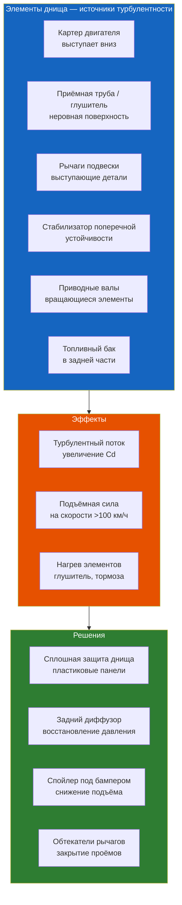

# Аэродинамика подднищевой зоны

Днище автомобиля — самая несовершенная с точки зрения обтекаемости поверхность.

## Формирование потока под днищем

Воздух, попадающий под передний бампер, проходит под автомобилем с ускорением (из-за ограниченного зазора — клиренса). По закону Бернулли, чем выше скорость потока, тем ниже давление. Это создаёт **разрежение под днищем**, присасывающее автомобиль к дороге — положительный эффект (ground effect). Однако неровности днища нарушают ламинарность потока, снижая эффективность этого эффекта и увеличивая Cd.

### Влияние клиренса

Клиренс (дорожный просвет) — критический параметр:

| Клиренс, мм | Влияние на аэродинамику |
|-------------|------------------------|
| < 100 | Возрастает присасывание к дороге, снижается Cd |
| 100–140 | Оптимум для гражданского автомобиля |
| 140–180 | Умеренная турбулентность под днищем, рост Cd |
| > 180 | Значительный поток под машиной, высокий Cd |

Renault Symbol имеет клиренс 155 мм — типичный для бюджетного седана. При таком клиренсе поток под днищем интенсивен, и неровности днища создают заметное сопротивление.

## Вклад в общее сопротивление

На долю днища и колёсных арок приходится 25–40% общего лобового сопротивления в зависимости от типа автомобиля и степени защиты днища. Для Symbol эта доля оценивается в 30–35%.

**Структура аэродинамического сопротивления Symbol (120 км/ч):**
- Кузов (верхняя часть): ~40%
- Днище и арки: ~35%
- Колёса: ~15%
- Зеркала, антенна, зазоры: ~10%

## Элементы подднищевой аэродинамики

### Поддоны (undertrays)

Сплошная панель, закрывающая часть днища, — самый эффективный способ снизить сопротивление. Поддон выравнивает поток, исключает турбулентность от выступающих элементов и стабилизирует разрежение под днищем.

**Эффективность:**
- Частичный поддон (моторный отсек): снижение Cd на 0,005–0,010
- Полный поддон (всё днище): снижение Cd на 0,015–0,030

Для современного седана с плоским днищем Cd на 0,015–0,020 ниже, чем для аналогичного автомобиля без защиты днища.

**Renault Symbol:** штатная стальная защита картера имеет ребристую поверхность, не оптимальную для аэродинамики. Замена на гладкую пластиковую защиту даёт снижение Cd на 0,003–0,005 — едва заметно на расходе, но полезно для уменьшения шума.

### Диффузор

Диффузор — расширяющийся канал в задней части днища. Принцип работы: поток замедляется в расширяющейся части, давление восстанавливается, снижая подъёмную силу. Диффузор — обязательный элемент гоночных автомобилей. На гражданских автомобилях он часто отсутствует или представлен в декоративном виде.

На Symbol диффузор отсутствует. Задняя часть днища работает как неэффективный аналог диффузора, создавая незначительное разрежение.

### Боковые пороги

Зазоры между порогами и днищем, а также форма самих порогов влияют на обтекание бортов. Аэродинамические накладки на пороги (side skirts) направляют поток вдоль борта, не давая ему хаотично уходить под днище. Эффективность: снижение Cd на 0,003–0,008.

На Symbol накладки порогов доступны для версий Expression и Privilege; их установка на базовые версии улучшает как аэродинамику, так и внешний вид.

### Гоночные решения

На гоночных автомобилях и суперкарах применяются:

**Сплошное плоское днище (flat floor):**
- Полностью изолирует подкапотное пространство от воздушного потока
- В комбинации с задним диффузором генерирует значительную прижимную силу
- Пример: Porsche 919 Hybrid — днище закрыто карбоновыми панелями, диффузор — активный

**Задний диффузор:**
- Создаёт зону низкого давления за автомобилем
- На Formula 1 генерирует до 40% общей прижимной силы
- Для гражданского применения — снижает Cd и Cl одновременно

**Тормозные каналы (brake ducts):**
- Направляют воздух к тормозным механизмам, охлаждая их
- Оптимизация каналов снижает потери, неизбежные при заборе воздуха под днищем

## Сравнение: обычный автомобиль vs гоночный

| Параметр | Гражданский седан (Symbol) | Formula 1 / LMP1 |
|---------|---------------------------|------------------|
| Защита днища | Частичная (сталь/пластик) | Полная (карбон/кевлар) |
| Диффузор | Отсутствует | Многосекционный, активный |
| Клиренс | 120–180 мм | 25–50 мм |
| Доля Cd от днища | 30–35% | 10–15% |
| Прижимная сила (200 км/ч) | Отрицательная (lift) | 1000–2000 кгс |
| Работа поддона | Пассивная | Формирует ground effect |

## Перспективы улучшения

Для электромобилей подднищевая аэродинамика — приоритет №1: плоская аккумуляторная батарея служит идеальным основанием для полного поддона. Автомобили с ДВС, включая Symbol, имеют фундаментальное ограничение — выпускной тракт и глушители под днищем.

**Практические рекомендации для Symbol:**
- Замена штатной стальной защиты картера на гладкую пластиковую
- Установка подкрылков всех четырёх колёс (штатно — только перед)
- Аэродинамические накладки порогов (если не установлены)
- Поддержание штатного клиренса (занижение ухудшает аэродинамику днища)
- Ожидаемый эффект: снижение Cd на 0,008–0,012, экономия ~0,2–0,3 л/100 км на трассе
