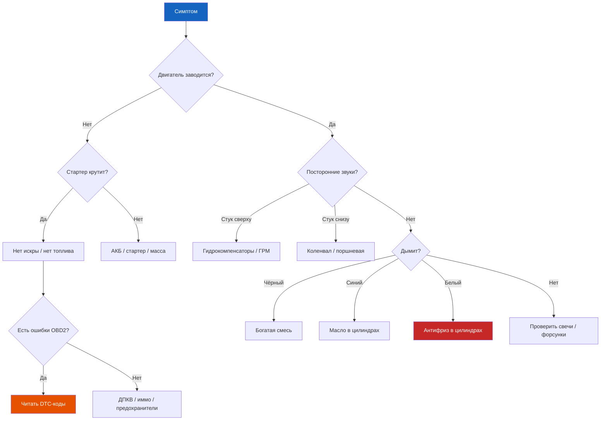

# Диагностика по симптомам

<input type="text" id="symptom-filter" class="symptom-filter-input" placeholder="Введите симптом: стук, дым, не заводится, течь масла, плавают обороты..." autofocus>

Все симптомы

    <button class="cost-filter-btn active" data-cost="all" style="padding:6px 14px;border:1px solid var(--searchbar-border-color);border-radius:16px;background:var(--bg);cursor:pointer;font-size:0.85em;">Все цены</button>
    <button class="cost-filter-btn" data-cost="low" style="padding:6px 14px;border:1px solid #4caf50;border-radius:16px;background:var(--bg);cursor:pointer;font-size:0.85em;color:#4caf50;">🟢 до 1500 ₽</button>
    <button class="cost-filter-btn" data-cost="medium" style="padding:6px 14px;border:1px solid #ff9800;border-radius:16px;background:var(--bg);cursor:pointer;font-size:0.85em;color:#ff9800;">🟠 1500–5000 ₽</button>
    <button class="cost-filter-btn" data-cost="high" style="padding:6px 14px;border:1px solid #f44336;border-radius:16px;background:var(--bg);cursor:pointer;font-size:0.85em;color:#f44336;">🔴 от 5000 ₽</button>

## Двигатель

### Система зажигания и запуск

<strong>Двигатель не заводится (стартер крутит)</strong>

Причины: нет искры, нет топлива, неисправен ДПКВ, иммобилайзер

→ <a href="../dvigatel/3-1.md">Диагностика двигателя</a> · <a href="../elektrika/8-3.md">Система пуска</a>

Бесплатно диагностика ОБД2

<strong>Двигатель не заводится (стартер молчит)</strong>

Причины: разряжена АКБ, окислены клеммы, неисправен стартер или втягивающее реле

→ <a href="../elektrika/8-1.md">АКБ</a> · <a href="../elektrika/8-3.md">Стартер</a>

от 0 ₽ до 5000 ₽

<strong>Двигатель заводится и сразу глохнет</strong>

Причины: иммобилайзер (ключ не распознан), подсос воздуха, загрязнён РХХ

→ <a href="../dvigatel/3-2.md#%D0%A0%D0%B5%D0%B3%D1%83%D0%BB%D0%B8%D1%80%D0%BE%D0%B2%D0%BA%D0%B0-%D0%BE%D0%B1%D0%BE%D1%80%D0%BE%D1%82%D0%BE%D0%B2-%D1%85%D0%BE%D0%BB%D0%BE%D1%81%D1%82%D0%BE%D0%B3%D0%BE-%D1%85%D0%BE%D0%B4%D0%B0">Регулировка ХХ</a>

чистка дросселя: 500 ₽ иммо: от 2000 ₽

<strong>Провалы при резком нажатии педали газа</strong>

Причины: загрязнение форсунок, подсос воздуха, забит топливный фильтр

→ <a href="../dvigatel/3-2.md#%D0%A4%D0%BE%D1%80%D1%81%D1%83%D0%BD%D0%BA%D0%B8-%D0%B4%D0%B8%D0%B0%D0%B3%D0%BD%D0%BE%D1%81%D1%82%D0%B8%D0%BA%D0%B0-%D0%B8-%D0%B7%D0%B0%D0%BC%D0%B5%D0%BD%D0%B0">Форсунки</a>

фильтр: 500–800 ₽ форсунки: 4000–8000 ₽

<strong>Плавают обороты холостого хода</strong>

Причины: загрязнён дроссель, неисправен РХХ, подсос воздуха

→ <a href="../dvigatel/3-2.md#%D0%94%D1%80%D0%BE%D1%81%D1%81%D0%B5%D0%BB%D1%8C%D0%BD%D1%8B%D0%B9-%D1%83%D0%B7%D0%B5%D0%BB">Чистка дросселя</a>

чистка: 300–500 ₽ РХХ: 800–1500 ₽

### Выхлоп и цвета дыма

<strong>Белый дым из выхлопной трубы</strong>

Причины: пробита прокладка ГБЦ (охлаждающая жидкость в камере сгорания), трещина в ГБЦ

→ <a href="../dvigatel/3-1.md#%D0%A2%D0%B8%D0%BF%D0%BE%D0%B2%D1%8B%D0%B5-%D0%BD%D0%B5%D0%B8%D1%81%D0%BF%D1%80%D0%B0%D0%B2%D0%BD%D0%BE%D1%81%D1%82%D0%B8-%D0%B4%D0%B2%D0%B8%D0%B3%D0%B0%D1%82%D0%B5%D0%BB%D0%B5%D0%B9">Неисправности двигателя</a>

прокладка ГБЦ: 5000–12000 ₽ ГБЦ: от 15000 ₽

<strong>Синий дым (при запуске после стоянки)</strong>

Причины: износ маслосъёмных колпачков

→ <a href="../dvigatel/3-1.md#%D0%A2%D0%B8%D0%BF%D0%BE%D0%B2%D1%8B%D0%B5-%D0%BD%D0%B5%D0%B8%D1%81%D0%BF%D1%80%D0%B0%D0%B2%D0%BD%D0%BE%D1%81%D1%82%D0%B8-%D0%B4%D0%B2%D0%B8%D0%B3%D0%B0%D1%82%D0%B5%D0%BB%D0%B5%D0%B9">Замена колпачков</a>

колпачки: 3000–5000 ₽

<strong>Чёрный дым</strong>

Причины: богатая смесь (неисправны форсунки, лямбда-зонд, MAP-датчик)

→ <a href="../dvigatel/3-2.md">Система питания</a> · <a href="../dtc.md">Коды ошибок OBD2</a>

лямбда: 1500–3000 ₽ форсунки: 4000–8000 ₽

<strong>Двигатель троит / пропуски зажигания</strong>

Причины: неисправна свеча/катушка зажигания, подсос воздуха, низкая компрессия

→ <a href="../statyi/svechi.md">Свечи зажигания</a> · <a href="../dvigatel/3-1.md">Диагностика</a>

свечи: 600–1200 ₽ катушка: 1500–3000 ₽

<strong>Двигатель набирает обороты, но не едет</strong>

Причины: пробуксовка сцепления, износ диска

→ <a href="../transmissiya/4-1.md">Замена сцепления</a>

комплект сцепления: 5000–15000 ₽

### Стуки и шумы

<strong>Стук гидрокомпенсаторов (цоканье на холодную)</strong>

Причины: воздух в масле, загрязнение масляных каналов, износ

→ <a href="../dvigatel/3-3.md#%D0%97%D0%B0%D0%BC%D0%B5%D0%BD%D0%B0-%D0%BC%D0%B0%D1%81%D0%BB%D0%B0-%D0%B8-%D0%BC%D0%B0%D1%81%D0%BB%D1%8F%D0%BD%D0%BE%D0%B3%D0%BE-%D1%84%D0%B8%D0%BB%D1%8C%D1%82%D1%80%D0%B0">Замена масла</a>

замена масла: 1500–2500 ₽

<strong>Перегрев двигателя (температура выше 105 °C)</strong>

Причины: низкий уровень антифриза, термостат закрыт, воздушная пробка, неисправен вентилятор

→ <a href="../dvigatel/3-4.md">Система охлаждения</a> · <a href="../dvigatel/3-4.md#%D0%92%D0%B5%D0%BD%D1%82%D0%B8%D0%BB%D1%8F%D1%82%D0%BE%D1%80-%D0%BE%D1%85%D0%BB%D0%B0%D0%B6%D0%B4%D0%B5%D0%BD%D0%B8%D1%8F-%D1%80%D0%B0%D0%B4%D0%B8%D0%B0%D1%82%D0%BE%D1%80%D0%B0">Вентилятор</a>

термостат: 600–1200 ₽ вентилятор: 3000–6000 ₽

<strong>Плохо заводится на горячую</strong>

Причины: неисправен ДПКВ (датчик коленвала) при нагреве, падает давление топлива (обратный клапан)

→ <a href="../dvigatel/3-1.md#%D0%A2%D0%B8%D0%BF%D0%BE%D0%B2%D1%8B%D0%B5-%D0%BD%D0%B5%D0%B8%D1%81%D0%BF%D1%80%D0%B0%D0%B2%D0%BD%D0%BE%D1%81%D1%82%D0%B8-%D0%B4%D0%B2%D0%B8%D0%B3%D0%B0%D1%82%D0%B5%D0%BB%D0%B5%D0%B9">Диагностика</a>

ДПКВ: 800–2000 ₽

<strong>Стук поршневого пальца</strong>

Причины: износ втулки верхней головки шатуна

→ <a href="../dvigatel/3-1.md#%D0%A2%D0%B8%D0%BF%D0%BE%D0%B2%D1%8B%D0%B5-%D0%BD%D0%B5%D0%B8%D1%81%D0%BF%D1%80%D0%B0%D0%B2%D0%BD%D0%BE%D1%81%D1%82%D0%B8-%D0%B4%D0%B2%D0%B8%D0%B3%D0%B0%D1%82%D0%B5%D0%BB%D0%B5%D0%B9">Диагностика</a>

ремонт двигателя: от 15000 ₽

<strong>Посторонний шум в районе ГРМ</strong>

Причины: износ натяжителя или ремня ГРМ, помпы

→ <a href="../dvigatel/3-1.md#%D0%A0%D0%B0%D1%81%D0%BF%D1%80%D0%B5%D0%B4%D0%B5%D0%BB%D0%B8%D1%82%D0%B5%D0%BB%D1%8C%D0%BD%D1%8B%D0%B9-%D0%B2%D0%B0%D0%BB-%D0%B8-%D0%93%D0%A0%D0%9C">Замена ремня ГРМ</a> · <a href="../dvigatel/3-4.md#%D0%AD%D0%BB%D0%B5%D0%BC%D0%B5%D0%BD%D1%82%D1%8B-%D1%81%D0%B8%D1%81%D1%82%D0%B5%D0%BC%D1%8B">Помпа</a>

комплект ГРМ: 4000–8000 ₽ с заменой: 8000–15000 ₽

<strong>Металлический стук при проезде лежачих полицейских</strong>

Причины: износ стабилизатора, сайлентблоков, амортизаторов

→ <a href="../hodovaya/5-1.md#%D0%A1%D0%B0%D0%B9%D0%BB%D0%B5%D0%BD%D1%82-%D0%B1%D0%BB%D0%BE%D0%BA%D0%B8-%D1%80%D1%8B%D1%87%D0%B0%D0%B3%D0%B0">Сайлент-блоки</a> · <a href="../hodovaya/5-1.md#%D0%97%D0%B0%D0%BC%D0%B5%D0%BD%D0%B0-%D1%81%D1%82%D0%BE%D0%B9%D0%BA%D0%B8-%D0%B2-%D1%81%D0%B1%D0%BE%D1%80%D0%B5">Амортизаторы</a>

сайлентблоки: 2000–4000 ₽ амортизаторы: 5000–12000 ₽

<strong>Запах бензина в салоне</strong>

Причины: трещина в топливной магистрали, неплотная крышка бензобака, подсос через адсорбер

→ <a href="../dvigatel/3-2.md">Система питания</a>

крышка бензобака: 200–500 ₽ адсорбер: 2000–4000 ₽

<strong>Повышенный расход топлива</strong>

Причины: неисправен лямбда-зонд, загрязнение форсунок, неправильная работа термостата, износ свечей

→ <a href="../dvigatel/3-2.md">Система питания</a> · <a href="../dtc.md">Чтение ошибок OBD2</a>

свечи: 600–1200 ₽ лямбда: 1500–3000 ₽

<strong>Свист при нажатии на сцепление</strong>

Причины: износ выжимного подшипника

→ <a href="../transmissiya/4-1.md">Сцепление — замена</a>

замена сцепления: 6000–15000 ₽

<strong>Дизелит / масло на свечах</strong>

Причины: износ маслосъёмных колпачков, залегли поршневые кольца

→ <a href="../dvigatel/3-3.md#%D0%A1%D0%B8%D1%81%D1%82%D0%B5%D0%BC%D0%B0-%D0%B2%D0%B5%D0%BD%D1%82%D0%B8%D0%BB%D1%8F%D1%86%D0%B8%D0%B8-%D0%BA%D0%B0%D1%80%D1%82%D0%B5%D1%80%D0%BD%D1%8B%D1%85-%D0%B3%D0%B0%D0%B7%D0%BE%D0%B2">Система смазки</a>

декарбонизация: 1500–3000 ₽ кольца: от 12000 ₽

## Трансмиссия

<strong>Задняя передача не включается</strong>

Причины: неисправен электромагнит reverse lockout

→ <a href="../transmissiya/4-2.md#%D0%9D%D0%B5%D0%B8%D1%81%D0%BF%D1%80%D0%B0%D0%B2%D0%BD%D0%BE%D1%81%D1%82%D0%B8-reverse-lockout">Reverse lockout</a>

reverse lockout: 1000–2500 ₽

<strong>Хруст при переключении передач</strong>

Причины: низкий уровень масла в КПП, износ синхронизаторов

→ <a href="../transmissiya/4-2.md#%D0%97%D0%B0%D0%BC%D0%B5%D0%BD%D0%B0-%D0%BC%D0%B0%D1%81%D0%BB%D0%B0">Замена масла КПП</a>

масло КПП: 800–1500 ₽ синхронизатор: от 10000 ₽

<strong>Дёргается при трогании (сцепление)</strong>

Причины: износ диска сцепления, масло на диске, износ корзины

→ <a href="../transmissiya/4-1.md">Замена сцепления</a>

замена сцепления: 6000–15000 ₽

<strong>Вибрирует на скорости 80–100 км/ч</strong>

Причины: износ ШРУС, разбалансировка колёс, износ стоек стабилизатора

→ <a href="../transmissiya/4-3.md">Приводные валы</a> · <a href="../hodovaya/5-3.md#%D0%9F%D0%BE%D1%80%D1%8F%D0%B4%D0%BE%D0%BA-%D0%B7%D0%B0%D0%BC%D0%B5%D0%BD%D1%8B-%D0%BA%D0%BE%D0%BB%D0%B5%D1%81%D0%B0">Колёса</a>

балансировка: 400–800 ₽ ШРУС: 2000–5000 ₽

<strong>Хруст при поворотах</strong>

Причины: износ наружного ШРУСа, порван пыльник

→ <a href="../transmissiya/4-3.md#%D0%9F%D0%BE%D1%80%D1%8F%D0%B4%D0%BE%D0%BA-%D1%80%D0%B0%D0%B1%D0%BE%D1%82-%D0%BD%D0%B0%D1%80%D1%83%D0%B6%D0%BD%D1%8B%D0%B9-%D0%A8%D0%A0%D0%A3%D0%A1">Замена наружного ШРУС</a>

ШРУС: 2000–5000 ₽

<strong>Выбивает передачи на ходу</strong>

Причины: износ вилок КПП, износ синхронизаторов, ослабление крепления КПП

→ <a href="../transmissiya/4-2.md#%D0%9D%D0%B5%D0%B8%D1%81%D0%BF%D1%80%D0%B0%D0%B2%D0%BD%D0%BE%D1%81%D1%82%D0%B8">Неисправности КПП</a>

ремонт КПП: от 15000 ₽

## Ходовая часть и рулевое

<strong>Стук в рулевой колонке</strong>

Причины: износ рулевой рейки, затяжка упора

→ <a href="../rulevoe/6-1.md#%D0%A0%D0%B5%D0%BC%D0%BE%D0%BD%D1%82-%D0%BD%D0%B0-%D0%BC%D0%B5%D1%81%D1%82%D0%B5">Регулировка рейки</a>

регулировка: 500–1500 ₽ рейка: 5000–12000 ₽

<strong>Руль тугой / тяжело вращается</strong>

Причины: низкий уровень жидкости ГУР, износ насоса ГУР, завоздушивание

→ <a href="../rulevoe/6-2.md#%D0%97%D0%B0%D0%BC%D0%B5%D0%BD%D0%B0-%D0%B6%D0%B8%D0%B4%D0%BA%D0%BE%D1%81%D1%82%D0%B8-%D0%93%D0%A3%D0%A0">Замена жидкости ГУР</a>

насос ГУР: 3000–8000 ₽

<strong>Биение руля при торможении</strong>

Причины: деформация тормозных дисков, неравномерный износ

→ <a href="../tormoza/7-1.md#%D0%97%D0%B0%D0%BC%D0%B5%D0%BD%D0%B0-%D1%82%D0%BE%D1%80%D0%BC%D0%BE%D0%B7%D0%BD%D1%8B%D1%85-%D0%B4%D0%B8%D1%81%D0%BA%D0%BE%D0%B2">Замена дисков</a>

диски: 3000–6000 ₽

<strong>Увод в сторону при движении</strong>

Причины: нарушен развал-схождение, неравномерное давление в шинах, износ сайлентблоков

→ <a href="../hodovaya/5-3.md">Колёса и шины</a> · <a href="../hodovaya/5-1.md">Передняя подвеска</a>

развал: 800–1500 ₽

<strong>Стук сзади на неровностях</strong>

Причины: износ амортизаторов, износ сайлентблоков балки

→ <a href="../hodovaya/5-2.md#%D0%9F%D1%80%D0%B8%D0%B7%D0%BD%D0%B0%D0%BA%D0%B8-%D0%B8%D0%B7%D0%BD%D0%BE%D1%81%D0%B0-%D0%B0%D0%BC%D0%BE%D1%80%D1%82%D0%B8%D0%B7%D0%B0%D1%82%D0%BE%D1%80%D0%BE%D0%B2">Амортизаторы задние</a>

амортизаторы: 3000–6000 ₽

<strong>Люфт руля / бьёт руль на скорости</strong>

Причины: износ рулевых наконечников, износ рейки

→ <a href="../rulevoe/6-1.md">Рулевой механизм</a> · <a href="../spravochnaya/oem.md#%D0%A0%D1%83%D0%BB%D0%B5%D0%B2%D0%BE%D0%B9-%D0%BD%D0%B0%D0%BA%D0%BE%D0%BD%D0%B5%D1%87%D0%BD%D0%B8%D0%BA">Наконечники</a>

наконечники: 1500–3000 ₽

## Электрооборудование

<strong>АКБ разряжается за 1–2 дня</strong>

Причины: утечка тока, неисправен генератор (диодный мост), старость АКБ

→ <a href="../elektrika/8-1.md">АКБ</a> · <a href="../elektrika/8-2.md">Генератор</a>

АКБ: 2500–5000 ₽ генератор: 5000–10000 ₽

<strong>Горит лампа зарядки АКБ</strong>

Причины: обрыв ремня генератора, износ щёток, неисправен регулятор напряжения

→ <a href="../elektrika/8-2.md#%D0%97%D0%B0%D0%BC%D0%B5%D0%BD%D0%B0-%D1%80%D0%B5%D0%B3%D1%83%D0%BB%D1%8F%D1%82%D0%BE%D1%80%D0%B0-%D0%BD%D0%B0%D0%BF%D1%80%D1%8F%D0%B6%D0%B5%D0%BD%D0%B8%D1%8F">Замена регулятора</a>

регулятор: 800–2000 ₽ щётки: 300–500 ₽

<strong>Не работают стеклоподъёмники</strong>

Причины: сгорел предохранитель, неисправен моторчик, обрыв проводки в гофре двери

→ <a href="../elektrika/8-5.md">Предохранители</a> · <a href="../shemy/index.md">Схемы</a>

предохранитель: 20 ₽ моторчик: 1500–3000 ₽

<strong>Не работают дворники</strong>

Причины: сгорел предохранитель, износ моторедуктора, закисла трапеция

→ <a href="../elektrika/8-5.md">Предохранители</a> · <a href="../statyi/dvorniki.md">Ремонт дворников</a>

пред: 20 ₽ трапеция: 2000–4000 ₽

<strong>Не работают наружные световые приборы</strong>

Причины: перегорела лампа, сгорел предохранитель, окисление контактов, неисправен подрулевой переключатель

→ <a href="../elektrika/8-4.md">Освещение и сигнализация</a> · <a href="../elektrika/8-5.md">Предохранители</a>

лампа: 100–300 ₽

<strong>Печка дует холодным / не включается кондиционер</strong>

Причины: низкий уровень или утечка хладагента, неисправен компрессор, забит салонный фильтр, обрыв вентилятора отопителя

→ <a href="../expluataciya/1-2.md">Климатическая установка</a>

салонный фильтр: 300–800 ₽ заправка: 1500–2500 ₽ компрессор: от 15000 ₽

<strong>Не работает прикуриватель / аудиосистема</strong>

Причины: сгорел предохранитель S1, окисление контактов

→ <a href="../elektrika/8-5.md#%D0%9F%D1%80%D0%B5%D0%B4%D0%BE%D1%85%D1%80%D0%B0%D0%BD%D0%B8%D1%82%D0%B5%D0%BB%D0%B8-%D1%81%D0%B0%D0%BB%D0%BE%D0%BD%D0%B0">Блок предохранителей салона</a>

предохранитель: 20 ₽

<strong>Не работают центральный замок / ключ не поворачивается</strong>

Причины: износ личинки замка, неисправен блок ЦЗ

→ <a href="../elektrika/8-5.md#%D0%9F%D1%80%D0%B5%D0%B4%D0%BE%D1%85%D1%80%D0%B0%D0%BD%D0%B8%D1%82%D0%B5%D0%BB%D0%B8-%D1%81%D0%B0%D0%BB%D0%BE%D0%BD%D0%B0">Предохранители ЦЗ</a>

замок: 1500–4000 ₽

## Тормозная система

<strong>Скрип тормозов</strong>

Причины: износ колодок до индикатора, загрязнение, дешёвые колодки

→ <a href="../tormoza/7-1.md">Передние тормоза</a> · <a href="../tormoza/7-2.md">Задние тормоза</a>

колодки: 1000–2000 ₽

<strong>Мягкая педаль тормоза / проваливается</strong>

Причины: воздух в системе, утечка тормозной жидкости, износ главного цилиндра

→ <a href="../tormoza/7-1.md#%D0%97%D0%B0%D0%BC%D0%B5%D0%BD%D0%B0-%D1%82%D0%BE%D1%80%D0%BC%D0%BE%D0%B7%D0%BD%D1%8B%D1%85-%D0%BA%D0%BE%D0%BB%D0%BE%D0%B4%D0%BE%D0%BA">Прокачка тормозов</a>

прокачка: 500–1500 ₽ ГТЦ: 2000–5000 ₽

<strong>Горит лампа ABS</strong>

Причины: загрязнение датчика ABS, неисправен гидроблок, обрыв проводки

→ <a href="../tormoza/7-3.md">ABS</a> · <a href="../dtc.md">Коды ABS</a>

датчик: 800–2000 ₽ гидроблок: 10000–20000 ₽

<strong>Торможение рывками / пульсация педали</strong>

Причины: деформация тормозных дисков, неравномерная выработка

→ <a href="../tormoza/7-1.md#%D0%97%D0%B0%D0%BC%D0%B5%D0%BD%D0%B0-%D1%82%D0%BE%D1%80%D0%BC%D0%BE%D0%B7%D0%BD%D1%8B%D1%85-%D0%B4%D0%B8%D1%81%D0%BA%D0%BE%D0%B2">Замена дисков</a>

диски + колодки: 5000–10000 ₽

<strong>Ручник не держит / слабый</strong>

Причины: износ троса, износ задних колодок, неотрегулирован

→ <a href="../tormoza/7-2.md#%D0%A0%D0%B5%D0%B3%D1%83%D0%BB%D0%B8%D1%80%D0%BE%D0%B2%D0%BA%D0%B0-%D1%81%D1%82%D0%BE%D1%8F%D0%BD%D0%BE%D1%87%D0%BD%D0%BE%D0%B3%D0%BE-%D1%82%D0%BE%D1%80%D0%BC%D0%BE%D0%B7%D0%B0">Регулировка ручника</a>

регулировка: 300–500 ₽ трос: 1000–2500 ₽

---

> 🔧 **Не нашли свой симптом?** Используйте поиск сверху — фильтр работает по всему тексту страницы. Также смотрите <a href="../dtc.md">коды неисправностей OBD2</a>.
