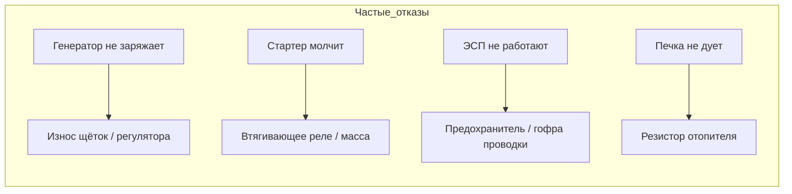

# Распространённые неисправности Renault Symbol

Сводка типичных проблем для всех поколений Symbol. Информация собрана на основе опыта владельцев, данных форумов (Symbol-club, Drive2) и сервисных бюллетеней Renault.

## Двигатель

### K7J 1.4 (8V) — самые надёжные, но не без недостатков

| Проблема | Причина | Пробег | Решение | Стоимость |
|----------|---------|--------|---------|-----------|
| Плавают обороты ХХ | Загрязнение дроссельной заслонки, РХХ | 40 000–80 000 | Чистка дросселя, замена РХХ | 300–1500 ₽ |
| Стук гидрокомпенсаторов | Загрязнение масляных каналов, некачественное масло | >100 000 | Замена масла (промывка), замена гидрокомпенсаторов | 1500–4000 ₽ |
| Течь сальника коленвала (передний) | Естественный износ резины | >120 000 | Замена сальника (со снятием ремня ГРМ) | 2500–4000 ₽ |
| Перегрев в пробках | Заклинил термостат / не включается вентилятор | 60 000–100 000 | Замена термостата / реле вентилятора F1/F2 | 600–1200 ₽ |

### K7M 1.6 (8V) — те же проблемы, что у K7J

| Проблема | Причина | Пробег | Решение |
|----------|---------|--------|---------|
| Масложор (расход >1 л/1000 км) | Залегли поршневые кольца | >150 000 | Раскоксовка / замена колец |
| Дизелит / троит на холодную | Износ маслосъёмных колпачков | >150 000 | Замена колпачков |

### K4J / K4M 1.4/1.6 (16V) — более капризные

| Проблема | Причина | Пробег | Решение | Стоимость |
|----------|---------|--------|---------|-----------|
| Ошибка P0016 (несовпадение фаз ГРМ) | Растяжение цепи/звёздочки распредвалов | 80 000–120 000 | Диагностика, замена натяжителя цепи | 3000–8000 ₽ |
| Масложор | Закоксовывание маслосъёмных колпачков | >120 000 | Замена колпачков (сложнее, чем на 8V) | 5000–8000 ₽ |
| Провалы при разгоне | Загрязнение форсунок, лямбда-зонд | >100 000 | Чистка форсунок / замена лямбды | 2000–5000 ₽ |
| Гидрокомпенсаторы стучат | Износ масляного насоса — низкое давление | >150 000 | Диагностика давления, замена насоса | 5000–12000 ₽ |

### K9K 1.5 dCi (дизель)

| Проблема | Причина | Пробег | Решение |
|----------|---------|--------|---------|
| Потеря мощности, ошибка по турбине | Загрязнение клапана EGR | 60 000–100 000 | Чистка EGR (снять и промыть) |
| Плохой запуск зимой | Свечи накала — перегорание 1–2 свечей | >80 000 | Замена свечей накала |
| Масло в интеркулере | Износ турбокомпрессора | >150 000 | Замена турбины (60–100 тыс. ₽) |
| Сажевый фильтр (DPF) забит | Городской цикл, дизель | >120 000 | Регенерация / удаление DPF |

## Трансмиссия

### МКПП (JH1/JH3)

| Проблема | Причина | Пробег | Решение | Стоимость |
|----------|---------|--------|---------|-----------|
| Хруст при включении 2-й передачи | Износ синхронизатора | >100 000 | Замена синхронизатора (со снятием КПП) | 10 000–15 000 ₽ |
| Не включается задняя передача | Отказ электромагнита reverse lockout | 50 000–100 000 | Замена электромагнита | 1000–2500 ₽ |
| Выбивает 3-ю/4-ю на ходу | Износ вилок КПП | >150 000 | Капитальный ремонт КПП | 15 000–25 000 ₽ |
| Гул КПП на всех передачах | Износ подшипников первичного/вторичного вала | >180 000 | Замена подшипников (дефицит запчастей) | от 20 000 ₽ |
| Течь масла КПП | Износ сальника левого привода | 80 000–120 000 | Замена сальника | 500–1000 ₽ |

### Сцепление

| Проблема | Причина | Пробег | Решение |
|----------|---------|--------|---------|
| Свист при нажатии | Износ выжимного подшипника | 80 000–150 000 | Замена подшипника / комплекта |
| Пробуксовка | Износ диска | >120 000 | Замена комплекта сцепления |
| Сцепление схватывает в самом низу | Воздух / утечка в гидроприводе | 60 000–100 000 | Прокачка / замена главного цилиндра |

## Подвеска и рулевое

| Проблема | Причина | Пробег | Решение | Стоимость |
|----------|---------|--------|---------|-----------|
| Стук спереди (мелкие неровности) | Стойки стабилизатора | 30 000–60 000 | Замена стабилизатора | 1000–3000 ₽ |
| Стук спереди (крупные неровности) | Сайлентблоки рычага | 60 000–100 000 | Замена рычагов / сайлентблоков | 2000–5000 ₽ |
| Стук сзади (лежачие полицейские) | Амортизаторы задние | 80 000–120 000 | Замена амортизаторов | 3000–6000 ₽ |
| Биение руля при торможении | Деформация передних тормозных дисков | 60 000–100 000 | Замена дисков | 3000–6000 ₽ |
| Люфт руля | Рулевые наконечники / рулевая рейка | 80 000–150 000 | Замена наконечников / регулировка рейки | 2000–12000 ₽ |
| Стук рулевой колонки | Износ карданчика / рейки | >150 000 | Замена карданчика | 3000–6000 ₽ |

## Электрика



| Проблема | Причина | Пробег | Решение | Стоимость |
|----------|---------|--------|---------|-----------|
| Генератор не заряжает | Износ щёток / пробой диодного моста | 100 000–150 000 | Щётки 300–500 ₽ / ремонт 2000–5000 ₽ | low |
| Стартер крутит вхолостую | Износ втягивающего реле / бендикса | 80 000–120 000 | Замена втягивающего / ремонт | 1500–4000 ₽ |
| ЭСП не работают | Обрыв проводки в гофре передней двери | 50 000–100 000 | Ремонт проводки в гофре | 1000–3000 ₽ |
| Печка не дует (нет 1–3 скорости) | Перегорел резистор отопителя | 40 000–80 000 | Замена резистора (справа под перчаточником) | 500–1500 ₽ |
| Не работают дворники | Износ трапеции / моторедуктора | 80 000–120 000 | Ремонт трапеции | 2000–4000 ₽ |
| Окисление массы | Плохой контакт массы АКБ (левый лонжерон) | >5 лет | Зачистка + смазка контакта | 0–200 ₽ |
| Панель приборов гаснет | Пропайка контактов на плате | >150 000 | Перепайка разъёма | 1500–3000 ₽ |
| Отказ блока комфорта | Залив водой (протечка уплотнителя лобового стекла) | 80 000–150 000 | Просушка / замена блока | 3000–8000 ₽ |

## Кузов

| Проблема | Локализация | Степень | Решение |
|----------|-------------|---------|---------|
| **Коррозия порогов** | Снаружи по шву, изнутри — в районе домкрата | **Типичная проблема всех Symbol** | Зачистка, сварка усилителя, антикор (5000–15000 ₽) |
| **Ржавчина арок задних колёс** | Со стороны багажника, за пластиковой обшивкой | Часто после 10 лет | Вырезать, сварить, покрасить |
| **Крышка багажника** | Под уплотнителем, у замка | Часто | Зачистка, подкраска |
| Навесные элементы | Кромки дверей, капот (сколы) | Редко | Локальная покраска |
| **Антикоррозийное покрытие днища** | С завода — слабое, точки сварки не защищены | Все Symbol | Обработка днища мастикой / воском |

## Климатическая система

| Проблема | Причина | Решение |
|----------|---------|---------|
| Печка дует только холодным / слабо греет | Забит салонный фильтр / заклинила заслонка | Замена фильтра 300–800 ₽ / диагностика заслонки |
| Кондиционер не включается | Утечка хладагента (ал. конденсор — слабое место) | Поиск утечки, замена конденсора от 5000 ₽ |
| Запах плесени при включении кондиционера | Бактерии на испарителе | Обработка очистителем, замена салонного фильтра |
| Нет 1–2 скорости вентилятора | Резистор отопителя (под панелью) | Замена резистора 500–1500 ₽ |

## Характерные шумы и их источники

| Шум | Вероятный источник | Серьёзность |
|-----|-------------------|-------------|
| Свист спереди слева на холодную | Ремень генератора | Низкая |
| Цоканье на холодную (2–3 сек) | Гидрокомпенсаторы | Низкая (норма) |
| Цоканье >10 сек | Износ гидрокомпенсаторов | Средняя |
| Свист при нажатии сцепления | Выжимной подшипник | Средняя |
| Металлический стук спереди (лежачие) | Стабилизатор / сайлентблоки | Средняя |
| Гул в салоне на скорости (глухой) | Подшипник ступицы | Низкая |
| Свистящий гул (нарастает с оборотами) | Генератор (подшипник / щётки) | Средняя |
| Грохот сзади (камни в подкрылке) | Зазор между баком и днищем | Низкая |

## Общие рекомендации по обслуживанию

| Что | Интервал | Примечание |
|-----|----------|------------|
| Моторное масло | 10 000–15 000 км | Синтетика 5W-40 / 10W-40 |
| Масло КПП | 60 000 км | 75W-80 GL-4 |
| Тормозная жидкость | 40 000 км / 2 года | DOT 4 |
| Антифриз | 60 000 км / 4 года | Renault D (Glysantin G30) |
| Ремень ГРМ (бензин) | 60 000 км / 4 года | + помпа + натяжитель |
| Ремень ГРМ (дизель) | 90 000 км / 6 лет | + помпа + натяжитель |
| Свечи зажигания | 30 000 км | NGK BKR6E / PFR6G |
| Салонный фильтр | 15 000 км / 1 год | — |
| Воздушный фильтр | 30 000 км | — |
| Топливный фильтр | 60 000 км | — |

```admonition tip
Самая недооценённая профилактика на Symbol — **зачистка массы АКБ** и **замена сальника коленвала при замене ГРМ**.
Пренебрежение этими двумя пунктами — причина 50% внезапных отказов электрооборудования и течей масла.
```
