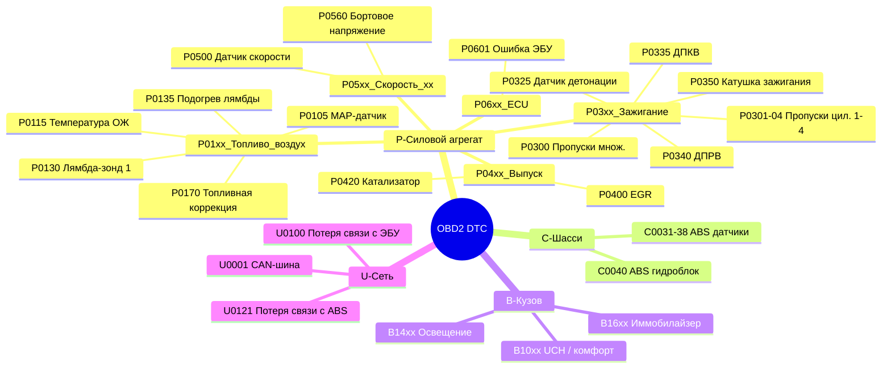

# Коды неисправностей OBD2 (DTC)

Коды OBD2 (Diagnostic Trouble Codes) для Renault Symbol с двигателями K7J, K4J, K7M, K4M.



## Формат кода

```text
P 0 1 0 1
│ │ │ └── номер ошибки (2 цифры)
│ │ └──── подсистема (0 — общая, 1 — топливо/воздух, 2 — топливная система, 3 — зажигание, 4 — доп. контроль)
│ └────── тип (0 — стандартный SAE, 1 — производитель)
└──────── система (P — силовой агрегат, C — шасси, B — кузов, U — сеть)
```

## Двигатель

### P0100 — P0199: Топливная система и воздух

| Код | Описание | Причина | Решение |
|-----|----------|---------|---------|
| **P0105** | MAP-датчик — неисправность цепи | Засорение вакуумной трубки, обрыв проводки | Продувка трубки MAP, проверка целостности проводов |
| **P0110** | Датчик температуры впускного воздуха (IAT) | Обрыв, КЗ, окисление контактов | Замена датчика |
| **P0115** | Датчик температуры ОЖ (ECT) | Обрыв цепи, неверный сигнал | Проверка разъёма, замена датчика |
| **P0120** | Датчик положения дроссельной заслонки (ДПДЗ) | Износ потенциометра, обрыв | Замена ДПДЗ (в сборе с дросселем) |
| **P0130** | Датчик кислорода (лямбда-зонд) — неисправность | Старение, загрязнение, топливо низкого качества | Диагностика, замена лямбда-зонда |
| **P0135** | Подогрев лямбда-зонда — неисправность | Обрыв цепи подогрева | Проверка предохранителя, замена зонда |
| **P0170** | Коррекция смеси — выход за пределы | Подсос воздуха после MAF | Поиск трещин в патрубках, проверка уплотнений |

### P0200 — P0299: Форсунки и топливоподача

| Код | Описание | Причина | Решение |
|-----|----------|---------|---------|
| **P0201–P0204** | Форсунка — обрыв цепи (цилиндр 1–4) | Обрыв обмотки форсунки, КЗ | Замер сопротивления (норма 11–15 Ом), замена форсунки |
| **P0230** | Реле топливного насоса — неисправность | Сгоревшее реле, обрыв цепи | Замена реле в блоке предохранителей моторного отсека |

### P0300 — P0399: Зажигание

| Код | Описание | Причина | Решение |
|-----|----------|---------|---------|
| **P0300** | Случайные / множественные пропуски зажигания | Смесь, свечи, катушка, компрессия | Комплексная диагностика |
| **P0301–P0304** | Пропуски зажигания — цилиндр 1–4 | Свеча, катушка, форсунка, низкая компрессия | Перестановка катушки/свечи для локализации |
| **P0325** | Датчик детонации — неисправность цепи | Обрыв, ослабление крепления | Затяжка датчика (20 Н·м), проверка цепи |
| **P0335** | Датчик положения коленвала (ДПКВ) — неисправность | Обрыв, загрязнение, зазор | Проверка зазора (0,5–1,5 мм), замена |
| **P0340** | Датчик фаз (распредвала) — неисправность | Обрыв, неверный сигнал | Замена датчика |

### P0400 — P0499: Доп. системы двигателя

| Код | Описание | Причина | Решение |
|-----|----------|---------|---------|
| **P0420** | Катализатор — эффективность ниже порога | Разрушенный или забитый катализатор | Замена катализатора или установка обманки |
| **P0441** | Система улавливания паров — неверный расход | Трещина в адсорбере, клапан продувки | Замена клапана продувки адсорбера |
| **P0450** | Датчик давления в системе EVAP | Засорение, обрыв | Проверка цепей |

### P0500 — P0599: Холостой ход и скорость

| Код | Описание | Причина | Решение |
|-----|----------|---------|---------|
| **P0505** | Регулятор холостого хода — неисправность | Загрязнение РХХ, обрыв | Чистка или замена РХХ |
| **P0560** | Напряжение бортовой сети — неверное | Генератор, АКБ, окисление клемм | Проверка зарядки, чистка клемм |

### P0600 — P0699: ЭБУ

| Код | Описание | Причина | Решение |
|-----|----------|---------|---------|
| **P0605** | ПЗУ ЭБУ — неисправность | Отказ блока | Замена/перепрошивка ЭБУ |
| **P0625** | Цепь питания генератора (L-вывод) | Обрыв, неисправность генератора | Диагностика генератора |
| **P0650** | Цепь индикатора MIL (Check Engine) | Перегоревшая лампа, обрыв | Замена лампы, проверка панели |
| **P0685** | Главное реле — обрыв цепи | Сгоревшее реле впрыска | Замена реле в блоке BSM |

### P0A00 — P0A99: Доп. системы двигателя

| Код | Описание | Причина | Решение |
|-----|----------|---------|---------|
| **P0A08** | Цепь вентилятора охлаждения | Залипшее реле, двигатель | Замена реле мотора |

### P1000 — P1999: Производитель (Renault-Specific)

| Код | Описание | Причина | Решение |
|-----|----------|---------|---------|
| **P1105** | MAP-датчик — неверный сигнал | Засор вакуумной трубки | Продувка, замена датчика |
| **P1113** | Датчик IAT — вход высокий/низкий | Обрыв, КЗ | Замена датчика |
| **P1121** | Потенциометр дросселя — сигнал вне диапазона | Износ/загрязнение | Замена ДПДЗ |
| **P1122** | Потенциометр дросселя — залипание | Механическое | Замена дросселя в сборе |
| **P1130** | Лямбда-зонд — медленный отклик | Старение зонда | Замена |
| **P1141** | Лямбда-зонд №2 — подогрев | Обрыв | Замена |
| **P1161** | Лямбда-зонд — топливная коррекция на пределе | Подсос, износ | Поиск подсоса |
| **P1170** | Лямбда-зонд — сигнал за пределами диапазона | Неисправность | Замена |
| **P1300** | Катушка зажигания — обрыв первичной цепи | Катушка/проводка | Проверка катушки |
| **P1301–P1304** | Катушка — обрыв цилиндр 1–4 | Катушка/свеча | Замена |
| **P1336** | Датчик детонации — сигнал вне диапазона | Обрыв, ослабление | Затяжка/замена |
| **P1340** | Датчик распредвала — неверный сигнал | Обрыв, загрязнение | Замена |
| **P1360** | ДПКВ — прерывистый сигнал | Зазор, загрязнение | Проверка зазора |
| **P1390** | Пропуски зажигания — катализатор повреждён | Многократные пропуски | Стирание кода после ремонта |
| **P1500** | Иммобилайзер — нет связи с ключом | Чип ключа, антенна | Адаптация ключа |
| **P1501** | Иммобилайзер — запрет пуска | Чип/ЭБУ | Диагностика иммо |
| **P1510** | РХХ — неисправность цепи | Обрыв, загрязнение | Чистка/замена |
| **P1515** | Электромагнитный клапан адсорбера (EVAP) | Обрыв | Замена |
| **P1525** | Реле вентилятора — неисправность | Сгоревшее реле | Замена |
| **P1550** | Напряжение АКБ — ниже порога | Разряд, генератор | Зарядка, проверка генератора |
| **P1600** | ЭБУ — EEPROM ошибка | Отказ памяти | Перепрошивка/замена |
| **P1610** | ЭБУ — ошибка контрольной суммы | Отказ | Замена |
| **P1625** | ЭБУ — внутреннее реле | Реле внутри ЭБУ | Замена блока |

### P2000 — P2999: Дизельные коды (K9K)

| Код | Описание | Причина | Решение |
|-----|----------|---------|---------|
| **P0380** | Свеча накаливания — обрыв цепи | Свеча/реле | Замена свечей/реле |
| **P0381** | Свеча накаливания — цепь индикатора | Лампа/проводка | Проверка индикатора |
| **P0401** | EGR — недостаточный расход | Засор клапана | Чистка/замена EGR |
| **P0403** | EGR — неисправность цепи управления | Электроклапан, обрыв | Проверка цепи |
| **P0470** | Датчик давления выхлопных газов (K9K) | Обрыв, засор | Замена |
| **P2002** | Сажевый фильтр — эффективность (если есть) | Забит DPF | Регенерация/замена |
| **P2146** | Форсунки (дизель) — общая цепь | ТНВД/проводка | Диагностика Common Rail |
| **P2147–P2149** | Форсунка 1–4 — обрыв | Форсунка | Замена

### P0700 — P0799: Трансмиссия

| Код | Описание | Причина | Решение |
|-----|----------|---------|---------|
| **P0705** | Датчик положения селектора АКПП | Износ датчика, обрыв | Замена датчика |
| **P0715** | Датчик скорости турбины АКПП | Загрязнение, износ | Диагностика, замена |
| **P0730** | Передаточное отношение — неверное | Износ фрикционов, гидроблок | Дефектовка АКПП |

### P0800 — P0899: Доп. системы шасси

| Код | Описание | Причина | Решение |
|-----|----------|---------|---------|
| **P0805** | Датчик положения сцепления | Износ, обрыв | Замена датчика |

## Антиблокировочная система (ABS Bosch 5.3 / 8.0)

| Код | Описание | Причина | Решение |
|-----|----------|---------|---------|
| **C0001** | Датчик скорости левый передний | Загрязнение, зазор, обрыв | Чистка датчика, проверка зазора |
| **C0002** | Датчик скорости правый передний | Загрязнение, зазор, обрыв | Чистка датчика, проверка зазора |
| **C0003** | Датчик скорости левый задний | Загрязнение, зазор, обрыв | Чистка датчика, проверка зазора |
| **C0004** | Датчик скорости правый задний | Загрязнение, зазор, обрыв | Чистка датчика, проверка зазора |
| **C0031–C0035** | Гидроагрегат ABS — неисправность | Отказ блока | Замена гидроагрегата |
| **C0040** | Насос ABS — цепь | Обрыв/КЗ мотора | Проверка реле насоса |
| **C0050** | ESP/ASR (если есть) | Неисправность блока | Диагностика |
| **C0060** | Реле насоса ABS | Сгоревшее реле | Замена реле в блоке BSM |
| **C0070** | Напряжение питания ABS | Ниже 9 В | Проверка АКБ/генератора |

## SRS (Airbag)

| Код | Описание | Причина | Решение |
|-----|----------|---------|---------|
| **B1000** | Подушка водителя — высокое сопротивление | Окисление контактов под рулём | Чистка контактного кольца |
| **B1003** | Подушка пассажира — высокое сопротивление | Обрыв в жгуте под сиденьем | Проверка проводки под сиденьем |
| **B1015** | Блок SRS — внутренняя неисправность | Отказ блока | Замена блока SRS |
| **B1020** | Подушка водителя — низкое сопротивление | КЗ | Замена подушки |
| **B1025** | Датчик удара — неисправность | Обрыв/блок | Диагностика |
| **B1030** | Ремень безопасности — преднатяжитель | Обрыв | Замена преднатяжителя |
| **B1050** | ESP/ASR — нет связи по CAN | CAN-шина | Диагностика CAN |

## Трансмиссия (АКПП / МКПП)

| Код | Описание | Причина | Решение |
|-----|----------|---------|---------|
| **P0705** | Датчик положения селектора АКПП — неисправность | Износ, обрыв | Замена датчика |
| **P0710** | Датчик температуры масла АКПП | Обрыв | Замена |
| **P0715** | Датчик скорости входного вала АКПП | Износ | Замена датчика |
| **P0720** | Датчик скорости выходного вала АКПП | Загрязнение | Диагностика |
| **P0730** | Передаточное отношение — неверное | Износ фрикционов | Дефектовка АКПП |
| **P0740** | Муфта блокировки гидротрансформатора | Износ | Замена |
| **P0745** | Клапан давления гидроблока | Засор | Промывка/замена гидроблока |
| **P0750–P0758** | Соленоиды переключения A/B/C | Обрыв | Замена соленоида |
| **P0805** | Датчик положения сцепления (МКПП) | Износ | Замена датчика |

---

## Как считать коды (без сканера)

На Renault Symbol с ЭБУ Siemens Sirius 32N / Bosch MP7.0 можно считать коды без сканера:

1. Включите зажигание, не запуская двигатель
2. Нажмите и удерживайте кнопку сброса суточного пробега
3. Через 5–7 секунд на дисплее панели приборов начнут мигать коды ошибок
4. Код состоит из серий вспышек (длинная = десятки, короткая = единицы)

> **Не сбрасывайте коды до диагностики** — при отключении АКБ на 10+ минут все адаптации сбрасываются, и двигатель будет работать неровно следующие 50–100 км.

## Где искать коды

| Блок | Протокол | Разъём OBD2 | Примечание |
|------|----------|-------------|------------|
| ЭБУ двигателя | ISO 9141-2 (K-line) | Пин 7 | Все бензиновые |
| ABS | ISO 9141-2 | Пин 7 | Через мультиплексор |
| SRS | ISO 9141-2 | Пин 7 | |
| АКПП | ISO 9141-2 | Пин 7 | Через ЭБУ двигателя |
| Панель приборов | CAN (после 2005) | Пины 6, 14 | Только **[Symbol II]** |

> Для полноценной диагностики рекомендуется Renault Can Clip (CLIP) или ELM327 с адаптером под Renault PIN-коды.
