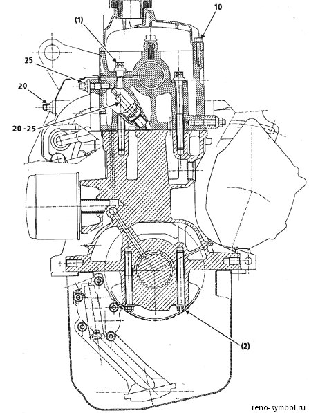

# 3.1 Бензиновые двигатели K7J, K4J, K7M, K4M и дизель K9K

Двигатели K-серии — рядные 4-цилиндровые моторы с чугунным блоком цилиндров и алюминиевой головкой блока. Бензиновые K7J, K4J, K7M и K4M являются двигателями интерференционного типа: при обрыве ремня ГРМ клапаны встречаются с поршнями, что приводит к дорогостоящему ремонту.

## Технические характеристики

### Бензиновые двигатели

| Параметр | K7J 700/710/720 | K4J | K7M 764/790 | K4M |
|----------|----------------|-----|-------------|-----|
| Рабочий объём, см³ | 1390 | 1390 | 1598 | 1598 |
| Диаметр цилиндра, мм | 79,5 | 79,5 | 79,5 | 79,5 |
| Ход поршня, мм | 70 | 70 | 80,5 | 80,5 |
| Степень сжатия | 9,5:1 | 10:1 | 9,5:1 | 10:1 |
| Клапанный механизм | SOHC, 8 клапанов | DOHC, 16 клапанов | SOHC, 8 клапанов | DOHC, 16 клапанов |
| Макс. мощность, кВт (л.с.) | 55 (75) при 5500 об/мин | 72 (98) при 6000 об/мин | 64 (88) при 5250 об/мин * | 77 (105) при 5750 об/мин |
| Макс. крутящий момент, Н·м | 114 при 3000 об/мин | 127 при 3750 об/мин | 135 при 3000 об/мин * | 148 при 3750 об/мин |
| Порядок работы цилиндров | 1–3–4–2 | 1–3–4–2 | 1–3–4–2 | 1–3–4–2 |
| Направление вращения коленвала | правое (по часовой) | правое (по часовой) | правое (по часовой) | правое (по часовой) |
| Система питания | Renix/Siemens MPI | Siemens MPI | Siemens/Bosch MPI | Siemens/Bosch MPI |
| Топливо | АИ-92 / АИ-95 | АИ-95 | АИ-92 / АИ-95 | АИ-95 |
| Расход топлива (смешанный), л/100 км | 7,0–7,5 | 7,0–7,5 | 7,5–8,5 | 7,5–8,5 |
| Масса двигателя (сухой), кг | ~105 | ~110 | ~115 | ~120 |

\* Мощность и момент K7M варьируются: от 88 л.с. / 131 Н·м до 90 л.с. / 135 Н·м в зависимости от версии.

### Дизельный двигатель K9K (1.5 dCi)

| Параметр | Значение |
|----------|----------|
| Рабочий объём | 1461 см³ |
| Диаметр цилиндра × ход поршня | 76 × 80,5 мм |
| Степень сжатия | 15,2:1 |
| Клапанный механизм | SOHC, 8 клапанов |
| Мощность | 48–63 кВт (64–86 л.с.) |
| Крутящий момент | 160–200 Н·м при 1750 об/мин |
| Система питания | Common Rail Direct Injection, турбонаддув |
| Интервал замены ремня ГРМ | 60 000 км или 4 года |

## Головка блока цилиндров (ГБЦ)

### K7J / K7M (8 клапанов, SOHC)

- Материал: алюминиевый сплав
- Количество клапанов: 8 (2 на цилиндр: впускной 34 мм, выпускной 30 мм)
- Угол между клапанами: 20°
- Прокладка ГБЦ: металлическая (многослойная)
- Момент затяжки ГБЦ: 20 Н·м + 50 Н·м + доворот на 120° (в три этапа по схеме от центра к краям)

### K4J / K4M (16 клапанов, DOHC)

- Материал: алюминиевый сплав
- Количество клапанов: 16 (4 на цилиндр)
- Два распределительных вала (впускной и выпускной)
- Гидрокомпенсаторы — регулировка зазоров не требуется
- Прокладка ГБЦ: металлическая (многослойная)

## Распределительный вал и ГРМ

- Распредвал: чугунный (SOHC) / стальные (DOHC)
- Привод: зубчатый ремень с автоматическим натяжителем
- **Интервал замены ремня ГРМ: 60 000 км или 4 года** (вне зависимости от состояния)
- Замена ремня ГРМ включает обязательную замену роликов и помпы

### Метка ГРМ
Шкив коленчатого вала имеет метку в виде треугольного выступа. При совмещении с неподвижной меткой на блоке цилиндров поршни 1 и 4 находятся в ВМТ. На шкиве распредвала метка совмещается с плоскостью головки блока.

## Привод клапанов

| Параметр | K7J | K7M | K4J / K4M |
|----------|-----|-----|-----------|
| Тип привода | Механические толкатели | Гидрокомпенсаторы | Гидрокомпенсаторы |
| Регулировка зазоров | Каждые 15 000 км | Не требуется | Не требуется |
| Зазор на холодном (впуск), мм | 0,20 ± 0,05 | — | — |
| Зазор на холодном (выпуск), мм | 0,25 ± 0,05 | — | — |
| Толщина регулировочных шайб | 2,20–3,40 мм (шаг 0,05 мм) | — | — |

⚠ **Для K7J**: регулировка клапанов подбором толкателей. При каждом ТО-2 проверяйте зазоры. Неотрегулированный зазор приводит к прогоранию клапана и потере мощности.

## Моменты затяжки резьбовых соединений

| Соединение | Момент, Н·м |
|------------|-------------|
| Болты ГБЦ (этап 1) | 20 |
| Болты ГБЦ (этап 2) | 50 |
| Болты ГБЦ (этап 3) | доворот 120° |
| Свечи зажигания | 25–30 |
| Поддон картера к блоку | 8–10 |
| Клапанная крышка | 8–10 |
| Маховик к коленвалу | 60–65 |
| Шкив коленвала | 100–110 |
| Выпускной коллектор к ГБЦ | 20–25 |
| Крышка распредвала | 8–10 |

## Система смазки

| Параметр | K7J | K4J | K7M | K4M |
|----------|-----|-----|-----|-----|
| Объём масла (с фильтром), л | 3,5 | 3,5 | 4,5 | 4,5 |
| Рекомендуемое масло | 5W-30 / 5W-40 API SL/SN, RN 0700 | 5W-30 / 5W-40 API SL/SN, RN 0700 | 5W-30 / 5W-40 API SL/SN, RN 0700 | 5W-30 / 5W-40 API SL/SN, RN 0700 |
| Давление на холостых, бар | 0,8–1,0 | 0,8–1,0 | 0,8–1,0 | 0,8–1,0 |
| Давление при 3000 об/мин, бар | 3,0–4,0 | 3,0–4,0 | 3,0–4,0 | 3,0–4,0 |

## Система охлаждения

| Параметр | K7J / K4J | K7M / K4M |
|----------|-----------|-----------|
| Объём охлаждающей жидкости, л | 5,5 | 6,0 |
| Тип ОЖ | G11 (силикатный, зелёный) | G11 (силикатный, зелёный) |
| Термостат: начало открытия | 89 °C | 89 °C |
| Термостат: полное открытие | 101 °C | 101 °C |
| Вентилятор: температура включения | 96 °C | 96 °C |
| Пробка радиатора, бар | 1,4 | 1,4 |

## Компрессия в цилиндрах

- Номинальное давление: 10–12 бар
- Минимально допустимое: 8 бар
- Разница между цилиндрами: не более 1,0 бар
- Измерять на прогретом двигателе со всеми выкрученными свечами при полностью открытой дроссельной заслонке

## Типовые неисправности двигателей K7J / K7M

| Неисправность | Причина | Устранение |
|---------------|---------|------------|
| Стук гидрокомпенсатора (K7M, K4J, K4M) | Воздух в масле, износ | Промывка масляной системы, замена масла; если не помогло — замена гидрокомпенсаторов |
| Стук поршневого пальца | Износ втулки | Замена поршневого пальца и шатунных втулок |
| Посторонний шум в ГРМ | Износ натяжителя или ремня | Немедленная замена ремня и роликов |
| Дым из выхлопной трубы (белый) | Прокладка ГБЦ | Замена прокладки, шлифовка плоскости ГБЦ |
| Дым (синий) | Износ маслосъёмных колпачков | Замена колпачков (без снятия ГБЦ, специальным съёмником) |
| Дым (чёрный) | Богатая смесь (форсунки, лямбда) | Диагностика топливной системы |
| Перегрев | Термостат / помпа / воздух | Промывка, замена термостата, прокачка |
| Плавающие обороты | Дроссельная заслонка / РХХ / подсос | Чистка дросселя, замена РХХ, поиск подсоса |
| Масло в охлаждающей жидкости | Трещина в ГБЦ / прокладка | Снятие и опрессовка ГБЦ |
