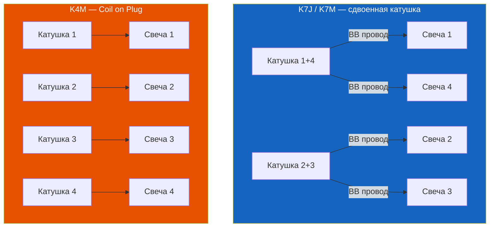

# 3.10 Система зажигания

Система зажигания бензиновых двигателей K7J, K7M, K4J, K4M. Бесконтактная, электронная — управляется ЭБУ.

```mermaid
flowchart LR
    subgraph Input[Входные датчики]
        CKP[ДПКВ — датчик коленвала<br/>индуктивный]
        CMP[ДПРВ — датчик распредвала<br/>эффект Холла]
        TPS[ДПДЗ — положение дросселя]
        MAP[Датчик давления воздуха]
        ECT[Датчик температуры ОЖ]
    end

    subgraph ECU[ЭБУ — блок управления]
        E1[Расчёт УОЗ<br/>угол опережения]
        E2[Расчёт времени<br/>накопления катушки]
        E3[Контроль детонации<br/>K4J/K4M]
    end

    subgraph Output[Выход — катушки + свечи]
        COIL1[Катушка зажигания 1+4<br/>одновременная искра]
        COIL2[Катушка зажигания 2+3<br/>одновременная искра]
        SPARK1[Свеча 1]
        SPARK2[Свеча 2]
        SPARK3[Свеча 3]
        SPARK4[Свеча 4]
    end

    Input --> ECU
    ECU --> Output
    
    style Input fill:#1565c0,color:#fff
    style ECU fill:#e65100,color:#fff
    style Output fill:#2e7d32,color:#fff
```



## Типы систем зажигания

| Двигатель | Тип | Катушки | Система |
|-----------|-----|---------|---------|
| **K7J** (1.4 8V) | Распределённая, статическая | 1 сдвоенная (1+4 / 2+3) | DIS — без распределителя |
| **K7M** (1.6 8V) | Распределённая, статическая | 1 сдвоенная (1+4 / 2+3) | DIS |
| **K4J** (1.4 16V) | Распределённая, статическая | 2 сдвоенные или 4 индивидуальные | DIS / COP |
| **K4M** (1.6 16V) | Распределённая, статическая | 4 индивидуальные (COP) | COP (Coil on Plug) |

### K7J / K7M (8 клапанов)

- **Катушка:** одна сдвоенная катушка с 2 высоковольтными выводами
- **Искрообразование:** метод «холостой искры» — искра одновременно в двух цилиндрах (1+4, 2+3), в одном — рабочая, в другом — холостая
- **ВВ-провода:** 4 шт
- **Порядок работы:** 1-3-4-2

### K4J / K4M (16 клапанов)

- **K4J (ранние):** 2 сдвоенные катушки (аналогично 8V)
- **K4J (поздние) / K4M:** 4 индивидуальные катушки (COP) — каждая свеча имеет свою катушку, без ВВ-проводов
- **COP — Coil on Plug:** катушка надевается непосредственно на свечу
- **Дачик детонации (KS):** устанавливается на блоке цилиндров, позволяет ЭБУ корректировать УОЗ

## Катушка зажигания

### Сдвоенная катушка (K7J/K7M)

| Параметр | Значение |
|----------|----------|
| Тип | Сдвоенная, «холостая искра» |
| Сопротивление первичной обмотки | 0,5–1,0 Ом |
| Сопротивление вторичной обмотки | 8–15 кОм (между ВВ-выводами) |
| Межвитковое замыкание | Проверка омметром |
| Артикул оригинал | 77 00 746 945 |

### Индивидуальная катушка COP (K4M)

| Параметр | Значение |
|----------|----------|
| Тип | Индивидуальная, на свечу |
| Сопротивление первичной обмотки | 0,4–0,8 Ом |
| Сопротивление вторичной обмотки | 6–12 кОм |
| Артикул оригинал | 82 00 858 153 |
| Свеча | Иридиевая / платиновая (ресурс 60 000 км) |



## Свечи зажигания

| Параметр | K7J/K7M (8V) | K4J/K4M (16V) |
|----------|-------------|---------------|
| Тип | Обычные медные | Иридиевые / платиновые (рекомендуется) |
| Зазор | 0,9–1,1 мм | 0,9–1,1 мм |
| Момент затяжки | 25–30 Н·м | 25–30 Н·м |
| Ресурс | 30 000 км | 60 000 км |
| Артикул оригинал | 77 00 500 366 | 77 00 500 735 (иридий) |
| Рекомендуемый аналог | NGK BKR6E | NGK BKR6EIX-11 (иридий) |

```admonition warning
Зазор свечи — критически важен. Зазор >1,2 мм → пропуски зажигания на высоких оборотах. Зазор <0,7 мм → слабая искра, плохой пуск. Проверяйте только круглым щупом (не плоским) — плоский даёт погрешность.
```

## ВВ-провода (только K7J/K7M 8V)

| Параметр | Значение |
|----------|----------|
| Сопротивление (новый) | 2–6 кОм |
| Сопротивление (предел) | 15–20 кОм |
| Длина | ~30–50 см (индивидуально по цилиндрам) |
| Артикул комплекта | 77 00 765 351 |

**Диагностика:** Прозвонить омметром. Если сопротивление >15 кОм или есть пробой (видно искру в темноте) — заменить комплектом. Пробой ВВ-провода → пропуски зажигания → ошибка P0301–P0304.

## Модуль зажигания (K7J/K7M)

На ранних версиях Symbol I (1999–2001) — модуль зажигания отдельный (под катушкой). На поздних — интегрирован в ЭБУ или в катушку.

| Тип | Применение | Примечание |
|-----|------------|------------|
| Отдельный модуль | Symbol I (1999–2001) | Крепится на катушку |
| Интегрирован в ЭБУ | Symbol II (2002–2005) | Модуль внутри ECU |
| Интегрирован в катушку | Symbol II (2005+) / III | Катушка с драйвером |

```admonition tip
Если нет искры — проверяйте:
1. Предохранитель F17 (15A, форсунки + катушки)
2. Датчик коленвала (ДПКВ) — самая частая причина
3. Катушку зажигания (первичная обмотка)
4. Коммутатор / модуль зажигания
```

## Датчики системы зажигания

### Датчик коленвала (ДПКВ / CKP)

| Параметр | Значение |
|----------|----------|
| Тип | Индуктивный (переменного тока) |
| Сопротивление обмотки | 200–400 Ом |
| Зазор до зубчатого колеса | 0,5–1,5 мм |
| Сигнал | Синусоида ~0,5–5 В (на холостых) |

**Проверка:** Подключить осциллограф к выводам датчика, прокрутить стартером — должна быть чёткая синусоида. Если сигнала нет — нет искры и впрыска.

### Датчик распредвала (ДПРВ / CMP)

| Параметр | Значение |
|----------|----------|
| Тип | Эффект Холла |
| Питание | 5В (от ЭБУ) |
| Сигнал | Прямоугольные импульсы 0–5В |
| Назначение | Определение ВМТ 1-го цилиндра |

**Без сигнала ДПРВ:** двигатель заведётся, но ЭБУ перейдёт в режим последовательного впрыска (все форсунки одновременно) — увеличится расход.

## Типичные неисправности

| Симптом | Причина | Диагностика | Решение |
|---------|---------|-------------|---------|
| Двигатель не заводится, искры нет | 1. ДПКВ<br/>2. Катушка<br/>3. Модуль/предохранитель | Осциллограф, мультиметр | Замена датчика / катушки |
| Пропуски зажигания на ХХ | 1. Свечи изношены<br/>2. ВВ-провода | Визуально, омметр | Замена |
| Пропуски под нагрузкой | 1. Катушка (пробой)<br/>2. Зазор свечи | Осциллограф тока катушки | Замена |
| Двигатель «троит» после мойки | Влага в свечных колодцах | Снять ВВ-провода, просушить | Сжатый воздух, WD-40 |
| Ошибка P0301–P0304 | Пропуски в цилиндре N | Проверить свечу / катушку / форсунку | Замена |
| Ошибка P0335–P0338 | Неисправность цепи ДПКВ | Сопротивление, осциллограф | Замена датчика |
| Ошибка P0340 | Неисправность цепи ДПРВ | Сигнал, питание 5В | Замена датчика |
| Ошибка P0325 | Детонация (K4J/K4M) | Датчик детонации | Замена датчика |

## Коды ошибок системы зажигания (OBD2)

| Код | Расшифровка |
|-----|-------------|
| P0300 | Множественные пропуски зажигания |
| P0301 | Пропуски в цилиндре 1 |
| P0302 | Пропуски в цилиндре 2 |
| P0303 | Пропуски в цилиндре 3 |
| P0304 | Пропуски в цилиндре 4 |
| P0325 | Цепь датчика детонации — неисправность |
| P0335 | Цепь датчика коленвала — неисправность |
| P0336 | Цепь датчика коленвала — диапазон/производительность |
| P0340 | Цепь датчика распредвала — неисправность |
| P0350 | Цепь катушки зажигания — неисправность |
| P0351 | Цепь катушки зажигания A |
| P0352 | Цепь катушки зажигания B |
