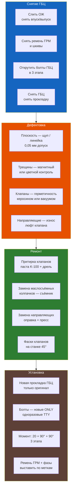

# 3.12 Головка блока цилиндров (ГБЦ)

Снятие, дефектовка, ремонт и установка ГБЦ двигателей K7J (8V) и K7M/K4J/K4M (16V).



## Конструкция ГБЦ

| Параметр | K7J (8V) | K7M (8V) | K4J/K4M (16V) |
|----------|----------|----------|---------------|
| Материал | Алюминий | Алюминий | Алюминий |
| Клапанов | 8 (SOHC) | 8 (SOHC) | 16 (DOHC) |
| Распредвалов | 1 | 1 | 2 |
| Гидрокомпенсаторы | Нет (регулировка шайбами) | Да | Да |
| Фазы ГРМ | Не регулируются | Не регулируются | Да (впуск) |
| Прокладка | Многослойная сталь (MLS) | Многослойная сталь | Многослойная сталь |

### K7J — особенности 8V

- Распредвал нижний (в блоке) — нет, это OHV. У K7J распредвал в ГБЦ (SOHC).
- Клапанный механизм: **регулировочные шайбы** (толкатели стаканы)
- Зазор впуск: **0,15–0,25 мм** (холодный)
- Зазор выпуск: **0,30–0,40 мм** (холодный)

Проверка зазора — щупом между кулачком распредвала и толкателем. Подбор шайбы — 33 шт разных толщин (2,00–3,60 мм с шагом 0,05 мм).

### K7M / K4J / K4M — гидрокомпенсаторы

Гидрокомпенсаторы автоматически регулируют зазор. Признаки неисправности:
- **Стук на холодную** (первые 2–3 секунды) — норма
- **Стук постоянно** — завоздушивание / износ / закоксовка
- **Стук на горячую** — износ гидрокомпенсатора → замена

## Снятие ГБЦ

### Инструменты

| Инструмент | Назначение |
|-----------|------------|
| Головка E-Torx T45 (K7J) / T50 (K7M) | Болты ГБЦ |
| Динамометрический ключ до 150 Н·м | Моменты |
| Угломер (транспортир) | Дотяжка на угол |
| Фиксатор маховика | |
| Съёмник шкива коленвала | Съёмник 2-лапый |

### Порядок снятия

1. **Слейте ОЖ** — через блок и радиатор
2. **Снимите впускной коллектор** — 8 гаек M8 (K7J) / 10 болтов M8 (K7M)
3. **Снимите выпускной коллектор** — 8 гаек M8 (ключ на 13, торцевая головка)
4. **Снимите ремень ГРМ** ([см. 3.6 Замена ремня ГРМ](./3-6.md)) — **обязательно выставить ВМТ**
5. **Снимите распредвал** (на K7J — фиксатор ГРМ, на K7M — съёмник шкива)
6. **Открутите болты ГБЦ** в 3 этапа — **строго по порядку**:

```text
K7J — порядок откручивания:
  8   4   1   5   9
  7   3   2   6   10

K7M — порядок откручивания:
  10  6   2   3   7
  9   5   1   4   8
```

**3 этапа откручивания:**
1. Ослабить каждый болт на 90° (четверть оборота) — в указанном порядке
2. Довернуть ещё на 90° — в том же порядке
3. Выкрутить полностью

7. **Снимите ГБЦ** — подденьте монтажкой (осторожно, не повредите плоскость!)

## Дефектовка

### Проверка плоскости

```admonition warning
Алюминиевая ГБЦ склонна к деформации при перегреве. Если двигатель перегревался — проверка плоскости обязательна!
```

| Допуск | Действие |
|--------|----------|
| < 0,05 мм | Можно ставить |
| 0,05–0,15 мм | Шлифовка плоскости (фрезерование) |
| > 0,15 мм | Замена ГБЦ |

**Проверка:** металлическая линейка + щуп. Положите линейку на плоскость по диагоналям и осям. Зазор > 0,05 мм — шлифовка.

### Проверка на трещины

- Визуально — в зоне между сёдлами клапанов и свечных колодцев
- Магнитопорошковый контроль (МПК) — для алюминия подходит цветная дефектоскопия
- Опрессовка: керосин под давлением 2–3 атм (признак — просачивание в свечные колодцы)

### Проверка клапанов

| Дефект | Причина | Решение |
|--------|---------|---------|
| Прогар тарелки | Бедная смесь, зажигание | Замена клапана |
| Износ стержня | Естественный | +0,075 мм ремонт |
| Изнашивание фаски | Естественное | Притирка / шлифовка |
| Люфт в направляющей | > 0,15 мм | Замена направляющей |

## Ремонт ГБЦ

### Притирка клапанов

1. Нанесите притирочную пасту (K-100 или аналог) на фаску клапана тонким слоем
2. Вставьте клапан в направляющую
3. Притрите дрелью или приспособлением: 10–15 секунд вращения, затем поворот на 90°
4. Повторите 3–4 раза
5. Удалите пасту, проверьте герметичность:
   - Залить керосин в камеру сгорания — клапан не должен пропускать
   - Или вакуумный тестер

### Замена маслосъёмных колпачков

```admonition tip
Причина синего дыма при запуске и на перегазовках — износ маслосъёмных колпачков. Характерно для K7J после 80 000 км.
```

**Инструмент:**
- Съёмник колпачков (цанговый)
- Оправка для запрессовки новых колпачков
- Пинцет, отвёртка

**Порядок (K7J 8V):**
1. Снять распредвал
2. Снять пружины клапанов (рассухаривателем)
3. Стянуть старый колпачок съёмником
4. Смазать новый колпачок моторным маслом
5. Запрессовать оправкой до щелчка (лёгкое нажатие)
6. Установить пружины и сухари
7. Установить распредвал, отрегулировать зазоры

**Порядок (K7M 16V):**
1. Снять распредвалы
2. Снять гидрокомпенсаторы (пометить, не путать!)
3. Далее — аналогично 8V
4. Перед установкой гидрокомпенсаторы — выдержать в масле 30 минут

### Шлифовка ГБЦ

Если выявлено искривление плоскости:
1. Снять все клапаны, пружины, сухари
2. Снять заглушки масляных каналов
3. Фрезеровать плоскость — **не более 0,3 мм** от номинала
4. После фрезеровки — проверить высоту ГБЦ (номинал K7J: 133,0 ± 0,05 мм)
5. Установить новые заглушки

## Установка ГБЦ

### Прокладка

```admonition danger
Болты ГБЦ — одноразовые (Torque-To-Yield). При каждой замене — новые болты! Старые болты после затяжки с углом 90° уже удлинены сверх предела текучести.
```

**Выбор прокладки:**
- Только оригинал Renault (VICTOR REINZ или ELRING — аналоги)
- Многослойная сталь (MLS) — тип "A" или "B" (по выступу)
- Не используйте пасту или герметик — сухая установка

### Этапы затяжки болтов

**K7J (M12 × 180, 10 шт):**
| Этап | Действие | Момент |
|------|----------|--------|
| 1 | Затянуть в порядке (см. схему) | 25 Н·м |
| 2 | Дотянуть в том же порядке | 90° |
| 3 | Дотянуть в том же порядке | ещё 90° |

**K4J/K4M / K7M (M12, 10 шт, TTY):**
| Этап | Действие | Момент |
|------|----------|--------|
| 1 | Затянуть в порядке (см. схему) | **20 Н·м** |
| 2 | Дотянуть в том же порядке | **240° ± 6°** |

```admonition warning
На двигателях K4J/K4M болты ГБЦ затягиваются **за один доворот на 240°** (не два по 90°!). Это одноразовые TTY-болты. После затяжки на 20 Н·м + 240° болт достигает предела текучести — повторное использование запрещено.
```

**Контроль длины болтов ГБЦ:**
| Двигатель | Максимальная длина (под головкой) | Действие |
|-----------|-----------------------------------|----------|
| K4J/K4M | 117,7 мм | Если длиннее — заменить все болты |
| K7J | 117,7 мм | То же |

**Важно:** При установке новых болтов ГБЦ **не смазывайте** резьбу маслом. При повторном использовании болтов (если допустимо) — **обязательно смазать** моторным маслом. Перед затяжкой удалите шприцом масло из крепёжных отверстий в блоке.

```text
Порядок затяжки (оба двигателя):
  9   5   1   3   7
  10  6   2   4   8
```

### Замена ремня ГРМ

После установки ГБЦ:
1. Выставить ВМТ 1-го цилиндра
2. Установить новый ремень ГРМ
3. Натянуть роликом (стрелка метки)
4. Провернуть коленвал на 2 оборота вручную — проверить совпадение меток

### Первый запуск

- При первом запуске — возможна работа с пропусками (развоздушивание гидрокомпенсаторов)
- Дайте двигателю поработать на ХХ 10–15 минут
- Проверьте на течь масла и ОЖ
- Проверьте уровень масла (долейте при необходимости)
- Сбросьте адаптации ЭБУ (отключить АКБ на 30 минут)

## Типичные неисправности

| Симптом | Причина | Решение |
|---------|---------|---------|
| Белый дым из выхлопа (не прекращается) | Пробита прокладка ГБЦ | Замена прокладки |
| Масло в ОЖ / ОЖ в масле | Прокладка / трещина ГБЦ | Дефектовка, замена |
| Синий дым при запуске | Износ маслосъёмных колпачков | Замена колпачков |
| Синий дым при разгоне | Износ поршневых колец | Капремонт |
| Перегрев (воздушная пробка) | Неправильное заполнение ОЖ | Удаление пробки ([3.4](./3-4.md)) |
| Стук гидрокомпенсаторов | Воздух / износ / грязное масло | Замена масла / промывка / замена |
| Плавающие обороты | Неправильные фазы ГРМ | Проверить метки |
