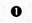
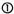

# 3.2 Система питания

Система питания обеспечивает приготовление и подачу топливно-воздушной смеси в цилиндры. На Renault Symbol с двигателем K7J применялась система одноточечного впрыска (Renix Monopoint на ранних версиях) или многоточечного распределённого впрыска (MPI). Двигатели K4J, K7M и K4M оснащались распределённым впрыском Siemens или Bosch.

## Одноточечный впрыск (Renix Monopoint)

На двигателях K7J (ранние выпуски) устанавливалась система Monopoint — одна центральная форсунка в корпусе дроссельного узла (TBI — Throttle Body Injection). ЭБУ — Renix 48.

### Особенности системы Monopoint

- Одна форсунка типа TBI
- Давление топлива: 1,0 ± 0,2 бар
- ЭБУ Renix 48
- Датчик положения коленвала (ДПКВ) индуктивного типа
- Датчик абсолютного давления (MAP) на впускном коллекторе
- Регулятор холостого хода (РХХ) шагового типа с 4 выводами
- Датчик положения дроссельной заслонки (ДПДЗ) потенциометрический

### Проверка давления в системе Monopoint

```text
1. Сбросьте давление: снимите колпачок с топливного штуцера
   на рампе и нажмите на золотник (через ветошь).
2. Подключите манометр (0–2 бар) к топливному штуцеру.
3. Включите зажигание — насос должен создавать давление.
4. Норма: 0,8–1,2 бар (на холостом ходу).
5. Если давление ниже 0,6 бар — проверьте насос и регулятор.
```

## Распределённый впрыск (MPI — Siemens / Bosch)

На двигателях K4J, K7M, K4M и поздних K7J с 2002 года применяется классический многоточечный впрыск с индивидуальной форсункой на каждый цилиндр. ЭБУ — Siemens Sirius 32N (K4J, K7M) или Bosch MP7.0 (K4M).

### Технические характеристики MPI

| Параметр | K7J (MPI) | K4J | K7M | K4M |
|----------|-----------|-----|-----|-----|
| Давление топлива, бар | 3,0 ± 0,2 | 3,0 ± 0,2 | 3,0 ± 0,2 | 3,0 ± 0,2 |
| Тип форсунок | Электромагнитные, высокоомные (12 Ом) |
| Производительность форсунок, см³/мин | ~190 | ~200 | ~210 | ~220 |
| Сопротивление обмотки форсунки, Ом | 11–15 (при 20 °C) |
| ЭБУ | Renix/Siemens | Siemens Sirius 32N | Siemens Sirius 32N | Bosch MP7.0 |
| Тип впрыска | Последовательный, фазированный |

#  

## Топливный модуль (насос в баке)

Топливный насос расположен внутри топливного бака в едином модуле, включающем:
- электрический насос роторного типа (на базе насосов Bosch 0580)
- датчик уровня топлива (поплавковый)
- регулятор давления топлива (для MPI: 3,0 бар)
- сетчатый фильтр грубой очистки (сетка-стакан)

**Признаки неисправности топливного насоса:**
- Двигатель не запускается или запускается после 3–4 попыток
- Рывки и провалы при движении особенно при низком уровне топлива
- Завышенный шум (свист или гул) из района заднего сиденья
- Падение давления топлива после выключения насоса

⚠ **Замена топливного модуля**: доступ через лючок под задним сиденьем. Откиньте подушку заднего сиденья, открутите 4 винта крышки лючка. Перед отсоединением трубок сбросьте давление в рампе (см. процедуру выше).

  

## Дроссельный узел

На двигателях K7J, K4J, K7M и K4M дроссельный узел объединён с датчиком положения и регулятором холостого хода.

- Диаметр дросселя: 45 мм (K7J, K4J), 48 мм (K7M, K4M)
- Привод дроссельной заслонки: тросовый (педаль газа — механическая)
- Датчик положения: 3-контактный, потенциометрический
- Напряжение сигнала: 0,4–0,6 В (закрыт) — 4,5–4,7 В (открыт)

### Чистка дроссельной заслонки

При загрязнении дросселя возникает плавание оборотов и провалы.

```text
1. Снимите воздушный патрубок с дросселя.
2. Снимите дроссельный узел (4 болта Torx T30).
3. Отсоедините разъём ДПДЗ и РХХ.
4. Промойте канал дросселя очистителем карбюратора.
5. Удалите налёт с заслонки — её нельзя царапать!
6. Продуйте сжатым воздухом.
7. Соберите, выполните адаптацию: включите зажигание на 10 с,
   выключите, повторите 3 раза.
```

## Регулировка оборотов холостого хода

На двигателях K7J с системой Monopoint обороты ХХ регулируются винтом качества смеси (закрыт заглушкой) и положением дроссельной заслонки. На MPI-версиях регулировка **невозможна** механически — коррекция выполняется через диагностический сканер.

| Модель | Обороты ХХ (нейтраль) | Норма CO на ХХ |
|--------|----------------------|----------------|
| K7J (моно) | 800 ± 50 об/мин | 0,5–0,8 % |
| K7J (MPI) | 800 ± 50 об/мин | < 0,5 % |
| K7M (MPI) | 750 ± 50 об/мин | < 0,5 % |
| K4J (MPI) | 750 ± 50 об/мин | < 0,5 % |
| K4M (MPI) | 750 ± 50 об/мин | < 0,5 % |

## Форсунки — диагностика и замена

Признаки неисправности форсунок:
- Пропуски зажигания (misfire) по одному или нескольким цилиндрам
- Обогащение смеси (чёрный дым, запах бензина)
- Повышенный расход топлива (более 10 л/100 км)

### Проверка форсунок

```text
1. Снимите топливную рампу в сборе с форсунками.
2. Не отсоединяя трубок, подложите мерные колбы под форсунки.
3. Проверните стартером на 10 с — объём в каждой колбе
   должен быть одинаков (±2 мл).
4. Замерьте сопротивление: 11–15 Ом (при 20 °C).
5. Для проверки герметичности: подайте давление 3 бар на рампу —
   форсунки не должны подтекать.
```

## Фильтр тонкой очистки топлива

Расположение: в топливном модуле (в баке), отдельный сменный фильтр **отсутствует** на поздних версиях. На ранних моделях (до 2002 г.) фильтр установлен под днищем автомобиля, с левой стороны, закреплён хомутом.

**Интервал замены:**
- Внешний фильтр (ранние): каждые 30 000 км
- Внутренний (сетка насоса): каждые 60 000 км (меняется в сборе с насосом или отдельно в зависимости от исполнения)

## Типовые неисправности системы питания

| Признак | Причина | Решение |
|---------|---------|---------|
| Двигатель глохнет сразу после пуска | Загрязнён РХХ | Чистка или замена РХХ |
| Провал при резком нажатии педали | Загрязнение форсунок | Ультразвуковая чистка форсунок |
| Ошибка P0170 — коррекция смеси | Подсос воздуха после MAF | Поиск трещин в патрубках |
| Ошибка P0105 — MAP sensor | Засорение вакуумной трубки MAP | продувка трубки |
| Двигатель не заводится (насос не жужжит) | Реле топливного насоса | Замена реле (блок предохранителей в моторном отсеке) |
| Давление топлива ниже нормы | Забита сетка насоса | Чистка или замена сетчатого фильтра в баке |

## Адаптация дросселя и РХХ после обслуживания (через сканер)

```text
1. Подключите сканер (Can Clip, ELM327 + Renault PID).
2. Выберите двигатель → адаптация дроссельной заслонки.
3. Включите зажигание, выключите на 10 с.
4. Запустите двигатель → после 10 мин работы на холостом ходу
   адаптация завершится автоматически.
```
