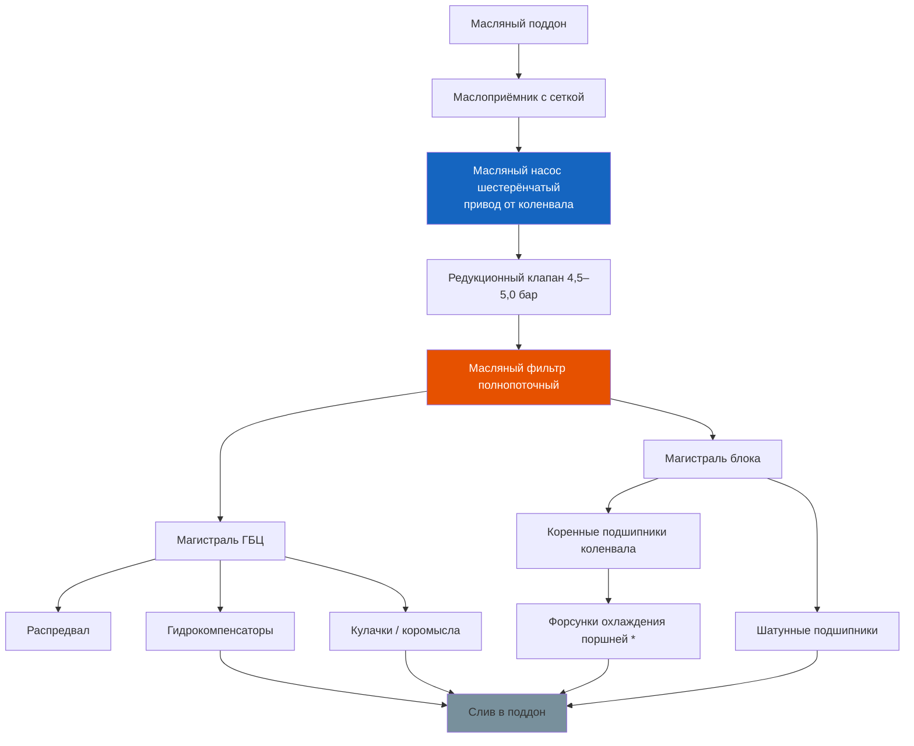

# 3.3 Система смазки

На двигателях K7J, K4J, K7M и K4M применена комбинированная система смазки: под давлением подаётся к коренным и шатунным подшипникам коленвала, распредвалу и гидрокомпенсаторам; разбрызгиванием смазываются стенки цилиндров, поршневые пальцы, кулачки распредвала.



## Масляный насос

- Тип: шестерёнчатый, с внутренним зацеплением (роторного типа)
- Привод: от коленчатого вала через цепь (K7J) или непосредственно через шестерни (K7M)
- Расположение: внутри масляного поддона, закреплён на блоке цилиндров
- Производительность: ~28 л/мин при 3000 об/мин
- Редукционный клапан: встроенный, открывается при давлении 4,5–5,0 бар

⚠ **Признаки износа масляного насоса**: устойчивая лампа давления масла на прогретом двигателе на холостом ходу. Если замена масла и фильтра не помогла — необходима замена насоса. Работа насоса проверяется механическим манометром на место штатного датчика.

## Масляный фильтр

- Тип: полнопоточный, сменный, навинчивающийся (spin-on)
- Резьба: 3/4″ — 16 UNF
- Расположение: на блоке цилиндров со стороны радиатора (доступ сверху)
- **Оригинальный номер**: 7700274195 (Renault) / 8200115695
- **Заменители**: MANN W 712/80, Knecht OC 493, Bosch 0 451 103 317, Hengst H14W01
- Момент затяжки: 25 Н·м (от руки + 3/4 оборота)

## Моторное масло — допуски и спецификации

| Параметр | Рекомендация |
|----------|--------------|
| Допуск Renault | RN 0700 (для бензиновых) |
| Класс API | SL, SM, SN |
| Класс ACEA | A3 / B4 |
| Рекомендуемая вязкость | 5W-30 (всесезонно), 5W-40 (высокотемпературная) |
| Объём масла (с фильтром) | 3,5 л (K7J, K4J) / 4,5 л (K7M, K4M) |
| Интервал замены (нормальные условия) | 15 000 км или 1 год |
| Интервал замены (тяжёлые условия) | 7 500 км (частые короткие поездки, пыль, такси) |

## Процедура замены масла и фильтра

### Необходимые материалы:
- Моторное масло 4 л (K7J/K4J) или 5 л (K7M/K4M)
- Масляный фильтр
- Прокладка сливной пробки поддона (медная шайба 18 × 24 × 2 мм)
- Ключ на «13» для сливной пробки
- Съёмник масляного фильтра
- Тара для слива отработанного масла (ёмкостью не менее 5 л)
- Воронка, ветошь, перчатки

### Пошаговая инструкция:

```text
1. Прогрейте двигатель до рабочей температуры (80–90 °C).
   Горячее масло сливается быстрее и полнее.

2. Установите автомобиль на ровную площадку или подъёмник.
   Внимание: под днищем горячее масло!

3. Открутите маслозаливную крышку на клапанной крышке.

4. Открутите сливную пробку поддона картера (ключ на «13»).
   Пробка расположена в задней части поддона со стороны водителя.
   Подставьте тару заранее — масло потечёт под давлением.

5. Слейте масло — не менее 5 минут до полного прекращения
   капежа.

6. Замените медную шайбу сливной пробки.
   Затяните пробку моментом 25 Н·м (не перетягивать — резьба в
   алюминиевом поддоне легко срывается).

7. Открутите масляный фильтр съёмником. Если фильтр прикипел —
   пробивайте его отвёрткой как рычагом через корпус.
   Утилизируйте старый фильтр.

8. Нанесите свежее масло на резиновое уплотнительное кольцо
   нового фильтра. Заверните фильтр от руки до контакта кольца
   с блоком, затем доверните на 3/4 оборота (25 Н·м).

9. Залейте свежее масло через заливную горловину:
   - K7J / K4J: 3,5 л
   - K7M / K4M: 4,5 л
   Контролируйте уровень по щупу.

10. Запустите двигатель на 1–2 минуты. Проверьте отсутствие течи
    под фильтром и сливной пробкой.

11. Заглушите двигатель, дайте маслу стечь 3–5 минут,
    проверьте уровень (должен быть между метками MIN и MAX).
```

⚠ **Важно**: превышение уровня масла выше метки MAX недопустимо. Избыток масла выдавится через сальники и может повредить катализатор. Если вместо масла на щупе эмульсия (пена) — не заводите двигатель, это указывает на попадание антифриза.

## Давление масла

Контроль давления выполняется механическим манометром (вкручивается вместо штатного датчика давления масла на блоке цилиндров).

| Режим | Давление (K7J / K7M) |
|-------|----------------------|
| Холостой ход (800 об/мин) | не менее 0,8 бар |
| 2000 об/мин | 2,0–3,0 бар |
| 3000 об/мин | 3,0–4,0 бар |
| 4500 об/мин | 4,0–5,0 бар |

При давлении ниже 0,5 бар на холостых лампа давления не гаснет — эксплуатация запрещена.

## Система вентиляции картерных газов (PCV)

Система отводит газы из картера во впускной коллектор. Состоит из:
- маслоотделителя под клапанной крышкой
- шланга с дросселем (жиклёр)
- штуцеров на впускном коллекторе

**Типовая неисправность**: засор шланга картерных газов → повышение давления в картере → выдавливание масла через сальники и щуп. При каждом масляном ТО проверяйте проходимость шланга PCV.

## Типовые утечки масла

| Место утечки | Причина | Способ устранения |
|-------------|---------|-------------------|
| Прокладка клапанной крышки | Старение резины, перетяжка | Замена прокладки, момент 8–10 Н·м |
| Прокладка масляного поддона | Перетяжка, коррозия | Замена прокладки, очистка плоскостей |
| Сальник коленвала (передний) | Износ, загрязнение ГРМ | Снятие шкива коленвала, замена сальника |
| Сальник коленвала (задний) | Износ | Со снятием КПП или двигателя |
| Датчик давления масла | Трещина корпуса | Замена датчика |
| Прокладка масляного насоса | Износ | Снятие поддона, замена прокладки насоса |

### Замена прокладки клапанной крышки — частая процедура

```text
1. Отсоедините минусовую клемму АКБ.
2. Снимите катушки зажигания (бронепровода на K7J).
3. Открутите 10 болтов крышки (Torx T30) — по спирали от центра.
4. Снимите крышку и старую прокладку.
5. Очистите посадочные поверхности на крышке и ГБЦ.
6. Установите новую прокладку в канавку крышки.
7. Нанесите герметик (Loctite 518 или аналог) в местах стыков
   плоскости ГБЦ (углы полукругов).
8. Затяните болты моментом 8–10 Н·м по спирали от центра к краям.
```

⚠ **Не перетягивайте** болты клапанной крышки — резьба в ГБЦ легко срывается. Используйте динамометрический ключ.

## Охлаждение масла

На базовых версиях масляный радиатор отсутствует. На версиях с кондиционером и для рынков с жарким климатом устанавливался маслоохладитель (теплообменник) между блоком и масляным фильтром с подводом ОЖ. При замене фильтра на машинах с маслоохладителем — проверьте состояние уплотнителей трубок ОЖ.
