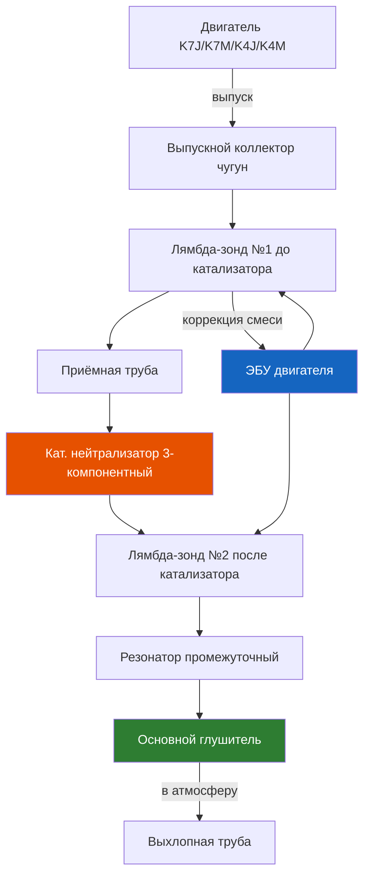

# 3.5 Система выпуска отработавших газов

Система выпуска отводит отработавшие газы из цилиндров двигателя, снижает уровень шума и обеспечивает нейтрализацию токсичных компонентов (CO, CH, NOx) в соответствии с нормами Евро-2, Евро-3 или Евро-4.



## Общая схема (сверху вниз)

Выпускной коллектор (чугун) → лямбда-зонд (верхний, до катализатора) → приёмная труба → каталитический нейтрализатор → лямбда-зонд (нижний, после катализатора, для Евро-3/4) → промежуточная труба с резонатором → задняя труба с основным глушителем.

## Выпускной коллектор

- Материал: серый чугун
- Длина каналов: равномерная (4–2–1)
- Крепление к ГБЦ: 4 шпильки M8, момент затяжки 20–25 Н·м
- Уплотнение: металлическая прокладка (одноразовая, подлежит замене при снятии)

⚠ **Типовая проблема**: трещина коллектора на стыке каналов 2-го и 3-го цилиндров. Признак — стреляющие звуки из подкапотного пространства и запах выхлопа. Временное решение — заварка аргоновой сваркой, постоянное — замена.

## Передняя труба (штаны) с катализатором

Каталитический нейтрализатор объединён с приёмной трубой в единый узел. На ранних выпусках (Евро-2) катализатор торкретного типа — замена в сборе с трубой.

| Параметр | Значение |
|----------|----------|
| Количество катализаторов | 1 (основной, под днищем) |
| Тип | Керамический, трёхкомпонентный (Pt, Pd, Rh) |
| Крепление к коллектору | 2 пружинных болта M10 (22 Н·м) |
| Фланец к средней трубе | 2 болта M10 (20 Н·м) |
| Уплотнение фланца | Графитовая прокладка (одноразовая) |

### Признаки забитого катализатора

```text
- Падение мощности (автомобиль «не едет» выше 3000–3500 об/мин)
- Свист или шипение из района катализатора
- Повышенная температура под днищем (нагрев до красна)
- Ошибки P0420, P0430 (эффективность катализатора)
- Затруднённый пуск, двигатель глохнет

Диагностика: измерьте противодавление выхлопа.
Выкрутите верхний лямбда-зонд и подсоедините манометр (0–1 бар).
При 2500 об/мин давление не должно превышать 0,35 бар.
Если выше — катализатор забит.
```

## Кислородные датчики (лямбда-зонды)

### Верхний датчик (до катализатора)

- Тип: циркониевый узкополосный (narrowband), с подогревом
- Количество проводов: 4 (1 сигнальный, 1 масса, 2 подогрев)
- Цвета проводов: белый-белый (подогрев), чёрный (сигнал), серый (масса)
- Момент затяжки: 45–55 Н·м
- Резьба: M18 × 1,5

### Нижний датчик (после катализатора) — Евро-3/4

Устанавливается после 2001 года. Аналогичен верхнему — узкополосный (narrowband). Контролирует эффективность катализатора. Сигнал на прогретом двигателе должен быть пологим (в отличие от верхнего, который переключается 1–5 Гц).

### Проверка лямбда-зонда

```text
1. Прогрейте двигатель до 80 °C.
2. Подключите осциллограф или сканер к сигнальному проводу.
3. Норма (верхний): напряжение переключается 0,1–0,9 В
   с частотой не менее 1 Гц на холостом ходу.
4. Норма (нижний, Евро-3/4): напряжение стабильное ~0,6–0,7 В
   при исправном катализаторе.
5. Если верхний: зависание на 0,45 В или медленные переключения
   — датчик загрязнён или вышел из строя.
```

### Замена лямбда-зонда

```text
1. Дайте двигателю остыть.
2. Отсоедините разъём датчика (на лонжероне или на
   впускном коллекторе).
3. Открутите датчик специальным ключом (22 мм, прорезь).
   Если прикипел — используйте WD-40 и прогрев места
   соединения горелкой (не перегреть провод датчика!).
4. Смажьте резьбу нового датчика медной смазкой (не графитовой).
5. Затяните моментом 45–55 Н·м.
6. Подключите разъём.
7. При замене верхнего датчика — удалите ошибки сканером.
```

⚠ **Важно**: лямбда-зонд — расходный элемент. Ресурс оригинальных (Bosch 0 258 003 000 / 0 258 003 259) составляет 100 000–150 000 км. Дешёвые неоригинальные датчики часто выходят из строя через 20 000–30 000 км.

## Средняя труба (резонатор)

- Конструкция: труба Ø 45 мм с расширительной камерой
- Материал: сталь, оцинкованная (оригинал), обычная сталь (аналоги)
- Соединения: фланец спереди, резиновая подушка сзади
- Длина оригинальной трубы: ~1100 мм (зависит от года выпуска)

## Задняя труба (основной глушитель)

- Конструкция: трёхкамерный глушитель (отражательный + абсорбционный)
- Диаметр трубы: 43–45 мм
- Расположение: сзади, за задней осью слева
- Крепление: 2 резиновые подушки + 1 резиновый хомут

## Соединения и прокладки

| Соединение | Тип | Размер/момент |
|-----------|-----|---------------|
| Коллектор → приёмная труба | Пружинные болты | M10, 22 Н·м |
| Приёмная труба → средняя | Фланец с прокладкой | 2 × M10, 20 Н·м |
| Средняя → задняя труба | Фланец с прокладкой | 2 × M8, 15 Н·м |
| Подушки крепления | Резиновые | 3–4 шт (2 задних, 1–2 средних) |

## Распространённые места коррозии

По опыту эксплуатации Renault Symbol в российских условиях, система выпуска корродирует в следующей очерёдности:

1. **Задняя часть резонатора** (над задней осью) — скапливается влага и реагент
2. **Сварной шов основного глушителя** (передняя стенка)
3. **Фланец катализатора** (среднее соединение)
4. **Впускной фланец приёмной трубы** (пружинные болты)

### Меры по продлению ресурса

- Прогревайте двигатель перед движением — конденсат быстрее испаряется
- При замене глушителя выбирайте детали из нержавеющей стали (AISI 409/304)
- Пружинные болты передней трубы смазывайте медной смазкой при каждом снятии
- Проверяйте целостность резиновых подушек — порванная подушка создаёт вибрации, разрушающие сварные швы

## Таблица размеров и моментов затяжки

| Элемент | Резьба | Момент, Н·м | Примечание |
|---------|--------|-------------|------------|
| Шпильки выпускного коллектора к ГБЦ | M8 × 1,25 | 20–25 | 4 шпильки, медная смазка |
| Гайка шпильки коллектора (со стороны трубы) | M10 × 1,25 | 22 | Контргайка + пружинная шайба |
| Болты фланца приёмная → средняя | M10 × 1,5 | 20 | 2 болта |
| Болты фланца средняя → задняя | M8 × 1,25 | 15 | 2 болта |
| Лямбда-зонд (верхний/нижний) | M18 × 1,5 | 45–55 | Спецключ 22 мм |

## Типовые неисправности и методы устранения

| Признак | Причина | Решение |
|---------|---------|---------|
| Рычащий шум под нагрузкой | Прогар основного глушителя | Замена заднего глушителя |
| Дребезг при 2000–2500 об/мин | Отрыв перегородки резонатора | Замена средней трубы |
| Свист при ускорении | Подсос на фланце коллектора | Замена прокладки коллектора |
| Запах выхлопа в салоне | Трещина в трубе под днищем | Заварка или замена трубы |
| Ошибка P0420 | Катализатор неэффективен | Диагностика, замена катализатора |
| Ошибка P0130–P0167 | Лямбда-зонд | Замена датчика |
| Металлический стук из выхлопа | Подушка крепления оторвана | Замена резиновой подушки |

## Замена глушителя (задней трубы) — типовая процедура

```text
1. Поднимите заднюю часть автомобиля на подъёмнике или
   домкрате + страховочные опоры.
2. Обильно нанесите WD-40 на резьбу фланцев.
3. Открутите 2 болта фланца средней трубы.
4. Снимите резиновые подушки заднего глушителя
   (смажьте мыльной водой).
5. Снимите глушитель — возможно, потребуется разрезать
   прикипевшее соединение болгаркой.
6. Установите новый глушитель:
   - Наденьте новую графитовую прокладку фланца.
   - Затяните болты моментом 15 Н·м.
   - Зафиксируйте резиновыми подушками.
7. Запустите двигатель — проверьте герметичность.
```

⚠ **Не экономьте на глушителе**. Дешёвый глушитель из тонкой стали (0,8–1,0 мм) потребует замены через 1–2 сезона в условиях зимних реагентов. Оригинал Renault (или Nissens, Bosal, Walker) из стали 1,5–2,0 мм служит 3–5 лет.
