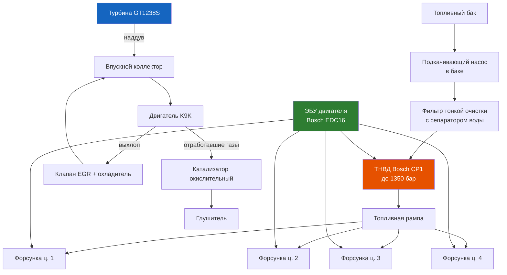

# 3.7 Дизельный двигатель K9K 1.5 dCi

Дизельный двигатель K9K (1,5 л, 8V, Common Rail) устанавливался на Renault Symbol II/III с 2005 по 2014 год. Выпускался в вариантах мощности 65, 68, 75 и 82 л.с.

> **[Symbol II (2005–2008)]** — K9K 702 (65 л.с.), K9K 704 (68 л.с.)
> **[Symbol III (2008–2014)]** — K9K 792 (75 л.с.), K9K 796 (82 л.с.)

## Технические характеристики

| Параметр | Значение |
|----------|----------|
| Рабочий объём | 1461 см³ |
| Диаметр × ход поршня | 76,0 × 80,5 мм |
| Степень сжатия | 17,9:1 |
| Мощность | 48–60 кВт (65–82 л.с.) при 4000 об/мин |
| Крутящий момент | 160–200 Н·м при 1700–2500 об/мин |
| ГРМ | Ремённый, 8 клапанов (2 на цилиндр) |
| Турбонаддув | Garrett GT1238S (фиксированная геометрия) |
| Топливная система | Common Rail Bosch CP1 (давление до 1350 бар) |
| Форсунки | Bosch CRI (6 отверстий) |
| Система EGR | Электромагнитный клапан + охладитель |
| Сажевый фильтр (DPF) | **Нет** на Symbol (D5F — экологический пакет без DPF) |
| Масло | 4,5 л ACEA C3 5W-30 |
| Ресурс до капремонта | 250 000–350 000 км (при своевременном обслуживании) |



## Отличие от бензиновых двигателей

| Узел | K9K dCi | K7J/K7M бензин |
|------|---------|----------------|
| Система питания | Common Rail 1350 бар, ТНВД | Инжектор MPI, бензонасос 3 бар |
| Система зажигания | Свечи накаливания (нет свечей зажигания) | Катушки + свечи зажигания |
| Турбонаддув | Garrett GT1238S | Атмосферный (нет турбины) |
| ГРМ | 8 клапанов, ремень (замена каждые 60 000 км) | 8/16 клапанов, ремень (замена каждые 60 000 км) |
| Топливный фильтр | Есть (с сепаратором воды) | Нет (только в баке сетка) |
| Система EGR | Есть (клапан + охладитель) | Выборочно (на некоторых версиях) |
| Дроссельная заслонка | Есть (управление разрежением) | Есть |

## Типовые неисправности K9K

### Топливная система

| Неисправность | Симптом | Причина | Устранение |
|--------------|---------|---------|------------|
| Плохой пуск на холодную | Долго крутит, запускается с «чиханием» | Низкое давление в рампе, износ плунжерной пары ТНВД | Диагностика давления, замена ТНВД |
| Дёргается на ходу | Рывки на 1500–2500 об/мин, особенно на прогретой | Засор форсунки, износ распылителя | Диагностика обратного слива форсунок, замена |
| Плавают обороты холостого хода | Обороты 800–1100 скачками | Воздух в системе (подсос), забит фильтр, EGR | Проверка герметичности, замена фильтра |
| Не развивает мощность | Нет тяги после 2500 об/мин | Недостаточное давление турбины, подсос воздуха | Проверить интеркулер, патрубки, актуатор |

### Система EGR

Клапан EGR на K9K — частая проблема. Симптомы:
- Падение мощности, «задумчивость» на 1500–2000 об/мин
- Чёрный дым из выхлопной при резком ускорении
- Увеличенный расход топлива
- Check Engine + ошибка по EGR (P0401, P1400)

```admonition warning
Глушить EGR без чип-тюнинга нельзя — ЭБУ уходит в аварийный режим, зажигается Check Engine. Для отключения требуется прошивка с удалением EGR из софта. Удаление EGR уменьшает загрязнение впускного коллектора и продлевает жизнь двигателю.
```

### Турбина Garrett GT1238S

| Проблема | Симптомы | Решение |
|----------|----------|---------|
| Масло в турбине (сальники) | Синий дым на холостых, масло в патрубках | Замена картриджа / турбины в сборе |
| Люфт вала | Свист при разгоне, металлический звук | Замена (критический износ — разрушение) |
| Заклинивание геометрии | Нет наддува, ошибка актуатора | Очистка, замена актуатора (VNT на некоторых версиях) |
| Масляное голодание | Стук, дым, разрушение | Проверить подачу масла (засор трубки) |

```admonition info
Причина выхода турбины из строя — чаще всего поздняя замена масла. K9K критичен к срокам: интервал не более 10 000 км на ACEA C3 5W-30. Пропуск одной замены масла вдвое сокращает ресурс турбины.
```

### Свечи накаливания

| Параметр | Значение |
|----------|----------|
| Резьба | M10×1 |
| Напряжение | 11 В |
| Момент затяжки | 15 Н·м |
| Производитель (оригинал) | Bosch 0 250 201 026 |
| Артикул (NGK) | Y-127J1 |
| Ресурс | 60 000–100 000 км |
| Контрольная лампа | Оранжевая спираль на щитке (гаснет через 3–10 сек в зависимости от температуры) |

**Проверка свечей накаливания:**
1. Отключите шину питания свечей
2. Мультиметром замерьте сопротивление каждой свечи относительно массы
3. Исправная свеча: 0,5–1,5 Ом
4. Обрыв (бесконечность) — замена (все 4 свечи желательно комплектом)

### Топливный фильтр (с сепаратором воды)

- **Периодичность замены:** каждые 30 000 км или раз в 2 года
- **Аналоги:** Knecht KL 792, MANN WK 8112, Bosch F 026 403 060
- **Оригинальный номер:** 77 00 273 654

**Признаки забитого фильтра:**
- Плохой пуск после длительной стоянки
- Снижение мощности и приёмистости
- Посторонние звуки из ТНВД (свист при работе)
- Вода в фильтре (на некоторых моделях датчик воды — лампа на щитке)

### Привод ГРМ

```admonition danger
Обрыв ремня ГРМ на K9K гарантированно гнёт клапана (8 из 8). Поршни встречаются с клапанами — ремонт от 40 000 ₽.
```

- Замена ремня: каждые **60 000 км** или 4 года
- Замена роликов и помпы в комплекте
- Метки ГРМ: шкив коленвала (вырез совпадает с меткой на блоке), распредвал (риска на шкиве совпадает с кромкой ГБЦ), ТНВД (в специальном положении)

## Особенности эксплуатации

### Запуск дизеля зимой
1. Включите зажигание — дождитесь гаснутия лампы подогрева (при –20 °C ~10 с)
2. Если двигатель схватывает, но не запускается — повторите цикл накала 2–3 раза
3. Не газуйте при запуске — дизель не требует газа (ЭБУ сам задаёт подачу)
4. При –25 °C и ниже возможна парафинизация топлива — используйте «зимнюю» солярку и антигель

### Расход топлива (реальные данные)

| Условия | K9K 65 л.с. | K9K 82 л.с. |
|---------|-------------|-------------|
| Город (зима) | 6,0–7,0 л/100 км | 5,5–6,5 л/100 км |
| Город (лето) | 5,5–6,0 л/100 км | 5,0–5,5 л/100 км |
| Трасса (100 км/ч) | 4,0–4,5 л/100 км | 3,8–4,2 л/100 км |
| Смешанный | 5,0–5,5 л/100 км | 4,5–5,0 л/100 км |

### Масло и интервалы замены

| Параметр | Требование |
|----------|-----------|
| Допуск | ACEA C3 (Low SAPS, для дизелей с DPF или без) |
| Вязкость | 5W-30 (всесезонно) |
| Объём | 4,5 л (с фильтром) |
| Интервал (нормальный) | 10 000 км / 1 год |
| Интервал (тяжёлые условия) | 7 500 км |
| Рекомендованный бренд | Renault RN 0720 / Total Quartz INEO MC3 5W-30 |

```admonition warning
Не экономьте на масле. K9K — двигатель с высокими тепловыми нагрузками. Дешёвое масло или несоответствие ACEA C3 приводит к закоксовыванию поршневых колец, повышенному расходу масла и выходу турбины.
```

## Ресурс и капремонт

Типичный ресурс двигателя K9K до капитального ремонта — **250 000–350 000 км**.
Основные причины сокращения ресурса:

1. **Нарушение интервалов замены масла** (60% случаев)
2. **Перегрев** (20% случаев) — трещина ГБЦ, прогорание прокладки
3. **Несвоевременная замена ГРМ** (10% случаев)
4. **Топливо низкого качества** (10% случаев) — засор форсунок, износ ТНВД

**Капремонт включает:**
- Расточка блока + новые поршни (1-й ремонт: +0,4 мм, 2-й: +0,8 мм)
- Шлифовка коленвала + вкладыши ремонтных размеров
- Замена направляющих и сёдел клапанов (или ГБЦ в сборе)
- Переборка/замена форсунок + ТНВД
- Замена турбины

При пробеге >250 000 км рекомендуется оценка состояния двигателя (компрессия, давление масла, дымность) каждые 20 000 км.
