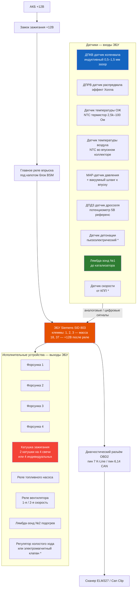
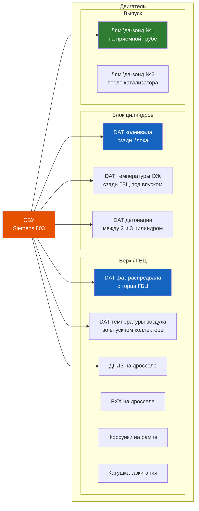

# 3.8 Система управления двигателем (ECU)

Электронный блок управления (ЭБУ) двигателем контролирует впрыск топлива, зажигание, холостой ход, вентилятор охлаждения и другие функции на основе сигналов датчиков. На Renault Symbol применялись блоки Siemens SID 803 (Siemens SID 803A) и Bosch Motronic (редко).

## Типы ЭБУ

| Параметр | Siemens SID 803 | Siemens SID 803A | Bosch Motronic MP7.0 |
|----------|----------------|------------------|----------------------|
| Двигатели | K7J, K7M (ранние) | K7J, K7M, K4J, K4M | K4M (редко) |
| Год выпуска | 2000–2004 | 2004–2010 | 2002–2005 |
| Память | EEPROM 28F400 | EEPROM 29F400 (объёмнее) | Flash |
| Тактовая частота | 24 МГц | 24 МГц | 32 МГц |
| Поддержка CAN | **Нет** (K-Line) | **Да** (с 2003) | Нет (K-Line) |
| Диагностика | ISO 9141-2 (K-Line) | ISO 15765 (CAN) + K-Line | ISO 9141-2 |
| Чип-тюнинг | Да (пайка EEPROM) | Да (пайка / Boot) | Да (через OBD) |



## Расположение датчиков



## Диагностика ЭБУ и датчиков

### Проверка питания ЭБУ

| Контакт ЭБУ | Напряжение | Условие |
|------------|-----------|---------|
| Клемма 18 / 37 | +12 В | Зажигание включено |
| Клемма 1 / 2 / 3 | 0 В (масса) | Постоянно |
| Клемма 19 | +5 В | Зажигание включено (питание датчиков) |

### Типовые параметры датчиков (мультиметром)

| Датчик | Контакты | Норма | При обрыве/КЗ |
|--------|----------|-------|--------------|
| **ДПКВ (CKP)** | 2-полюсный разъём | 200–1500 Ом (индуктивный), ~2,5 В AC при 200 об/мин | Бесконечность / 0 Ом |
| **ДПРВ (CMP)** | 3-полюсный (5В, сигнал, масса) | 5 В на питании, 0–5 В импульсы при прокрутке | 0 или 5 В постоянно |
| **Температура ОЖ** | 2-полюсный | Холодный: 2,5–3,5 кОм (20 °C). Горячий: 200–400 Ом (80 °C) | Бесконечность / 0 Ом |
| **ДПДЗ (TPS)** | 3-полюсный | Опорное: 5 В между 1 и 3. Сигнал: 0,5 В (закрыт) — 4,5 В (открыт) | Выход за диапазон |
| **Лямбда-зонд** | 4-полюсный | Подогрев: 3–7 Ом. Сигнал: 0,1–0,9 В (циклично) | Обрыв подогрева / сигнал застрял |
| **MAP-датчик** | 3-полюсный | 5 В опорное. Сигнал: ~1,5 В (х.х.) — 4,5 В (полный газ) | 0 В или 5 В постоянно |

### Осциллографом

- **ДПКВ**: синусоидальный сигнал, амплитуда растёт с оборотами. На холостых ~2,5 В, на 3000 об/мин ~15–20 В
- **ДПРВ**: прямоугольный сигнал 0–5 В, один импульс за 2 оборота коленвала
- **Лямбда-зонд**: переключение 0,1–0,9 В с частотой 1–3 Гц (прогретый двигатель)

### Снятие и установка ЭБУ

1. Отсоедините минусовую клемму АКБ
2. Снимите правую декоративную накладку моторного отсека (за АКБ)
3. Отожмите фиксаторы двух разъёмов ЭБУ (белый и синий)
4. Открутите 3 болта (Torx T20) крепления корпуса ЭБУ
5. Снимите ЭБУ вместе с кронштейном
6. Установка — в обратном порядке (момент болтов: 8 Н·м)

> ⚠ Не прикасайтесь к контактам разъёмов ЭБУ — статическое электричество выводит блок из строя. Снимите статический заряд, коснувшись массы кузова.

## Распиновка ЭБУ Siemens Sirius 32 (K4J/K4M)

Блок управления Siemens Sirius 32 (SID 803A) — 90 контактов, два разъёма (белый и синий).

```admonition info
Диагностика. Все проверки выполняются цифровым мультиметром (входное сопротивление ≥ 10 кОм/В). Подсоединение — со стороны проводов разъёма (сняв крышку). Зажигание выключено при подключении.
```

| Вывод | Цепь | Сигнал / Номинал | Условие проверки |
|-------|------|-------------------|------------------|
| 1 | Катушка зажигания (цил. 2–3) | Управление, 0–12 В импульсы | При работе двигателя |
| 3 | Масса силовой цепи | 0 В | Постоянно |
| 4 | Клапан продувки адсорбера (EVAP) | 0–12 В (ШИМ) | Двигатель прогрет, ХХ |
| 8 | Реле вентилятора 1 | 0 В (выкл.) / 12 В (вкл.) | По температуре ОЖ |
| 9 | Лампа перегрева двигателя | Масса (горит) / 12 В | Зажигание вкл. |
| 10 | Компрессор кондиционера | 0–12 В | При запросе A/C |
| 12 | РХХ (контакт B) | 0–12 В (ШИМ) | Холостой ход |
| 13 | Датчик температуры ОЖ | 2,5–0,2 В (пуск→прогрев) | 20→90 °C |
| 15 | Масса датчика давления | 0 В | Постоянно |
| 16 | MAP-датчик давления во впуске | 1,5–4,5 В | ХХ → полный газ |
| 18 | Датчик давления хладагента | 0,5–4,5 В | A/C вкл. |
| 19 | Экран датчика детонации | — | Экран |
| 20 | Датчик детонации | Сигнал, AC | Детонация |
| 24 | ДПКВ (сигнал) | Переменный ток, 0,5–20 В | Прокрутка → 3000 об/мин |
| 26 | Диагностика K-Line | 0–12 В (K-Line) | Сканер подключён |
| 28 | Масса силовой цепи | 0 В | Постоянно |
| 29 | +12 В после замка зажигания | 12 В | Зажигание вкл. |
| 30 | +12 В до замка зажигания (пост.) | 12 В | Всегда |
| 32 | Катушка зажигания (цил. 1–4) | Управление, 0–12 В импульсы | При работе двигателя |
| 33 | Масса силовой цепи | 0 В | Постоянно |
| 38 | Реле вентилятора 2 | 0 В (выкл.) / 12 В (вкл.) | Перегрев / A/C |
| 39 | Реле привода | 0–12 В | Управление |
| 41 | РХХ (контакт A) | 0–12 В (ШИМ) | Холостой ход |
| 42 | РХХ (контакт C) | 0–12 В (ШИМ) | Холостой ход |
| 43 | ДПДЗ (сигнал) | 0,5–4,5 В | Закрыт → открыт |
| 45 | Лямбда-зонд (сигнал) | 0,1–0,9 В (цикл) | Прогрет, 2000 об/мин |
| 46 | Сигнал кондиционера | 0/12 В | Запрос A/C |
| 49 | Датчик температуры воздуха | 2,5–0,5 В | 20→80 °C |
| 53 | Датчик скорости (VSS) | Прямоугольные импульсы | Движение |
| 54 | ДПКВ (доп. вход) | То же, что вывод 24 | — |
| 56 | Диагностика (CAN High) | CAN-H | CAN-шина |
| 58 | Иммобилайзер | Код, шина | При запуске |
| 59 | Форсунка 1 | 0–12 В (управление массой) | При работе |
| 60 | Форсунка 3 | 0–12 В | При работе |
| 63 | Подогрев лямбда-зонда | 12 В (ШИМ) | До прогрева |
| 66 | +12 В после замка зажигания | 12 В | Зажигание вкл. |
| 68 | Реле бензонасоса | 0–12 В | 3 сек при вкл. зажигания |
| 70 | Выход тахометра (обороты) | Прямоугольные импульсы | Двигатель работает |
| 72 | РХХ (контакт D) | 0–12 В (ШИМ) | Холостой ход |
| 73 | Масса датчика температуры ОЖ | 0 В | Постоянно |
| 74 | Питание ДПДЗ (+5 В) | 5 В | Зажигание вкл. |
| 75 | Масса ДПДЗ | 0 В | Постоянно |
| 77 | Масса датчика температуры воздуха | 0 В | Постоянно |
| 78 | Питание MAP-датчика (+5 В) | 5 В | Зажигание вкл. |
| 79 | Масса датчика детонации | 0 В | Постоянно |
| 80 | Масса лямбда-зонда | 0 В | Постоянно |
| 82 | Масса датчика давления хладагента | 0 В | Постоянно |
| 83 | Питание датчика давления хладагента (+5 В) | 5 В | Зажигание вкл. |
| 85 | Датчик давления ГУР | Сигнал | Нагрузка на ГУР |
| 89 | Форсунка 4 | 0–12 В | При работе |
| 90 | Форсунка 2 | 0–12 В | При работе |

```admonition tip
Самая частая ошибка при диагностике — путать выводы 29 и 30 (+ после замка / + постоянное). При включении зажигания должно быть 12 В на обоих. Разница: вывод 30 — всегда под напряжением, вывод 29 — только при включённом зажигании. Если на выводе 29 нет 12 В — проверьте главное реле впрыска.
```

### Типовые осциллограммы (Siemens Sirius 32)

| Сигнал | Форма | Амплитуда | Частота |
|--------|-------|-----------|---------|
| ДПКВ | Синусоида | 0,5–2,5 В (ХХ), 15–20 В (3000 об/мин) | Растёт с оборотами |
| ДПРВ | Прямоугольник | 0→5 В | 1 импульс за 2 оборота коленвала |
| Лямбда-зонд | Переключение | 0,1–0,9 В | 1–3 Гц (прогретый) |
| Форсунка | Импульс массы | 0→12 В | Меняется с нагрузкой |
| РХХ (ШИМ) | Прямоугольник | 0→12 В | ~100 Гц |

### Оборудование для проверки

| Инструмент | Требования | Для чего |
|------------|-----------|----------|
| Мультиметр цифровой | ≥ 10 кОм/В, 0–20 В, 0–200 Ом, 0–20 кОм | Базовая диагностика цепей |
| Осциллограф | 2 канала, 20 МГц | Просмотр формы сигналов |
| Стробоскоп / мотор-тестер | — | Система зажигания |

## Чип-тюнинг (перепрошивка ЭБУ)

На Siemens SID 803 прошивка хранится в EEPROM (28F400 / 29F400). Для перепрошивки:

1. **Через разъём OBD** — поддерживается только на поздних версиях (после 2004)
2. **Выпайка EEPROM** — для ранних блоков: выпаять микросхему, прошить программатором, впаять обратно
3. **Через Boot-режим** — на SID 803A: замкнуть определённые пины при включении, прошить через диагностический разъём

Типовые цели чип-тюнинга:
- Удаление EGR (K9K дизель)
- Отключение лямбда-зонда №2 (после катализатора)
- Увеличение мощности (K4M: +5–8 л.с., K9K: +10–15 л.с.)
- Отключение катализатора / DPF

```admonition warning
Чип-тюнинг изменяет экологические параметры. После перепрошивки автомобиль может не пройти техосмотр (Euro-нормы). Также повышается нагрузка на двигатель и трансмиссию.
```

## Сброс адаптаций ЭБУ

После ремонта (замена дросселя, датчиков, ремонт ГБЦ) может потребоваться сброс адаптаций:

### Метод 1 — Через диагностический сканер
1. Подключите сканер, выберите блок двигателя
2. Меню «Сброс адаптации» / «Reset Adaptations»
3. Подтвердите, отключите зажигание на 10 секунд

### Метод 2 — Без сканера (обучение холостого хода)
1. Прогрейте двигатель до рабочей температуры
2. Заглушите, выключите зажигание на 10 секунд
3. Включите зажигание (не запуская двигатель) на 30 секунд
4. Запустите двигатель, не трогая педаль газа
5. Дайте поработать 5–10 минут на холостых (возможны колебания оборотов — нормально)
6. Если обороты стабилизировались — обучение завершено

## Типовые неисправности ЭБУ и датчиков

| Симптом | Код ошибки | Вероятная неисправность |
|---------|-----------|------------------------|
| Двигатель не запускается | P0335 | ДПКВ — нет сигнала коленвала |
| Плавающие обороты | P0507 | Подсос воздуха, пересос, РХХ |
| Повышенный расход | P0170 | Лямбда-зонд, подсос, MAP |
| Двигатель «троит» | P0301–P0304 | Свечи, катушка, форсунка, компрессия |
| Нет искры | P2301 | Катушка зажигания — обрыв первичной обмотки |
| Нет связи со сканером | — | Лин K-Line (сгоревший предохранитель прикуривателя!) |
| Ошибка по датчику O2 | P0130–P0172 | Лямбда-зонд, топливо, подсос |

```admonition info
Самая частая причина «нет связи со сканером» на Symbol — перегоревший предохранитель прикуривателя. Цепь диагностического разъёма и прикуривателя общая: F21 (15А) в салонном блоке. При неработающем прикуривателе — проверьте этот предохранитель.
```

## Моменты затяжки датчиков

| Датчик | Момент, Н·м |
|--------|-------------|
| Датчик коленвала (ДПКВ) | 8–10 |
| Датчик распредвала (ДПРВ) | 8–10 |
| Лямбда-зонд | 45–55 |
| Датчик детонации | 20 |
| Датчик температуры ОЖ | 15–20 |
| MAP-датчик | 8–10 |
| Болты крепления ЭБУ | 8 |
