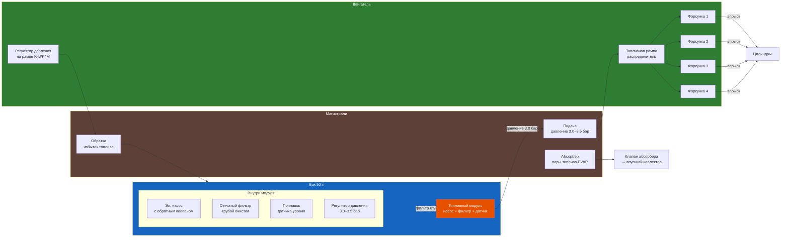
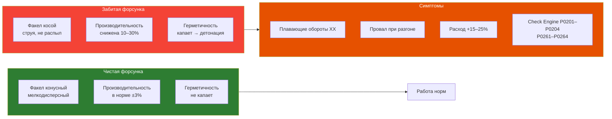

# 3.9 Топливная система (бензин)

Система питания бензиновых двигателей Renault Symbol. Топливный бак, насос, фильтр, магистрали, форсунки, регулятор давления.



## Конструкция системы

Топливная система Symbol — безвозвратная (returnless) на K7J/K7M (частично) и возвратная на K4J/K4M. Отличается версиями ЭБУ.

### Топливный бак

| Параметр | Значение |
|----------|----------|
| Ёмкость | 50 л (Symbol I–III) |
| Материал | Сталь с антикоррозийным покрытием |
| Расположение | Сзади, под днищем |
| Горловина | Слева сзади, с клапаном отсечки |

**Конструкция бака (клапанная система):**

На Renault Symbol топливный бак оснащён тремя клапанами:

1. **Клапан вентиляции** — соединяет бак с адсорбером (EVAP), открывается при разряжении в баке
2. **Ограничительный клапан (Overflow)** — предотвращает попадание этилированного бензина (защита лямбда-зонда и катализатора). При заправке неэтилированным — открыт, этилированным — закрыт (горловина сужена под «пистолет» без юбки)
3. **Клапан отсечки при опрокидывании (Rollover Valve)** — перекрывает паровую магистраль при наклоне / опрокидывании автомобиля. Установлен на верхней стенке бака

**Снятие бака:**
1. Слить топливо через насос (перемычка на реле бензонасоса)
2. Снять глушитель, тепловые экраны, тросы стояночного тормоза
3. Отсоединить заливной шланг и шланги вентиляции
4. Открутить 2 болта крепления лент (21 Н·м)
5. Опустить бак, зафиксировав три овальных отверстия для регулировки при установке

```admonition info
При каждом снятии бака заменяйте резиновые уплотнения заливной горловины и шлангов вентиляции. Оригинальный артикул уплотнения: 82 00 053 449.
```

```admonition danger
Не используйте стальной бак после повреждения. Ремонт сваркой запрещён — остатки паров топлива взрывоопасны. Замена бака: 5 000–8 000 ₽ (оригинал), 2 000–3 000 ₽ (аналог).
```

### Топливный насос (модуль)

Насос установлен в топливном модуле под люком заднего сиденья (спецключ Mot.1397 для крышки).

| Параметр | K7J/K7M (8V) | K4J/K4M (16V) |
|----------|-------------|---------------|
| Тип | Погружной, в баке | Погружной, в баке |
| Давление | 3,0 ± 0,06 бар (безвозвратная) | 3,5 бар (с возвратом) |
| Производительность | 80 л/ч (с возвратом)<br/>160 л/ч (без возврата) | 80–110 л/ч |
| Артикул оригинал | 82 00 817 532 | 82 00 817 532 |
| Доступ | Через люк под задним сиденьем (Mot.1397) | То же |

**Распиновка разъёма топливного модуля:**

| Контакт | Цепь | Примечание |
|---------|------|------------|
| A1 | Масса датчика уровня | — |
| B1 | Сигнал датчика уровня топлива | Переменное сопротивление |
| C1 | Питание насоса (+12В) | Через реле бензонасоса |
| C2 | Масса насоса | — |

**Характеристики насоса (заводские):**
- Производительность: 3±0,06 бар / 80 л/ч (система с возвратом); 3,5 бар / 160 л/ч (без возврата)
- Проверка: манометр на рампу + мерный цилиндр (измерение расхода за 30 сек)
- Минимальный расход: не менее 0,6 л за 30 сек (при 3 бар)

### Признаки неисправности топливного насоса

| Симптом | Причина | Решение |
|---------|---------|---------|
| Двигатель не заводится, насос не жужжит при включении зажигания | 1. Реле топливного насоса<br/>2. Предохранитель F7 (20A)<br/>3. Насос (износ щёток) | Прозвонить цепи, заменить |
| Двигатель заводится и глохнет | 1. Обратный клапан насоса<br/>2. Залипание регулятора давления | Замена модуля |
| Шум (вой) из заднего ряда сидений | 1. Забита сетка насоса<br/>2. Износ подшипника | Чистка или замена |
| Провалы при ускорении | 1. Забитый фильтр<br/>2. Низкое давление | Проверить тестером давления |
| Плохой пуск «на горячую» | Обратный клапан не держит давление | Замена клапана / модуля |

### Датчик уровня топлива

Установлен в топливном модуле. Представляет собой потенциометр с дугообразным резистивным элементом и поплавком.

**Сопротивление датчика уровня (заводские данные):**

| Уровень | Сопротивление | Примечание |
|---------|--------------|------------|
| Полный бак | 7 Ом | Поплавок в верхнем положении |
| Половина | 150–160 Ом | — |
| Резерв (~6 л) | 310 Ом | Загорается лампа резерва |
| Неисправность (обрыв) | > 320 Ом | Ошибка на приборной панели |

**Проверка:**
1. Отсоедините разъём топливного модуля (доступ под задним сиденьем)
2. Измерьте сопротивление между контактами A1 (масса) и B1 (сигнал)
3. Переместите поплавок вручную — сопротивление должно плавно меняться
4. Признак неисправности: скачки сопротивления, обрыв, замыкание

```admonition warning
При замене топливного насоса или датчика уровня используйте только оригинальные уплотнительные кольца крышки модуля. Неправильная установка крышки → запах бензина в салоне и риск возгорания.
```

## Топливный фильтр

### Бензиновые двигатели

| Параметр | Значение |
|----------|----------|
| Расположение | Снаружи, под днищем (возле бака) или в модуле насоса |
| Тип | Сетчатый (в модуле) + сменный (в магистрали) |
| Интервал замены | 120 000 км (бензин), 60 000 км (дизель) |
| Артикул | 77 00 857 616 (оригинал) |

```admonition info
На Symbol III топливный фильтр совмещён с насосом в едином модуле. Замена — только модулем в сборе. На Symbol I–II фильтр отдельный, под днищем, с креплением на хомут.
```

### Замена топливного фильтра (отдельный)

1. Сбросьте давление в системе (снять фишку с насоса, запустить двигатель — заглохнет)
2. Поднимите авто, найдите фильтр под днищем
3. Отщёлкните фиксаторы топливных трубок (спец. съёмник для быстросъёмов)
4. Запомните направление стрелки на фильтре
5. Установите новый фильтр по направлению стрелки к двигателю
6. Защёлкните фиксаторы, проверьте герметичность
7. Включите зажигание на 3–5 секунд (насос накачает давление), проверьте на течь

## Форсунки

| Параметр | K7J/K7M | K4J/K4M |
|----------|---------|---------|
| Тип | Электромагнитные | Электромагнитные |
| Производительность, см³/мин | 165 | 195 |
| Сопротивление обмотки, Ом | 12 | 12 |
| Угол распыла | 30° | 30° |
| Расположение | Во впускном коллекторе | Во впускном коллекторе |



### Диагностика форсунок

| Метод | Оборудование | Точность |
|-------|-------------|----------|
| Прослушивание стетоскопом | Механический стетоскоп | Низкая |
| Измерение сопротивления | Мультиметр | Средняя (норма 12 ±0,5 Ом) |
| Проверка на стенде | Ультразвуковой стенд | Высокая (проливка 4 форсунок) |
| Снятие осциллограммы тока | Осциллограф | Высокая |

### Промывка форсунок

1. **На автомобиле:** промывка на стенде Wynn's / Liqui Moly через рампу (20–30 мин).
   - Эффективно для профилактики
   - Неэффективно для сильного засора
2. **Со снятием:** ультразвуковая ванна + проливка на стенде (рекомендуется).
   - 100% результат
   - 1 500–3 000 ₽ за комплект
3. **Периодичность:** каждые 60 000–80 000 км или при появлении симптомов

## Адсорбер (EVAP)

Система улавливания паров топлива. Предотвращает выход паров в атмосферу.

| Компонент | Назначение | Типичная неисправность |
|-----------|------------|----------------------|
| Адсорбер (угольный фильтр) | Поглощение паров, клапан продувки | Забит → запах бензина |
| Клапан продувки EVAP | Открывается по команде ЭБУ | Залипает → ошибка P0441 |
| Трубки паров бензина | От бака к адсорберу | Трещины → запах |

**Признаки забитого адсорбера:**
- Запах бензина в салоне (особенно при заправке)
- Свист при открытии крышки бензобака (вакуум в баке)
- Трудности с заправкой (пистолет отключается)

## Регулятор давления топлива

| Двигатель | Расположение | Давление |
|-----------|-------------|----------|
| K7J/K7M (8V) | В модуле насоса (в баке) | 3,0 бар |
| K4J/K4M (16V) | На топливной рампе + бак | 3,5 бар |

```admonition tip
Если двигатель плохо заводится «на горячую» — проверьте давление в системе. Норма: 3,0–3,5 бар. Падение до 1,5–2,0 бар за 10 мин после выключения — неисправен обратный клапан насоса или регулятор.
```

## Диагностика системы

### Проверка давления топлива

1. Подсоедините манометр к рампе (штуцер под колпачком, на конце рампы)
2. Включите зажигание — давление поднимется до 3,0–3,5 бар
3. Запустите двигатель — давление на ХХ: 2,8–3,2 бар
4. Перегазуйте — давление должно кратковременно подняться
5. Пережмите обратку — давление должно вырасти до 4,5–5,0 бар
6. Заглушите — падение не более 0,5 бар за 10 минут

### Типичные коды ошибок

| Код | Расшифровка | Причина | Решение |
|-----|-------------|---------|---------|
| P0087 | Низкое давление топлива | Насос / фильтр / регулятор | Проверить давление |
| P0089 | Регулятор давления | Залипание / износ | Замена регулятора |
| P0170 | Бедная смесь (Fuel Trim) | Низкое давление / подсос | Диагностика |
| P0172 | Богатая смесь | Высокое давление / форсунки | Диагностика |
| P0201–P0204 | Неисправность форсунки N | Обрыв / КЗ цепи | Измерение, замена |
| P0441 | EVAP неправильный расход | Клапан EVAP | Замена клапана |
