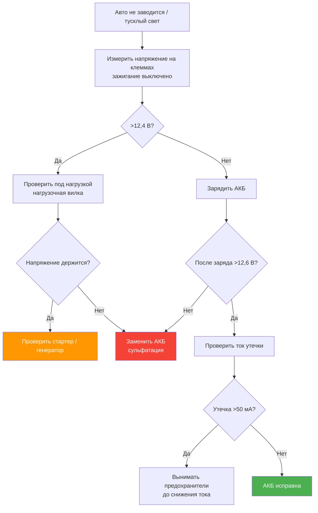

# 8.1 Аккумуляторная батарея

Аккумуляторная батарея (АКБ) обеспечивает пуск двигателя и питание бортовой сети при неработающем двигателе. На Renault Symbol устанавливаются необслуживаемые (кальциевые) или малообслуживаемые аккумуляторы.

## Технические характеристики

| Параметр | Значение |
|----------|----------|
| Номинальное напряжение | 12 В |
| Типоразмер | L2 (242×175×190 мм) или L3 (278×175×190 мм) |
| Ёмкость (C20) | 45–60 А·ч (1,4 л — 45–55 А·ч; 1,6 л — 55–60 А·ч) |
| Пусковой ток (EN) | 450–640 А |
| Тип корпуса | Европейский (EU), клеммы Type 1 |
| Плюсовая клемма | Ø 19,5 мм (правая) |
| Минусовая клемма | Ø 17,9 мм (левая) |
| Вес | ~12–17 кг (зависит от ёмкости) |
| Расположение | Левый лонжерон моторного отсека, перед коробкой передач |

## Замена АКБ

1. Заглушите двигатель, выключите зажигание, закройте двери и окна.

2. **Первой отключайте минусовую клемму.** Используйте ключ на 10 мм. Отведите провод в сторону, изолируйте.

3. Отключите плюсовую клемму.

4. Отверните гайку прижимной планки (ключ на 10 или 13 мм). Снимите планку.

5. Извлеките старую АКБ. Очистите площадку от грязи и коррозии (раствор соды).

6. Установите новую АКБ. Закрепите прижимной планкой — **АКБ не должна смещаться** при движении.

7. **Подключайте первой плюсовую клемму**, затем минусовую. Смажьте клеммы техническим вазелином или аэрозолем для клемм.

⚠ **При замене АКБ на автомобилях с CAN-шиной** **[Symbol II / Symbol III]** (с 2003 г.) возможно сбросить настройки ЭБУ, часов, аудиосистемы. После подключения выполните процедуру «обучения холостого хода» (на некоторых ЭБУ — 15–20 мин работы на холостых, затем 3–4 цикла газ до 3000 об/мин).

## Диагностика АКБ

### Напряжение покоя (зажигание выключено, автомобиль не «питает»)

| Напряжение | Состояние |
|-----------|-----------|
| 12,65 В и выше | 100 % заряда |
| 12,45 В | 75 % заряда |
| 12,24 В | 50 % заряда |
| 12,06 В | 25 % заряда |
| Менее 11,9 В | Глубокий разряд — возможна сульфатация |

### Напряжение при работающем двигателе

- **Норма:** 13,5–14,8 В (генератор заряжает)
- **Менее 13,0 В** — генератор не заряжает (неисправность)
- **Более 15,0 В** — неисправен регулятор напряжения

### Проверка стартерным током

Используйте нагрузочную вилку или электронный тестер:

1. Подключите тестер к клеммам АКБ.

2. Запустите процедуру тестирования (CCA — Cold Cranking Amps).

3. Если CCA ниже 60 % от номинала — АКБ подлежит замене.

## Проверка тока утечки (паразитный разряд)

1. Убедитесь, что зажигание выключено, двери закрыты (габариты и салонный свет неактивны). Подождите 15–20 минут — после засыпания CAN-шины ток минимален.

2. Отсоедините минусовую клемму АКБ.

3. Подключите мультиметр (режим измерения тока DC, предел 10 А) последовательно между клеммой и проводом.

4. Считайте показания:

| Ток утечки | Вердикт |
|------------|---------|
| 10–50 мА | Норма (питание часов, ЭБУ, сигнализации) |
| 50–100 мА | Выше нормы — проверка дополнительного оборудования |
| Более 100 мА | Неисправность — поиск «пожирателя» энергии |

### Поиск источника утечки

Последовательно вынимайте предохранители из монтажных блоков, контролируя ток утечки. При исчезновении утечки — проблема в цепи, защищаемой этим предохранителем.

## Зарядка АКБ

- Используйте автоматическое зарядное устройство (с контролем напряжения и тока).
- Режим: 14,4–14,8 В, ток 1/10 от ёмкости (например, 5,5 А для 55 А·ч).
- **Не заряжайте** замерзшую АКБ — взрыв.
- Полностью заряженная АКБ имеет напряжение 12,65–12,80 В через 2–3 часа после отключения зарядного.

## Типовые неисправности

| Проблема | Причина | Решение |
|----------|---------|---------|
| АКБ быстро разряжается (норма — 5–7 лет) | Сульфатация пластин (глубокий разряд, длительное хранение без заряда) | Замена |
| Клеммы окисляются (белый/зелёный налёт) | Электрохимическая коррозия | Чистка щёткой, смазка клемм |
| Трещина корпуса | Механическое повреждение, замерзание | Замена |
| Утечка электролита | Трещина, переворот | Замена |
| АКБ не крутит стартер зимой | Снижение ёмкости на морозе (до 50 % при −30 °C) | Зарядка, замена на более мощную (60 А·ч) |
| Пахнет сероводородом («тухлые яйца») | Кипение электролита при перезаряде (неисправен регулятор генератора) | Проверка генератора, замена АКБ |
