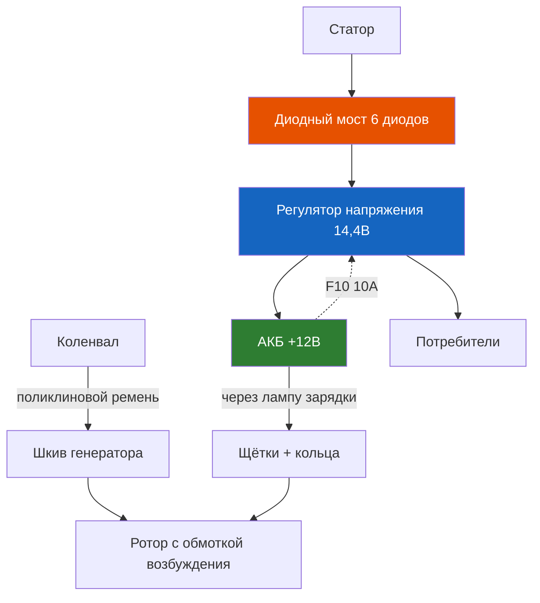

# 8.2 Генератор

Генератор преобразует механическую энергию вращения коленвала в электрическую, обеспечивая питание бортовой сети и заряд АКБ. На Renault Symbol установлены генераторы переменного тока с встроенным выпрямительным мостом и электронным регулятором напряжения.

## Технические характеристики

| Параметр | Значение |
|----------|----------|
| Номинальный выпрямленный ток | 90 А |
| Номинальное напряжение | 14 В |
| Тип регулятора напряжения | Встроенный, электронный (гибридный или микропроцессорный) |
| Привод | Поликлиновой ремень Poly-V (4/5 ручьёв) от шкива коленвала |
| Производители | Valeo (SG12B046, SG12B047), Bosch, Mitsubishi |
| Масса | ~5,5–6,5 кг |
| Тип щёток | Графитовые, сменные (в щёточном узле) |
| Начало отдачи | ~13,5 В при 1400–1600 об/мин коленвала |

## Устройство

| Компонент | Описание |
|-----------|----------|
| Статор | Трёхфазная обмотка в пазах сердечника |
| Ротор | Электромагнит с обмоткой возбуждения и контактными кольцами |
| Щёточный узел | Две графитовые щётки, прижимаемые пружинами к кольцам ротора |
| Выпрямительный мост | Диодный, трёхфазный (6 силовых диодов + 3 дополнительных) |
| Регулятор напряжения | Управляет током возбуждения — стабилизирует выходное напряжение |
| Конденсатор | Помехоподавляющий, снижает радиопомехи |
| Шкив | Поликлиновой, одноручьевой или двухручьевой (с обгонной муфтой на некоторых версиях) |

## Проверка выходного напряжения

### Быстрая проверка мультиметром

1. Запустите двигатель, прогрейте до рабочих температур.

2. Подключите мультиметр (DC, предел 20 В) напрямую к клеммам АКБ.

3. Включите нагрузку (дальний свет, печка, обогрев заднего стекла).

4. Показания:

| Напряжение | Вывод |
|-----------|-------|
| 13,5–14,8 В | Норма — генератор исправен |
| Менее 13,0 В | Генератор не выдаёт ток заряда — проверка регулятора, щёток, ремня |
| Более 15,0 В | Регулятор неисправен — замена |

### Проверка тока заряда (токоизмерительными клещами)

1. Установите клещи на плюсовой провод АКБ.

2. Запустите двигатель, включите нагрузку.

3. Ток заряда должен быть > 30 А при разряженной АКБ и включённых потребителях.

4. Если ток < 10 А при разряженной АКБ — генератор выдаёт недостаточно.

## Замена регулятора напряжения и щёток

Признаки износа щёток: лампа зарядки горит тускло или загорается на холостых оборотах, пропадает при повышении оборотов.

1. Снимите генератор с автомобиля (см. порядок ниже).

2. Отверните 2–3 винта крепления щёточного узла/регулятора на задней крышке генератора.

3. Извлеките узел. Проверьте длину щёток: минимально допустимая — 5 мм (новая — 12–15 мм).

4. Если щётки изношены — замените щёточный узел в сборе с регулятором (они объединены на генераторах Valeo/Bosch).

5. Перед установкой нового регулятора зачистите контактные кольца ротора мелкозернистой наждачной бумагой (зерно P400–P600), протрите спиртом.

6. Установите новый узел, затяните винты моментом 2–3 Н·м.

⚠ **Не касайтесь контактных дорожек регулятора пальцами** — жир нарушает контакт щёток.

## Замена приводного ремня генератора

1. Ослабьте натяжитель (ключ на 13 мм), сместите генератор по направлению к двигателю.

2. Снимите ремень со шкивов.

3. Осмотрите шкивы — на них не должно быть заусенцев и износа.

4. Установите новый ремень. ВАЖНО: рисунок ручьёв должен совпадать.

5. Натяните ремень: прогиб на длинном участке (между шкивом коленвала и генератора) 8–12 мм при усилии 10 кг.

6. Затяните болты натяжителя моментом 20–25 Н·м.

## Снятие генератора

1. Отсоедините минусовую клемму АКБ.

2. Снимите приводной ремень.

3. Отсоедините разъём проводки от генератора (плюсовой провод + управляющий разъём).

4. Отверните болты крепления:
   - Верхний болт (ключ на 13 мм) — через верх, доступ из моторного отсека
   - Нижний болт (ключ на 16 мм) — доступ снизу

5. Извлеките генератор вверх (между двигателем и радиатором).

6. Установка — в обратной последовательности. Моменты затяжки: болты крепления 40–45 Н·м, гайка плюсового провода 8–10 Н·м.

## Типовые неисправности

| Проблема | Причина | Решение |
|----------|---------|---------|
| Горит лампа зарядки | Износ щёток, обрыв ремня, обрыв цепи возбуждения | Проверка щёток, ремня, проводки |
| Напряжение < 13,5 В | Износ щёток, неисправность диодного моста, плохой контакт | Проверка регулятора и диодов |
| Напряжение > 15,0 В | Короткое замыкание регулятора | Замена регулятора |
| Свист при работе | Проскальзывание ремня (износ или ослабление) | Натяжение или замена ремня |
| Гул (механический шум) | Износ подшипника ротора | Замена подшипника или генератора |
| Генератор не заряжает (напряжение АКБ падает) | Обрыв обмотки статора, неисправность возбуждения | Замена генератора |
| Аккумулятор кипит | Перезаряд (регулятор не ограничивает) | Срочная замена регулятора |

## Диагностика диодного моста

1. Переключите мультиметр в режим измерения диодов.

2. Проверьте диоды на «плюсовом» выводе:
   - Красный щуп к корпусу, чёрный к выводу: 0,4–0,7 В — норма
   - Чёрный щуп к корпусу, красный к выводу: обрыв (бесконечность) — норма
   - Если показания одинаковы в обе стороны — диод пробит (замена моста)

## Проверка цепи возбуждения

1. Включите зажигание.

2. Измерьте напряжение на управляющем проводе генератора (тонкий провод разъёма D+):

| Напряжение | Вывод |
|-----------|-------|
| 12 В (напряжение АКБ) | Цепь исправна |
| 0 В | Обрыв цепи между генератором и ЭБУ или лампой зарядки — проверьте предохранитель F15 (20 А) |
