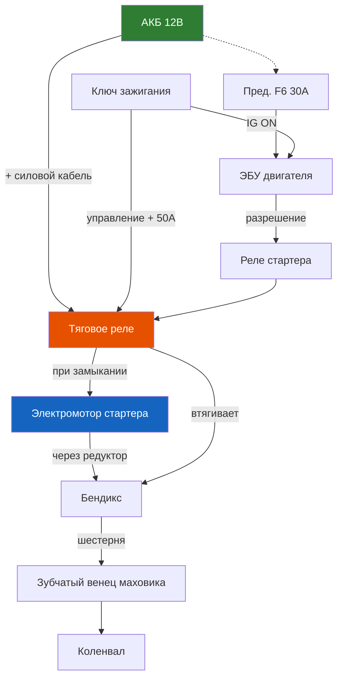

# 8.3 Система пуска (стартер)

Стартер преобразует электрическую энергию АКБ в механическую для вращения коленчатого вала при пуске двигателя. На Renault Symbol установлены стартеры с тяговым реле и планетарным редуктором (на большинстве версий).

## Технические характеристики

| Параметр | Значение |
|----------|----------|
| Номинальное напряжение | 12 В |
| Мощность | 1,1 кВт |
| Номинальный ток (без нагрузки) | 60–80 А |
| Ток под нагрузкой (при пуске) | 200–450 А (пиковый до 600 А) |
| Тип привода | Обгонная муфта (бендикс) с шестернёй |
| Число зубьев шестерни привода | 9 |
| Число зубьев маховика | ~110 (зависит от КПП) |
| Тип редуктора | Планетарный (у большинства) |
| Производители | Valeo (D7R, D8R), Bosch |

## Устройство

| Компонент | Описание |
|-----------|----------|
| Электродвигатель | Постоянного тока, возбуждение от постоянных магнитов (4 полюса) |
| Тяговое реле (втягивающее) | Две обмотки: втягивающая (pull-in) и удерживающая (hold-in) |
| Планетарный редуктор | Солнечная шестерня, сателлиты, коронная шестерня — снижает обороты, повышает момент |
| Привод (бендикс) | Обгонная муфта + шестерня — передаёт вращение на маховик |
| Щёточно-коллекторный узел | Две щётки (плюсовая и минусовая), коллектор ламельный |

## Принцип работы

1. При повороте ключа зажигания в положение START питание подаётся на втягивающее реле.

2. Втягивающая обмотка намагничивает сердечник — якорь реле перемещает бендикс к маховику.

3. Одновременно замыкаются силовые контакты реле — питание подаётся на стартер, ротор начинает вращаться.

4. После пуска двигателя частота вращения маховика превышает частоту стартера — обгонная муфта отключает бендикс.

5. При отпускании ключа зажигания питание снимается — пружина возвращает бендикс в исходное положение.

## Диагностика стартера

| Симптом | Причина | Проверка |
|---------|---------|----------|
| Стартер не включается (тишина) | АКБ разряжена, обрыв цепи, неисправность реле зажигания | Напряжение АКБ, предохранитель F15 (20 А), реле R4 |
| Слышен щелчок, но стартер не вращается | Подгорание силовых контактов реле, села АКБ, заклинивание бендикса | Проверка АКБ, замена реле |
| Щёлкает многократно | Слабая АКБ, недостаточный контакт на массе | Зарядка АКБ, чистка клемм |
| Стартер вращается, но мотор не заводится | Износ бендикса (не зацепляет маховик), срезаны зубья маховика | Замена бендикса, осмотр маховика |
| Медленное вращение коленвала | Разряжена АКБ, износ щёток, подгорание контактов | Зарядка АКБ, ремонт стартера |
| Стартер продолжает вращаться после пуска | Заклинивание реле или бендикса | Срочно отключить АКБ — ремонт стартера |
| Посторонний шум (скрежет) при пуске | Износ втулок (подшипников) вала стартера | Замена втулок или стартера |
| Стартер не отключается после пуска | Заклинило тяговое реле | Немедленно отключить АКБ, замена реле |

## Снятие стартера

1. Отсоедините минусовую клемму АКБ.

2. Снимите воздушный фильтр и патрубок (для доступа).

3. Отсоедините:
   - Управляющий провод от тягового реле (разъём, наконечник)
   - Силовой провод (гайка на 13 мм) от плюсового болта реле

4. Отверните три болта крепления стартера к корпусу сцепления (головка Torx T40 или ключ на 13 мм). Доступ — сверху и снизу.

5. Снимите стартер, слегка покачивая (не повредите маховик).

6. Установка — в обратной последовательности. Моменты затяжки:

| Соединение | Момент, Н·м |
|------------|-------------|
| Болты крепления стартера | 35–45 |
| Гайка силового провода на реле | 10–12 |

## Проверка тягового реле

### Измерение сопротивления обмоток

1. Снимите тяговое реле (сначала снять стартер).

2. Измерьте сопротивление мультиметром:

| Проверка | Выводы | Норма |
|----------|--------|-------|
| Втягивающая обмотка | 50 (питание) — М (масса корпуса) | 0,2–0,5 Ом |
| Удерживающая обмотка | 50 (питание) — корпус | 0,8–1,5 Ом |
| Силовые контакты | Силовые болты | Бесконечность (разомкнуты) |

1. При подаче 12 В на вывод 50 (+) и корпус (−) реле должно чётко щёлкать и замыкать силовые контакты.

## Замена бендикса

1. Снимите стартер.

2. Отверните два винта крепления тягового реле, снимите реле.

3. Отверните длинные стяжные болты корпуса стартера.

4. Разъедините корпус статора и заднюю крышку.

5. Снимите ограничительное кольцо на валу якоря (съёмник или пассатижи).

6. Снимите бендикс с вала (в сборе с планетарным редуктором, если есть).

7. Установите новый бендикс. Сборка — в обратной последовательности.

## Замена щёток

1. Разберите стартер (аналогично замене бендикса).

2. Извлеките щёточный узел (на большинстве — отдельный блок).

3. Проверьте длину щёток:
   - Новая: 12–15 мм
   - Минимальная: 6 мм

4. Замените щёточный узел при износе. Смажьте втулки вала (моторное масло, 2–3 капли).

## Типовые неисправности

| Проблема | Причина | Решение |
|----------|---------|---------|
| Стартер не реагирует на ключ | Нет питания на реле (обрыв проводки, замок зажигания) | Проверка цепи: АКБ → предохранитель F15 → замок зажигания → реле R4 → стартер |
| Реле щёлкает, но стартер не вращается | Подгорели силовые контакты реле | Разборка, зачистка контактов или замена реле |
| Бендикс не входит в зацепление | Заклинивание привода на валу | Замена бендикса |
| После пуска слышен вой | Износ втулок ротора | Замена втулок (ремкомплект) |
| Запах гари при работе | Перегрузка, износ щёток | Замена щёток, проверка АКБ |

## Моменты затяжки

| Соединение | Момент, Н·м |
|------------|-------------|
| Болты крепления стартера к корпусу КПП | 35–45 |
| Гайка силового провода на стартере | 10–12 |
| Болты крепления тягового реле | 8–10 |
| Стяжные болты корпуса стартера | 6–8 |
