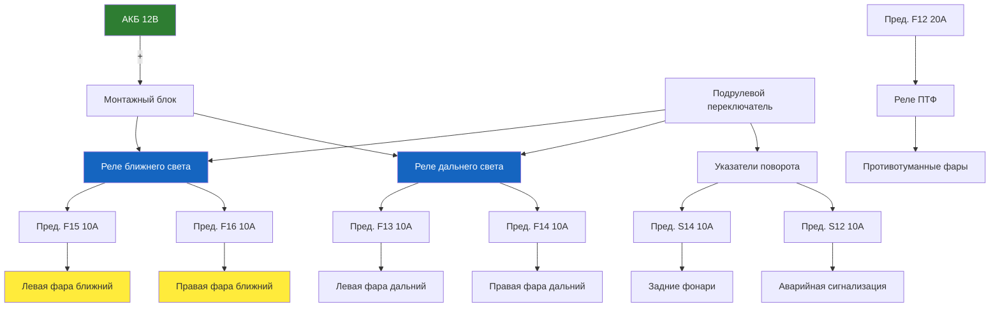

# 8.4 Освещение и световая сигнализация

Система освещения обеспечивает видимость дороги в тёмное время суток и информирует других участников движения о манёврах автомобиля. На Renault Symbol применяются галогенные лампы, на рестайлинговых версиях **[Symbol II 2005+ / Symbol III]** — светодиодные элементы в задних фонарях.

## Типы устанавливаемых ламп

| Назначение | Тип лампы | Мощность, Вт | Цоколь |
|------------|-----------|--------------|--------|
| **Фары головного света** | | | |
| Ближний/дальний свет | H4 | 60/55 | P43t |
| Дальний свет (отдельный) | H7 | 55 | PX26d |
| Габаритные огни передние | W5W | 5 | W2.1×9.5d |
| Указатели поворота передние | PY21W | 21 | BA15s (оранжевый) |
| Противотуманные фары | H11 | 55 | PGJ19-2 |
| **Задние фонари** | | | |
| Стоп-сигналы | P21W | 21 | BA15s |
| Габаритные огни задние | W5W | 5 | W2.1×9.5d |
| Указатели поворота задние | P21W | 21 | BA15s |
| Фонарь заднего хода | P21W | 21 | BA15s |
| Противотуманный фонарь задний | P21W | 21 | BA15s |
| Подсветка номерного знака | W5W | 5 | W2.1×9.5d |
| **Салон** | | | |
| Плафон освещения салона | W5W | 10 | BA9s |
| Подсветка багажника | W5W | 5 | W2.1×9.5d |
| Подсветка приборной панели | LED (впаянные) | — | SMD |

## Замена лампы головного света (H4)

1. Откройте капот.

2. Отсоедините разъём питания от лампы (надавите на фиксатор).

3. Снимите резиновый защитный колпачок.

4. Отожмите пружинный фиксатор лампы. Извлеките лампу.

   ⚠ **Не касайтесь стеклянной колбы лампы пальцами** — жир с кожи вызывает локальный перегрев и разрушение кварцевого стекла. Используйте перчатки или салфетку.

   ⚠ Если всё же коснулись — протрите колбу спиртом или обезжиривателем.

5. Установите новую лампу (не перепутайте ориентацию — на цоколе есть направляющий выступ).

6. Зафиксируйте пружинным зажимом. Установите защитный колпачок.

7. Подключите разъём. Проверьте работу.

## Регулировка света фар (процедура)

1. Установите автомобиль на ровную площадку перед стеной или экраном на расстоянии 5–10 м.

2. Давление в шинах — номинальное. Водитель на месте. Топливный бак заполнен наполовину.

3. Включите ближний свет.

4. Регулировочные винты (сделайте отвёрткой):
   - **Вертикальная регулировка** — винт сверху фары (вращением по часовой — луч выше)
   - **Горизонтальная регулировка** — винт сбоку фары

5. Контрольная точка: граница света должна находиться на 0,5–1,0 % ниже высоты центра фары (на расстоянии 10 м опускание на 5–10 см).

## Расположение реле освещения

| Реле | Назначение | Расположение |
|------|------------|--------------|
| R1 | Реле дальнего света | Монтажный блок под капотом |
| R2 | Реле ближнего света | Монтажный блок под капотом |
| R3 | Реле противотуманных фар | Монтажный блок под капотом |
| R5 | Реле указателей поворота | Монтажный блок в салоне (за бардачком) |
| R6 | Реле очистителя фар (при наличии) | Монтажный блок под капотом |

⚠ **Реле указателей поворота** находится в салонном монтажном блоке. При неисправности реле поворотники либо не работают, либо горят постоянно без мигания.

## Неисправности освещения (быстрая диагностика)

| Симптом | Причина | Решение |
|---------|---------|---------|
| Фара не горит (одна) | Перегорела лампа | Замена лампы |
| Обе фары ближнего света не горят | Перегорел предохранитель F10 (15 А) или неисправно реле R2 | Замена предохранителя, проверка реле |
| Фара светит тускло | Окисление контактов разъёма, плохая масса | Чистка контактов |
| Поворотники не мигают, горят постоянно | Неисправно реле R5 (поворотников) | Замена реле |
| Стоп-сигналы не работают | Предохранитель F7 (10 А), контакт под педалью тормоза, лампы | Проверка выключателя стоп-сигнала |
| Фара светит в небо / под ноги | Сбита регулировка | Регулировка фар |
| Задний ход не включается (лампа) | Предохранитель F1 (10 А), выключатель на КПП | Проверка контакта на коробке |
| Габаритные огни не горят с одной стороны | Лампы, предохранитель F3 или F4 | Замена лампы, проверка предохранителя |
| Противотуманки не включаются | Реле R3, предохранитель F8 (20 А), кнопка | Проверка цепи |

## Проверка выключателя стоп-сигналов

1. Над педалью тормоза найдите выключатель (концевик) с двумя проводами.

2. Мультиметром проверьте цепь:
   - Педаль свободна: контакты замкнуты (0 Ом)
   - Педаль нажата: контакты разомкнуты (бесконечность)

3. Если наоборот — выключатель неисправен (замена). Если цепь не меняется при нажатии — регулировка положения выключателя (он вкручивается/выкручивается).

## Адаптация к правому/левому движению

На Renault Symbol с галогенными фарами (H4/H7) переключение света для стран с левосторонним движением производится поворотом рычажка на корпусе фары или наклейкой специальных накладок на стекло фары. На некоторых версиях функция переключения отсутствует.

⚠ **Не используйте ксеноновые (HID) лампы** вместо штатных галогенных без установки автокорректора и омывателя фар — это нелегально и опасно для встречных водителей.
