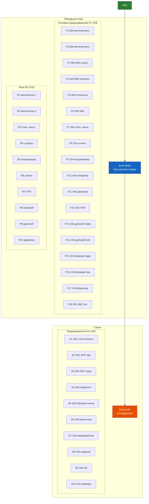
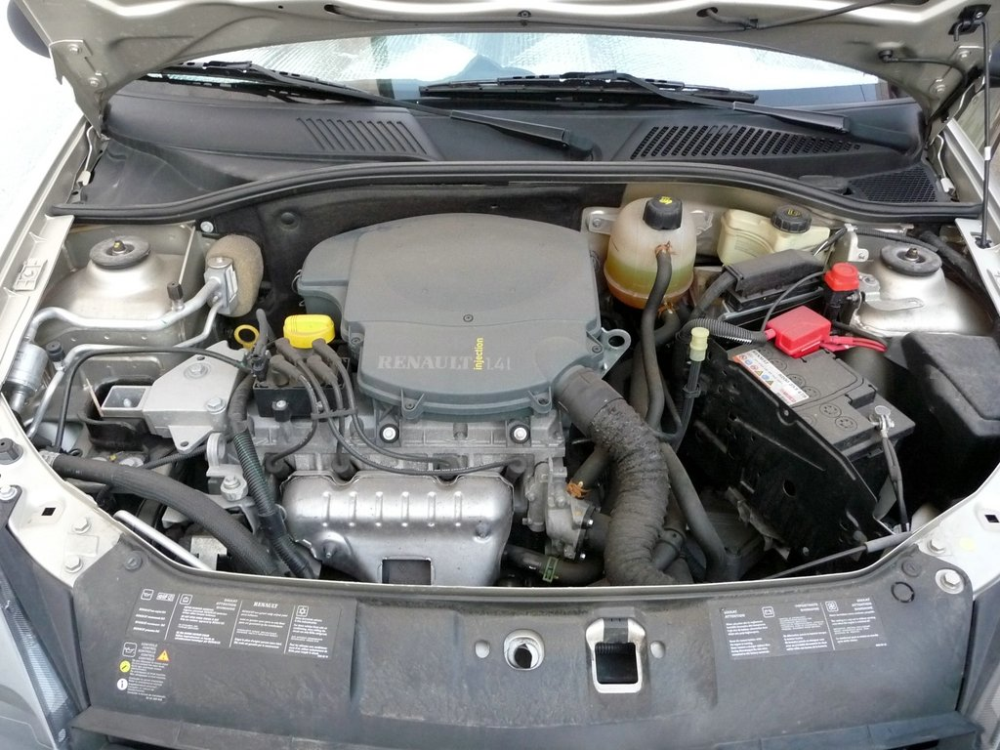
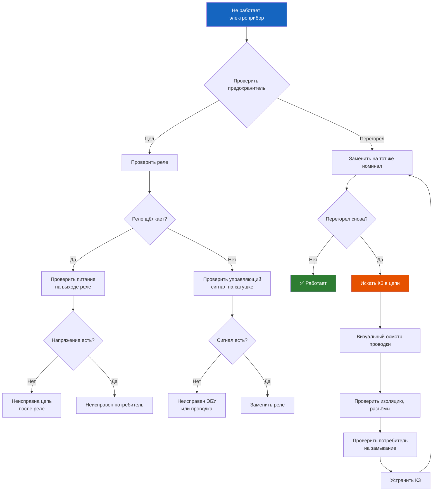

# 8.5 Схема предохранителей

Схема расположения и назначение предохранителей и реле Renault Symbol. Данные актуальны для Symbol I (1999–2002), Symbol II (2002–2008) и Symbol III (2008–2014). Различия по годам указаны отдельно.

> **Правило безопасности:** Перед заменой предохранителя выясните причину перегорания. Замена на предохранитель большего номинала запрещена — приводит к возгоранию проводки!

## Расположение блоков

## Монтажный блок под капотом

Расположен справа, на чашке переднего амортизатора. Крышка фиксируется двумя защёлками.

### F-блок (силовые предохранители)

| № | Номинал, А | Цепь | Примечание |
|---|------------|------|------------|
| F1 | 50 | Вентилятор радиатора (1-я скорость) | — |
| F2 | 60 | Вентилятор радиатора (2-я скорость) | — |
| F3 | 50 | ABS насос | Symbol I: 30 A |
| F4 | 30 | ABS клапаны | — |
| F5 | 40 | Отопитель салона | — |
| F6 | 30 | ЭБУ двигателя | — |
| F7 | 20 | Топливный насос | — |
| F8 | 15 | Звуковой сигнал | — |
| F9 | 15 | Компрессор кондиционера | — |
| F10 | 10 | Обмотка возбуждения генератора | — |
| F11 | 30 | Стеклоочиститель ветрового стекла | — |
| F12 | 20 | Противотуманные фары | — |
| F13 | 10 | Правая фара (дальний) | — |
| F14 | 10 | Левая фара (дальний) | — |
| F15 | 10 | Правая фара (ближний) | — |
| F16 | 10 | Левая фара (ближний) | — |
| F17 | 15 | Форсунки / катушки зажигания | — |
| F18 | 20 | ЭБУ (питание) | — |

### R-блок (реле под капотом)

| № | Назначение | Примечание |
|---|------------|------------|
| R1 | Реле вентилятора (1-я скорость) | — |
| R2 | Реле вентилятора (2-я скорость) | — |
| R3 | Реле топливного насоса | — |
| R4 | Реле стартера | — |
| R5 | Реле кондиционера | — |
| R6 | Реле звукового сигнала | — |
| R7 | Реле противотуманных фар | — |
| R8 | Реле ближнего света | — |
| R9 | Реле дальнего света | — |
| R10 | Реле стеклоочистителя | — |

## Монтажный блок в салоне

Расположен **за перчаточным ящиком (бардачком)**. Для доступа:
1. Откройте бардачок до упора.
2. Нажмите фиксаторы по бокам внутрь.
3. Откиньте бардачок вниз.
4. Снимите пластиковую крышку блока предохранителей.

### Предохранители салона

| № | Номинал, А | Цепь | Примечание |
|---|------------|------|------------|
| S1 | 15 | Прикуриватель / розетка 12 В | — |
| S2 | 10 | Часы / дисплей | — |
| S3 | 10 | Аудиосистема (память) | — |
| S4 | 10 | Подсветка приборов | — |
| S5 | 15 | Аудиосистема (питание) | — |
| S6 | 10 | Подрулевые переключатели | — |
| S7 | 15 | ЭСП передние левое | — |
| S8 | 15 | ЭСП передние правое | — |
| S9 | 20 | ЭСП задние | Symbol I: 15 A |
| S10 | 10 | Блокировка замков (ЦЗ) | — |
| S11 | 15 | Обогрев заднего стекла | — |
| S12 | 10 | Аварийная сигнализация | — |
| S13 | 10 | Стоп-сигналы | — |
| S14 | 10 | Указатели поворота | — |
| S15 | 10 | Задние фонари / габариты | — |
| S16 | 10 | Подкапотный свет / багажник | — |
| S17 | 15 | Подогрев передних сидений | — |
| S18 | 10 | Диагностический разъём OBD2 | — |
| S19 | 15 | Омыватель фар | — |
| S20 | 10 | Иммо / сигнализация | — |

## Предохранители в багажнике (Symbol II 2005+ / Symbol III)

На рестайлинговых версиях дополнительный блок расположен слева в нише багажника (за съёмной панелью).

| № | Номинал, А | Цепь |
|---|------------|------|
| T1 | 30 | Усилитель руля (электроусилитель) |
| T2 | 20 | Блок ABS/ESP |
| T3 | 15 | Датчики парковки |
| T4 | 10 | Навигационная система |

## Типовые неисправности и диагностика

| Симптом | Вероятный предохранитель | Что проверить |
|---------|-------------------------|---------------|
| Не работает вентилятор охлаждения | F1/F2 | Сначала проверить реле R1/R2, затем предохранители |
| Не крутит стартер | R4, F6 | Реле стартера, питание ЭБУ |
| Не работает прикуриватель | S1 | Самая частая причина — короткое замыкание в гнезде |
| Не работают стеклоподъёмники | S7/S8/S9 | Проверить целостность проводки в дверных гофрах |
| Не работают фары (обе стороны) | R8/R9 | Реле ближнего/дальнего света, а не предохранители |
| Не работают фары (одна сторона) | F13-F16 | Перегорел предохранитель конкретной лампы |
| Горит ABS на приборной панели | F3/F4 | Проверить предохранители ABS в подкапотном блоке |
| Не работает обогрев заднего стекла | S11 | Проверить контакт в стекле, затем предохранитель |
| Не работает печка (вентилятор) | F5 | Предохранитель 40 A в подкапотном блоке |

## Замена предохранителя

1. **Обесточьте цепь** — выключите зажигание и соответствующий потребитель.
2. **Откройте крышку монтажного блока** — под капотом или в салоне.
3. **Извлеките предохранитель** — используйте пинцет на крышке блока.
4. **Проверьте** — визуально или тестером (целостность перемычки).
5. **Установите новый** — строго того же номинала (цветовая маркировка).
6. **При повторном перегорании** — ищите короткое замыкание в цепи.

### Цветовая маркировка по номиналу

| Цвет | Номинал, А |
|------|------------|
| Серый | 2 |
| Фиолетовый | 3 |
| Оранжевый | 5 |
| Коричневый | 7,5 |
| Красный | 10 |
| Синий | 15 |
| Жёлтый | 20 |
| Белый (прозрачный) | 25 |
| Зелёный | 30 |
| Розовый | 40 |

> **Запасные предохранители** находятся в крышке монтажного блока под капотом (3 шт.: 10 A, 15 A, 20 A).

## Особенности по поколениям

### Symbol I (1999–2002)
- Нет блока предохранителей в багажнике.
- Предохранитель ABS — 30 A (F3).
- Реле вентилятора — только 1-скоростное (R1).

### Symbol II (2002–2008)
- Добавлен блок в багажнике (с 2005 года).
- Появились предохранители ЭСП задних дверей (S9).
- Частая проблема: окисление контактов в салонном блоке.

### Symbol III (2008–2014)
- Электроусилитель руля — отдельный предохранитель T1 (30 A) в багажнике.
- CAN-BUS управление реле — замена на блоки SEM (смарт-блоки).
- Предохранители ближнего света — могут быть заменены на мини-реле.

## Типы предохранителей

### В подкапотном блоке — MAXI (большие) и MINI (малые)
- **MAXI** — силовые (50–60 A): F1–F5
- **MINI** — остальные (10–30 A): F6–F18

### В салонном блоке — стандартные (ATO/JCase)
- Все предохранители S1–S20 — стандартные ATO

### В багажнике — MINI
- T1–T4 — малые предохранители

## Схема монтажного блока (под капотом)

### Расположение предохранителей

| Ряд | Колонка 1 | Колонка 2 | Колонка 3 | Колонка 4 | Колонка 5 |
|-----|-----------|-----------|-----------|-----------|-----------|
| 1 | F1 50A | F2 60A | F3 50A | F4 30A | F5 40A |
| 2 | F6 30A | F7 20A | F8 15A | F9 15A | F10 10A |
| 3 | F11 30A | F12 20A | F13 10A | F14 10A | F15 10A |
| 4 | F16 10A | F17 15A | F18 20A | R4 | R5 |
| 5 | R1 | R2 | R3 | — | — |
| 6 | R6 | R7 | R8 | R9 | R10 |

### Расположение реле

| № | Назначение |
|---|------------|
| R1 | Вентилятор 1-я скорость |
| R2 | Вентилятор 2-я скорость |
| R3 | Топливный насос |
| R4 | Стартер |
| R5 | Кондиционер |
| R6 | Звуковой сигнал |
| R7 | Противотуманные фары |
| R8 | Ближний свет |
| R9 | Дальний свет |
| R10 | Стеклоочиститель |

> **Рекомендация:** Сфотографируйте схему расположения предохранителей в вашем автомобиле перед заменой. На разных годах выпуска нумерация может незначительно отличаться.
