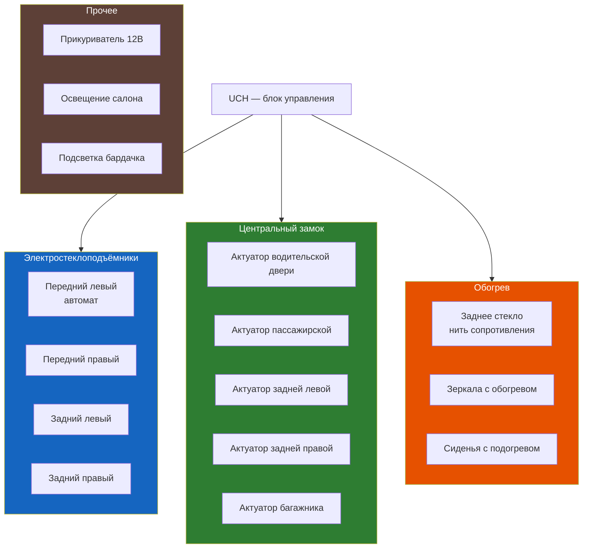

# 8.7 Электрооборудование салона

Дополнительное электрооборудование салона Renault Symbol: центральный замок, электростеклоподъёмники, обогрев заднего стекла, электрозеркала, подогрев сидений.



## Электростеклоподъёмники (ЭСП)

### Управление

| Дверь | Кнопка | Автоматический режим | Подсветка |
|-------|--------|---------------------|-----------|
| Передняя левая | На подлокотнике, 4 кнопки | Да (только водитель) | Да |
| Передняя правая | На подлокотнике + на двери | Нет | Да |
| Задняя левая | На подлокотнике водителя | Нет | Нет |
| Задняя правая | На подлокотнике водителя | Нет | Нет |

**Блокировка:** кнопка с символом замка на подлокотнике водителя (блокирует задние ЭСП).

### Признаки неисправности ЭСП

| Симптом | Причина | Решение |
|---------|---------|---------|
| Стекло не опускается | 1. Предохранитель S2/S3 (20A)<br/>2. Моторчик ЭСП<br/>3. Кнопка управления | Прозвонка цепей |
| Стекло опускается медленно | Износ направляющих / перекос | Смазка направляющих |
| Стекло опускается с шумом | Износ троса / редуктора | Замена моторчика |
| Клацает, но стекло стоит | Сломаны пластиковые шестерни | Замена редуктора |
| Не работает только кнопка на двери | Обрыв проводки в гофре | Восстановление проводки |

### Замена моторчика ЭСП

1. Снять обшивку двери ([см. 9.2 Салон](../kuzov/9-2.md))
2. Отсоединить колодку моторчика
3. Открутить 3 винта T20 крепления моторчика
4. Снять моторчик вместе с редуктором
5. Перенести редуктор на новый моторчик
6. Смазать направляющие стекла силиконовой смазкой
7. Собрать в обратном порядке

```admonition info
Типичная проблема Symbol: обрыв проводов в гофре между кузовом и дверью (особенно водительская дверь). Провода перетираются от постоянного открывания/закрывания. Лечение: разобрать гофру, найти обрыв, спаять, заизолировать.
```

## Центральный замок (ЦЗ)

### Управление

- **С брелока:** 2 кнопки (закрыть / открыть), при повороте ключа в замке водительской двери
- **С кнопки в салоне:** на центральной консоли (Symbol II–III)

| Команда | Действие |
|---------|----------|
| Закрыть | Все 4 двери + багажник |
| Открыть | Все 4 двери или только водительская (настройка) |
| Двойное нажатие открыть | Все двери |

### Неисправности ЦЗ

| Симптом | Причина | Решение |
|---------|---------|---------|
| Не закрывается / не открывается | 1. Брелок (села батарейка)<br/>2. Предохранитель S9 (20A)<br/>3. UCH | Диагностика |
| Закрывается только водительская | Обрыв провода в гофре двери | Ремонт проводки |
| Моторчик гудит, но не закрывает | Износ пластиковых шестерён | Замена актуатора |
| Багажник не открывается | 1. Актуатор<br/>2. Проводка | Проверить цепь |
| Срабатывает самопроизвольно | Глюк UCH / концевик двери | Диагностика UCH |

### Актуатор замка

**Замена актуатора замка двери:**
1. Снять обшивку двери
2. Отсоединить тяги замка (пластиковые, отщёлкиваются)
3. Открутить 2 винта T20 крепления актуатора
4. Отсоединить колодку
5. Заменить, собрать в обратном порядке

## Обогрев заднего стекла

| Параметр | Значение |
|----------|----------|
| Тип | Нити сопротивления, вклеенные в стекло |
| Питание | +12В через реле и предохранитель S5 (25A) |
| Кнопка | На панели управления отоплением |
| Таймер | Автовыключение через 10–12 минут |

### Неисправности обогрева заднего стекла

| Симптом | Причина | Решение |
|---------|---------|---------|
| Не работает | Предохранитель S5 (25A) / реле | Заменить |
| Работает частично (нити не греют) | Обрыв нитей | Ремонт токопроводящим клеем |
| Все нити целы, но не греют | Пропайка контактов на стекле | Припаять контакты |

## Электрозеркала

| Параметр | Значение |
|----------|----------|
| Тип | Электрическая регулировка (джойстик на подлокотнике) |
| Обогрев | Включается вместе с обогревом заднего стекла |
| Складывание | Только механическое (кроме поздних версий) |

**Неисправности зеркал:**
- Не регулируется → обрыв проводки в гофре / джойстик
- Не греется → обогрев (цепь общая с задним стеклом)

## Подогрев передних сидений

Опционально (Privilège на Symbol II–III).

| Параметр | Значение |
|----------|----------|
| Расположение | Кнопки сбоку сиденья |
| Режимы | 1–2 (низкий / высокий) |
| Предохранитель | В салонном блоке (S15 / S16) |

```admonition warning
Неисправности подогрева сидений:
1. **Обрыв нити в подушке** — одна сторона не греется. Ремонт — замена мата подогрева или перетяжка
2. **Перегорел предохранитель** — обе стороны не греются
3. **Сгорел выключатель** — одна сторона не включается
```

## Прикуриватель и розетка 12В

| Параметр | Значение |
|----------|----------|
| Расположение | Справа от рычага КПП (I–II) / слева от руля (III) |
| Напряжение | 12В |
| Максимальный ток | 10A (120 Вт) |
| Предохранитель | F21 (15A) в салонном блоке |

```admonition tip
Типичная неисправность: прикуриватель не работает. Вместе с ним не работает диагностический разъём OBD2 — общая цепь питания. Проверяйте предохранитель F21 (15A) в первую очередь.
```

## Освещение салона

| Освещение | Тип лампы | Мощность | Примечание |
|-----------|-----------|----------|------------|
| Плафон салона | W5W | 5 Вт | 3 режима: вкл/дверь/выкл |
| Лампа багажника | W5W | 5 Вт | Включается при открытии |
| Подсветка бардачка | W5W | 5 Вт | Symbol II–III |
| Подсветка ног | W5W | 5 Вт | Опция Privilège |
| Лампа пепельницы | W5W | 5 Вт | Только Symbol I |

**Замена лампы плафона:**
1. Поддеть прозрачную крышку тонкой отвёрткой
2. Вытащить лампу (цоколь W5W)
3. Вставить новую (не касаться стекла пальцами)
4. Закрыть крышку

## Предохранители салонного оборудования

| № | Номинал | Цепь |
|---|---------|------|
| S2 | 20A | ЭСП переднее левое |
| S3 | 20A | ЭСП переднее правое |
| S5 | 25A | Обогрев заднего стекла |
| S9 | 20A | Центральный замок |
| S15 | 15A | Подогрев сиденья водителя |
| S16 | 15A | Подогрев сиденья пассажира |
| F21 | 15A | Прикуриватель / OBD2 |

См. полную таблицу в разделе [8.5 Схема предохранителей](./8-5.md).
