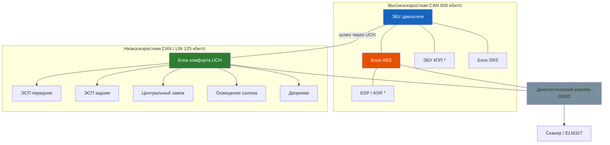

# Электрооборудование

Раздел посвящён электрической системе Renault Symbol — бортовой сети 12 В, системам пуска, зарядки, освещения и вспомогательному оборудованию.

## Общая характеристика

| Параметр | Значение |
|----------|----------|
| Номинальное напряжение | 12 В (отрицательный вывод на массе) |
| Тип проводки | Однопроводная (минус на кузове) |
| Аккумулятор | 12 В, 45–60 А·ч, необслуживаемый (EFB на версиях с Start-Stop) |
| Генератор | 90 А (номинально), Valeo / Bosch |
| Стартер | 1,1 кВт, с тяговым реле |
| CAN-шина | Присутствует на автомобилях с 2003 года (CAN-FD на поздних версиях) |

### CAN-шина — схема взаимодействия блоков (Symbol II 2003+ / Symbol III)

> На Symbol I (1999–2002) CAN-шина отсутствует — блоки общаются по K-Line (ISO 9141). Диагностика — через KKL/VAG-COM.

## Расположение основных элементов

| Элемент | Расположение |
|---------|--------------|
| АКБ | Слева в моторном отсеке (за фа farой) |
| Монтажный блок (под капотом) | Справа, на чашке амортизатора |
| Монтажный блок (салон) | За перчаточным ящиком (бардачком) |
| ЭБУ двигателя (ECM) | Справа в моторном отсеке, за АКБ |
| Блок ABS | Слева в моторном отсеке, под АКБ |
| Реле стартера | В монтажном блоке под капотом, поз. R4 |
| Диагностический разъём OBD2 | Под панелью приборов, слева от рулевой колонки |

## Структура раздела

- **8.1** — Аккумуляторная батарея: характеристики, замена, диагностика утечек
- **8.2** — Генератор: устройство, проверка напряжения, замена регулятора/щёток
- **8.3** — Система пуска (стартер): снятие, ремонт, типовые неисправности
- **8.4** — Освещение и световая сигнализация: лампы, реле, неисправности

## CAN-шина (сеть контроллеров)

На Renault Symbol **[Symbol II / Symbol III]** с 2003–2004 года используется мультиплексная проводка с CAN-шиной (Controller Area Network).

| Шина | Скорость | Участники |
|------|----------|-----------|
| Высокоскоростная CAN (CAN-HS) | 500 кбит/с | ЭБУ двигателя, ABS, АКП (при наличии) |
| Среднескоростная CAN (CAN-MS) | 125 кбит/с | Панель приборов, блок комфорта, аудиосистема |
| LIN-шина | 20 кбит/с | Стеклоподъёмники, центральный замок (ведомые устройства) |

## Меры безопасности

⚠ **Отсоединяйте минусовую клемму АКБ** перед заменой любого электрооборудования.

⚠ **Не отсоединяйте клеммы АКБ при работающем двигателе** — скачок напряжения может повредить ЭБУ, генератор и блоки управления.

⚠ **Запрещается «прикуривать» автомобиль** при переполюсовке (плюс к минусу) — это гарантированно выводит из строя все электронные блоки.

⚠ **При сварке кузова** обязательно отключайте АКБ и ЭБУ (двигателя, ABS, подушек безопасности).

⚠ **Не используйте предохранители большего номинала** — это может привести к оплавлению проводки и пожару.

## Предохранители

### Монтажный блок (под капотом)

| Номер | Ток | Цепь |
|-------|-----|------|
| F01 | 60 А | Вентилятор радиатора |
| F02 | 40 А | ABS (насос) |
| F03 | 30 А | ABS (ЭБУ) |
| F04 | 30 А | ЭБУ двигателя |
| F05 | 20 А | Топливный насос |
| F06 | 15 А | Звуковой сигнал |
| F07 | 10 А | Диагностический разъём |
| F14 | 30 А | ABS (клапаны) |
| F15 | 20 А | Прикуриватель |

### Монтажный блок (салон)

| Номер | Ток | Цепь |
|-------|-----|------|
| F1 | 10 А | Лампы заднего хода, противотуманки |
| F2 | 10 А | Стеклоподъёмники (задние) |
| F3 | 10 А | Задние фонари (габариты) |
| F4 | 10 А | Передние фонари (габариты, подсветка номера) |
| F5 | 20 А | Отопитель |

## Периодичность обслуживания электрооборудования

| Работа | Периодичность |
|--------|---------------|
| Проверка напряжения АКБ | Каждые 15 000 км |
| Замена АКБ (средний срок службы) | 4–5 лет |
| Проверка генератора (напряжение + ток) | Каждые 30 000 км |
| Замена щёток генератора | Каждые 80 000–100 000 км |
| Очистка клемм АКБ от окислов | Ежегодно |
| Замена ламп освещения | По мере перегорания |
## Инструмент для электрики

- Мультиметр (цифровой, Fluke/Apipa или аналог)
- Тестер аккумулятора (нагрузочная вилка или электронный анализатор)
- Токоизмерительные клещи (для проверки тока утечки)
- Диагностический сканер ELM327 (OBD2 + CAN)
- Набор автомобильных предохранителей (mini + standard)
- Изолента, термоусадка, стяжки
- Набор ключей 8–13 мм для демонтажа узлов
