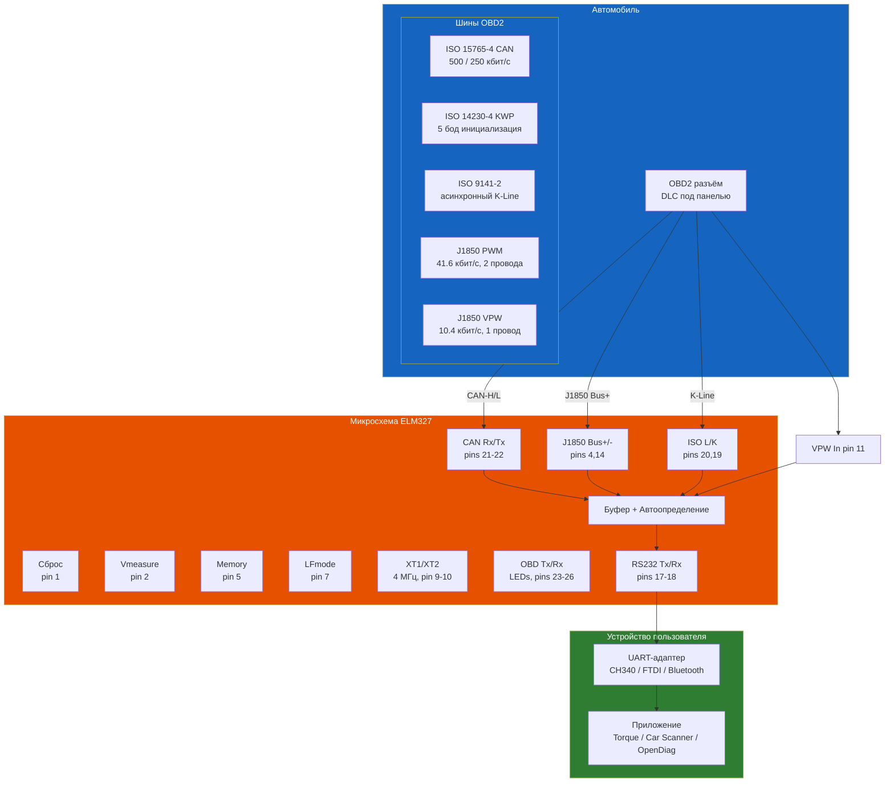

# Справочник ELM327

> ELM327 — микросхема-интерпретатор OBD2 → RS232/UART. Разработана Elm Electronics (Канада). Преобразует 9 стандартов OBD2 в последовательный интерфейс для ПК, планшетов и смартфонов. Используется в большинстве бюджетных автосканеров ELM327 (CH340/FTDI + ELM327 clone/оригинал).

## Основные характеристики

| Параметр | Значение |
|----------|----------|
| Поддерживаемые протоколы | 9 стандартов OBD2 |
| Автопоиск протокола | Да (автоматическое определение) |
| Интерфейс с ПК | UART (RS232) 3.3/5 В |
| Скорость UART | до 500 кбит/с |
| Тактовая частота | 4.000 МГц (кварцевый резонатор) |
| Напряжение питания | 3.3–5.0 В (VDD) |
| Измерение напряжения АКБ | Да (вывод Vmeasure, 0–5 В) |
| Режим низкого потребления | Да (LP — Low Power) |
| Корпуса | PDIP-28, SOIC-28 |
| Температурный диапазон | −40…+85 °C |



## Поддерживаемые протоколы

ELM327 автоматически определяет и работает с 9 протоколами OBD2:

| № | Протокол | Стандарт | Скорость | Выводы |
|---|----------|----------|----------|--------|
| 1 | SAE J1850 PWM | SAE J1850 | 41.6 кбит/с | Bus+, Bus- (2 провода) |
| 2 | SAE J1850 VPW | SAE J1850 | 10.4 кбит/с | Bus+ (1 провод) |
| 3 | ISO 9141-2 | ISO 9141-2 | 10.4 кбит/с | K-Line, L-Line |
| 4 | ISO 14230-4 (KWP 5 бод) | ISO 14230-4 | 10.4 кбит/с | K-Line |
| 5 | ISO 14230-4 (KWP быстрый) | ISO 14230-4 | 10.4 кбит/с | K-Line |
| 6 | ISO 15765-4 CAN (11 бит, 250 кбит/с) | ISO 15765-4 | 250 кбит/с | CAN-H, CAN-L |
| 7 | ISO 15765-4 CAN (29 бит, 250 кбит/с) | ISO 15765-4 | 250 кбит/с | CAN-H, CAN-L |
| 8 | ISO 15765-4 CAN (11 бит, 500 кбит/с) | ISO 15765-4 | 500 кбит/с | CAN-H, CAN-L |
| 9 | ISO 15765-4 CAN (29 бит, 500 кбит/с) | ISO 15765-4 | 500 кбит/с | CAN-H, CAN-L |

Дополнительно (ELM327 версии 2.x+):
- **SAE J1939** (CAN, 29 бит, 250 кбит/с) — грузовой/сельхоз транспорт
- **FMS** (Fleet Management System) — стандарт для автопарков

### Автоматическое определение протокола

1. ELM327 подаёт напряжение на J1850 Bus+ (8 В для VPW, 5 В для PWM)
2. Пробует инициализацию J1850 PWM (2 провода)
3. Если нет ответа — J1850 VPW (1 провод)
4. Пробует KWP 5 бод, затем KWP быстрый, затем ISO 9141-2
5. Пробует CAN 250 кбит/с, затем 500 кбит/с
6. Для каждого варианта — с 11-бит и 29-бит ID

При успешном определении протокол сохраняется в памяти (если AT M1).

## Распиновка ELM327 (PDIP-28 / SOIC-28)

| Вывод | Имя | Направление | Описание |
|-------|-----|-------------|----------|
| 1 | MCLR | Вход | Сброс (активный низкий, >2 мкс). Подтянуть к VDD |
| 2 | Vmeasure | Аналоговый вход | Измерение напряжения АКБ (0–5 В). К резисторному делителю |
| 3 | J1850 Volts | Выход | Управление питанием J1850 Bus+ (8 В для VPW, 5 В для PWM) |
| 4 | J1850 Bus+ | Выход | Выход шины J1850 Bus+ (активный высокий) |
| 5 | Memory | Вход | Сохранение настроек: 0 = EEPROM, 1 = только RAM |
| 6 | Baud Rate | Вход | Выбор скорости RS232: 0 = 38400, 1 = 9600 бод (по умолч.) |
| 7 | LFmode | Вход | Символ конца строки: 0 = CR+LF, 1 = только CR (по умолч.) |
| 8 | VSS | Питание | Общий (GND) |
| 9 | XT1 | Вход | Кварцевый резонатор 4.000 МГц (пин 1) |
| 10 | XT2 | Выход | Кварцевый резонатор 4.000 МГц (пин 2) |
| 11 | VPW In | Вход | Вход J1850 VPW (активный высокий, триггер Шмитта) |
| 12 | PWM In | Вход | Вход J1850 PWM (активный высокий) |
| 13 | ISO In | Вход | Вход ISO 9141 / KWP (K-Line, активный высокий) |
| 14 | J1850 Bus- | Выход | Выход шины J1850 Bus- (активный низкий) |
| 15 | RTS | Выход | RTS (готовность к приёму): высокий = занят |
| 16 | Busy | Выход | Индикатор занятости: высокий = обработка |
| 17 | RS232 Tx | Выход | UART Tx (выход данных к ПК) |
| 18 | RS232 Rx | Вход | UART Rx (вход данных от ПК) |
| 19 | ISO K | Вход/Выход | Линия K ISO 9141 / KWP (двунаправленная) |
| 20 | ISO L | Выход | Линия L ISO 9141 / KWP |
| 21 | CAN Tx | Выход | Выход CAN (к CAN-трансиверу) |
| 22 | CAN Rx | Вход | Вход CAN (от CAN-трансивера) |
| 23 | RS232 Rx LED | Выход | Индикатор приёма RS232 (активный низкий) |
| 24 | RS232 Tx LED | Выход | Индикатор передачи RS232 |
| 25 | OBD Rx LED | Выход | Индикатор приёма OBD |
| 26 | OBD Tx LED | Выход | Индикатор передачи OBD |
| 27 | VDD | Питание | Питание +3.3…+5.0 В |
| 28 | VSS | Питание | Общий (GND) |

```admonition tip
Выводы 6 (Baud Rate) и 7 (LFmode) — входы с внутренней подтяжкой к VDD. Если их оставить неподключёнными — будет 9600 бод + только CR (символ возврата каретки). Для 38400 бод — соедините пин 6 с VSS (GND).
```

## AT-команды

AT-команды — внутренние команды управления ELM327. Начинаются с префикса `AT` (регистр не важен). Ответ: `OK` (успех), `?` (ошибка) или данные.

### Основные команды

| Команда | Аргументы | Описание | По умолчанию |
|---------|-----------|----------|--------------|
| `AT<CR>` | — | Повтор последней команды | — |
| `ATZ` | — | Полный сброс (Reset), как после подачи питания | — |
| `ATWS` | — | Тёплый перезапуск (Warm Start, без полной инициализации) | — |
| `ATD` | — | Сброс всех настроек на заводские | — |
| `ATE0` / `ATE1` | 0/1 | Выключить/включить эхо (Echo) | 1 (ON) |
| `ATL0` / `ATL1` | 0/1 | Выключить/включить символы LF (Linefeed) | 0 (OFF) |
| `ATM0` / `ATM1` | 0/1 | Выключить/включить память (Memory) | 0 (OFF) |
| `ATH0` / `ATH1` | 0/1 | Выключить/включить заголовки (Headers) | 0 (OFF) |
| `ATS0` / `ATS1` | 0/1 | Выключить/включить пробелы (Spaces) | 0 (OFF) |
| `ATR0` / `ATR1` | 0/1 | Выключить/включить ответы (Responses) | 1 (ON) |
| `ATI` | — | Версия прошивки (идентификатор) | — |
| `AT@1` | — | Описание устройства | — |
| `AT@2` | — | Идентификатор устройства | — |
| `AT@3` | строка (12 симв.) | Сохранить идентификатор устройства | — |
| `ATFE` | — | Очистить журнал ошибок (Forget Events) | — |
| `ATRD` | — | Прочитать сохранённые данные | — |
| `ATSD` | hh | Сохранить байт данных hh | — |
| `ATLP` | — | Перейти в режим пониженного потребления (Low Power) | — |
| `ATIGN` | — | Прочитать состояние входа IgnMon (зажигание) | — |

### Команды напряжения

| Команда | Аргументы | Описание |
|---------|-----------|----------|
| `ATRV` | — | Прочитать напряжение на выводе Vmeasure (вольты) |
| `ATCV` | dddd | Калибровка напряжения (dd.dd вольт) |
| `ATCV` | 0000 | Сброс калибровки на заводскую |

### Команды протокола

| Команда | Аргументы | Описание |
|---------|-----------|----------|
| `ATSP h` | h | Установить протокол h и сохранить |
| `ATSP Ah` | Ah | Автопоиск + протокол h (с сохранением) |
| `ATTP h` | h | Попробовать протокол h (без сохранения) |
| `ATTP Ah` | Ah | Попробовать автопоиск + протокол h |
| `ATDP` | — | Описание текущего протокола |
| `ATDPN` | — | Номер текущего протокола |
| `ATBI` | — | Пропустить инициализацию (Bypass Init) |
| `ATBD` | — | Дамп буфера (Buffer Dump) |
| `ATPC` | — | Закрыть протокол (Protocol Close) |
| `ATMA` | — | Мониторинг всех сообщений (Monitor All) |
| `ATMR hh` | hh | Мониторинг получателя = hh |
| `ATMT hh` | hh | Мониторинг отправителя = hh |
| `ATNL` | — | Сообщения нормальной длины (Normal Length) |
| `ATAL` | — | Разрешить длинные сообщения (>7 байт, Allow Long) |
| `ATAR` | — | Автоматический приём (Automatically Receive) |
| `ATRA hh` | hh | Установить адрес получателя |
| `ATSH xyz` | xyz | Установить заголовок (3 байта) |
| `ATSH xxyyzz` | xxyyzz | Установить заголовок (6 байт для CAN) |
| `ATSR hh` | hh | Установить адрес отправителя |
| `ATST hh` | hh | Тайм-аут = hh × 4 мс |
| `ATAT0` / `ATAT1` / `ATAT2` | 0/1/2 | Адаптивный тайминг: 0 — выкл, 1 — авто*, 2 — авто2 |

**Номера протоколов (h):**

| h | Протокол |
|---|----------|
| 0 | Автоматический поиск |
| 1 | SAE J1850 PWM (41.6 кбит/с) |
| 2 | SAE J1850 VPW (10.4 кбит/с) |
| 3 | ISO 9141-2 (5 бод инициализация) |
| 4 | ISO 14230-4 KWP (5 бод инициализация) |
| 5 | ISO 14230-4 KWP (быстрая инициализация) |
| 6 | ISO 15765-4 CAN (11 бит, 500 кбит/с) |
| 7 | ISO 15765-4 CAN (29 бит, 500 кбит/с) |
| 8 | ISO 15765-4 CAN (11 бит, 250 кбит/с) |
| 9 | ISO 15765-4 CAN (29 бит, 250 кбит/с) |
| A | SAE J1939 CAN (29 бит, 250 кбит/с)* |
| B | SAE J1939 CAN (29 бит, 500 кбит/с)* |

\* — на некоторых версиях ELM327.

### CAN-специфичные команды

| Команда | Аргументы | Описание |
|---------|-----------|----------|
| `ATCAF0` / `ATCAF1` | 0/1 | Автоформатирование CAN выкл/вкл* |
| `ATCF hhh` | hhh | ID-фильтр CAN (11 бит) |
| `ATCF hhhhhhhh` | hhhhhhhh | ID-фильтр CAN (29 бит) |
| `ATCFC0` / `ATCFC1` | 0/1 | Управление потоком CAN выкл/вкл* |
| `ATCM hhh` | hhh | ID-маска CAN (11 бит) |
| `ATCM hhhhhhhh` | hhhhhhhh | ID-маска CAN (29 бит) |
| `ATCP hh` | hh | Приоритет CAN (29 бит) |
| `ATCRA hhh` | hhh | Адрес приёма CAN (11 бит) |
| `ATCRA hhhhhhhh` | hhhhhhhh | Адрес приёма CAN (29 бит) |
| `ATCS` | — | Статус CAN (счётчики) |
| `ATD0` / `ATD1` | 0/1 | Отображение DLC выкл*/вкл |
| `ATFC SM h` | h | Режим управления потоком |
| `ATFC SH hhh/hhhhhhhh` | hhh | Заголовок управл. потоком (11/29 бит) |
| `ATFC SD` | данные (1–5 байт) | Данные управл. потоком |
| `ATRTR` | — | Отправить RTR-сообщение |
| `ATV0` / `ATV1` | 0/1 | Переменная длина DLC выкл*/вкл |

### J1939-команды

| Команда | Аргументы | Описание |
|---------|-----------|----------|
| `ATDM1` | — | Мониторинг сообщений DM1 |
| `ATJE` | — | Формат данных J1939 Elm* |
| `ATJS` | — | Формат данных J1939 SAE |
| `ATMP hhhh` | hhhh | Мониторинг PGN (4 цифры) |
| `ATMP hhhhhh` | hhhhhh | Мониторинг PGN (6 цифр) |

### J1850-команды

| Команда | Аргументы | Описание |
|---------|-----------|----------|
| `ATIFR0` | 0 | IFR выключены |
| `ATIFR1` | 1 | IFR авто* |
| `ATIFR2` | 2 | IFR включены |
| `ATIFR H` | H | Только заголовок IFR |
| `ATIFR S` | S | IFR с данными |

### Программируемые параметры (PP)

| Команда | Описание |
|---------|----------|
| `ATPP xx OFF` | Отключить параметр xx |
| `ATPP FF OFF` | Отключить все параметры |
| `ATPP xx ON` | Включить параметр xx |
| `ATPP FF ON` | Включить все параметры |
| `ATPP xx SV yy` | Установить значение yy для параметра xx |
| `ATPPS` | Вывести сводку PP |

**Основные PP (зависят от версии):**

| № | Параметр | Описание |
|---|----------|----------|
| 02 | RS232 бод | Установка скорости RS232 (с AT BRD) |
| 05 | Pseudo CAN | Эмуляция CAN на не-CAN протоколах |
| 06 | J1939 | Включение J1939 |
| 07 | J1939 адрес | Установка адреса в сети J1939 |
| 12 | J1850 Volts | Управление напряжением на выводе 3 |
| 16 | CAN тишина | CAN Silent Mode (прослушивание без передачи) |
| 17 | FMS | Режим Fleet Management System |

### Установка скорости RS232

| Команда | Действие |
|---------|----------|
| `ATBRD hh` | Установить делитель бода (Baud Rate Divisor) |
| `ATBRT hh` | Установить тайм-аут для смены скорости |

**Таблица делителей (AT BRD):**

| hh | Реальная скорость (при 4 МГц) |
|----|-----------------------------|
| 00 | 500 000 (макс.) |
| 01 | 384 615 |
| 02 | 250 000 |
| 03 | 192 308 |
| 04 | 153 846 |
| 05 | 128 205 |
| 06 | 104 167 |
| 07 | 96 154 |
| 08 | 78 125 |
| 09 | 72 115 |
| 0A | 62 500 |
| 0B | 57 692 |
| 0C | 48 077 |
| 0D | 38 400* |
| 0E | 28 777 |
| 0F | 19 231 |
| 10 | 14 400 |
| 11 | 9 600* |

\* — значения по умолчанию в зависимости от вывода Baud Rate (pin 6).

## OBD-команды (стандартные PID)

После инициализации ELM327 принимает OBD-команды в шестнадцатеричном виде. Формат:

```
<mode> <PID> <данные>
```

### Режимы OBD2 (Mode)

| Mode | Описание |
|------|----------|
| 01 | Текущие данные (Show Current Data) |
| 02 | Замороженные данные (Freeze Frame) |
| 03 | Коды неисправностей (DTC) |
| 04 | Сброс DTC (Clear/Reset) |
| 05 | Датчик кислорода (тест) |
| 06 | Мониторинг (On-Board Monitoring) |
| 07 | Неподтверждённые DTC |
| 08 | Управление исполнительными механизмами |
| 09 | Информация об автомобиле (VIN, CALID) |
| 0A | Неподтверждённые DTC (стоковые) |

### Примеры OBD-команд

| Команда | Описание |
|---------|----------|
| `01 0D` | Скорость автомобиля (км/ч) |
| `01 05` | Температура ОЖ (°C) |
| `01 0C` | Обороты двигателя (RPM) |
| `01 11` | Положение дроссельной заслонки (%) |
| `01 2F` | Уровень топлива (%) |
| `01 31` | Пробег с включённым Check Engine (км) |
| `03` | Чтение DTC (коды неисправностей) |
| `04` | Сброс DTC (гашение Check Engine) |
| `09 02` | VIN автомобиля (17 символов) |
| `09 0A` | ECU name (название ЭБУ) |

### Стандартные PID режима 01 (текущие данные)

Полный справочник стандартных PID (Parameter IDs) режима 01 OBD2. Не все PID поддерживаются всеми автомобилями — Renault Symbol гарантированно поддерживает PID `00–20`, `40–46` и `4C–50`.

| PID | Байты | Формула | Описание | Мин | Макс | Ед. |
|-----|-------|---------|----------|-----|------|-----|
| `00` | 4 | Битовая маска | Поддерживаемые PID (01–20) | — | — | битовая маска |
| `01` | 4 | A | Статус MIL + число DTC | 0 | 255 | — |
| `02` | 2 | A | DTC, вызвавший MIL (замороженный кадр) | 0 | 65535 | — |
| `03` | 2 | A | Система топливоподачи 1 | 0 | 255 | — |
| `04` | 2 | A | Система топливоподачи 2 | 0 | 255 | — |
| `05` | 1 | A − 40 | Температура ОЖ | −40 | 215 | °C |
| `06` | 2 | (A×256+B)/32768 | Коррекция смеси (долгосрочная) банк 1 | −100 | 99.2 | % |
| `07` | 2 | (A×256+B)/32768 | Коррекция смеси (краткосрочная) банк 1 | −100 | 99.2 | % |
| `08` | 2 | (A×256+B)/32768 | Коррекция смеси (долгосрочная) банк 2 | −100 | 99.2 | % |
| `09` | 2 | (A×256+B)/32768 | Коррекция смеси (краткосрочная) банк 2 | −100 | 99.2 | % |
| `0A` | 2 | A×256+B | Давление топлива (кПа) | 0 | 765 | кПа |
| `0B` | 1 | A | Давление во впускном коллекторе | 0 | 255 | кПа |
| `0C` | 2 | (A×256+B)/4 | Обороты двигателя | 0 | 16383.75 | об/мин |
| `0D` | 1 | A | Скорость автомобиля | 0 | 255 | км/ч |
| `0E` | 1 | A − 64 | Опережение зажигания (цилиндр 1) | −64 | 63.5 | ° |
| `0F` | 1 | A/2 | Температура впускного воздуха (IAT) | −40 | 87.5 | °C |
| `10` | 2 | A×256+B | Расход воздуха (MAF) | 0 | 655.35 | г/с |
| `11` | 1 | 100×A/255 | Положение дроссельной заслонки | 0 | 100 | % |
| `12` | 1 | A | Статус вторичного воздуха | 0 | — | — |
| `13` | 1 | A | Положение датчика кислорода (банк 1, сенсор 1) | 0 | 255 | — |
| `14` | 2 | (A×256+B)/32768 | Напряжение O2 (банк 1, сенсор 1) | 0 | 1.275 | В |
| `15` | 1 | A | Положение датчика кислорода (банк 1, сенсор 2) | 0 | 255 | — |
| `16` | 2 | (A×256+B)/32768 | Напряжение O2 (банк 1, сенсор 2) | 0 | 1.275 | В |
| `17` | 1 | A | Положение датчика кислорода (банк 2, сенсор 1) | 0 | 255 | — |
| `18` | 2 | (A×256+B)/32768 | Напряжение O2 (банк 2, сенсор 1) | 0 | 1.275 | В |
| `19` | 1 | A | Положение датчика кислорода (банк 2, сенсор 2) | 0 | 255 | — |
| `1A` | 2 | (A×256+B)/32768 | Напряжение O2 (банк 2, сенсор 2) | 0 | 1.275 | В |
| `1B` | 1 | A | Стандарты OBD2 | 0 | — | — |
| `1C` | 1 | A | OBD-стандарт, поддерживаемый ЭБУ | 0 | — | — |
| `1D` | 1 | — | Датчики кислорода с подогревом (4 датчика) | 0 | — | — |
| `1E` | 1 | A | Время работы двигателя с MIL | 0 | 65535 | мин |
| `1F` | 2 | A×256+B | Пробег с включённым MIL | 0 | 65535 | км |
| `20` | 4 | Битовая маска | Поддерживаемые PID (21–40) | — | — | битовая маска |
| `21` | 2 | A×256+B | Пробег с момента последнего сброса DTC | 0 | 65535 | км |
| `22` | 2 | A×256+B | Давление топлива (рельс, относительное) | 0 | 5177.265 | кПа |
| `23` | 2 | A×256+B | Давление топлива (рельс, абсолютное) | 0 | 65535 | кПа |
| `24` | 2 | (A×256+B)−32768 | Коррекция смеси O2 (банк 1, сенсор 1) | −32768 | 32767 | — |
| `25` | 2 | (A×256+B)−32768 | Коррекция смеси O2 (банк 1, сенсор 2) | −32768 | 32767 | — |
| `26` | 2 | (A×256+B)−32768 | Коррекция смеси O2 (банк 2, сенсор 1) | −32768 | 32767 | — |
| `27` | 2 | (A×256+B)−32768 | Коррекция смеси O2 (банк 2, сенсор 2) | −32768 | 32767 | — |
| `28` | 2 | A×256+B | Давление тормозной жидкости | 0 | 65535 | кПа |
| `29` | 2 | A×256+B | Давление топлива (rail gauge, высокое) | 0 | 65535 | кПа |
| `2A` | 1 | A | Коэффициент мощности EGR | 0 | 100 | % |
| `2B` | 1 | A | Ошибка EGR | −128 | 127 | % |
| `2C` | 1 | 100×A/255 | Положение дроссельной заслонки (общее) | 0 | 100 | % |
| `2D` | 1 | 100×A/255 | Положение дроссельной заслонки (педаль) | 0 | 100 | % |
| `2E` | 1 | 100×A/255 | Положение заслонки (командное, ЭБУ) | 0 | 100 | % |
| `2F` | 1 | 100×A/255 | Уровень топлива | 0 | 100 | % |
| `30` | 1 | A − 40 | Температура охлаждающей жидкости на выходе | −40 | 215 | °C |
| `31` | 2 | A×256+B | Пробег с момента последнего сброса DTC | 0 | 65535 | км |
| `32` | 2 | A×256+B | Давление в шинах (измеренное) | 0 | 65535 | кПа |
| `33` | 2 | A×256+B | Давление топлива (абсолютное, высокое) | 0 | 65535 | кПа |
| `34` | 1 | (A×100)/255 | Положение дросселя (датчик 1) | 0 | 100 | % |
| `35` | 1 | (A×100)/255 | Положение дросселя (датчик 2) | 0 | 100 | % |
| `36` | 1 | (A×100)/255 | Положение педали (датчик 1) | 0 | 100 | % |
| `37` | 1 | (A×100)/255 | Положение педали (датчик 2) | 0 | 100 | % |
| `38` | 1 | (A×100)/255 | Положение педали (датчик 3) | 0 | 100 | % |
| `39` | 1 | (A×100)/255 | Положение заслонки (командное, датчик 1) | 0 | 100 | % |
| `3A` | 1 | (A×100)/255 | Положение заслонки (командное, датчик 2) | 0 | 100 | % |
| `3B` | 1 | (A×100)/255 | Положение заслонки (командное, датчик 3) | 0 | 100 | % |
| `3C` | 1 | A | Температура катализатора (банк 1, сенсор 1) | −40 | 6513.5 | °C |
| `3D` | 1 | A | Температура катализатора (банк 2, сенсор 1) | −40 | 6513.5 | °C |
| `3E` | 1 | A | Температура катализатора (банк 1, сенсор 2) | −40 | 6513.5 | °C |
| `3F` | 1 | A | Температура катализатора (банк 2, сенсор 2) | −40 | 6513.5 | °C |
| `40` | 4 | Битовая маска | Поддерживаемые PID (41–60) | — | — | битовая маска |
| `41` | 1 | A | Статус мониторов (с момента последнего сброса) | 0 | — | — |
| `42` | 2 | A×256+B | Напряжение АКБ | 0 | 655.35 | В |
| `43` | 2 | A×256+B | Абсолютная нагрузка на двигатель | 0 | 25700 | % |
| `44` | 1 | A/2 | Команда AFR (эквивалент) | 0 | 127.5 | — |
| `45` | 1 | 100×A/255 | Относительное положение дросселя | 0 | 100 | % |
| `46` | 1 | A − 40 | Температура окружающего воздуха | −40 | 215 | °C |
| `47` | 1 | (A×100)/255 | Положение дросселя (датчик B) | 0 | 100 | % |
| `48` | 1 | (A×100)/255 | Положение дросселя (датчик C) | 0 | 100 | % |
| `49` | 1 | A | Положение акселератора (датчик D) | 0 | 100 | % |
| `4A` | 1 | A | Положение акселератора (датчик E) | 0 | 100 | % |
| `4B` | 1 | A | Положение акселератора (датчик F) | 0 | 100 | % |
| `4C` | 1 | 100×A/255 | Положение привода дросселя | 0 | 100 | % |
| `4D` | 1 | A × 10 | Время работы двигателя | 0 | 65534 | сек |
| `4E` | 1 | A − 40 | Температура масла двигателя | −40 | 210 | °C |
| `4F` | 2 | A×256+B | Время впрыска | 0 | 524288 | мкс |
| `50` | 2 | A×256+B / 20 | Расход топлива | 0 | 3212.75 | л/ч |
| `51` | 1 | A | Статус требований DPF | 0 | — | — |
| `52` | 1 | A | Давление в DPF (дифференциальное) | 0 | 255 | кПа |
| `53` | 1 | A | Температура DPF (вход) | −40 | 215 | °C |
| `54` | 1 | A | Температура DPF (выход) | −40 | 215 | °C |
| `55` | 1 | 100×A/255 | Насыщение DPF сажей | 0 | 100 | % |
| `56` | 1 | A | Счётчик регенераций DPF | 0 | 255 | — |
| `57` | 1 | A | Период регенерации DPF | 0 | 255 | мин |
| `58` | 1 | A | Статус SCR (Selective Catalytic Reduction) | 0 | — | — |
| `59` | 1 | A | Уровень жидкости AdBlue / DEF | 0 | 100 | % |
| `5A` | 1 | A | NOx сенсор (коррекция) | 0 | — | — |
| `5B` | 1 | A | NOx сенсор (значение) | 0 | — | ppm |
| `5C` | 2 | A×256+B | Пробег с последней регенерации DPF | 0 | 65535 | км |
| `5D` | 2 | A×256+B | Пробег с последней замены масла | 0 | 65535 | км |
| `5E` | 1 | A | Напряжение лямбда-зонда (широкополосный) | 0 | 7.99 | В |
| `5F` | 1 | A | Ток насоса лямбда-зонда | 0 | 2.55 | мА |

**Примечание к формуле:** `A` — первый байт ответа, `B` — второй байт. Для мультибайтовых PID формула указана в столбце "Формула". Для Renault Symbol с двигателями K7J/K4J гарантированно работают PID `00–11`, `13–1F`, `2C–2F`, `40–46`, `4C–50`.

### Режим 09 (информация об автомобиле)

| PID | Байты | Описание | Формат |
|-----|-------|----------|--------|
| `00` | 4 | Поддерживаемые PID (01–20) | Битовая маска |
| `02` | 17 | VIN автомобиля | ASCII (17 символов) |
| `04` | 32 | Калибровочный ID (CALID) | ASCII |
| `06` | 16 | CVN (Calibration Verification Number) | HEX |
| `08` | 16 | Номер ПО ЭБУ | ASCII |
| `0A` | 20 | Название ЭБУ (ECU name) | ASCII |
| `0B` | 32 | Калибровочный ID (часть 2) | ASCII |
| `0C` | 16 | CVN (часть 2) | HEX |

### Формат DTC

Код неисправности занимает 2 байта:

- **Старший байт:** P0 = P0xxx, P2 = P2xxx, C0 = C0xxx, U0 = U0xxx
- **Бит 5:** 0 = общий SAE, 1 = производитель
- **Младшие 2 цифры + младший байт:** номер ошибки

**Расшифровка DTC:**
```
P0101 → P = Powertrain, 0 = SAE, 101 = код
C1234 → C = Chassis, 1 = manufacturer, 234 = код
U0100 → U = Network, 0 = SAE, 100 = код
```

## Электрические параметры

### Предельные значения

| Параметр | Мин | Макс | Ед. |
|----------|-----|------|-----|
| Напряжение питания VDD | −0.3 | +6.0 | В |
| Напряжение на входах | −0.3 | VDD + 0.3 | В |
| Vmeasure (пин 2) | −0.3 | VDD + 0.3 | В |
| Ток через любой вывод | — | 25 | мА |
| Максимальный ток VDD | — | 100 | мА |
| Рабочая температура | −40 | +85 | °C |
| Температура хранения | −65 | +150 | °C |

### Рекомендуемые условия

| Параметр | Мин | Тип | Макс | Ед. |
|----------|-----|-----|------|-----|
| VDD | 3.3 | — | 5.0 | В |
| VSS | — | 0 | — | В |
| Частота XTAL | — | 4.000 | — | МГц |
| ESR резонатора | — | — | 60 | Ом |
| Ёмкость конденсаторов XTAL | 22 | 27 | 33 | пФ |
| Vmeasure (норм. работа) | 0 | — | VDD | В |
| Ток потребления (активн.) | — | 17 | 25 | мА |
| Ток потребления (LP) | — | 50 | 100 | мкА |

### Уровни входов/выходов

| Параметр | Условие | Мин | Макс | Ед. |
|----------|---------|-----|------|-----|
| VIL (низкий) | VDD = 5 В | — | 1.5 | В |
| VIH (высокий) | VDD = 5 В | 3.5 | — | В |
| VIL (низкий) | VDD = 3.3 В | — | 0.8 | В |
| VIH (высокий) | VDD = 3.3 В | 2.6 | — | В |
| VOL (вых. низкий) | IOL = 8.5 мА | — | 0.6 | В |
| VOH (вых. высокий) | IOH = −8.5 мА | VDD − 0.6 | — | В |

## Типовые схемы подключения

### Минимальная схема (UART 3.3 В)

```
ELM327 (PDIP-28)
                 ┌──────────┐
    VDD ──┬──────┤1  MCLR  28├────── VSS (GND)
          │      │    VDD    │
          │      │2  Vmeas 27├────── VSS
          ├──────┤          │
         ┌┤3 J1850V  26├── OBD Tx LED ──┐
   ┌─────┤│4 J1850+ 25├── OBD Rx LED   │
   │     ││5  Mem   24├── RS232 Tx LED  │
   │     ││6  Baud  23├── RS232 Rx LED  │
   │     ││7  LFmode 22├── CAN Rx       │
   │     ││8   VSS   21├── CAN Tx       │
   GND   ││          │                  │
         ││9   XT1  20├── ISO L        LED
   4 MHz ┤│         │                  GND
   27pF ─┤│10  XT2  19├── ISO K
   GND   ││          │
         ││11 VPWIn 18├── UART Rx ← ПК
         ││12 PWMIn 17├── UART Tx → ПК
         ││13 ISOIn 16├── Busy ── LED
         ││14 J1850- 15├── RTS
         │└──────────┘
         │
        ─┴─ GND
```

```admonition warning
На выводах 9–10 — кварцевый резонатор 4.000 МГц. Обязательно с конденсаторами 22–33 пФ на землю. Без точного кварца ELM327 не запустится.
```

### Подключение к линиям OBD2

| Сигнал ELM327 | Пин DLC (OBD2) | Цепь |
|---------------|----------------|------|
| ISO K | 7 | K-Line |
| ISO L | 15 | L-Line |
| CAN Rx | 6 | CAN-High |
| CAN Tx | 14 | CAN-Low |
| J1850 Bus+ | 2 | J1850 Bus+ |
| J1850 Bus- | 10 | J1850 Bus- |
| Vmeasure | 16 | АКБ (+) через делитель |
| VSS | 4, 5 | GND |

**Делитель напряжения для Vmeasure (пин 2):**

АКБ 12 В → Vmeasure 0–5 В:

```
АКБ (+) ── R1 33 кОм ──┬── pin 2 (Vmeasure)
                        │
                    R2 5.1 кОм
                        │
                       GND
```

## Диагностика и устранение неисправностей ELM327

### Аппаратные проблемы

| Симптом | Причина | Решение |
|---------|---------|---------|
| Не светятся LED | Нет питания | Проверить VDD (3.3–5 В) на пине 27 |
| Нет ответа на ATZ | Неправильная скорость UART | Проверить скорость (по умолч. 9600 или 38400) |
| Только OK без данных | Нет связи с авто | Проверить соединение с DLC |
| Ошибка BUS INIT | Неправильный протокол | Принудительно задать: ATSP h |
| BUS BUSY | Конфликт на шине | Сброс ATZ, проверка K-Line/CAN |
| UNABLE TO CONNECT | Нет питания OBD2 | Проверить предохранитель прикуривателя |
| NO DATA | Проблема с протоколом | ATSP 0 (автопоиск) или ATTP 6 (CAN) |
| ERR bb | Неверный PID | Проверить PID, совместимость авто |

### Программные проблемы

| Сообщение | Значение |
|-----------|----------|
| `OK` | Команда выполнена |
| `?` | Неверная команда |
| `BUS INIT: OK` | Шина инициализирована |
| `BUS INIT: ERROR` | Ошибка инициализации |
| `STOPPED` | Остановлено по тайм-ауту |
| `NO DATA` | Нет ответа от ЭБУ |
| `BUS BUSY` | Шина занята |
| `CAN ERROR` | Ошибка на CAN-шине |
| `UNABLE TO CONNECT` | Не могу подключиться |

## Сообщения об ошибках ELM327

| Код | Значение |
|-----|----------|
| FB | BUS BUSY — шина занята |
| FC | BUS ERROR — ошибка шины |
| FD | BUS INIT ERROR — ошибка инициализации |
| FE | BUS BUSY — повторная занятость |
| FF | NO DATA — нет данных от ЭБУ |

```admonition info
Источник: официальная документация ELM327 (Elm Electronics, Канада): ELM327DSA–DSL (760 стр) и ELM327L_DS A–C (289 стр). Данный справочник — перевод и консолидация ключевых разделов. Полная документация на английском доступна на www.elmelectronics.com.
```
