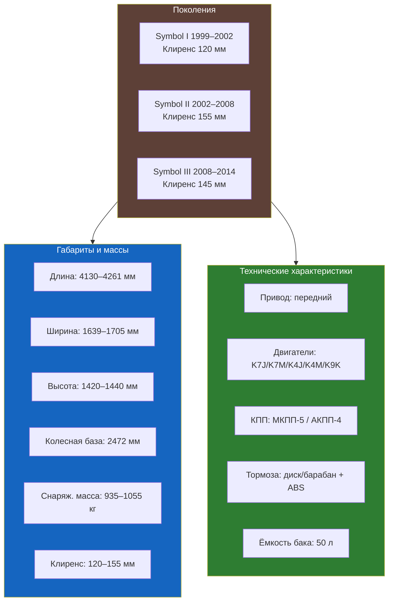
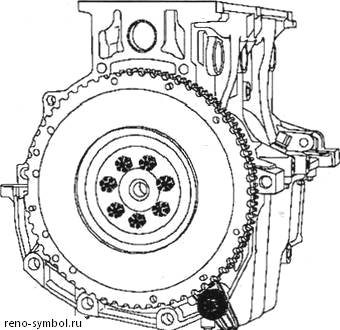
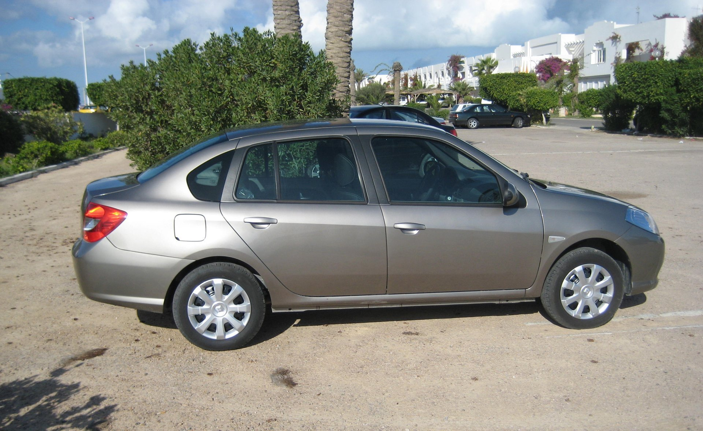
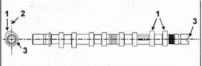
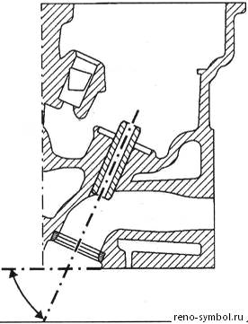
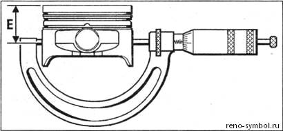
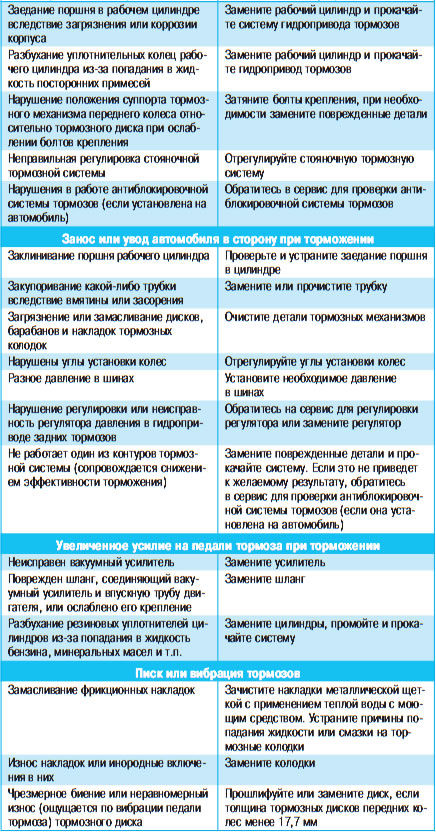

# 1.1 Общие сведения об автомобиле

Renault Symbol (также известный как Thalia) — переднеприводный субкомпактный седан, выпускавшийся с 1999 по 2014 год. Автомобиль прошёл три поколения ([подробнее о поколениях](../generations.md)). Создан на платформе Renault Clio второй генерации, адаптирован для эксплуатации в различных дорожных и климатических условиях. Сборка для российского рынка осуществлялась на заводе «Автофрамос» (Москва) и в Турции (Oyak-Renault).

## Идентификационные данные автомобиля

### Расположение VIN-номера

VIN-номер (идентификационный номер транспортного средства) нанесён в двух местах:

1. **В моторном отсеке** — на правом лонжероне (со стороны пассажира). Доступ открывается откидыванием пластмассовой крышки воздушного фильтра или снятием декоративной накладки. Номер выбит ударным способом и дублируется на самоклеящейся табличке рядом.
2. **На стойке кузова (B-pillar)** — на табличке с техническими данными, расположенной на центральной стойке кузова со стороны водителя (видна при открытой передней двери).
3. **Под ковриком переднего пассажира** — дополнительное дублирование VIN на полу кузова, закрыто технологическим лючком.

Расшифровка VIN (17 символов):

| Позиция | Значение |
|---------|----------|
| 1–3 | WMI — мировой индекс изготовителя (VSF — Renault Испания, VF1 — Renault Франция) |
| 4–6 | Тип кузова и модель (LBx — Symbol/Thalia) |
| 7 | Тип двигателя |
| 8 | Тип КПП |
| 9 | Контрольная сумма (Check digit) |
| 10 | Модельный год |
| 11 | Завод изготовитель |
| 12–17 | Серийный номер |

### Номер двигателя

Номер двигателя выбит на блоке цилиндров со стороны коробки передач, в верхней части площадки под масляный фильтр. Для доступа может потребоваться снятие воздушного фильтра и защитного кожуха.

| Двигатель | Рабочий объём, см³ | Мощность, л.с. | Крутящий момент, Н·м |
|-----------|-------------------|----------------|---------------------|
| K7J 1.4 | 1390 | 75 (55 кВт) при 5500 об/мин | 114 при 4250 об/мин |
| K7M 1.6 | 1598 | 90 (66 кВт) при 5250 об/мин | 131 при 2500 об/мин |
| K7M 1.6 16V | 1598 | 105 (77 кВт) при 5750 об/мин | 148 при 3750 об/мин |
| K9K 1.5 dCi | 1461 | 65 (48 кВт) / 82 (60 кВт) | 160 / 185 при 2000 об/мин |

## Технические характеристики

### Габаритные размеры и масса

| Параметр | Значение |
|----------|----------|
| Длина | 4161 мм |
| Ширина (без зеркал) | 1639 мм |
| Высота (без рейлингов) | 1439 мм |
| Колёсная база | 2473 мм |
| Колея передних колёс | 1396 мм |
| Колея задних колёс | 1368 мм |
| Дорожный просвет (клиренс) | 155 мм (под нагрузкой — 135 мм) |
| Минимальный радиус разворота | 5,1 м |
| Объём топливного бака | 50 л |
| Объём багажника (VDA) | 510 л |
| Объём багажника со сложенными сиденьями | до 1420 л |
| Снаряжённая масса | 985–1055 кг (в зависимости от двигателя) |
| Полная допустимая масса | 1480–1525 кг |
| Максимальная нагрузка на крышу | 75 кг (с багажником) |

### Ёмкости систем

| Система | Объём |
|---------|-------|
| Система охлаждения (1.4 / 1.6) | 6,2 / 6,5 л |
| Система смазки двигателя (1.4 / 1.6) | 3,2 / 3,5 л |
| Система смазки КПП (МКПП) | 2,2 л |
| Система смазки КПП (АКПП) | 6,0 л |
| Тормозная система | 0,7 л |
| Бачок омывателя ветрового стекла | 4,5 л |
| Кондиционер (хладагент) | 550–600 г |
| Масло гидроусилителя руля | 1,0 л |

  

## Буксировка и нагрузки

### Допустимая масса буксируемого прицепа

| Тип прицепа | Бензиновые двигатели | Дизельные двигатели |
|-------------|----------------------|---------------------|
| Прицеп без тормозов | 500 кг | 500 кг |
| Прицеп с тормозами (уклон до 10 %) | 1000–1100 кг | 1100–1200 кг |
| Прицеп с тормозами (уклон до 6 %) | 1200 кг | 1300 кг |

Перед буксировкой прицепа убедитесь в наличии штатного фаркопа и правильном подключении электрического разъёма (7-контактный разъём). При эксплуатации с прицепом нагрузка на фаркоп не должна превышать 50 кг.

### Буксировка автомобиля

| Условие | Рекомендация |
|---------|--------------|
| АКПП | Буксировка только с поднятыми ведущими колёсами или на эвакуаторе |
| МКПП | Буксировка на нейтральной передаче, максимальная скорость 50 км/ч, не более 50 км |
| Неисправен рулевой механизм | Только жёсткая сцепка |
| Отсутствие тормозной жидкости | Только эвакуатор |

## Система регламентного обслуживания (A, B, C)

Renault Symbol использует трёхуровневую систему планового обслуживания, заложенную заводом-изготовителем. Периодичность определяется пробегом или временем эксплуатации — в зависимости от того, что наступит раньше.

### ТО-A (каждые 15 000 км или 1 год)

Базовое сервисное обслуживание, минимально необходимый набор работ для поддержания гарантийных обязательств:

- Замена моторного масла и масляного фильтра
- Замена фильтра салона (пылевого/угольного)
- Проверка уровней всех эксплуатационных жидкостей
- Проверка состояния ремня ГРМ (визуальный осмотр)
- Проверка состояния тормозных колодок и дисков
- Проверка давления в шинах и их состояния
- Проверка работы светотехники и звукового сигнала
- Диагностика электронных систем (сканером OBD2)
- Смазка замков дверей и петель

### ТО-B (каждые 30 000 км или 2 года)

Расширенное обслуживание, включающее полный объём ТО-A, а также:

- Замена воздушного фильтра двигателя
- Замена топливного фильтра (для бензиновых и дизельных версий)
- Замена свечей зажигания (для бензиновых двигателей, оригинал Renault 7700500168)
- Проверка состояния ремня ГРМ; замена при наличии признаков износа
- Проверка состояния высоковольтных проводов (для бензиновых)
- Проверка углов установки колёс (развал-схождение)
- Проверка герметичности выхлопной системы
- Очистка дренажных отверстий кузова

### ТО-C (каждые 60 000 км или 4 года)

Полное плановое обслуживание с заменой большинства расходных элементов и жидкостей:

- Все работы, предусмотренные ТО-A и ТО-B
- Замена ремня ГРМ с роликами и помпой (для бензиновых двигателей; для K9K dCi — замена цепи ГРМ не требуется, проверка натяжителя)
- Замена охлаждающей жидкости (GLACEOL RX Type D)
- Замена тормозной жидкости (DOT 4)
- Замена масла в механической коробке передач
- Замена масла в автоматической коробке передач (частичная или аппаратная замена)
- Замена жидкости гидроусилителя руля
- Замена салонного и воздушного фильтра (если не делалось ранее)
- Замена свечей зажигания (повторно)
- Замена ремня генератора и поликлинового ремня
- Проверка состояния амортизаторов и сайлентблоков

### Рекомендации по тяжёлым условиям эксплуатации

При эксплуатации автомобиля в следующих условиях интервалы обслуживания рекомендуется сократить вдвое (7500 км / 6 месяцев):

- Частые короткие поездки (менее 10 км) при низких температурах
- Длительная работа на холостом ходу (пробки, такси)
- Эксплуатация в условиях повышенной запылённости (грунтовые дороги)
- Буксировка прицепа или регулярная перевозка тяжёлых грузов
- Эксплуатация в горной местности с частыми подъёмами и спусками
- Использование топлива низкого качества

### Маркировка и спецификации расходных материалов

| Элемент | Артикул / спецификация |
|---------|------------------------|
| Моторное масло (1.4 / 1.6) | ELF Evolution 5W-40, API SL/SN, ACEA A3 |
| Моторное масло (1.5 dCi) | ELF Evolution 5W-30, ACEA C3 |
| Масляный фильтр | Renault 7700274182 (MANN W75/3, Bosch 0451103310) |
| Воздушный фильтр | Renault 8200073144 |
| Топливный фильтр (бензин) | Renault 8200069406 |
| Салонный фильтр | Renault 7701057646 (MANN CU2202, Bosch 1987432084) |
| Свечи зажигания | Renault 7700500168 (NGK BKR6E-11, Champion RC8YCL) |
| Ремень ГРМ | Renault 7700733248 (Gates 5282XS, ContiTech CT946) |
| Тормозные колодки перед | Renault 7701209306 |
| Тормозные колодки зад | Renault 7701209308 |
| Антифриз | GLACEOL RX Type D (зелёный) |
