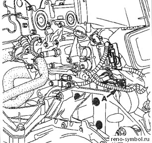
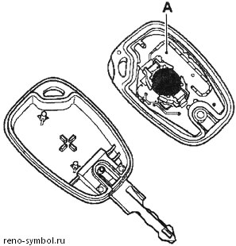

# 1.2 Приборы и органы управления

В разделе описано расположение и назначение всех приборов, переключателей и контрольных ламп на панели приборов Renault Symbol. Информация актуальна для автомобилей выпуска 1999–2013 годов с комбинацией приборов с аналоговыми индикаторами и жидкокристаллическим дисплеем.

## Приборная панель (щиток приборов)

Комбинация приборов расположена за рулевым колесом и включает следующие элементы:

- **Спидометр** — аналоговый указатель скорости движения (0–220 км/ч), цена деления 5 км/ч.
- **Тахометр** — аналоговый указатель частоты вращения коленчатого вала (0–8000 об/мин). Красная зона — от 6000 об/мин.
- **Указатель температуры охлаждающей жидкости** — расположен слева. Нормальное положение стрелки — 70–90 °C. Красная зона — 110 °C и выше.
- **Указатель уровня топлива** — расположен справа. Резерв — около 7 л (загорается жёлтая лампа).
- **Жидкокристаллический дисплей** — в верхней части комбинации приборов. Отображает:
  - Суммарный пробег (одометр)
  - Суточный пробег (возможность сброса)
  - Время на часах
  - Температуру наружного воздуха (при наличии)
  - Индикатор сервисного интервала
  - Мгновенный и средний расход топлива (при наличии)

## Контрольные лампы и индикаторы

### Полная таблица контрольных ламп

| № | Лампа | Цвет | Описание |
|---|-------|------|----------|
| 1 | Check Engine (диагностика двигателя) | Жёлтый | Неисправность системы управления двигателем. Требуется диагностика OBD2. Допускается движение в аварийном режиме, но не рекомендуется |
| 2 | ABS | Жёлтый | Неисправность антиблокировочной системы тормозов. Тормозная система работает в обычном режиме без ABS. Требуется диагностика |
| 3 | SRS / Airbag | Жёлтый | Неисправность системы пассивной безопасности. Подушки безопасности могут не сработать при ДТП. Требуется немедленный визит в сервис |
| 4 | Давление масла | Красный | Критическое падение давления в системе смазки двигателя. Немедленно остановите двигатель! Причина: низкий уровень масла, неисправный насос, забитый фильтр |
| 5 | Зарядка АКБ | Красный | Отсутствие зарядки аккумуляторной батареи. Причина: обрыв ремня генератора, неисправность генератора, окисление клемм |
| 6 | Температура ОЖ | Красный | Перегрев двигателя. Немедленно остановитесь, заглушите двигатель. Причина: утечка антифриза, неисправность вентилятора, завоздушивание системы |
| 7 | Тормозная система (ручной тормоз + уровень) | Красный | Может указывать на: затянутый ручной тормоз, низкий уровень тормозной жидкости, износ тормозных колодок |
| 8 | Brake pad wear | Жёлтый | Износ передних тормозных колодок до предельного состояния (датчик износа в колодке). Требуется замена колодок |
| 9 | Ремень безопасности | Красный | Сигнализатор непристёгнутого ремня безопасности водителя. Гаснет после фиксации ремня в замке |
| 10 | SRS пассажира отключена | Жёлтый | Передняя пассажирская подушка безопасности отключена (ключом на торце панели). Возгорается при отключении подушки |
| 11 | Дальний свет | Синий | Включён дальний свет фар |
| 12 | Ближний свет | Зелёный | Включён ближний свет фар |
| 13 | Передние ПТФ | Зелёный | Включены передние противотуманные фары |
| 14 | Задние ПТФ | Жёлтый | Включены задние противотуманные фонари |
| 15 | Указатели поворота (левый/правый) | Зелёный | Мигающий индикатор включения поворота. Одинарное мигание — аварийная сигнализация |
| 16 | Preheating (свечи накаливания) | Оранжевый | Горит при включении зажигания на дизельных версиях. Гаснет при достижении температуры в камере сгорания |
| 17 | Immobiliser | Красный | Мигает при включении зажигания, если ключ не распознан системой. Двигатель не запустится |

| 18 | ESP / ASR | Жёлтый | Система стабилизации отключена или неисправна. На Renault Symbol устанавливалась опционально |
| 19 | Низкий уровень топлива | Жёлтый | В баке осталось менее 7 л топлива. Рекомендуется заправка в ближайшее время |
| 20 | Давление в шинах | Жёлтый | Сигнал системы контроля давления в шинах (при наличии). Требуется проверка и подкачка колёс |
| 21 | Нейтральная передача (АКПП) | Зелёный | Режим N выбран на селекторе АКПП. Включается при запуске и остановке |
| 22 | Snow Mode (АКПП) | Зелёный | Режим движения по снегу на автоматической коробке передач. Включается кнопкой на селекторе |

### Действия при загорании контрольных ламп

**Красные лампы** — требуют немедленной остановки двигателя. Дальнейшее движение возможно только после устранения причины.

**Жёлтые (оранжевые) лампы** — предупреждение о неисправности или необходимости обслуживания. Движение обычно разрешено, но требуется посетить сервисный центр.

**Зелёные и синие лампы** — информационные индикаторы работы светотехники и вспомогательных систем.

## Органы управления на рулевой колонке

### Левый подрулевой рычаг (свет)

- Поворот кольца на себя — включение габаритных огней
- Поворот кольца от себя — включение ближнего света фар
- Оттягивание рычага на себя — мигание дальним светом (с фиксацией — дальний свет)
- Поворот рычага вверх/вниз — включение левого/правого указателя поворота
- Торцевая кнопка на рычаге — активация передних / задних противотуманных фар

### Правый подрулевой рычаг (стеклоочистители)

- Вращение торцевого кольца — выбор режима работы заднего стеклоочистителя (при наличии)
- Перемещение рычага вверх — однократный взмах передних дворников
- Перемещение рычага вниз — автоматический режим с прерывистой работой
- Фиксация в нижнем положении — постоянная работа дворников во 2-й скорости
- Оттягивание на себя — омыв ветрового стекла
- Торцевая кнопка — омыв заднего стекла (при наличии)

### Регулировка рулевой колонки

Рулевая колонка регулируется по высоте в диапазоне до 50 мм. Для регулировки отожмите рычажок под рулевой колонкой, установите удобное положение и зафиксируйте рычажок обратно.

## Органы управления на центральной консоли

### Система отопления и вентиляции (блок климат-контроля)

- **Левый регулятор (температура)** — поворот от синего к красному для регулировки температуры подаваемого воздуха
- **Средний регулятор (вентилятор)** — выбор скорости вращения вентилятора (0–4 положения). Положение 0 — вентилятор отключён
- **Правый регулятор (распределение потоков)** — выбор направления воздуха (на ветровое стекло, на ноги, центральные сопла)
- **Кнопка A/C** — включение компрессора кондиционера (загорается зелёным индикатором при активации)
- **Кнопка рециркуляции** — замыкание воздушного потока внутри салона (горит жёлтым индикатором)
- **Кнопка обогрева заднего стекла** — включение нитей обогрева на заднем стекле (автоматическое отключение через ~10 минут)

### Аудиосистема (штатная магнитола)

Renault Symbol комплектовался штатными аудиосистемами CD-радио с поддержкой RDS и AUX-входа (на более поздних версиях — USB).

Элементы управления базовой версии:

- Кнопка включения / выключения с регулировкой громкости (поворот)
- Кнопки переключения радиостанций / дорожек (SEEK)
- Настройка радио (ручной / автоматический поиск)
- Регулировка баланса и тембра (меню AUDIO)
- Кнопка сброса настроек магнитолы (утопленная кнопка на лицевой панели)

### Часы и бортовой компьютер

Настройка часов на автомобилях с базовой комбинацией приборов производится короткой кнопкой на щитке приборов:

1. Нажмите и удерживайте кнопку сброса суточного пробега (на щитке приборов) в течение 3 секунд
2. Показания часов начнут мигать
3. Одиночными нажатиями установите нужное значение часов
4. После паузы переключитесь на минуты
5. Для выхода подождите 10 секунд или нажмите и удерживайте кнопку

### Сброс суточного пробега (Trip Reset)

Кнопка сброса расположена на щитке приборов справа от спидометра. Короткое нажатие (менее 2 секунд) переключает отображение суточного / общего пробега. Длительное нажатие (более 3 секунд) обнуляет суточный пробег.

## Прочие органы управления

### Аварийная сигнализация

Кнопка включения аварийной сигнализации расположена на центральной консоли, над блоком климат-контроля. Обозначена красным треугольником. При активации мигают все указатели поворота и загораются зелёные стрелки на щитке приборов.

### Обогрев и электропривод зеркал

- Переключатель регулировки зеркал — на водительской двери. Положения L / R / нагрев
- Кнопка блокировки дверей — на центральной консоли рядом с рычагом КПП

### Электростеклоподъёмники

Кнопки управления расположены на подлокотнике водительской двери. Передние стеклоподъёмники имеют автоматический режим (Auto) при длительном нажатии. Задние стеклоподъёмники (при наличии) управляются раздельными кнопками на задних дверях.

## Педальный узел

- **Педаль сцепления** — левая (только для МКПП). Ход педали 140–150 мм
- **Педаль тормоза** — центральная. Рабочий ход 50–60 мм. При выключенном двигателе педаль становится тугой
- **Педаль акселератора** — правая. Электронная или тросовая в зависимости от года выпуска. На ранних версиях — тросовый привод дроссельной заслонки

## Рекомендации по эксплуатации приборов

- При появлении любой контрольной лампы красного цвета следует немедленно остановить двигатель и провести диагностику
- При загорании лампы ABS — тормозная система работоспособна, но ABS отключена. Блокировка колёс при экстренном торможении возможна
- Периодически проверяйте исправность всех контрольных ламп кратковременным включением зажигания (все лампы загораются для самопроверки)
- Не нажимайте кнопку рециркуляции при включённом кондиционере в холодную погоду — стекла будут запотевать
- При длительной стоянке в жару откройте окна на 1–2 минуты перед включением кондиционера для снижения температуры в салоне
- Обогрев заднего стекла отключается автоматически через 8–12 минут для предотвращения разряда АКБ
- При замене АКБ или снятии клемм обнуляются настройки часов, суточного пробега и радиостанций — после замены потребуется повторная настройка
- Свечи накаливания на дизельных версиях автоматически отключаются после прогрева; запуск возможен только после погасания лампы

## Комбинация приборов — особенности рестайлинговых версий

На автомобилях Renault Symbol второй генерации (с 2008 года) комбинация приборов получила обновлённый дизайн с двумя аналоговыми шкалами и центральным прямоугольным дисплеем. В отличие от дорестайлинговой версии:

- Способ сброса суточного пробега — короткое нажатие на кнопку END на торце подрулевого рычага стеклоочистителей
- На дисплей выводятся: температура наружного воздуха, средний и мгновенный расход топлива, запас хода, дата следующего ТО
- Часовая настройка — через меню на дисплее (кнопка END, затем поворот кольца на рычаге)

## Бортовой компьютер (при наличии)

Управление функциями бортового компьютера осуществляется кнопкой на торце правого подрулевого рычага. Последовательное нажатие переключает отображаемые параметры:

- Средний расход топлива (л/100 км)
- Мгновенный расход топлива
- Средняя скорость
- Запас хода на остатке топлива
- Пробег с начала поездки
- Температура наружного воздуха
- Дистанция до следующего ТО

Для сброса средних значений удерживайте кнопку более 3 секунд.
