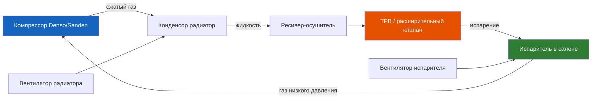

# 1.3 Кондиционер и климат-контроль

Система кондиционирования Renault Symbol — традиционная компрессорная, с хладагентом R134a. На части автомобилей установлен ручной климат-контроль (отопитель + кондиционер), на поздних версиях **[Symbol II 2005+ / Symbol III]** — полуавтоматический с датчиком температуры салона.



## Характеристики системы

| Параметр | Значение |
|----------|----------|
| Тип хладагента | **R134a** |
| Объём заправки | **550–600 г** |
| Масло компрессора | PAG 46 (синтетическое, гигроскопичное), 100–150 мл |
| Тип компрессора | Denso 7SBU16C (Symbol I/II), Sanden SD7V16 (Symbol III) |
| Давление high-side (рабочее) | 12–16 бар (35 °C наружного воздуха) |
| Давление low-side (рабочее) | 2–3,5 бар (35 °C наружного воздуха) |
| Температура на выходе испарителя | 5–10 °C |
| ТРВ | H-Valve (блок с клапаном на испарителе) |
| Датчик давления | 2-контактный (аварийное отключение при утечке) |

## Диагностика неисправностей

### Кондиционер не включается

| Причина | Проверка | Решение | Стоимость |
|---------|----------|---------|-----------|
| Нет хладагента (утечка) | Давление low-side = 0 | Найти и устранить утечку, заправить | от 2000 ₽ |
| Сгорел предохранитель | Проверить F9 (15A) под капотом | Заменить | 20 ₽ |
| Неисправно реле компрессора | Проверить R5 в монтажном блоке | Заменить реле | 300–500 ₽ |
| Нет сигнала от ЭБУ | Диагностика OBD2 — ошибки P0530–P0534 | Диагностика | 500–1500 ₽ |
| Обрыв в муфте компрессора | Нет напряжения на муфте | Проверить проводку | 500–2000 ₽ |
| Заклинил компрессор | Муфта не вращается рукой | Замена компрессора | 8000–15000 ₽ |

### Кондиционер дует, но не холодно

| Симптом | Причина | Решение |
|---------|---------|---------|
| Температура воздуха 15–20 °C | Недостаточно хладагента (частичная утечка) | Дозаправка, поиск утечки |
| Сначала холодно, потом тепло | Замерзание испарителя | Замена датчика испарителя / ТРВ |
| Холодно только на высоких оборотах | Низкое давление low-side | Дозаправка хладагента |
| Нет конденсата под авто | Забит испаритель / салонный фильтр | Чистка испарителя |

### Посторонние звуки

| Звук | Причина | Решение |
|------|---------|---------|
| Свист при включении | Износ муфты компрессора | Замена муфты (от 2000 ₽) |
| Стук при работе | Заклинивание подшипника компрессора | Замена компрессора |
| Шуршание в салоне | Забит салонный фильтр / посторонний предмет в вентиляторе | Замена фильтра / чистка |
| Гул спереди при включении | Неисправен вентилятор конденсора | Замена вентилятора |

## Заправка кондиционера

```admonition warning
Работы с кондиционером требуют специального оборудования (манометрическая станция).
Самостоятельная заправка баллончиками из магазина — частая причина поломки компрессора.
```

### Этапы профессиональной заправки

1. **Вакуумирование системы** (15–30 мин) — удаление воздуха и влаги.
2. **Проверка герметичности** — вакуум не должен падать более 0,1 бар за 10 мин.
3. **Заправка маслом PAG 46** — 30–50 мл (если менялся компрессор — 120–150 мл).
4. **Заправка хладагентом R134a** — 550–600 г, с контролем high-side/low-side давлений.
5. **Проверка** — температура на выходе испарителя 5–10 °C.

### Признаки правильной заправки

| Условие | Low-side | High-side |
|---------|----------|-----------|
| Холостой ход, 25 °C | 2,0–2,5 бар | 8–11 бар |
| 2000 об/мин, 25 °C | 1,5–2,0 бар | 11–14 бар |
| 2000 об/мин, 35 °C | 2,0–3,5 бар | 13–16 бар |

## Замена салонного фильтра

Салонный фильтр расположен за перчаточным ящиком (бардачком).

1. Откройте бардачок до упора.
2. Сожмите боковые фиксаторы, откиньте бардачок вниз.
3. Снимите пластиковую крышку фильтра (защёлки).
4. Извлеките старый фильтр (стрелки вниз).
5. Установите новый, стрелки по направлению воздушного потока (вниз).

| Параметр | Значение |
|----------|----------|
| Оригинал | 77 01 036 857 (I/II) / 77 01 048 999 (III) |
| Аналог | MANN CU 24 014 / Mahle LA 271 |
| Интервал замены | Каждые 15 000 км или 1 год |
| Стоимость | 300–800 ₽ |

```admonition info
Забитый салонный фильтр — одна из самых частых причин слабого потока воздуха из дефлекторов. Меняйте его каждый год, это занимает 5 минут.
```

## Чистка испарителя

Забитый испаритель — причина неприятного запаха при включении кондиционера.

| Метод | Стоимость | Эффективность |
|-------|-----------|---------------|
| Аэрозольная пена через дренаж (Liqui Moly Klima-Reiniger) | 500–1000 ₽ | 60% |
| Промывка испарителя со снятием | 2000–4000 ₽ | 95% |
| Озонирование салона | 1000–1500 ₽ | 70% (убирает запах, не грязь) |

### Профилактика
- Перед выключением кондиционера за 2–3 мин выключите A/C, оставьте вентилятор — осушит испаритель.
- Меняйте салонный фильтр ежегодно.
- Раз в год — аэрозольная обработка испарителя.

## Типовые неисправности по поколениям

### Symbol I (1999–2002)
- Слабый алюминиевый конденсор — частые утечки внизу.
- Компрессор Denso 7SBU16C — отказ муфты при пробеге >150 000.

### Symbol II (2002–2008)
- Датчик давления хладагента — окисление контактов разъёма.
- Пластиковый корпус ТРВ — трещины при перепадах температур.

### Symbol III (2008–2014)
- Электронный клапан ТРВ — отказ управления (нет сигнала от ЭБУ климата).
- Вентилятор конденсора — износ щёток мотора (2-скоростной).

## Полезные ссылки
- [Жидкости и объёмы](../spravochnaya/zhidkosti.md) — тип и количество хладагента
- [8.5 Схема предохранителей](../elektrika/8-5.md) — предохранители кондиционера (F9)
