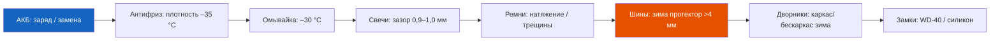

# 1.4 Эксплуатация в зимних условиях

Эксплуатация Renault Symbol зимой требует дополнительной подготовки и особого внимания к ряду систем. При температурах ниже –15 °C поведение автомобиля и нагрузка на узлы существенно меняются.

## Подготовка к зиме

### Контрольный чек-лист (за 2–4 недели до заморозков)



### 1. Аккумуляторная батарея
- Проверьте напряжение: **минимум 12,4 В** (75% заряда) при –20 °C
- Пусковой ток должен быть не ниже **450 А** (EN)
- При температуре –20 °C ёмкость АКБ падает на 40–50% — короткие поездки (до 10 мин) не успевают заряжать батарею
- **Рекомендация:** если АКБ старше 4 лет — замените до зимы, или возите пусковое устройство (бустер)

### 2. Система охлаждения
- Проверьте плотность антифриза ареометром:
  | Температура замерзания | Плотность |
  |------------------------|-----------|
  | –25 °C | 1,065 г/см³ |
  | –35 °C | 1,075 г/см³ |
  | –45 °C | 1,085 г/см³ |
- Норма для Symbol: –35 °C (концентрат + дистиллят 50:50)
- Признак недостаточной плотности: печка греет слабо на холостых оборотах

### 3. Омывающая жидкость
- Используйте зимнюю омывайку до –30 °C
- **Запрещено** заливать воду или разбавлять летнюю жидкость — замёрзнет в бачке и магистралях
- Если замёрзла — не лейте кипяток (лопнет бачок). Загоните авто в тёплый бокс на 4–6 ч или используйте фен

### 4. Свечи зажигания
- Зазор: **0,9 мм** (K7J/K7M) или **1,0 мм** (K4J/K4M)
- Изношенные свечи (>30 000 км) на морозе дают пропуски зажигания — двигатель «троит» при пуске
- **Рекомендация:** перед зимой установить новые свечи NGK BKR6E или аналог

### 5. Ремни генератора и ГРМ
- На морозе резина дубеет, ослабленный ремень может проскальзывать (свист при пуске)
- Натяжение ремня генератора проверяется нажатием пальцем: прогиб 8–10 мм при усилии 10 кгс
- Ремень ГРМ со сроком >4 лет — замените до зимы (обрыв на морозе гарантирует гнутые клапана)

### 6. Зимние шины

| Параметр | Рекомендация |
|----------|-------------|
| Минимальная высота протектора | 4 мм (закон: 1,6 мм, но безопасность — 4 мм) |
| Давление | На 0,1–0,2 бар выше летнего (проверять раз в 2 недели) |
| Шипы | Допустимы, не ухудшают управляемость на льду |
| «Липучка» (нешипованная) | Лучше для города, не шумит, не разрушает асфальт |

```admonition warning
Не экономьте на зимних шинах. Автомобиль без ABS (Symbol I ранних выпусков) на скользком покрытии с изношенной резиной неуправляем.
```

## Особенности пуска двигателя зимой

### Бензиновые двигатели (K7J / K7M / K4J / K4M)

```text
1. Перед пуском включите зажигание на 3–5 секунд
   (прогрев свечей зажигания и подкачка топлива).

2. Выжмите педаль сцепления до упора (если МКПП) —
   это отключает первичный вал КПП от маховика,
   снижая нагрузку на стартер на 30–40%.

3. Стартером крутите не более 10 секунд.
   Перерыв между попытками — 30 секунд.

4. Если двигатель не пустился с 3-й попытки —
   дайте АКБ отдохнуть 2–3 минуты.
   Проверьте искру и подачу топлива.

5. После пуска не давайте «газ» первые 30–60 секунд —
   масло должно разойтись по системе.
   Движение начинайте через 1–2 минуты,
   без резких ускорений первые 5 км.
```

### Дизельные двигатели (K9K dCi)
- Включите зажигание — дождитесь погасания лампы предпускового подогрева (спираль)
- При –20 °C может потребоваться 2–3 цикла предпускового подогрева
- Если не пускается — проверьте свечи накаливания (резьба M10×1, напряжение 11 В)

### Чего делать НЕЛЬЗЯ

| ❌ Действие | Почему |
|-------------|--------|
| Поливать кипятком впускной коллектор | Трещина ГБЦ при резком перепаде температур |
| Пускать с толкача (на МКПП) | Обрыв ремня ГРМ (масло застыло, клапана не закрыты) |
| Добавлять бензин в дизель | Разжижение масла, выход ТНВД из строя |
| Долго крутить стартер (20+ секунд) | Перегрев стартера, разряд АКБ, возможен пожар проводки |
| Использовать эфир («быстрый старт») | Детонация, разрушение поршней и шатунов |

## Эксплуатация после пуска

### Прогрев двигателя
- **Современная рекомендация:** прогрев 1–2 минуты на холостых, затем движение на низких передачах без превышения 2500 об/мин до выхода на рабочую температуру (90 °C)
- Длительный прогрев (>10 мин) на холостых:
  - Увеличивает расход топлива (2–3 л/ч на холостых)
  - Ускоряет износ цилиндров (богатая смесь смывает масляную плёнку)
  - Загрязняет свечи и катализатор

### Печка и обогрев
- Режим рециркуляции воздуха ускоряет прогрев салона на 2–3 минуты
- На Symbol II/III кондиционер автоматически включается в режиме обогрева (осушение воздуха) — это нормально
- Если печка дует холодным на прогретом двигателе:
  1. Проверьте уровень антифриза
  2. Проверьте воздушную пробку в системе (прокачка)
  3. Неисправен термостат (завис в открытом положении)
  4. Забит радиатор отопителя

### Замки и уплотнители
- Примерзание дверных уплотнителей — смажьте силиконовой смазкой
- Если замёрз замок двери — прогрейте ключ зажигалкой или используйте размораживатель замков
- Люк (если есть) зимой не открывать — механизм примерзает и ломается

### Стеклоочистители
- На ночь поднимайте «дворники» (или подкладывайте картон) — примерзание к стеклу рвёт резинку при включении
- В бескаркасных дворниках зимой замерзает вода в механизме — переходите на каркасные зимние
- Ледоход на стекле — не включайте дворники, пока лёд не оттает (резина режется)

## Аварийные ситуации зимой

| Ситуация | Действие |
|----------|----------|
| Замёрзла омывайка | Загоните в тёплый бокс на 4–6 ч. Слейте бачок, залейте зимнюю |
| Замёрз дизель (парафинизация) | Добавьте антигель (депрессорную присадку) до замерзания. Греть магистрали феном |
| Села АКБ | «Прикурите» от другого авто (минус к минусу, плюс к плюсу). Пусковой ток — до 200 А |
| Застрял в сугробе | Отключите ESP (если есть). Раскачка: 1-я → задняя без пробуксовок |
| Дверь не закрывается | Уплотнитель замёрз — прогрейте феном. Смажьте силиконом |
| Трещина на лобовом стекле | На морозе не сверлить. Заклейте скотчем стоп-трещину. Замена при прогреве |
| Антифриз в масле (эмульсия) | Немедленно остановить — пробита прокладка ГБЦ или трещина блока |

```admonition info
При температуре ниже –30 °C не рекомендуется эксплуатация Symbol без предварительного утепления моторного отсека (автоодеяло, картонный экран перед радиатором). В сильные морозы возможна поломка пластиковых элементов системы охлаждения (расширительный бачок, патрубки).
```
