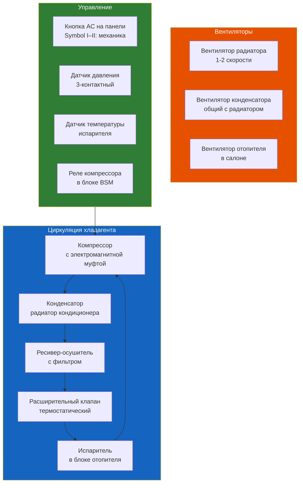

# 1.5 Система кондиционирования

Устройство, диагностика и обслуживание системы кондиционирования Renault Symbol. Хладагент R134a (до 2018) / R1234yf (после 2018).



## Устройство системы

### Компрессор

| Параметр | Значение |
|----------|----------|
| Тип | Поршневой, аксиальный (Sanden / Denso) |
| Привод | Ремень поликлиновой (через шкив) |
| Муфта | Электромагнитная, 12В |
| Расположение | Справа внизу двигателя |
| Масло | PAG 46 (ND-OIL 8) |

**Признаки неисправности компрессора:**
- Не включается муфта → нет питания, зазор >0.8 мм, обрыв обмотки
- Шум при работе → износ подшипника шкива / поршневой группы
- Не холодит → внутренняя утечка (замена компрессора)

### Конденсатор

- Расположен перед радиатором охлаждения двигателя
- Алюминиевый, трубчато-ленточный
- Наиболее уязвим к камням и коррозии
- **Типичная неисправность:** прокол (камень) → утечка R134a → замена

### Расширительный клапан (ТРВ)

- Термостатический, с баллоном на выходе испарителя
- Регулирует подачу хладагента в испаритель
- **Неисправность:** забит (не холодит) / заклинил открыт (избыточное давление)

### Испаритель

- В блоке отопителя, под панелью приборов
- **Типичная неисправность:** забиты дренажи → вода в салоне (справа под ковриком)
- Замена испарителя — снятие панели приборов (~4–6 часов работы)

### Ресивер-осушитель

- Цилиндрический, справа у конденсатора
- Содержит силикагель (влагопоглотитель)
- **Замена:** при каждой разгерметизации системы!

## Диагностика

### Не включается кондиционер

| Симптом | Причина | Проверка |
|---------|---------|----------|
| Муфта не включается | Нет давления хладагента | Датчик давления — замкнуть контакты |
| Муфта не включается | Предохранитель F7 (15A) | Проверить мультиметром |
| Муфта не включается | Реле компрессора (R7 в BSM) | Проверить щелчок |
| Вентилятор радиатора не включается | Датчик температуры/давления | Сканер OBD2 |
| Кондиционер не холодит (муфта работает) | Низкий уровень хладагента | Манометрический коллектор |

### Давление в системе (R134a)

Измерение манометрическим коллектором при +20°C и работающем кондиционере (2000 об/мин):

| Контур | Давление (норма) | Низкое | Высокое |
|--------|-----------------|--------|---------|
| Низкое (LP) | 1.5–2.5 бар | Утечка хладагента | Забит ТРВ / забит конденсатор |
| Высокое (HP) | 12–16 бар | Компрессор неисправен | Перегрузка / воздух в системе |
| Разница LP-HP | 8–12 бар | — | — |

```admonition warning
Высокое давление >20 бар на LP или >25 бар на HP → аварийный сброс через предохранительный клапан. Причина — чаще всего забит конденсатор или избыток масла. Немедленно остановите компрессор!
```

## Заправка кондиционера

### Когда нужна заправка

- Кондиционер дует тёплым (температура на дефлекторах >10°C от уличной)
- Визуально: маслянистые подтёки на соединениях (компрессор, конденсатор)
- По весу: утечка >15% хладагента в год — норма для R134a

### Инструменты

- Манометрический коллектор (R134a / R1234yf)
- Вакуумный насос (2-ступенчатый, ~40 л/мин)
- Весы для хладагента (точность ±5 г)
- Течеискатель (электронный или UV-лампа с красителем)

### Порядок заправки

1. **Проверка на утечки** — течеискателем или UV-красителем
2. **Подключение коллектора:**
   - Синий шланг → LP (низкое, трубка большего диаметра)
   - Красный шланг → HP (высокое, трубка меньшего диаметра)
   - Жёлтый шланг → вакуумный насос / баллон
3. **Вакуумирование:** 30–45 минут при −0.9 бар (–700 mmHg)
   - Должно держать вакуум 10 минут без потерь
4. **Заправка масла:** если заменяли компрессор — новое масло PAG 46
5. **Заправка хладагента:**
   - R134a: 550–600 г (без открытия HP при работе)
   - Открыть LP-вентиль → компрессор втягивает хладагент
   - Дозаправлять газом, не жидкостью (баллон вверх дном — жидкий, вверх — газ)
   - Проверить: температура на выходе из дефлектора 4–8°C

```admonition danger
Запрещается открывать красный вентиль (HP) при работающем компрессоре! Давление на HP — до 16 бар, баллон может взорваться.
```

### Параметры системы

| Параметр | R134a | R1234yf |
|----------|-------|---------|
| Вес заправки | 550–600 г | 520–570 г |
| Масло | PAG 46 — 150 мл | PAG 46 — 150 мл |
| Рабочее давление HP | 12–16 бар | 10–14 бар |
| Масло для компрессора | Sanden SP-15 | Sanden SP-15 |

## Замена компонентов

### Компрессор

1. Откачать хладагент (сервисный центр или коллектор + ресивер)
2. Снять ремень генератора/ГУР
3. Открутить 4 болта M8 крепления компрессора (головка Torx T50 или ключ на 13)
4. Отсоединить шланги HP и LP (заглушить!)
5. Отсоединить разъём муфты
6. Снять компрессор
7. Перед установкой: слить масло из старого, залить новое (PAG 46, 150 мл)
8. Установить в обратном порядке
9. Заправить систему

### Конденсатор

1. Снять решётку радиатора (пистоны + 4 болта M8)
2. Отсоединить шланги (ключ на 17) — заглушить
3. Открутить 2 болта M8 крепления к радиатору
4. Вынуть конденсатор вверх
5. Установить новый, подсоединить шланги

### Салонный фильтр

| Расположение | Под капотом, слева (жабо) |
|-------------|---------------------------|
| Доступ | Снять пластиковую накладку жабо |
| Фильтр | Угольный / обычный |
| Периодичность | Каждые 15 000 км |

**Замена:**
1. Снимите левую часть жабо (пластиковые пистоны)
2. Снимите заглушку фильтра (2 клипсы)
3. Вытащите старый фильтр
4. Установите новый (стрелка — вниз, по потоку воздуха)
5. Закройте заглушку, установите жабо

### Испаритель (сложная операция)

Замена испарителя требует снятия панели приборов. Основные этапы:
1. Отключение АКБ
2. Снятие рулевой колонки
3. Снятие панели приборов
4. Демонтаж блока отопителя
5. Разборка корпуса отопителя → доступ к испарителю
6. Замена + сборка

## Типичные неисправности

| Проблема | Причина | Решение |
|----------|---------|---------|
| Кондиционер не включается (муфта молчит) | Нет давления хладагента | Заправка / ремонт утечки |
| Кондиционер включается, дует тёплым | Низкий уровень хладагента | Дозаправка |
| Кондиционер дует холодным, но слабо | Забит салонный фильтр | Замена фильтра |
| Вода на коврике пассажира | Забит дренаж испарителя | Прочистка дренажа (трубка под авто) |
| Свист при включении кондиционера | Износ подшипника муфты | Замена муфты |
| Шум при работе | Износ компрессора | Замена компрессора |
| Неприятный запах при включении | Грибок / плесень на испарителе | Обработка антибактериальным спреем |
| Кондиционер выключается на поворотах | Низкий уровень хладагента | Заправка |
| Масляное пятно под авто (справа) | Утечка из компрессора / конденсатора | Диагностика |

## Профилактика

- Включайте кондиционер не реже 1 раза в месяц зимой (прогрев компрессора + смазка уплотнений)
- Мойте конденсатор снаружи (струя воды, не Karcher!)
- Меняйте салонный фильтр каждые 15 000 км
- При появлении запаха — обработайте испаритель антибактериальным спреем (через дренаж)
- Полная заправка — раз в 2–3 года
