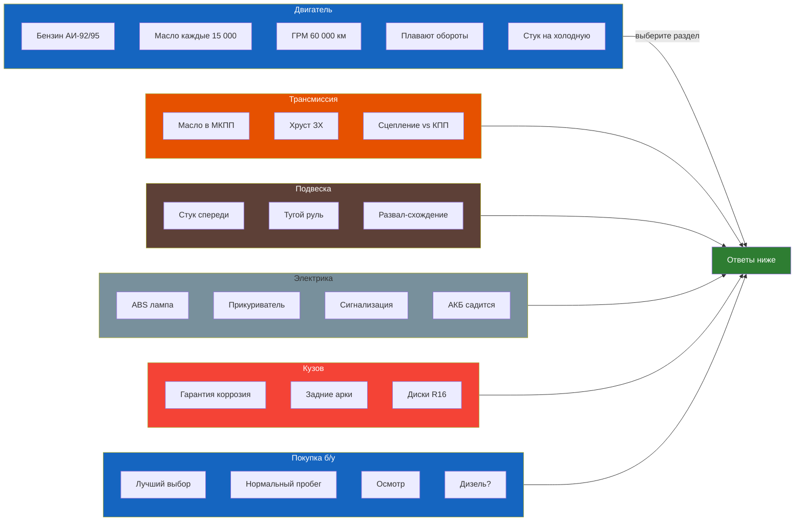

# FAQ: Часто задаваемые вопросы

## Двигатель

### Какой бензин заливать — АИ-92 или АИ-95?
**K7J / K7M (8 клапанов):** допускается АИ-92 (по документации). Рекомендуется АИ-95 для лучшей динамики и меньшего расхода.
**K4J / K4M (16 клапанов):** **только АИ-95**. Заливка АИ-92 может вызвать детонацию на высоких оборотах из-за степени сжатия 10:1.
**K9K (дизель):** только дизтопливо с цетановым числом не менее 49.

> Расход на АИ-92 выше на 3–5%, чем на АИ-95. Экономия на топливе иллюзорна.

### Как часто менять масло в двигателе?
- **Нормальные условия:** каждые 15 000 км или 1 год
- **Тяжёлые условия (короткие поездки, пыль, пробки):** 7 500–10 000 км
- **Дизель K9K:** строго 10 000 км (масло ACEA C3 5W-30)
- **После покупки б/у:** замените сразу, независимо от данных продавца

### Какой лямбда-зонд выбрать: оригинал или аналог?
Оригинал (Bosch 0 258 003 XXX) — 6 000–8 000 ₽, ходит 80 000–100 000 км.
Аналог (NGK, Denso, Stellox) — 3 000–5 000 ₽, ходит 40 000–60 000 км.
Рекомендуется оригинал для замедленного отклика.

### Двигатель стучит на холодную — это нормально?
Лёгкий стук гидрокомпенсаторов первые 2–3 секунды после пуска (до поступления масла) — **норма**. Если стук не проходит через 10 секунд или усиливается с прогревом — гидрокомпенсаторы забиты/изношены, требуется замена.

### Плавают обороты холостого хода — что делать?
1. ✅ Проверьте подсос воздуха (силиконовые патрубки, дроссельную заслонку)
2. ✅ Почистите дроссельную заслонку + дроссельный узел
3. ✅ Замените свечи, если пробег >30 000 км
4. ✅ Проверьте лямбда-зонд (подогрев + сигнал)
5. ✅ Выполните обучение холостого хода (см. раздел [3.8](./dvigatel/3-8.md))

## Трансмиссия

### Масло в МКПП «необслуживаемое» — нужно ли менять?
Renault заявляет, что масло в МКПП залито на весь срок службы. **На практике:** менять каждые 60 000 км. После 100 000 км старое масло теряет вязкость, передачи начинают хрустеть.

### Какой тип масла лить в МКПП?
75W-80 GL-4 (Elf Tranself NF, Motul Gear 300, Castrol Syntrans). **Не используйте 75W-90 GL-5** — агрессивные присадки разрушают синхронизаторы из жёлтого металла.

### Хрустит при включении задней передачи — что это?
**Это норма для Symbol.** Задняя передача не имеет синхронизатора. Если включается с трудом:
1. Включите сначала I или II, затем заднюю
2. Проверьте reverse lockout (соленоид)
3. Если хрустит постоянно — износ шестерни ЗХ (дорогой ремонт)

### Как отличить симптомы неисправности сцепления от КПП?

| Симптом | Сцепление | КПП |
|---------|-----------|-----|
| Запах гари при трогании | ✅ Износ диска | ❌ |
| Шум на нейтрали (двигатель работает) | ❌ | ✅ Подшипник первичного вала |
| Шум при выжатом сцеплении | ✅ Выжимной подшипник | ❌ |
| Вылетает передача в движении | ❌ | ✅ Износ вилки/синхронизатора |
| Рывки при трогании | ✅ Замасливание/износ | ❌ |

## Подвеска и рулевое

### Стук спереди на лежачих полицейских — что это?
**90% — стойки стабилизатора.** Замена — 500–1 000 ₽ за пару. Если стук остался — проверьте шаровые опоры и сайлент-блоки рычагов.

### Руль стал тугим — что смотреть?
1. Уровень жидкости ГУР (бачок справа)
2. Натяжение ремня привода насоса ГУР
3. Насос ГУР (гудит или нет)
4. Воздух в системе (пена в бачке → прокачка)

### Обязательно ли делать развал-схождение после замены стоек?
**Да, обязательно.** После замены любого элемента передней подвески, влияющего на геометрию:
- Амортизационной стойки
- Нижнего рычага / сайлент-блоков
- Шаровой опоры
- Рулевой тяги / наконечника

## Электрика

### Горит лампа ABS — что делать?
1. Лампа загорается на 2–3 секунды при пуске — норма
2. Горит постоянно — ошибка в системе ABS. Проверьте:
   - Загрязнение датчиков скорости колёс (самая частая причина)
   - Предохранители ABS (30А и 40А в блоке под капотом)
   - Обрыв провода датчика (особенно при частой замене колёс)

### Почему прикуриватель не работает?
**Самая частая причина:** перегорел предохранитель F21 (15A) в салонном блоке. Вместе с прикуривателем может не работать диагностический разъём OBD2 (общая цепь питания). Замените предохранитель.

### Как отключить сигнализацию, если брелок не работает?
1. Откройте дверь механическим ключом (обычно водительская дверь)
2. Вставьте ключ в замок зажигания, включите зажигание
3. У некоторых версий: нажмите кнопку Valet (под панелью, слева от руля)
4. Если не помогло — отключите АКБ на 10 секунд. Сигнализация сбросится, но двигатель заведётся только при наличии чипа в ключе (иммобилайзер)

### Почему в машине быстро садится АКБ?
1. Ток утечки >50 мА (проверить мультиметром)
2. АКБ старше 4–5 лет — сульфатация
3. Генератор не заряжает (напряжение <13,5 В при работе двигателя)
4. Короткие поездки (до 10 мин) зимой — АКБ не успевает зарядиться

## Кузов

### Есть ли гарантия от сквозной коррозии?
Заводская гарантия — **6 лет** на сквозную коррозию кузова. Практически: если коррозия пошла изнутри (например, сварной шов арки), Renault может оплатить ремонт до 75%.

### Как лечить коррозию задних арок?
Стандартный метод для Symbol: зачистить до металла → преобразователь ржавчины → грунт → краска → антигравий. Для профилактики: обработать скрытые полости арок Dinitrol ML раз в 2–3 года.

### Можно ли поставить диски R16 на Symbol?
С 195/50 R16 — технически да, но с оговорками:
- Вылет ET 38–40 (ET35 будет задевать за арку)
- На Symbol III арки меньше — проверять при полном вывороте
- Спидометр будет завышать на 3%
- Расход топлива вырастет на 0,3–0,5 л/100 км

## Эксплуатация

### Загорелся Check Engine — можно ли продолжать движение?
- **Если лампа горит ровным светом** — можно ехать до сервиса, но избегайте высоких оборотов (>3000) и резких ускорений
- **Если лампа мигает** — немедленно остановитесь (пропуски зажигания с повреждением катализатора). Нужна эвакуация

### Какой срок службы ремня ГРМ?
| Двигатель | Срок | Замена |
|-----------|------|--------|
| K7J / K7M / K4J / K4M | 60 000 км / 4 года | Комплектом: ремень + ролики + помпа |
| K9K (дизель) | 90 000 км / 6 лет | Комплектом: ремень + ролики |

**Если ремень порвался в движении** — гарантированно гнёт клапана (интерференционные двигатели).

### Нужно ли прогревать двигатель зимой?
Современная рекомендация: 1–2 минуты на холостых, затем движение на низких передачах без превышения 2500 об/мин до выхода на 90 °C. Длительный прогрев на холостых (>10 мин) увеличивает износ и расход топлива.

### Какую незамерзайку заливать?
Только зимнюю с температурой замерзания не выше –30 °C. **Не разбавляйте летнюю воду/омывайку** — замёрзнет в бачке и магистралях. Если уже замёрзла — не заливайте кипяток (лопнет бачок), используйте тёплый бокс или фен.

## Покупка б/у

### Какой Symbol лучше купить?
**Лучший выбор:** Symbol II (2005–2008) с двигателем 1.4 (K7J) или 1.6 8V (K7M). Эти моторы неприхотливы, ремонт дёшев, запчасти есть в любом магазине. 16-клапанные (K4J/K4M) мощнее, но дороже в обслуживании.

### Какой пробег считать нормальным?
- 2005–2008: 120 000–180 000 км
- 2008–2014: 80 000–150 000 км
- Подозрительный: <50 000 км для авто старше 15 лет (скручен)
- Допустимый: до 250 000 км при наличии подтверждённого обслуживания

### На что обратить внимание перед покупкой?
См. полный чеклист в разделе [Осмотр перед покупкой](../statyi/osmotr-pered-pokupkoi.md).

### Стоит ли брать дизельный Symbol (K9K)?
**Плюсы:** расход 4,5–5,5 л/100 км, ресурс 300 000+ км, высокая тяга с низов.
**Минусы:** дорогой ТНВД (40 000+ ₽), требователен к маслу (ACEA C3), проблемы с EGR, турбиной. Хорош для тех, кто ездит >30 000 км/год.
