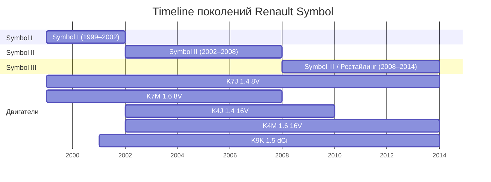
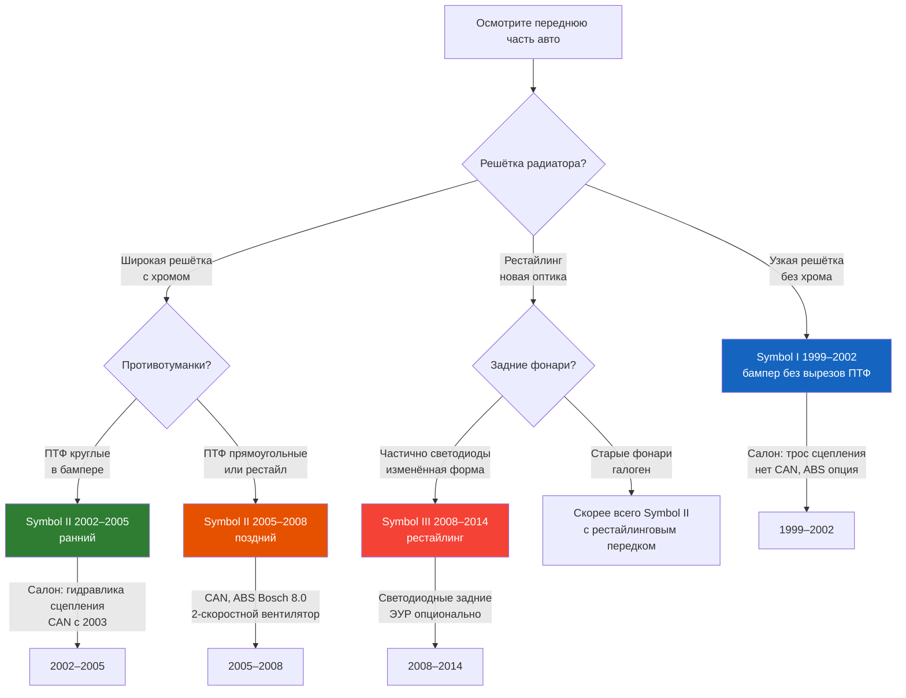

# Поколения Renault Symbol

На протяжении выпуска (1999–2014) автомобиль претерпел три крупных обновления.
Поколения различаются экстерьером, интерьером, электроникой и набором двигателей.

## Symbol I (1999–2002)

- **Платформа**: Renault Clio II Phase 1
- **Кузов**: оригинальные бамперы, узкая решётка радиатора
- **Двигатели**: K7J (1.4), K7M (1.6), K9K (1.5 dCi)
- **КПП**: JH1 (5-ст.), JH3 (5-ст. усиленная)
- **Электрика**: без CAN-шины, традиционная проводка
- **Сцепление**: тросовый привод (до ~2002, K7J/K7M)
- **Рулевое**: ГУР — опция
- **ABS**: опционально, Bosch 5.3
- **Система охлаждения**: 1-скоростной вентилятор
- **Фары**: H4 60/55W (лампа совмещённая)
- **Топливный фильтр**: отдельный, под днищем

## Symbol II (2002–2008)

- **Платформа**: Renault Clio II Phase 2
- **Кузов**: обновлённые бамперы, хромированная решётка
- **Двигатели**: K7J, K7M, K4J, K4M, K9K
- **КПП**: JH1/JH3, 5-ст.
- **Электрика**: CAN-шина с 2003 г.
- **Сцепление**: гидропривод (все 1.6, после 2002 — все)
- **Рулевое**: ГУР — стандарт с 2001 г.
- **ABS**: Bosch 5.3 / Bosch 8.0 (с 2005)
- **Система охлаждения**: 2-скоростной вентилятор
- **Фары**: H7 55W + H1 55W (раздельные лампы)
- **Топливный фильтр**: в баке, сменный фильтр отсутствует
- **Задние фонари**: галоген

## Symbol III / Рестайлинг (2008–2014)

- **Платформа**: Renault Clio II Phase 3
- **Кузов**: рестайлинг передней части, изменённая оптика
- **Двигатели**: K7J, K4M, K9K
- **КПП**: JH1/JH3, 5-ст.
- **Электрика**: CAN-шина
- **Сцепление**: гидропривод
- **Рулевое**: ГУР / ЭУР (зависит от рынка)
- **ABS**: Bosch 8.0
- **Фары**: H7 55W + H1 55W
- **Задние фонари**: частично светодиодные (с 2005)
- **Комбинация приборов**: обновлённый дизайн, центральный дисплей
- **Подушки безопасности**: 2 фронтальные (базово), боковые (опция)

## Галерея

### Symbol I / Thalia (1999–2002)

### Symbol II (2002–2008)

### Symbol III / Рестайлинг (2008–2014)

## Таблица совместимости

| Компонент | Symbol I (1999–2002) | Symbol II (2002–2008) | Symbol III (2008–2014) |
|---|---|---|---|
| Передние тормозные диски | 238 мм / 259 мм | 259 мм | 259 мм |
| Задние тормозные барабаны | 180 мм | 180 мм | 203 мм |
| Передний амортизатор | Arwin 639132 | Arwin 639132 / Monroe | Monroe |
| Задний амортизатор | Arwin 639133 | Arwin 639133 / Monroe | Monroe |
| Ремень ГРМ (K7J/K7M) | 113 зубьев | 113 зубьев | 113 зубьев |
| Свечи зажигания | RC87YCL | RC87YCL / FR8DC+ | FR8DC+ |
| Фильтр масляный | 7700274195 | 7700274195 / 8200115695 | 8200115695 |
| Фильтр воздушный | 8200073144 | 8200073144 | 8200073144 |
| Фильтр салона | 7700421977 | 7700421977 | 7700421977 |
| АКБ | 60 А·ч (540 А пуск) | 60 А·ч (540 А) | 62 А·ч (620 А) |

> 💡 **Проверка поколения по VIN**: десятый символ VIN — год выпуска.
> Подробнее — в разделе [Идентификация](vin.md).
