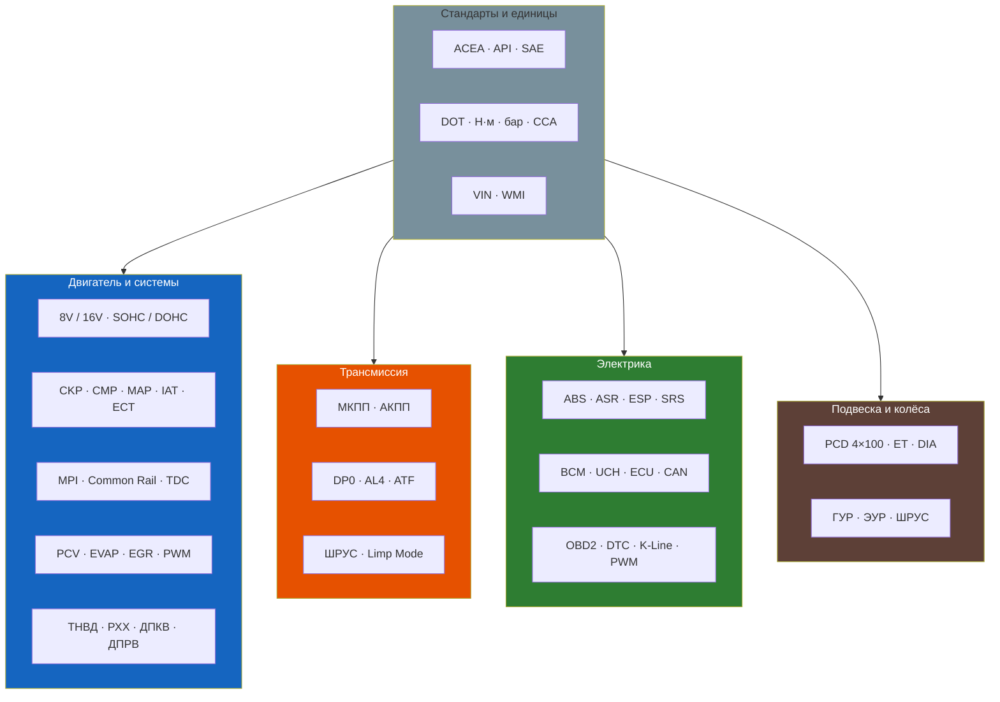

# Глоссарий терминов и сокращений

## 0–9

| Термин | Расшифровка | Пояснение |
|--------|-------------|-----------|
| **4×100** | PCD (Pitch Circle Diameter) | Разболтовка колёс — 4 отверстия, диаметр окружности 100 мм. Стандарт для Symbol |
| **8V / 16V** | 8 / 16 клапанов | Количество клапанов на двигатель. 8V — SOHC (один распредвал), 16V — DOHC (два распредвала) |

## A–Z

| Термин | Расшифровка | Пояснение |
|--------|-------------|-----------|
| **ABS** | Anti-lock Braking System | Антиблокировочная система тормозов. Bosch 5.3 / 8.0 |
| **ACEA** | Association des Constructeurs Européens d'Automobiles | Европейский стандарт классификации моторных масел (A3/B4, C3 и т.д.) |
| **API** | American Petroleum Institute | Американский стандарт классификации масел (SL, SM, SN) |
| **ASR** | Anti-Slip Regulation | Противобуксовочная система (регулировка тяги). Опционально на Symbol |
| **ATF** | Automatic Transmission Fluid | Масло для автоматических коробок передач. Для DP0 — LT 71141 |
| **BCM / UCH** | Body Control Module | Блок комфорта (UCH на французских авто). Управляет ЦЗ, ЭСП, освещением |

| Термин | Расшифровка | Пояснение |
|--------|-------------|-----------|
| **CAN** | Controller Area Network | Шина обмена данными между ЭБУ. На Symbol — с 2003 года. 500 кбит/с (высокоскоростная) + 125 кбит/с (низкоскоростная) |
| **CCCD** | — | Подстрочный редактор: CCCD — Configuration Climatisation Chauffage Décongélation (блок климат-контроля) |
| **CKP** | Crankshaft Position Sensor | Датчик положения коленвала (ДПКВ). Индуктивный тип, зазор 0,5–1,5 мм |
| **CMP** | Camshaft Position Sensor | Датчик положения распредвала (ДПРВ). Эффект Холла |
| **Common Rail** | — | Аккумуляторная топливная система дизеля. Bosch CP1, давление до 1350 бар |
| **dCi** | Direct Common injection | Дизельный двигатель с Common Rail (K9K). Рекламное обозначение Renault |

| Термин | Расшифровка | Пояснение |
|--------|-------------|-----------|
| **DP0 / AL4** | — | 4-ступенчатая автоматическая коробка передач (АКПП) совм. разработки Peugeot/Renault |
| **DPF** | Diesel Particulate Filter | Сажевый фильтр. На Symbol — отсутствует (D5F — экопакет без DPF) |
| **DTC** | Diagnostic Trouble Code | Код неисправности OBD2 (например, P0301, P0420) |
| **ECT** | Engine Coolant Temperature | Датчик температуры охлаждающей жидкости |
| **ECU / ECM** | Engine Control Unit / Module | ЭБУ — электронный блок управления двигателем |
| **EGR** | Exhaust Gas Recirculation | Система рециркуляции отработавших газов. Частая проблема на K9K |
| **ELM327** | — | Микросхема-адаптер для диагностики OBD2. Рекомендуется CANtieCAR v1.5+ |
| **ESP** | Electronic Stability Program | Система курсовой устойчивости (электронный стабилизатор) |
| **EVAP** | Evaporative Emission Control | Система улавливания паров топлива (адсорбер) |
| **GTS** | Главный тормозной цилиндр | Педаль → ГТЦ → гидроблок ABS → суппорта |
| **ГУР** | Гидроусилитель руля | Система облегчения поворота руля с гидравлическим насосом |

| Термин | Расшифровка | Пояснение |
|--------|-------------|-----------|
| **HCU** | Hydraulic Control Unit | Гидравлический блок ABS (насос + клапаны + аккумулятор) |
| **IAT** | Intake Air Temperature | Датчик температуры воздуха на впуске |
| **K-Line** | ISO 9141-2 | Диагностический протокол Symbol I (1999–2002). Использует пин 7 OBD2 |
| **Limp Mode** | — | Аварийный режим АКПП: только III передача, оранжевая лампа |

| Термин | Расшифровка | Пояснение |
|--------|-------------|-----------|
| **MAP** | Manifold Absolute Pressure | Датчик абсолютного давления во впускном коллекторе |
| **MIL** | Malfunction Indicator Lamp | Контрольная лампа Check Engine |
| **MPI** | Multi Point Injection | Распределённый впрыск топлива (1 форсунка на цилиндр) |
| **OBD2** | On-Board Diagnostics II | Стандарт бортовой диагностики с 1996 г. Разъём 16-контактный SAE J1962 |
| **PCD** | Pitch Circle Diameter | Диаметр расположения отверстий колёсных болтов (4×100 = 4 отв. на Ø100 мм) |
| **PCV** | Positive Crankcase Ventilation | Система вентиляции картерных газов |
| **PWM** | Pulse Width Modulation | Широтно-импульсная модуляция (управление форсунками, РХХ) |

| Термин | Расшифровка | Пояснение |
|--------|-------------|-----------|
| **РХХ** | Регулятор холостого хода | Электромагнитный клапан или шаговый двигатель, управляющий обводным каналом дросселя |
| **SOHC / DOHC** | Single/Double OverHead Camshaft | Один / два распределительных вала в ГБЦ |
| **SRS** | Supplemental Restraint System | Система пассивной безопасности (подушки + преднатяжители) |
| **TPS / ДПДЗ** | Throttle Position Sensor | Датчик положения дроссельной заслонки (потенциометр) |
| **TDC** | Top Dead Center | Верхняя мёртвая точка. Установка поршня в ВМТ — этап замены ГРМ |

| Термин | Расшифровка | Пояснение |
|--------|-------------|-----------|
| **ТНВД** | Топливный насос высокого давления | Создаёт давление до 1350 бар в Common Rail (дизель K9K) |
| **VIN** | Vehicle Identification Number | 17-значный идентификатор автомобиля. Для Symbol: VF1... |
| **VSS** | Vehicle Speed Sensor | Датчик скорости автомобиля (на КПП) |
| **WMI** | World Manufacturer Identifier | Первые 3 знака VIN: VF1 = Renault France |
| **МКПП** | Механическая коробка передач | JB3 (1,4 л) или JC5 (1,6 л), 5-ст., двухвальные |
| **АКПП** | Автоматическая коробка передач | DP0 (AL4), 4-ст., гидромеханическая |
| **ЭБУ** | Электронный блок управления | Компьютер двигателя (Siemens SID 803 / Bosch MP7.0) |
| **ЭУР** | Электроусилитель руля | На Symbol III опционально (вместо ГУР) |
| **ШРУС** | Шарнир равных угловых скоростей | Внутренний (tripod) + наружный (Rzeppa 6 шариков) |

## Сленговые термины

| Термин | Значение |
|--------|----------|
| **«Буксует»** | Сцепление проскальзывает (обороты растут, скорость нет) |
| **«Ведёт»** | Сцепление не выключается полностью (передачи с хрустом) |
| **«Троит»** | Двигатель работает с пропусками зажигания (неустойчиво) |
| **«Check Engine»** | Лампа MIL на панели приборов |
| **«Подсос»** | Негерметичность впускного тракта (лишний воздух → бедная смесь) |
| **«Обманка»** | Эмулятор лямбда-зонда для отключения Check Engine |
| **«Чип»** | Перепрошивка ЭБУ для изменения характеристик двигателя |
| **«Капиталка»** | Капитальный ремонт двигателя (замена поршневой, шлифовка коленвала) |

## Единицы измерения

| Сокращение | Полное | Применение |
|-----------|--------|-----------|
| Н·м | Ньютон-метр | Момент затяжки (например, 200 Н·м — гайка ступицы) |
| А·ч | Ампер-час | Ёмкость АКБ (45–62 А·ч) |
| бар | Бар (1 бар = 0,987 атм) | Давление: масло 0,8–5,0 бар; шины 2,0–2,5 бар |
| psi | Фунт-сила на кв. дюйм | Давление в шинах (29 psi ≈ 2,0 бар) |
| CCA | Cold Cranking Amps | Пусковой ток АКБ (450–640 А) |
| °C | Градус Цельсия | Температура |

## Мнемоника цветов проводов Renault

| Код | Французский | Русский | Назначение |
|-----|-------------|---------|-----------|
| R | Rouge | Красный | Постоянное +12В |
| J | Jaune | Жёлтый | +12В после замка (IGN) |
| O | Orange | Оранжевый | Освещение |
| V | Violet | Фиолетовый | Стартер, датчики |
| B | Bleu | Синий | Сигналы управления |
| Vt | Vert | Зелёный | Повороты, сигналы |
| G | Gris | Серый | Масса (GND) |
| Bc | Blanc | Белый | CAN-шина, диагностика |
| M | Marron | Коричневый | Заземление |

Например: **RGE** = Rouge (красный) + Gris (серый полоса) = постоянное питание +12В
