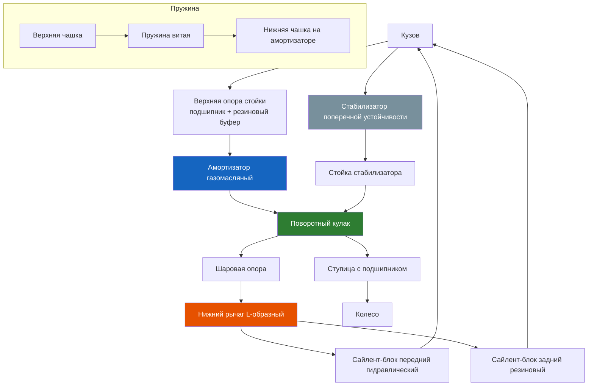

# 5.1 Передняя подвеска (MacPherson)

Передняя подвеска Renault Symbol — независимая типа MacPherson (стойка McPherson). Простая, прочная и ремонтопригодная конструкция.



```admonition info
Смазка направляющих пальцев суппорта — при каждом ТО (через 15 000 км). Используйте смазку TRW PFG110 или Ate Plastilube. Не применяйте литол — вызывает закисание направляющих.
```

## Устройство

| Узел | Описание |
|------|----------|
| Амортизационная стойка | Телескопический газомасляный амортизатор + витая пружина + верхняя опора с подшипником |
| Поворотный кулак | Чугунный, с запрессованным двухрядным ступичным подшипником |
| Нижний рычаг | L-образный, штампованный из листовой стали, с двумя сайлент-блоками |
| Шаровая опора | Неразборная, запрессована в рычаг (замена только в сборе с рычагом) |
| Стабилизатор | Штанга Ø 22–24 мм, крепится к лонжеронам через резиновые подушки, к рычагам — через стойки |
| Верхняя опора стойки | Резиновый буфер + радиально-упорный подшипник (на 3 болтах к чашке кузова) |

## Амортизационная стойка — замена

### Параметры стоек

| Характеристика | Оригинал (Renault) | Заменители |
|----------------|-------------------|------------|
| Передний амортизатор | 77 00 268 015 | Monroe 41331, KYB 333333, Sachs 110101 |
| Артикул пружины | 77 00 268 028 | Lesjöfors 4206014 |
| Ход амортизатора | ~185 мм | — |
| Длина пружины (свободная) | ~360 мм | — |
| Диаметр прутка пружины | 11,5 мм | — |

### Инструменты
- Стяжки пружин (обязательно)
- Головки Torx T45, T40, T30
- Динамометрический ключ до 200 Н·м
- Съёмник шаровой опоры

### Порядок работ (замена стойки в сборе)
1. Поднять переднюю часть, снять колесо
2. Открутить гайку стабилизатора (T45) и отсоединить стойку стабилизатора
3. Открутить датчик ABS (если есть)
4. Отсоединить рулевую тягу — открутить гайку, выпрессовать палец съёмником
5. Открутить 2 болта шаровой опоры к кулаку (T40, 45 Н·м)
6. Открутить гайку ступицы (200 Н·м, воротком), снять ступицу с амортизатора при необходимости
7. Открутить 3 гайки верхней опоры (T30, 20 Н·м) — придерживая стойку снизу
8. Извлечь стойку вниз через поворотный кулак

### Замена пружины и верхней опоры (на стенде)
1. Сжать пружину стяжками (симметрично, виток за витком)
2. Открутить центральную гайку штока (Torx T45 держать шток)
3. Снять верхнюю опору, подушку, пыльник, буфер отбоя
4. Снять пружину
5. Собрать в обратном порядке: новая опора → пыльник → буфер → пружина → верхняя чашка → гайка штока
6. Затянуть гайку штока до 50 Н·м (на необжатой пружине нельзя — вырвет шток)

> ⚠ Стяжки пружин — обязательно работа вдвоём. Пружина сжата с усилием >300 кг. Сорвавшаяся стяжка может травмировать.

## Замена нижнего рычага

### Сайлент-блоки рычага
- **Передний сайлент-блок:** гидравлический (заполнен маслом), артикул 77 00 270 207
- **Задний сайлент-блок:** резинометаллический, артикул 77 00 270 208

### Порядок работ
1. Поднять авто, открутить гайку шаровой опоры
2. Отсоединить шаровую от кулака съёмником
3. Открутить 2 болта переднего сайлент-блока к подрамнику (T55, 80 Н·м)
4. Открутить болт заднего сайлент-блока (T55, 60 Н·м)
5. Извлечь рычаг
6. Запрессовать новые сайлент-блоки прессом (строго горизонтально до меток)
7. Установить рычаг, затянуть болты на стоящем на колёсах автомобиле (под нагрузкой)

> ⚠ Затяжка сайлент-блоков на вывешенном автомобиле приводит к их быстрому разрушению. Затягивать только при массе авто на колёсах!

## Замена стоек стабилизатора

| Параметр | Значение |
|----------|----------|
| Длина стойки | ~280 мм |
| Ключ | Torx T45 (с двух сторон) |
| Момент затяжки | 45 Н·м |
| Артикул (оригинал) | 77 00 271 851 |
| Заменитель | Lemförder 31823 01, TRW JTC1825 |

### Симптомы износа
- Металлический стук на лежачих полицейских
- Стук при раскачке кузова (при остановленном авто)
- Осмотр: покачивая стойку рукой — должен быть люфт

## Углы установки колёс (регулировка)

| Параметр | Передняя ось |
|----------|-------------|
| Развал | −0°30′ ± 30′ (регулируется эксцентриковым болтом нижнего рычага) |
| Кастер | +1°30′ ± 30′ (не регулируется) |
| Схождение | 0 ± 1 мм (регулировка рулевыми тягами) |

### После замены элементов подвески
Обязательна проверка и регулировка углов после замены:
- Нижнего рычага или его сайлент-блоков
- Шаровой опоры
- Рулевой тяги или наконечника
- Поворотного кулака
- Амортизационной стойки

## Моменты затяжки (передняя подвеска)

| Соединение | Момент, Н·м |
|------------|-------------|
| Гайка ступицы | 200 |
| Болт шаровой опоры к кулаку | 45 |
| Сайлент-блок передний к подрамнику | 80 |
| Сайлент-блок задний к кузову | 60 |
| Верхняя опора стойки | 20 |
| Центральная гайка штока амортизатора | 50 |
| Стойка стабилизатора | 45 |
| Подушка стабилизатора (скоба) | 25 |
| Гайка рулевого наконечника | 35 |
