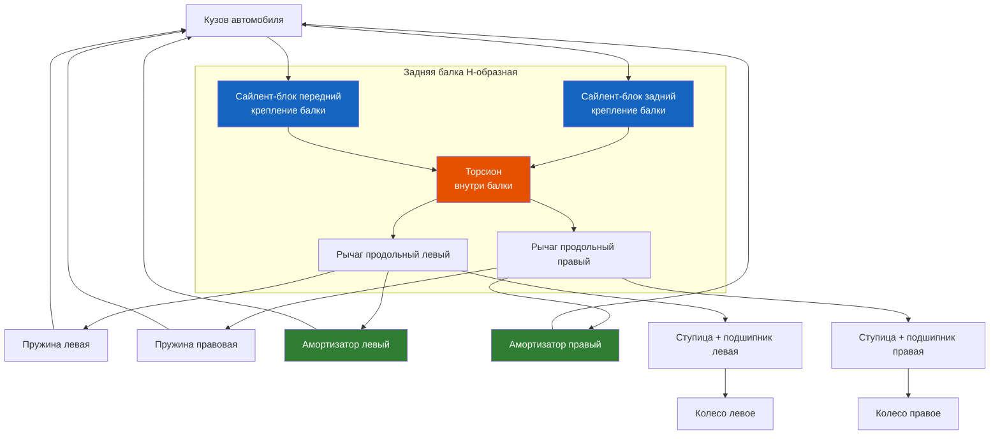

# 5.2 Задняя подвеска

Задняя подвеска Renault Symbol — полузависимая, торсионная балка с интегрированными продольными рычагами. Конструкция проверена десятилетиями: простая, прочная, дешёвая в обслуживании.



```admonition info
На Symbol I/II/III торсионы внутри балки имеют разную жёсткость. Маркировка торсиона нанесена краской на торце. При замене необходимо устанавливать торсион той же маркировки (или парой для одинаковой жёсткости слева/справа).
```

## Устройство

| Узел | Описание |
|------|----------|
| Балка | H-образная сварная конструкция из профильных труб |
| Торсионы | Внутренние (размещены внутри балки), работают на скручивание |
| Рычаги | Продольные, приварены к балке, с площадками для пружин |
| Амортизаторы | Газомасляные, наклонные (от рычага к чашке кузова) |
| Пружины | Цилиндрические витые |
| Ступицы | Неразборные, с запрессованным двухрядным подшипником |
| Сайлент-блоки | 2 шт (передний и задний узел крепления балки к кузову) |

## Технические характеристики

| Параметр | Значение |
|----------|----------|
| Колея задних колёс | 1380–1390 мм (зависит от дисков) |
| Развал задних колёс | −1° ± 30′ (не регулируется) |
| Схождение задних колёс | 0 ± 1,5 мм (не регулируется) |
| Амортизаторы (оригинал) | 77 00 268 039 |
| Пружины (оригинал) | 77 00 268 031 |
| Сайлент-блок балки (артикул) | 77 00 270 550 |

## Замена задних амортизаторов

### Инструменты
- Головка Torx T40 и T45
- Динамометрический ключ
- Домкрат, подставки

### Порядок работ
1. Поднять заднюю часть, установить подставки под лонжероны
2. Открутить верхнее крепление амортизатора (Torx T45, 45 Н·м) — доступ из багажника после снятия обшивки
3. Открутить нижнее крепление (Torx T40, 45 Н·м)
4. Извлечь амортизатор, сжав/растянув (если не выходит — опустить балку домкратом)
5. Установить новый амортизатор
6. Затянуть нижний болт, затем верхний

> ⚠ Замена амортизаторов — только парой (оба задних одновременно). Нельзя смешивать газовые и масляные.

### Признаки износа амортизаторов
- Запотевание/течь масла по штоку
- Стук на неровностях (пробитие подвески)
- Кузов раскачивается после нажатия на бампер (более 2 колебаний)
- Неравномерный износ шин

## Задние пружины

| Характеристика | Оригинал | Усиленные (+25 мм) |
|----------------|----------|-------------------|
| Диаметр прутка | 10,5 мм | 11,5 мм |
| Длина свободная | ~310 мм | ~340 мм |
| Количество витков | 8 | 8 |

Задние пружины заменяются при просадке кузова >20 мм от номинальной высоты.

## Сайлент-блоки задней балки

Два резинометаллических шарнира (передний и задний) в узлах крепления балки к кузову. Характерная неисправность с пробегом >100 000 км.

### Диагностика
- Стук и скрип сзади на неровностях
- Люфт при покачивании балки (подняв задние колёса)
- Плавание задней оси при движении (замедленная реакция на руль)

### Замена

> ⚠ Замена сайлент-блоков на Symbol требует выпрессовки/запрессовки шарниров из балки и из кузова. Без гидравлического пресса (10+ т) не обойтись.

#### Без снятия балки (возможно)
1. Поднять заднюю часть, снять колесо
2. Вывесить балку, открутить болт крепления балки к кронштейну кузова (T55, 105 Н·м)
3. Выпрессовать старый сайлент-блок специальным съёмником (Renault Mot. 1369 или аналог)
4. Смазать новый сайлент-блок мыльным раствором (не маслом!), запрессовать до упора
5. Установить болт, затянуть на стоящем автомобиле (105 Н·м)

#### Со снятием балки (см. ниже)

## Снятие задней балки

Требуется для замены сайлент-блоков, при деформации балки или замене торсионов.

### Порядок
1. Установить авто на подъёмник, снять колёса
2. Снять задние тормозные барабаны/колодки (см. раздел 7.2)
3. Отсоединить трос ручника от колодок
4. Снять тормозные шланги с балки (пережать или слить тормозную жидкость)
5. Снять датчики ABS (если есть)
6. Подставить домкрат под балку, снять амортизаторы (верх и низ)
7. Снять пружины (сжав балку домкратом вверх)
8. Открутить болты сайлент-блоков (T55, 105 Н·м) — по одному с каждой стороны
9. Опустить балку на домкрате, выкатить из-под авто

> ⚠ Масса балки в сборе с тормозами — ~40 кг. Работать вдвоём.

### Установка
1. Установить балку на домкрат, поднять до совмещения отверстий
2. Вставить болты сайлент-блоков, затянуть от руки
3. Установить пружины и амортизаторы
4. Присоединить тормозные шланги, прокачать тормоза
5. Опустить авто на колёса, затянуть болты сайлент-блоков (105 Н·м)
6. Отрегулировать ручник

## Самовыравнивающая подвеска (если оборудована)

На части Symbol (обычно с дизелем или для такси) устанавливались задние амортизаторы с пневмокамерами Nivomatic.

- **Принцип:** при загрузке давление в баллоне растёт, амортизатор удлиняется, восстанавливая дорожный просвет
- **Диагностика:** просадка при нагрузке, отсутствие восстановления высоты — замена амортизаторов
- **Замена:** как обычные, но перед снятием стравить давление через золотник
- **Артикул:** Renault 77 00 269 455

## Моменты затяжки (задняя подвеска)

| Соединение | Момент, Н·м |
|------------|-------------|
| Болт сайлент-блока балки к кузову | 105 |
| Верхний болт амортизатора | 45 |
| Нижний болт амортизатора | 45 |
| Гайка ступицы заднего колеса | 200 |
| Болт крепления тормозного щита | 25 |
