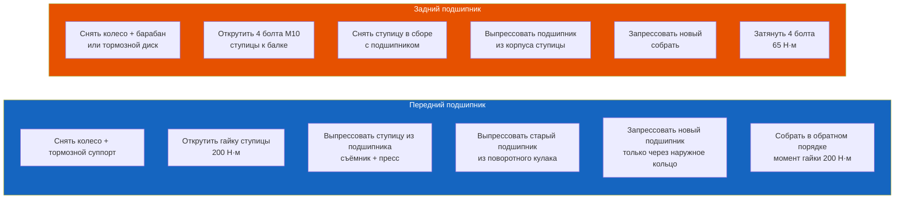

# 5.4 Замена ступичного подшипника

Инструкция по замене ступичного подшипника переднего и заднего колеса на Renault Symbol.



## Передний ступичный подшипник

### Признаки износа

| Симптом | На какой скорости |
|---------|------------------|
| Гул, нарастающий при повороте налево | Изношен левый подшипник |
| Гул, нарастающий при повороте направо | Изношен правый подшипник |
| Гул на прямой (без поворота) | Оба подшипника |
| Люфт колеса при покачивании (вверх-вниз) | Критический износ |
| Хруст при вращении | Разрушение сепаратора |

**Диагностика:**
1. Поднимите колесо домкратом
2. Возьмитесь за пружину рукой — вращайте колесо
3. Если вибрация пружины ощущается — подшипник шумит
4. Покачайте колесо вверх-вниз (за 6 и 12 часов) — люфт >1 мм = замена

### Инструменты

| Инструмент | Назначение |
|-----------|------------|
| Головка на 30 / 32 (K7J/K7M) | Гайка ступицы |
| Динамометрический ключ до 200 Н·м | Затяжка гайки |
| Съёмник 2-лапый + поперечина | Выпрессовка ступицы |
| Пресс или мощный съёмник | Запрессовка подшипника |
| Набор головок M8–M13 | Суппорт, направляющие |
| Молоток + выколотка | Стопор шплинта |

### Порядок замены

1. **Ослабьте гайку ступицы** на земле (подставьте упор под колесо)
2. Поднимите авто на опорах, снимите колесо
3. **Снимите суппорт** (2 болта M10, подвесьте на проволоке — не на тормозном шланге!)
4. **Снимите тормозной диск** (открутите 2 направляющих винта M8, если приржавел — обработайте WD-40)
5. **Открутите гайку ступицы** — головка на 30/32, момент отрыва ~200 Н·м + коррозия
   - Зафиксируйте ступицу: вкрутите 2 болта колеса, зажмите между ними монтажку
   - Используйте удлинитель рычага (трубу)
6. **Выпрессуйте приводной вал** из ступицы:
   - Съёмником 2-лапым — упритесь лапами в ступицу, винтом — в торец приводного вала
   - Или монтажкой между кулаком и приводным валом (осторожно!)
7. **Снимите поворотный кулак** в сборе (3 болта M10 к стойке + 2 болта M10 к шаровой)
8. **Выпрессуйте ступицу из подшипника** — прессом или съёмником (упритесь во внутреннюю обойму)
9. **Выпрессуйте старый подшипник** из кулака:
   - Выньте стопорное кольцо (круглогубцы)
   - Прессом через выколотку — опирайтесь на наружное кольцо подшипника
   - Или съёмником с обратными лапами
10. **Зачистите посадочное место** в кулаке (нулёвка, обезжириватель)
11. **Запрессуйте новый подшипник:**
    - **Важно:** давить только на **наружное кольцо**! Иначе разрушите подшипник
    - Оправка по наружному диаметру подшипника (72 мм)
    - Запрессовать до упора в стопорное кольцо
    - Установить стопорное кольцо
12. **Запрессуйте ступицу** в подшипник (давить на внутреннюю обойму)
13. **Сборка:**
    - Вставьте приводной вал в ступицу (смазать шлицы)
    - Установите кулак на место, затяните болты
    - **Новая гайка ступицы обязательно!** Старую не использовать!
    - Затяжка: 200 Н·м (динамометрическим ключом)
    - Зашплинтуйте

```admonition danger
Гайка ступицы — одноразовая (самоконтрящаяся). Использование старой гайки → ослабление → авария.
```

### Моменты затяжки

| Соединение | Н·м |
|------------|-----|
| Гайка ступицы (новая) | 200 |
| Болты суппорта к кулаку | 100 |
| Болт шаровой опоры к кулаку | 45 |
| Болты стойки к кулаку | 80 |

## Задний ступичный подшипник

На задней оси Renault Symbol используется подшипник, запрессованный в ступицу. Подшипник меняется отдельно или в сборе со ступицей.

### Диагностика

- Гул сзади (не меняется в поворотах — задняя ось)
- Люфт колеса при покачивании вверх-вниз
- Шум при вращении на поднятом авто

### Порядок замены (задний барабан)

1. Снимите колесо
2. Снимите тормозной барабан — открутите 2 направляющих винта M8
   - Если прикипел: закрутите 2 болта M8 в резьбовые отверстия барабана, равномерно затягивайте — барабан сойдёт
3. Снимите тормозные колодки — поместите пружины и распорку (запомните положение!)
4. Снимите тормозной щит (4 болта M8)
5. Открутите 4 болта M10 крепления ступицы к балке (ключ на 13)
6. Снимите ступицу в сборе с подшипником
7. Выпрессуйте подшипник (или меняйте ступицу в сборе)
8. Запрессуйте новый подшипник
9. Соберите в обратном порядке

### Порядок замены (задний диск, опция)

1. Снимите колесо
2. Снимите суппорт (1 болт M10 + откинуть)
3. Снимите тормозной диск
4. Открутите 4 болта M10 ступицы к балке
5. Далее — аналогично барабану

### Моменты затяжки

| Соединение | Н·м |
|------------|-----|
| Болт ступицы к балке (M10, 4 шт) | 65 |
| Болт суппорта (зад) | 26 |

## Выбор подшипника

| Позиция | Размеры | OEM | Аналоги |
|---------|---------|-----|---------|
| Передний ступичный | 72×34×37 мм | 77 01 208 114 | SKF VKBA 3570, FAG 713 6012 10, SNR R168.18 |
| Задний ступичный | 62×28×30 мм | 77 01 208 115 | SKF VKBA 3571, FAG 713 6013 10 |
| Задняя ступица в сборе | — | 77 01 208 116 | Meyle 714 525 0001 |

```admonition tip
Рекомендую SKF или FAG — оригинальные поставщики Renault. Избегайте дешёвых noname-подшипников — ступичный подшипник отвечает за безопасность.
```

## После замены

- Проверьте люфт колеса — его быть не должно
- Прокачайте тормоза (если открывали магистраль)
- Через 100–200 км проверьте: не греется ли ступица (рукой на ощупь)
- После замены переднего подшипника — развал-схождение обязательно
- После замены заднего — развал не требуется (балка)
