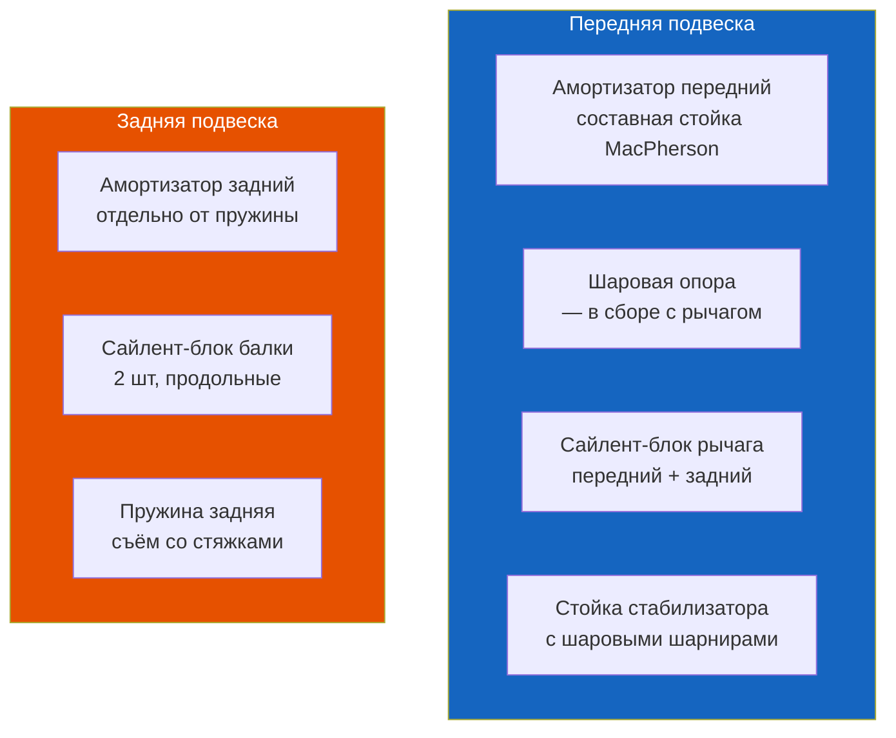

# 5.5 Замена амортизаторов, шаровой опоры и сайлент-блоков

Практические инструкции по замене элементов передней и задней подвески Renault Symbol.



## Передний амортизатор (стойка MacPherson)

### Признаки износа

| Симптом | Состояние |
|---------|-----------|
| Кузов раскачивается после неровности | Демпфирование ослабло |
| Течь масла по штоку | Разгерметизация — замена |
| Стук при проезде неровностей | Износ опорного подшипника / верхней опоры |
| Вибрация в руль | Амортизатор не гасит колебания |
| Неравномерный износ шины | Амортизатор не держит колесо |

**Ресурс передних амортизаторов:** 80 000–100 000 км. Замена — только парой на ось.

### Инструменты

| Инструмент | Назначение |
|-----------|------------|
| Ключ на 21 + шестигранник на 6 | Гайка штока амортизатора |
| Головки M8–M18 | Основной крепёж |
| Динамометрический ключ до 100 Н·м | Моменты |
| Стяжки пружин (2 шт) | Обязательно! |
| Съёмник шаровой | Для отжатия рычага |

### Порядок замены

1. Поднимите авто на опорах, снимите колесо
2. Открутите гайку стойки стабилизатора (ключ на 16)
3. Открутите 2 болта M10 крепления стойки к поворотному кулаку
4. Открутите 3 болта верхней опоры (под капотом, Torx T40)
5. Снимите стойку в сборе (амортизатор + пружина + опора)
6. **Работа со стяжками:**
   - Стяните пружину (3–4 витка равномерно)
   - Открутите гайку штока (ключ на 21 + шестигранник на 6)
   - Снимите верхнюю опору, пыльник, отбойник
7. **Сборка нового амортизатора:**
   - Перенесите пружину на новый амортизатор (торец пружины — в упор чашки)
   - Новая опора (рекомендуется), новый пыльник, новый отбойник
   - Затяните гайку штока: 45 Н·м
   - Снимите стяжки — пружина должна лечь правильно
8. Установка — в обратном порядке

```admonition danger
Стяжки пружин — обязательны! Сжатая пружина при срыве может нанести серьёзную травму. Не используйте кустарные стяжки из проволоки.
```

### Моменты затяжки

| Соединение | Н·м |
|------------|-----|
| Гайка штока амортизатора | 45 |
| Болты стойки к кулаку (M10) | 80 |
| Верхняя опора (3 гайки) | 25 |
| Стойка стабилизатора (гайка) | 21 |

## Задний амортизатор

### Особенности

Задняя подвеска Symbol — торсионная балка. Амортизаторы и пружины — раздельные. Амортизатор крепится:
- **Верх:** к кузову (в багажнике, за обшивкой)
- **Низ:** к балке (снизу)

### Порядок замены

1. Поднимите авто на опорах
2. В багажнике откройте доступ к верхней опоре (отогните обшивку)
3. Открутите гайку верхнего крепления (M10, 45 Н·м) — придерживайте шток
4. Снизу открутите нижний болт (M12, 80 Н·м)
5. Снимите амортизатор
6. Установите новый — в обратном порядке

```admonition tip
При замене задних амортизаторов — не нагружайте подвеску (поднято колесо). Затяжку нижнего болта выполняйте на земле (авто стоит на колёсах).
```

## Шаровая опора

На Renault Symbol шаровая опора — **неразборная**, меняется **в сборе с нижним рычагом**.

### Диагностика

- Люфт при покачивании колеса (вверх-вниз)
- Стук при повороте руля на месте
- Изношенный пыльник → замена рычага

### Замена рычага в сборе

1. Поднимите авто, снимите колесо
2. Открутите гайку шаровой (M12, 45 Н·м) — съёмником отожмите шаровую из кулака
3. Открутите 2 болта M10 крепления шаровой к кулаку (если есть)
4. Открутите передний сайлент-блок (M12, 80 Н·м, ключ на 18)
5. Открутите задний сайлент-блок (M12, 80 Н·м, ключ на 18)
6. Снимите рычаг
7. Установите новый рычаг
8. Затяните сайлент-блоки на земле (авто под нагрузкой!)
9. После замены — развал-схождение

## Сайлент-блоки переднего рычага

### Признаки износа

- Стук в подвеске при разгоне / торможении
- Люфт рычага при покачивании
- Неравномерный износ шин
- Увод авто при торможении

### Замена (прессом)

Если меняете только сайлент-блоки (рычаг остаётся старый):
1. Снимите рычаг (см. выше)
2. Выпрессуйте старые сайлент-блоки (пресс / съёмник)
3. Запрессуйте новые — **только через наружное кольцо**
4. **Важно:** ориентация сайлент-блоков — вырез совпадает с осью рычага
5. Смазка посадочного места — WD-40 (не масло!)
6. Установите рычаг

### Моменты затяжки

| Соединение | Н·м |
|------------|-----|
| Передний сайлент-блок (M12) | 80 |
| Задний сайлент-блок (M12) | 80 |
| Шаровая (гайка M12) | 45 |
| Болты шаровой к кулаку (M10) | 45 |

## Сайлент-блоки задней балки

### Признаки

- Стук сзади при проезде неровностей
- Люфт балки при покачивании
- Увод авто в поворотах

### Замена

```admonition warning
Сайлент-блоки задней балки — отдельная операция. Без специального съёмника замена невозможна. При сильном износе — замена балки в сборе.
```

1. Поднимите заднюю часть авто на опорах
2. Снимите колёса
3. Открутите нижнее крепление амортизаторов
4. Поддомкратьте балку
5. Открутите 2 болта сайлент-блоков (M14, 105 Н·м)
6. Выпрессуйте старые сайлент-блоки съёмником
7. Запрессуйте новые
8. Затяжка — на земле, при массе авто

## Стойки стабилизатора

"Самые расходные" элементы подвески Symbol. Ресурс — 30 000–50 000 км.

### Замена

1. Открутить гайку (M10, 21 Н·м) с одной стороны
2. Вынуть палец стойки из стабилизатора
3. Открутить вторую гайку
4. Снять стойку
5. Установить новую — затяжка 21 Н·м

## Регламент замены

| Элемент | Периодичность (пробег) |
|---------|----------------------|
| Передние амортизаторы | 80 000–100 000 км |
| Задние амортизаторы | 100 000 км |
| Стойки стабилизатора | 30 000–50 000 км |
| Шаровая опора (рычаг) | 60 000–80 000 км |
| Сайлент-блоки рычага | 60 000–80 000 км |
| Сайлент-блоки балки | 100 000 км |

## После замены

- После замены амортизаторов — развал-схождение
- После замены шаровой — развал-схождение
- После замены сайлент-блоков — развал-схождение
- После замены стоек стабилизатора — развал не требуется, но желателен
- Через 100 км — проверьте моменты затяжки (особенно колёсные гайки)
