# Инструменты и оборудование для ремонта

Список инструментов, необходимых для обслуживания и ремонта Renault Symbol своими руками. Разделение по уровням сложности.

```mermaid
flowchart LR
    subgraph Level1[🟦 Уровень 1<br/>Базовое ТО]
        L1_1[Ключи 10/13/17<br/>Torx T30/T40/T45/T55]
        L1_2[Торцевые головки<br/>набор 8–24 мм]
        L1_3[Динамометрический ключ<br/>20–200 Н·м]
        L1_4[Домкрат + подставки]
        L1_5[Мультиметр]
        L1_6[Воронка + тара для масла]
    end

    subgraph Level2[🟧 Уровень 2<br/>Средний ремонт]
        L2_1[Съёмник шаровых<br/>Съёмник сайлент-блоков]
        L2_2[Стяжки пружин<br/>Съёмник масл. фильтра]
        L2_3[ELM327 OBD2<br/>Renault Can Clip]
        L2_4[Нагрузочная вилка<br/>Компрессометр]
        L2_5[Компрессор + манометр]
    end

    subgraph Level3[🟥 Уровень 3<br/>Сложный ремонт]
        L3_1[Гидропресс 10–20 т]
        L3_2[Съёмник подшипников<br/>Съёмник маховика]
        L3_3[Газовая горелка]
        L3_4[Осциллограф]
        L3_5[Сканер Renault PIN]
    end

    Level1 --> Level2 --> Level3

    style Level1 fill:#1565c0,color:#fff
    style Level2 fill:#e65100,color:#fff
    style Level3 fill:#f44336,color:#fff
```



## Минимальный набор (базовое ТО)

| Инструмент | Размер | Для чего |
|-----------|--------|----------|
| Ключ накидной / рожковый | 10, 13, 17 мм | Замена АКБ, слив масла, снятие защиты |
| Головка Torx | T30, T40, T45, T55 | Крепление КПП, сайлент-блоки, суппорта |
| Торцевая головка | 10, 13, 15, 16, 17, 19, 24 мм | Колёса, шаровая, рейка |
| Вороток | 1/2″ × 300 мм | Ступичная гайка (200 Н·м) |
| Динамометрический ключ | 20–200 Н·м | **Обязателен** для ГБЦ, колёс, подвески |
| Плоскогубцы / пассатижи | — | Хомуты, фиксаторы |
| Отвёртка шлицевая | — | Поддевание фишек, клипс |
| Отвёртка крестовая | PH2 | Саморезы, внутренняя отделка |
| Молоток | 500 г | Выпрессовка |
| Домкрат | 2 т (бутылочный) | Минимум |
| Подставки под авто | 2 шт × 3 т | **Безопасность** (не используйте домкрат как опору!) |
| Воронка для масла | — | Замена масла |
| Тара для слива | 5 л | Отработанное масло |
| Мультиметр | Цифровой (Fluke, UNI-T, Mastech) | Диагностика АКБ, датчиков, цепей |

```admonition danger
Никогда не работайте под автомобилем, установленным только на домкрат. Используйте подставки (рамные Jack Stands). Домкрат — для подъёма, подставки — для фиксации.
```

## Набор для среднего ремонта

### Расширенный инструмент

| Инструмент | Для чего |
|-----------|----------|
| **Головка Torx T40 с удлинителем** | Шаровая опора, суппорт (много мест) |
| **Шестигранник 8 мм** | Контрольная пробка КПП |
| **Шестигранник 10 мм** | Сливная пробка КПП |
| **Съёмник шаровых пальцев** (типа «вилка») | Рулевые наконечники, шаровая |
| **Съёмник масляного фильтра** (ленточный или цепной) | Замена фильтра |
| **Стяжки пружин** (2 шт) | Замена стоек амортизаторов |
| **Съёмник стопорных колец** (прямой + угловой) | ШРУС, КПП |
| **Съёмник сайлент-блоков** (съёмник-пресс) | Замена рычагов |
| **Щуп для проверки масла** | — |
| **Нагрузочная вилка** | Диагностика АКБ |
| **Зарядное устройство** (автомат, 4–10 А) | Обслуживание АКБ |
| **Компрессор + манометр** | Подкачка шин |

### Диагностическое оборудование

| Устройство | Зачем | Цена (₽) |
|-----------|-------|----------|
| **ELM327 WiFi/BT** (CANtieCAR v1.5+) | Чтение ошибок, параметры | 800–2 000 |
| **Renault Can Clip** (оригинал или клон) | Полный доступ ко всем ЭБУ | 5 000–15 000 |
| **Манометр давления масла** (механический, 0–10 бар) | Проверка смазки двигателя | 1 500–3 000 |
| **Компрессометр** (бензиновый, резьба M14×1,25) | Измерение компрессии в цилиндрах | 1 000–2 500 |
| **Тестер утечки антифриза** (CO-тестер) | Диагностика прокладки ГБЦ | 500–1 000 |
| **Осциллограф USB** (DSO138 или Hantek) | Диагностика ДПКВ, ДПРВ, лямбды | 2 000–8 000 |

## Набор для сложного ремонта

| Инструмент | Для чего | Примерная цена |
|-----------|----------|---------------|
| **Пресс гидравлический** (10–20 т) | Запрессовка сайлент-блоков, ступичных подшипников | 8 000–25 000 |
| **Съёмник-пресс сайлент-блоков** | Renault Mot. 1369 или аналог | 3 000–6 000 |
| **Динамометрический ключ 3/8″** (10–100 Н·м) | Малые моменты (ГРМ, датчики, свечи) | 3 000–6 000 |
| **Съёмник маховика / шкива коленвала** | Для замены ГРМ | 500–1 500 |
| **Фиксатор маховика** | Отворачивание гайки ступицы | 300–800 |
| **Съёмник подшипников** (2- или 3-лапчатый) | Ступичные подшипники | 1 000–3 000 |
| **Инструмент для центровки сцепления** (оправка) | Установка ведомого диска | 300–500 |
| **Горелка газовая** (турбо-зажигалка) | Отогрев прикипевших соединений | 500–1 500 |
| **Сканер ELM327 с поддержкой Renault PIN** | Chiptuning, адаптация АКПП | 3 000–5 000 |

## Расходные материалы (всегда под рукой)

| Материал | Для чего |
|----------|----------|
| **WD-40** (или аналог) | Откручивание закисших болтов |
| **Медная смазка** | Резьба свечей, направляющие суппорта |
| **Литиевая смазка** | Петли дверей, замки |
| **Силиконовая смазка** | Уплотнители дверей, пыльники |
| **Смазка MoS₂ (дисульфид молибдена)** | ШРУСы (Molykote G-2000) |
| **Фиксатор резьбы Loctite 243 (средний)** | Ответственные резьбовые соединения |
| **Герметик Loctite 518** | Прокладка клапанной крышки, поддона |
| **Ветошь** | Протирка, защита |
| **Перчатки нитриловые** | Защита рук |
| **Проволока / хомуты нейлоновые** | Фиксация проводов |
| **Изолента ПВХ** | Временная изоляция |

## Рекомендуемые моменты затяжки (значения едины для Symbol)

| Узел | Н·м | Инструмент |
|------|-----|-----------|
| Колёсные болты | 90–105 | Головка 17, моментный ключ |
| Ступичная гайка | 200 | Головка 24, вороток + труба |
| Свечи зажигания | 25–30 | Свечная головка 16 |
| Корзина сцепления | 20 | Torx T55 |
| КПП к блоку | 50 | Torx T55 |
| Сайлент-блок рычага | 80 | Torx T55, на гружёном авто |
| Шаровая опора | 45 | Torx T40 |

## Полезные мелочи

| Предмет | Зачем |
|---------|-------|
| **Фонарик налобный** | Работа в тёмных местах (под панелью, под авто) |
| **Магнит гибкий** | Извлечение упавших болтов |
| **Зеркало на телескопической ручке** | Осмотр задних датчиков, свечей |
| **Шприц с трубкой** | Заливка масла в КПП |
| **Маркер-краска** | Метки перед разбором (положение руля, метки ГРМ) |
| **Смартфон/планшет** | Доступ к руководству (наше!) прямо в гараже |
| **Перчатки + защитные очки** | Безопасность |
| **Огнетушитель** | На всякий случай |

```admonition tip
Лучшая инвестиция для домашнего ремонта — **домкрат с подставками** и **динамометрический ключ**. Не экономьте на безопасности: подставки за 1 500–2 000 ₽ могут спасти жизнь. Гайка ступицы, затянутая «от руки» (без ключа), может открутиться на ходу.
```
