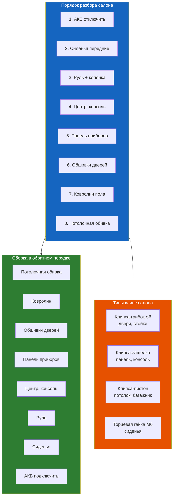

# 9.2 Салон и внутренняя отделка

Демонтаж и замена элементов салона Renault Symbol.

## Панель приборов

### Снятие

1. Отсоединить клемму АКБ
2. Снять руль (болт M16, головка на 24) — **предварительно выставить колёса прямо и пометить положение руля меткой**
3. Снять декоративные накладки рулевой колонки (4 винта снизу)
4. Отщёлкнуть центральную консоль:
   - Вокруг магнитолы — 4 клипсы
   - Вокруг блока отопления — 2 винта снизу
5. Вывернуть **6 болтов M8** панели:
   - 2 у ветрового стекла (под заглушками)
   - 1 в бардачке (слева)
   - 1 у рулевой колонки
   - 2 у центральной консоли
6. Отсоединить колодки жгутов (прикуриватель, магнитола, блок отопления, подушка пассажира)
7. Снять панель через водительский или пассажирский проём

> ⚠ Подушка безопасности пассажира закреплена к панели 4 болтами. Отсоединять колодку подушки только при отключённой АКБ.

## Штатная магнитола

1. Вставить тонкие пластиковые ключи (4 шт) в щели по углам магнитолы
2. Нажать до щелчка — фиксаторы отойдут
3. Вытянуть магнитолу на себя
4. Отсоединить ISO-колодку и антенный разъём (Fakra, ранние — DIN)

## Снятие обшивки двери (салонный доступ к механизмам)

1. Открутить **2 винта T20** под накладкой подлокотника
2. Поддеть и снять накладку замка двери
3. Вывернуть **1 винт T20** за ручкой
4. Отщёлкнуть клипсы по периметру (10 шт) пластиковым съёмником
5. Приподнять обшивку вверх и снять с подоконной кромки
6. Отсоединить колодку стеклоподъёмника и динамик

## Переднее сиденье

### Снятие водительского:

1. Сдвинуть сиденье назад — выкрутить **2 болта M10** передних направляющих (головка на 13)
2. Сдвинуть сиденье вперёд — выкрутить **2 болта M10** задних направляющих
3. Вывернуть сиденье — приподнять, наклонить, вытащить через проём
4. Под пассажирским сиденьем может быть колодка датчика непристёгнутого ремня — отсоединить

> ⚠ Сиденье тяжёлое (~20 кг), работать вдвоём. Не повредить торец направляющих — может высыпаться обойма шариков.

## Заднее сиденье

1. **Подушка** — потянуть передний край вверх (2 защёлки в основании)
2. Наклонить подушку вперёд и вытащить из пазов
3. **Спинка** — открутить **2 болта M8** в нижней части (по краям)
4. Отщёлкнуть 2 защёлки сверху (за спинкой, со стороны багажника)
5. Снять спинку

## Ковролин салона (пол)

1. Снять передние сиденья и обшивки порогов (клипсы)
2. Снять центральную консоль (6 винтов T20, по периметру корпуса)
3. Отщёлкнуть накладки на стойках А (снять пластик у ветрового стекла)
4. Открутить винты крепления ковра под порогами (4 с каждой стороны)
5. Вытащить ковролин через пассажирский проём

> ⚠ Под ковром — блок управления отопителем и жгут проводки. Не повредить их при вытаскивании.

## Обивка потолка (головная обивка)

1. Снять:
   - Противосолнечные козырьки (2 винта под заглушками + колодка зеркальца)
   - Плафон освещения салона (поддеть отвёрткой, отщёлкнуть)
   - Ручки поручней (3 винта под накладкой)
   - Накладки стоек A, B, C (клипсы)
2. Отщёлкнуть уплотнители дверей по всему периметру
3. Вытащить обивку из багажника (предварительно сложить заднее сиденье)

> ⚠ Обивка потолка ломкая от времени — при снятии без замены грозит изломом основы (картон).

## Противосолнечный козырёк

1. Снять декоративную накладку со стороны зеркальца
2. Выкрутить **2 винта T20** (один может быть скрыт под заглушкой)
3. Отщёлкнуть клипсу со стороны крепления к крыше
4. Потянуть козырёк вдоль стекла

## Плафон освещения салона

1. Поддеть прозрачную крышку тонкой отвёрткой
2. Вытащить лампу W5W (цоколь 12V 5W)
3. Для снятия плафона: отщёлкнуть весь корпус (2 пружинных фиксатора)
4. Крепление к потолку — 2 винта Т10

## Таблица крепежа салона

| Элемент | Тип крепежа | Особенности |
|---------|-------------|-------------|
| Панель приборов | Болт M8 × 6 + клипсы | Металлические закладные гайки |
| Обшивка двери | Клипса (10) + винт T20 (3) | Клипсы одноразовые |
| Сиденье переднее | Болт M10 × 4 | 40 Н·м |
| Сиденье заднее | Защёлка (2) + болт M8 (2) | 25 Н·м |
| Ремень безопасности | Болт M10 × 1 | 40 Н·м |
| Консоль центральная | Винт T20 × 6 | Корпус к тоннелю |
| Козырёк солнцезащитный | Винт T20 × 2 | Под заглушками |
| Плафон потолка | Винт T10 × 2 | Пружинные защёлки |

## Снятие бардачка (перчаточного ящика)

1. Откройте бардачок полностью
2. Отожмите ограничитель с левой стороны (пластиковый рычажок)
3. Опустите бардачок до упора вниз
4. Сожмите боковые стенки бардачка внутрь и потяните на себя
5. Отсоедините колодку подсветки (если есть)
6. Установка — в обратном порядке, защёлкнуть до щелчка

## Клипсы — как не сломать

### Распространённые типы клипс Symbol

| Тип | Внешний вид | Где стоит | Съёмник | Замена |
|-----|-------------|-----------|---------|--------|
| **A** | Белая пластиковая, грибок ∅6 мм, шток 25 мм | Обшивки дверей, стойки A/B/C | Пластиковый съёмник с вилкой на конце | 10–30 ₽ |
| **B** | Чёрная, грибок ∅8 мм, шток 30 мм + резиновый уплотнитель | Обшивки багажника | Универсальный съёмник | 20–40 ₽ |
| **C** | Жёлтая/белая, пистон с разрезом | Потолок, консоль | Поддеть отвёрткой с плоским жалом | 10–20 ₽ |
| **D** | Металлическая защёлка-скоба | Ковролин пола (по краям) | Поддеть плоской отвёрткой | 30–50 ₽ |

### Как снять клипсу без поломки

1. Используйте пластиковый съёмник (не металлическую отвёртку!)
2. Вставьте съёмник в щель между деталью и кузовом
3. Подведите вилку съёмника под шляпку клипсы
4. Плавным движением вытяните — если клипса сопротивляется, не дёргайте
5. Для дверных клипс: сначала потяните обшивку на себя за нижний край, затем по бокам

> **Запас:** при работе с обшивкой дверей имейте 10–15 запасных клипс (старые ломаются в 80% случаев). Продаются в любом автомагазине, набор 50 шт — ~200–300 ₽.

## Типичные скрипы салона и их устранение

| Место | Тип звука | Причина | Решение |
|-------|-----------|---------|---------|
| **Панель приборов** | Сверчок, скрип пластика | Трение пластика о пластик | Антискрип (Битопласт) в стыки |
| **Ручка КПП** | Дребезг | Ослабла накладка | Затяжка, подложить войлок |
| **Замок ремня безопасности** | Стук | Удар пластика о стойку | Самоклеящийся войлок |
| **Третья полка багажника** | Дребезг на кочках | Ослабла на защёлках | Войлок на опорные точки |
| **Резиновые уплотнители** | Свист на скорости | Износ / отставание | Замена или смазка силиконом |
| **Сиденье водителя** | Скрежет при повороте | Трение направляющих | Смазка втулок |
| **Плафон потолка** | Дребезг | Ослабла защёлка | Подложить кусочек картона |

## Регулировка ручника (стояночного тормоза)

Хотя ручник относится к тормозам, доступ к нему — через салон:

1. Снимите центральную консоль (6 винтов T20)
2. С левой стороны рычага — регулировочная гайка на 10 мм
3. Затяните гайку так, чтобы ручник фиксировался на **5–7 щелчках**
4. Проверьте: на 5 щелчках колёса не должны вращаться
5. Затяжка: 4–5 оборотов гайки обычно достаточно

## Особенности по поколениям

| Узел | Symbol I (1999–2002) | Symbol II (2002–2008) | Symbol III (2008–2014) |
|------|---------------------|----------------------|----------------------|
| Панель приборов | Щиток с 2 большими колодцами | Щиток с плавными линиями | Щиток с хромированными кольцами |
| Магнитола | 1 DIN, разъём DIN | 1 DIN, разъём ISO | 1 DIN, разъём ISO + CAN |
| Руль | 3-спицевый, без кнопок | 3-спицевый, подушка | 4-спицевый (опц. кнопки) |
| Бардачок | Простой, без подсветки | С подсветкой | С подсветкой + охлаждением |
| Центр. консоль | Маленькая, без бокса | Стандартная, с боксом | Высокая, с боксом + AUX |
| Потолочная обивка | Серая ворсовая | Серая ворсовая | Бежевая / серая |
