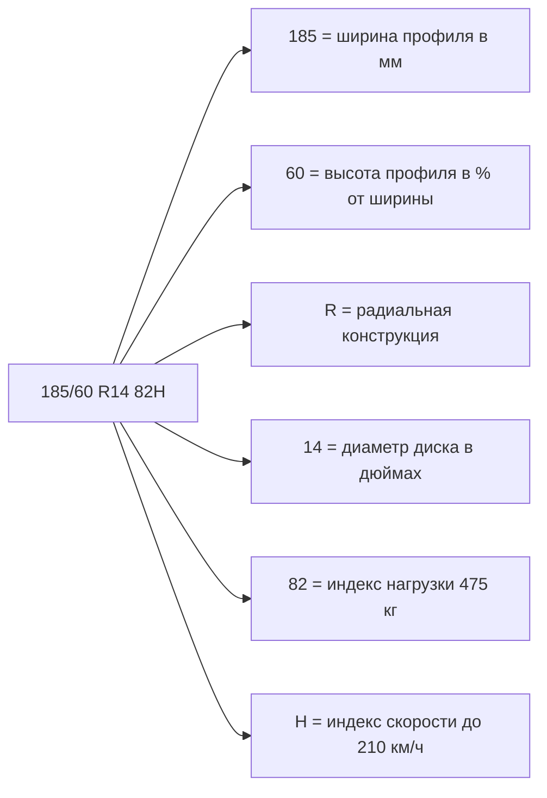
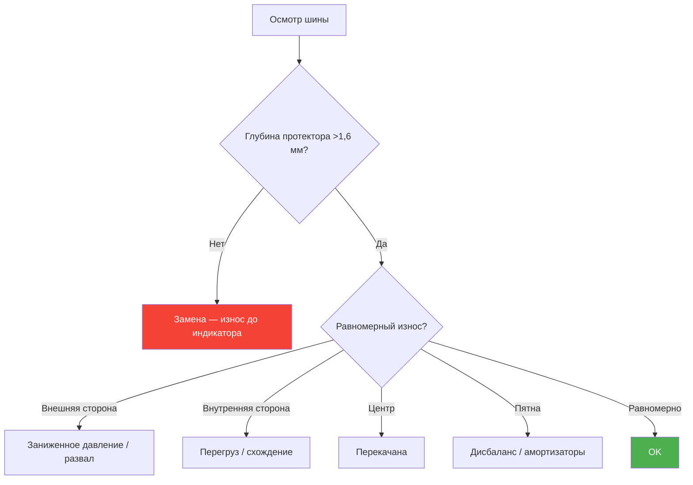

# 9.3 Колёса и шины

Рекомендуемые размеры шин, дисков и давление в шинах для Renault Symbol всех поколений.

## Заводские размеры шин

| Двигатель | Поколение | Типоразмер шины | Диски (дюймы) | Вылет ET | PCD |
|-----------|-----------|-----------------|---------------|----------|-----|
| **K7J 1.4** | Symbol I (1999–2002) | **175/70 R13** | 5,5J×13 | 35 | 4×100 |
| **K7J 1.4** | Symbol II (2002–2008) | **175/65 R14** | 5,5J×14 | 35 | 4×100 |
| **K7M 1.6** | Symbol I–II | **175/65 R14** | 5,5J×14 | 35 | 4×100 |
| **K4J 1.4 16V** | Symbol II–III | **185/60 R14** | 6J×14 | 38 | 4×100 |
| **K4M 1.6 16V** | Symbol II–III | **185/60 R14** / **185/55 R15** | 6J×14 / 6J×15 | 38 | 4×100 |
| **K9K 1.5 dCi** | Symbol II–III | **185/60 R14** | 6J×14 | 38 | 4×100 |

> **Заводские диски:** Стальные штампованные 5,5J×14 ET35 (символ I) или 6J×14 ET38 (символ II/III). Легкосплавные — опционально, те же размеры.

## Допустимые размеры (замена без доработок)

| Ширина | Профиль | Диаметр | Отклонение спидометра |
|--------|---------|---------|----------------------|
| 175 | 70 | R13 | 0% (база) |
| 175 | 65 | R14 | +0,5% (стандарт) |
| 185 | 60 | R14 | +1,0% |
| 185 | 55 | R15 | +0,3% |
| 195 | 55 | R15 | +2,0% (допустимо) |
| 195 | 50 | R16 | +3,0% (возможны задевания) |

```admonition warning
Установка дисков с вылетом ET < 35 приводит к трению шины о крылья.
Установка ET > 40 — колесо «утоплено», цепляет за стойку амортизатора.
Для дисков R16 необходимо убедиться, что не задевает арку (проверка при полном вывороте).
```

## Давление в шинах

### Стандартное давление (рекомендация завода)

| Размер шин | Передние колёса | Задние колёса |
|------------|-----------------|---------------|
| 175/70 R13 | **2,0 бар** (29 psi) | **2,0 бар** (29 psi) |
| 175/65 R14 | **2,0 бар** (29 psi) | **2,0 бар** (29 psi) |
| 185/60 R14 | **2,1 бар** (30 psi) | **2,1 бар** (30 psi) |
| 185/55 R15 | **2,2 бар** (32 psi) | **2,2 бар** (32 psi) |

### С полной нагрузкой (+0,2 бар)

| Размер | Перед | Зад |
|--------|-------|-----|
| 175/65 R14 | 2,2 | 2,5 |
| 185/60 R14 | 2,3 | 2,6 |
| 185/55 R15 | 2,4 | 2,6 |

```admonition info
Проверяйте давление **на холодных шинах** (до начала движения).
Разница в давлении между колёсами одной оси — не более 0,05 бар.
Запасное колесо — 2,5 бар (если докатка).
```

## Параметры колёсных болтов

| Параметр | Значение |
|----------|----------|
| Количество болтов | 4 |
| PCD (разболтовка) | **4×100** |
| Резьба болта | M12 × 1,25 |
| Длина болта (стальной диск) | 25 мм |
| Длина болта (литой диск) | 28–30 мм |
| Момент затяжки | **90–100 Н·м** |
| Ключ | Баллонный / торкс T50 |

## Сезонность шин

| Тип | Размер | Особенности |
|-----|--------|-------------|
| **Летние** | Рекомендуемый заводской | Шины H/T или UHP для города |
| **Зимние (шипованные)** | 175/65 R14 — 185/60 R14 | Шип не выступает за габарит крыла |
| **Зимние (нешипованные / "липучка")** | 175/65 R14 — 185/60 R14 | Лучше для города, без абразива на асфальте |
| **Всесезонные** | Не рекомендуются | Для Symbol неэффективны ни зимой, ни летом |

## Маркировка шин



### Индексы скорости

| Индекс | Макс. скорость | Установка на Symbol |
|--------|---------------|---------------------|
| **T** | 190 км/ч | Допустимо (зимние) |
| **H** | 210 км/ч | **Рекомендовано** |
| **V** | 240 км/ч | Опционально |

## Типовые вопросы

### Можно ли поставить диски R15 от Clio / Megane?
Да, если PCD 4×100 и ET 35–38. Диски R15 от Clio II (1998–2006) / Megane I (1999–2003) подходят. Необходимо проверить, что не задевают за суппорт (на 16V диски с вылетом ET35 могут задевать).

### Можно ли поставить R16?
Технически да, но только 195/50 R16 или 205/45 R16. Рекомендуется примерка — на Symbol III колёсные арки меньше. Возможно задевание за подкрылки и арки сзади.

### Какое давление для экономии топлива?
+0,2 бар к рекомендуемому (но не более 2,6 бар спереди). Ухудшается сцепление и комфорт, растёт износ центральной части протектора.

### Нужна ли балансировка при каждой смене резины?
**Обязательно.** Дисбаланс >10 г на скорости 80 км/ч даёт заметное биение руля и вибрацию.

## Проверка износа шин



## Рекомендуемые бренды шин для Symbol

| Бренд | Модель (лето) | Модель (зима) | Комментарий |
|-------|---------------|---------------|-------------|
| Michelin | Energy XM2 | X-Ice North | Дорого, хорошая управляемость |
| Continental | ContiPremiumContact 5 | WinterContact TS 860 | Сбалансированы |
| Nokian | Hakka Green 3 | Hakkapeliitta 9 (шип) / Hakka R3 | Отлично для зимы |
| Bridgestone | Turanza T005 | Blizzak LM005 | Уверенное поведение на мокрой |
| Goodyear | EfficientGrip Performance | UltraGrip Performance+ | Хорошее соотношение цена/качество |
| Hankook | Ventus Prime3 | Winter i*cept RS2 | Бюджетно-качественные |
| Viatti | Strada Asimmetrico | V-526 Nordico | Бюджет, адекватно для Symbol |

```admonition tip
Не покупайте шины «восстановленные» или с глубиной протектора менее 4 мм (б/у).
Экономия 2000–3000 ₽ на шинах — причина аварии на мокрой дороге.
```
