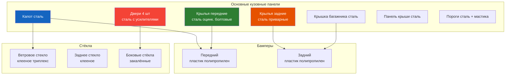

# Кузов

## Общие сведения

Renault Symbol (с 1999 по 2014 г.в.) — переднеприводный седан на платформе B0 с несущим цельнометаллическим кузовом. Кузов — оцинкованный (двусторонняя оцинковка панелей), с антикоррозионной обработкой скрытых полостей и днища. Гарантия от сквозной коррозии — 6 лет (заводская).

## Основные размеры кузова

| Параметр | Значение |
|----------|----------|
| Колёсная база | 2472 мм |
| Длина | 4261 мм |
| Ширина | 1635 мм |
| Высота | 1439 мм |
| Колея передняя / задняя | 1406 / 1420 мм |
| Дорожный просвет | 155 мм |
| Снаряжённая масса | 935–1105 кг |

## Панели и элементы кузова

| Панель | Материал | Тип крепления |
|--------|----------|---------------|
| Капот | Сталь, оцинкованная | Петли с газовыми упорами, замок с тросовым приводом |
| Передние крылья | Сталь, оцинкованная | Болтовое (M8, 20 Н·м) — замена без сварки |
| Задние крылья | Сталь | Приварные, неотъёмные |
| Двери | Сталь, с усилителями бокового удара | Петли вварные, 2 шт. на дверь, болты M10 (25 Н·м) |
| Крышка багажника | Сталь | Петли с торсионами, замок с электрозамком |
| Передний бампер | Пластик (полипропилен) | 4 болта M8 + 6 клипс |
| Задний бампер | Пластик (полипропилен) | 4 болта M8 + 6 клипс |
| Панель крыши | Сталь | Приварная (точечная сварка) |
| Пороги | Сталь + мастика | Приварные, антикоррозионное покрытие |

## Антикоррозионная обработка

С завода применяется:

- **Оцинковка** — двери, капот, крышка багажника, передние крылья (до 45 г/м² цинка)
- **Мастика** — пороги, днище, колёсные арки
- **Консервант полостей** — лонжероны, усилители порогов, стойки
- **Пластиковые антигравийные накладки** — на нижней части дверей и задних крыльев

### Рекомендации по доработке защиты

- Обрабатывать скрытые полости **Dinitrol ML** или **Tectyl Body** каждые 2–3 года
- Наносить антигравий на пороги и арки при первых сколах ЛКП
- Чистить дренажные отверстия дверей (по 3–4 шт. снизу каждой двери) — засорение ведёт к коррозии изнутри

## Типовые проблемы кузова Symbol

- **Коррозия задних арок колёс** — начинается со стороны багажника в месте стыка арки и боковины
- **Вздутие ЛКП на передних крыльях** — в районе фар (зона сколов)
- **Заклинивание троса замка капота** — при отсутствии смазки
- **Скрип петель дверей** — отсутствие смазки в шарнирах
- **Запотевание задних фонарей** — разгерметизация корпуса
- **Отказ электрозамка багажника** — обрыв провода в гофре

## Моменты затяжки резьбовых соединений

| Соединение | Момент, Н·м |
|------------|-------------|
| Болт крепления переднего крыла к лонжерону | 20 ± 2 |
| Болт петли двери | 25 ± 3 |
| Болт капота к петле | 22 ± 2 |
| Болт крепления сиденья к полу | 40 ± 4 |
| Гайка стойки стабилизатора | 21 ± 3 |
| Болт направляющей суппорта | 26 ± 2 |
