# Регламент технического обслуживания

График планового ТО Renault Symbol для всех двигателей. Соблюдение регламента — основа долговечности автомобиля.

```mermaid
flowchart TD
    subgraph KM0[0 км — Подготовка к эксплуатации]
        A0[Проверка уровней всех жидкостей]
        A1[Регулировка давления в шинах]
        A2[Проверка работы световых приборов]
    end

    subgraph KM15[15 000 км — ТО-1]
        B1[Моторное масло + фильтр]
        B2[Проверка ремня ГРМ]
        B3[Свечи зажигания 🔄 каждые 30 000]
        B4[Воздушный фильтр]
        B5[Тормозная система + колодки]
    end

    subgraph KM30[30 000 км — ТО-2]
        C1[Всё из ТО-1]
        C2[Свечи зажигания<br/>замена]
        C3[Салонный фильтр]
        C4[Проверка ШРУСов]
        C5[Смазка замков + петель]
    end

    subgraph KM60[60 000 км — ТО-3]
        D1[Всё из ТО-2]
        D2[Ремень ГРМ + ролики + помпа]
        D3[Антифриз]
        D4[Масло в КПП]
        D5[Тормозная жидкость 🔄 40 000]
        D6[Топливный фильтр<br/>бензин: 120 000<br/>дизель: 60 000]
    end

    subgraph KM120[120 000 км — ТО-4]
        E1[Всё из ТО-3]
        E2[Ремень ГРМ повторно<br/>+ помпа]
        E3[Сцепление 🔄 при износе]
        E4[Передние амортизаторы]
        E5[Сайлент-блоки рычагов]
        E6[Рулевые наконечники]
    end

    KM0 --> KM15 --> KM30 --> KM60 --> KM120

    style KM0 fill:#1565c0,color:#fff
    style KM15 fill:#2e7d32,color:#fff
    style KM30 fill:#e65100,color:#fff
    style KM60 fill:#f44336,color:#fff
    style KM120 fill:#5d4037,color:#fff
```



## Полная таблица ТО

| Интервал | Операция | Детали | Примечание |
|----------|----------|--------|------------|
| **Каждую неделю / перед поездкой** |
| | Проверка уровня масла | Щуп, на холодную | Норма между MIN и MAX |
| | Проверка уровня антифриза | Расширительный бачок | При холодном двигателе |
| | Давление в шинах | 2.0–2.5 бар | См. табличку на двери |
| | Световые приборы | Все лампы | + поворотники |
| **Каждые 10 000 км** |
| ✅ | Моторное масло + фильтр (дизель K9K) | 4,5 л 5W-40 C3 | ACEA C3 обязательно |
| **Каждые 15 000 км или 1 год** |
| ✅ | Моторное масло + фильтр (бензин) | 3,3–4,8 л 10W-40 / 5W-40 | API SL/CF, ACEA A3/B3 |
| | Проверка натяжения ремня ГРМ | Визуально + на ощупь | Трещины, износ |
| | Проверка тормозных колодок | Перед + зад | Износ < 1,5 мм |
| | Проверка ШРУСов | Пыльники, люфт | При повреждении — замена |
| | Проверка выхлопной системы | Глушитель, гофра | Свищи, коррозия |
| **Каждые 30 000 км или 2 года** |
| ✅ | Свечи зажигания | K7J/K7M: 4 шт; K4J/K4M: 4 шт | Зазор 0,9–1,1 мм |
| ✅ | Салонный фильтр | Под бардачком | Пыль, запах |
| | Замена воздушного фильтра | В корпусе над двигателем | |
| | Проверка рулевых наконечников | Люфт, пыльники | |
| | Смазка замков и петель | Литиевая смазка | |
| **Каждые 40 000 км или 2 года** |
| ✅ | Тормозная жидкость | DOT 4, 0,6–0,8 л | Замена, не долив! |
| | Проверка амортизаторов | Перед + зад | Подтёки, отбой |
| | Проверка сайлент-блоков | Рычаги передние | Трещины, разрыв |
| **Каждые 60 000 км или 4 года** |
| ✅ | **Ремень ГРМ + натяжной ролик + помпа** | Все бензиновые | Критически важно! |
| ✅ | Антифриз | 5,5–6,2 л OAT | Renault D / D+ |
| ✅ | Масло в МКПП | 75W-80 GL-4 | 1,9–2,5 л |
| ✅ | Топливный фильтр (дизель K9K) | | |
| | Проверка ремня генератора | Натяжение, трещины | |
| | Проверка тормозных дисков | Биение, толщина | |
| | Проверка работы ABS | Тест-драйв | Лампа ABS гаснет |
| **Каждые 90 000 км или 6 лет** |
| ✅ | Ремень ГРМ (дизель K9K) | Комплектом | |
| **Каждые 120 000 км** |
| ✅ | Ремень ГРМ (повторно) | + Помпа, ролики | |
| ✅ | Топливный фильтр (бензин) | | |
| | Передние амортизаторы | В сборе с опорами | |
| | Сайлент-блоки передних рычагов | | Обычно к этому пробегу |
| | Замена рулевых наконечников | | |
| | Проверка состояния глушителя | | |
| **Каждые 150 000–200 000 км** |
| | **Замена сцепления** | Комплект: диск+корзина+подшипник | При износе — раньше |
| | Задние амортизаторы | | |
| | Ступичные подшипники | | При гуле — раньше |
| **Каждые 250 000+ км** |
| | Капитальный ремонт двигателя | Поршневая + кольца + вкладыши | По состоянию |
| | Замена турбины (дизель K9K) | | |
| | Замена ТНВД (дизель) | | |

```admonition warning
✅ — операции, которые **нельзя пропускать**. Пропуск хотя бы одной из них ведёт к дорогостоящему ремонту (обрыв ГРМ, перегрев, заклинивание двигателя).
```

## Условные обозначения

- **Бензин:** K7J (1.4 8V), K7M (1.6 8V), K4J (1.4 16V), K4M (1.6 16V)
- **Дизель:** K9K (1.5 dCi)
- **Интервал** указан в км или годах — что наступит раньше

## Особенности по типу двигателя

### Дизель K9K — важные отличия

| Операция | Интервал | Особенность |
|----------|----------|-------------|
| Моторное масло | **10 000 км** | Только ACEA C3 Low SAPS |
| Ремень ГРМ | 90 000 км / 6 лет | Отличается от бензина! |
| Топливный фильтр | 60 000 км | Обязательно с заменой уплотнений |
| EGR клапан | Проверка каждые 30 000 км | Чистка при закоксовке |
| Турбина | Проверка каждые 60 000 км | Люфт, масло |

### 16-клапанные K4J/K4M — важные отличия

- Масла требуется больше (4,8 л против 3,3 л у 8V)
- Масло: только 5W-40 (не 10W-40)
- Свечи: иридиевые (ресурс 60 000 км) или обычные (30 000 км)

```admonition tip
Распечатайте эту страницу и отмечайте выполненные пункты. Или используйте приложение-напоминалку на телефоне. Регулярное ТО обходится в 5–15 тыс. руб. в год, ремонт после пропуска — от 50 тыс. руб.
```
