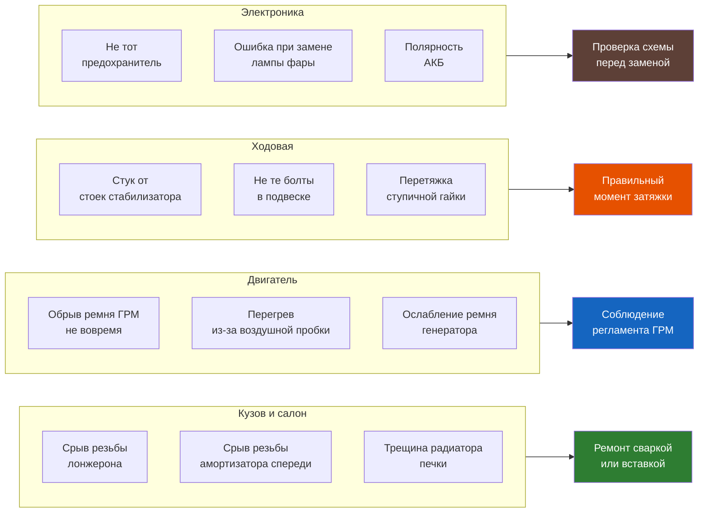

# Типичные ошибки при ремонте Renault Symbol

Собраны наиболее частые ошибки, которые допускают начинающие (и не только) мастера при обслуживании и ремонте Symbol. Основано на опыте владельцев и форумов.

<div id="mistakes-filter" style="margin:1em 0">
  <input type="text" id="mistakes-query" placeholder="🔍 Поиск по ошибке..." style="width:100%;padding:10px 14px;font-size:15px;border:2px solid #ff6b00;border-radius:8px;outline:none;box-sizing:border-box;margin-bottom:0.5em">
  <div style="display:flex;flex-wrap:wrap;gap:0.3em" id="mistakes-tabs"></div>
  <div id="mistakes-stats" style="font-size:0.85em;color:#888;margin-top:0.3em;padding:0 0.3em"></div>
</div>

<script>
(function() {
  var input = document.getElementById('mistakes-query');
  var tabs = document.getElementById('mistakes-tabs');
  var stats = document.getElementById('mistakes-stats');
  var container = document.querySelector('.content');
  var sections = [];

  // Build section list from h2 elements
  var headers = container.querySelectorAll('h2');
  var activeSection = 'all';

  headers.forEach(function(h2) {
    var section = { name: h2.textContent.trim(), el: h2, items: [] };
    var el = h2.nextElementSibling;
    while (el && el.tagName !== 'H2') {
      if (el.tagName === 'H3' || el.tagName === 'TABLE' || el.tagName === 'P') {
        section.items.push(el);
      }
      el = el.nextElementSibling;
    }
    sections.push(section);
  });

  // Build tabs
  function renderTabs() {
    var html = '<button class="mistake-tab" data-section="all" style="padding:0.3em 0.7em;border:1px solid #ff6b00;border-radius:4px;background:#ff6b00;color:#fff;cursor:pointer;font-size:0.85em">Все разделы</button>';
    sections.forEach(function(s) {
      html += '<button class="mistake-tab" data-section="' + s.name + '" style="padding:0.3em 0.7em;border:1px solid #ddd;border-radius:4px;background:#fff;cursor:pointer;font-size:0.85em">' + s.name + '</button>';
    });
    tabs.innerHTML = html;

    tabs.querySelectorAll('.mistake-tab').forEach(function(btn) {
      btn.addEventListener('click', function() {
        activeSection = this.dataset.section;
        tabs.querySelectorAll('.mistake-tab').forEach(function(b) {
          b.style.background = b.dataset.section === activeSection ? '#ff6b00' : '#fff';
          b.style.color = b.dataset.section === activeSection ? '#fff' : '#333';
          b.style.borderColor = b.dataset.section === activeSection ? '#ff6b00' : '#ddd';
        });
        filter();
      });
    });
  }

  function filter() {
    var q = input.value.trim().toLowerCase();
    var totalItems = 0;
    var visibleItems = 0;

    sections.forEach(function(section) {
      var sectionVisible = (activeSection === 'all' || activeSection === section.name);
      section.el.style.display = sectionVisible ? '' : 'none';
      var hasVisibleItem = false;

      section.items.forEach(function(item) {
        totalItems++;
        var text = item.textContent.toLowerCase();
        var match = !q || text.indexOf(q) !== -1;
        var show = sectionVisible && match;
        item.style.display = show ? '' : 'none';
        if (show) hasVisibleItem = true;
        if (show) visibleItems++;
      });

      // Show h2 only if it has at least one visible item
      if (sectionVisible) {
        var next = section.el.nextElementSibling;
        var hasAnyVisible = false;
        while (next && next.tagName !== 'H2') {
          if (next.style.display !== 'none') { hasAnyVisible = true; break; }
          next = next.nextElementSibling;
        }
        section.el.style.display = hasAnyVisible ? '' : 'none';
      }
    });

    if (!q && activeSection === 'all') {
      stats.textContent = 'Всего: ' + totalItems + ' ошибок';
    } else {
      stats.textContent = 'Показано: ' + visibleItems + ' из ' + totalItems;
    }
  }

  input.addEventListener('input', filter);
  input.addEventListener('keydown', function(e) { if (e.key === 'Escape') { input.value = ''; filter(); input.blur(); } });

  renderTabs();
  filter();
})();
</script>



## Двигатель и системы

### 1. Обрыв ремня ГРМ из-за просрочки

**Ошибка:** Владельцы откладывают замену ремня ГРМ на 70–80 тыс. км (вместо 60 тыс.) и получают обрыв с «встречей клапанов с поршнями».

**Последствия:** Капитальный ремонт или замена двигателя (60–120 тыс. руб.).

**Как правильно:**
- Замена ГРМ **строго каждые 60 000 км или 4 года**
- Менять ремень **вместе с натяжным роликом и помпой** (экономия на помпе приводит к повторной работе)
- После замены проверять натяжение через 1 000 км

### 2. Воздушная пробка в системе охлаждения

**Ошибка:** После замены антифриза не удалён воздух из системы → двигатель перегревается, термостат не открывается, печка дует холодным.

**Последствия:** Перегрев → деформация ГБЦ → пробитая прокладка → масло в антифризе.

**Как правильно:**
- При заливке поднять переднюю часть автомобиля
- Заливать антифриз медленно, открыв расширительный бачок
- Запустить двигатель на 10 минут с открытой пробкой радиатора
- Поднять обороты до 2 500–3 000 — пузыри выйдут
- Добавить антифриз после остывания
- Прогреть до срабатывания вентилятора радиатора

### 3. Перетяжка свечей зажигания

**Ошибка:** «От души» затянуть свечи ключом → трещина в изоляторе или срыв резьбы в ГБЦ.

**Последствия:** Сорванная резьба — замена свечной трубы или вставка helicoil.

**Как правильно:**
- Момент затяжки: 25–30 Н·м (рукой + треть оборота ключом)
- Только холодный двигатель
- Использовать динамометрический ключ (см. [раздел моментов](./momenty.md))

### 4. Неправильная установка масляного фильтра

**Ошибка:** Масляный фильтр закручен без смазки уплотнительного кольца → прикипает → при следующей замене срывается вместе с штуцером.

**Последствия:** Замена масляного радиатора в сборе.

**Как правильно:**
- Смазать резиновое кольцо свежим маслом
- Закручивать рукой до касания + ¾ оборота
- Проверить через 500 км на подтёки

## Трансмиссия

### 5. Неправильное масло в КПП

**Ошибка:** Заливка моторного масла или ATF в МКПП вместо трансмиссионного 75W-80 GL-4.

**Последствия:** Плохое включение передач → износ синхронизаторов → ремонт КПП (30–50 тыс. руб.).

**Как правильно:** Только 75W-80 GL-4 (Elf Tranself NFJ или аналог).

### 6. Путаница с уровнем масла в КПП

**Ошибка:** Уровень проверяется по заливной пробке, заливают «до полного» — избыток приводит к выдавливанию сальников.

**Последствия:** Течь масла на сцепление → пробуксовка → замена сцепления.

**Как правильно:**
- Заливать строго по объёму (1,9–2,1 л для JH1/JH3)
- Проверять на горизонтальной машине
- Контролировать по нижней кромке заливного отверстия

## Ходовая часть

### 7. Перетяжка ступичной гайки

**Ошибка:** Ступичная гайка затягивается «от души» (300+ Н·м) → разрушение подшипника.

**Последствия:** Гул в поворотах, замена ступицы в сборе (через 15–20 тыс. км вместо 100+).

**Как правильно:** Момент затяжки 175–200 Н·м (см. [5.1 Передняя подвеска](./hodovaya/5-1.md)).

### 8. Неправильная затяжка шаровых опор

**Ошибка:** Гайки шаровых затянуты без затяжки под нагрузкой или не тем моментом.

**Последствия:** Люфт, стук, срыв резьбы.

**Как правильно:**
- Затягивать под нагрузкой (авто на колёсах)
- Моменты: шаровая к рычагу — 45 Н·м, шаровая к кулаку — 62 Н·м
- Использовать новые гайки (самоконтрящиеся)

## Электрика

### 9. Замена предохранителя на больший номинал

**Ошибка:** Предохранитель перегорает → владелец ставит на 5–10 A больше → проводка плавится.

**Последствия:** Короткое замыкание → возгорание жгута → замена проводки.

**Как правильно:**
- Выяснить причину перегорания (чаще — КЗ в потребителе)
- Ставить только штатный номинал (таблица в [8.5](./elektrika/8-5.md))
- Неисправный потребитель заменить или отремонтировать

### 10. Неправильное подключение магнитолы

**Ошибка:** (+) и (ACC) перепутаны → магнитола не выключается или радио не запоминает настройки.

**Последствия:** Разряд АКБ за выходные (если не выключается), потеря настроек при выключении зажигания.

**Как правильно:**
- Постоянный плюс (Klemme 30) — жёлтый провод ISO
- Управляемый плюс (Klemme 15) — красный провод ISO
- Масса — чёрный провод (не на болт кузова!)
- Проверить мультиметром перед подключением

### 11. Полярность при «прикуривании»

**Ошибка:** Красный зажим на «минус», чёрный на «плюс» → выход из строя блока управления двигателем, генератора, АКБ.

**Последствия:** Сгоревший ECU или генератор — 20–50 тыс. руб.

**Как правильно:**
- Красный → (+), чёрный → (–)
- Подключать в порядке: (+) донор → (+) реципиент → (–) донор → масса реципиента
- Отключать в обратном порядке
- Не допускать касания зажимов

## Кузов

### 12. Срыв резьбы заднего лонжерона

**Ошибка:** При замене амортизаторов срывается резьба нижнего болта амортизатора в лонжероне.

**Последствия:** Сварная вставка или замена лонжерона.

**Как правильно:**
- Предварительно обработать проникающей смазкой (WD-40, жидкий ключ)
- Откручивать только холодным
- Не применять ударный гайковёрт
- При первых признаках сопротивления — греть строительным феном

### 13. Трещина радиатора отопителя

**Ошибка:** При замене магнитолы или шумоизоляции задевают трубки радиатора отопителя.

**Последствия:** Течь антифриза в салон, замена радиатора печки (требуется разбор торпедо — 8–12 часов работы).

**Как правильно:** При любых работах за панелью — отключить АКБ и быть аккуратным в зоне трубок отопителя (идут от моторного щита к печке слева).

## Общие

### 14. Работа без схемы электрооборудования

**Ошибка:** Начинающие мастера «тыкают» отвёрткой или лампочкой в провода → КЗ сгоревшие предохранители и блоки.

**Последствия:** Сгоревшие блоки питания, замена проводки.

**Как правильно:**
- Использовать электрические схемы (раздел [Схемы](./shemy/index.md))
- При измерениях — цифровой мультиметр
- Не замыкать силовые линии на массу
- Если не уверены — спросить на форуме

### 15. Экономия на сопутствующих деталях

**Ошибка:** Замена только одной детали в узле, где остальные уже изношены.

| Случай | Экономия | Последствия |
|--------|----------|-------------|
| Только диск сцепления (без корзины) | ~3 000 руб. | Через 10 000 км повторная работа |
| Только одна стойка стабилизатора | ~500 руб. | Через 10 000 км стук со второй стороны |
| Ремень ГРМ без ролика | ~1 500 руб. | Заклинивание ролика → обрыв ремня |
| Только колодки без барабанов | ~2 000 руб. | Ускоренный износ колодок + скрип |
| Только амортизаторы без опор | ~2 000 руб. | Стук при повороте через 20 000 км |

**Правило:** Ремонтируемый узел восстанавливают **полностью** — все детали, которые имеют выработку.

### 16. Игнорирование моментной затяжки

**Ошибка:** Гайки и болты тянутся «на глаз» без динамометрического ключа.

**Последствия:**
- Недотянуто → самооткручивание → потеря колеса/детали
- Перетянуто → срыв резьбы → helicoil / замена

**Как правильно:** Следовать таблице [моментов затяжки](./momenty.md). Минимальный набор: динамометрический ключ 10–210 Н·м.

```admonition tip
Динамометрический ключ — недорогой инструмент (от 1 500 руб.). Начинайте с него, а не с «усилия по руке». Одно спасённое соединение окупает ключ целиком.
```
