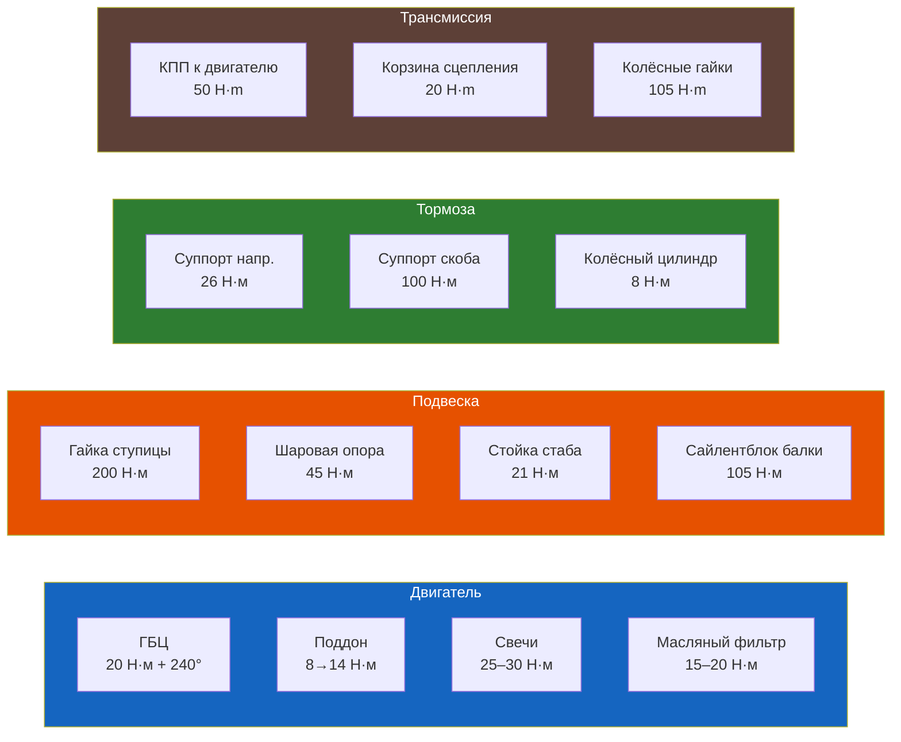
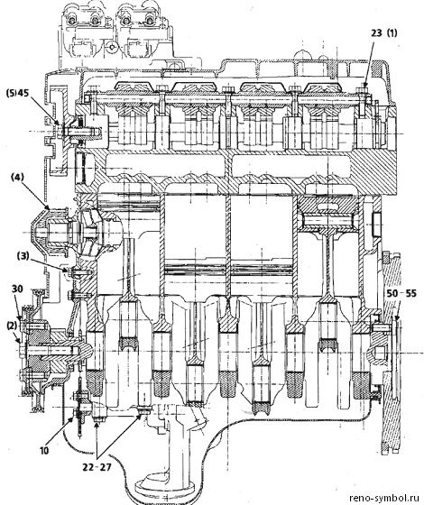
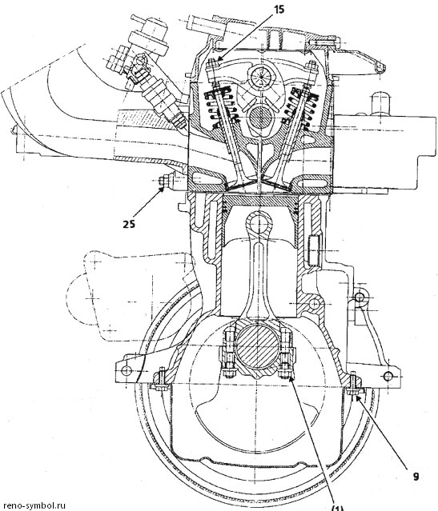

# Сводная таблица моментов затяжки

> Все значения указаны для сухой (не смазанной) резьбы, если не указано иное. Использовать динамометрический ключ обязательно. Перетяг так же опасен, как и недотяг.

## Двигатель

| Соединение | Момент, Н·м | Примечание |
|------------|-------------|------------|
| Болты ГБЦ | 20, затем доворот 240°±6° | TTY болты, замена обязательна |
| Свечи зажигания | 25–30 | Не более 30 Н·м — алюминиевая ГБЦ |
| Поддон картера к блоку | 8 (предв.) → 14 (окончат.) | Предварительно 0,8 даН·м, окончательно 1,4 даН·м |
| Клапанная крышка | 8–10 | По спирали от центра к краям |
| Маховик к коленвалу | 60–65 | |
| Болты коленвала (коренные) | 25 + 47°±5° | TTY, с калиброванной проволокой проверка зазора |
| Шкив коленвала | 100–110 | |
| Шатунные болты (новые гайки) | 43 | Заменять гайки обязательно |
| Выпускной коллектор к ГБЦ | 20–25 | Шпильки M8 |
| Крышка распредвала | 8–10 | |
| Масляный фильтр | 25 (от руки + 3/4 оборота) | |
| Датчик давления масла | 32 | — |
| Датчик детонации | 20 | — |
| Датчик уровня масла | 20 | — |
| Сливная пробка масла | 25 | Не перетягивать |
| Помпа системы охлаждения | M6: 11, M8: 22 | С герметиком Loctite 518 |
| Коллектор → приёмная труба | 22 | M10, пружинные болты |
| Приёмная труба → средняя | 20 | 2 × M10 |
| Средняя → задняя труба | 15 | 2 × M8 |
| Лямбда-зонд | 45 | |
| Крепление генератора | 20–25 | Болты натяжителя |
| Крепление генератора к кронштейну | 40–45 | |

> Подробнее: [3.1 Бензиновые двигатели](./dvigatel/3-1.md), [3.3 Система смазки](./dvigatel/3-3.md), [3.4 Система охлаждения](./dvigatel/3-4.md), [3.5 Система выпуска](./dvigatel/3-5.md)

## Трансмиссия

| Соединение | Момент, Н·м | Примечание |
|------------|-------------|------------|
| Корзина сцепления к маховику | 20 | |
| Сливная пробка КПП | 25 | |
| Контрольная пробка КПП | 25 | |
| Гайка ступицы (приводной вал) | 200 | Обязательно новая гайка, с дотяжкой |
| Болт фиксации кулисы | 8 | Torx T30 |

> Подробнее: [4.1 Сцепление](./transmissiya/4-1.md), [4.2 Коробка передач](./transmissiya/4-2.md), [4.3 Приводные валы](./transmissiya/4-3.md)

## Ходовая часть

| Соединение | Момент, Н·м | Примечание |
|------------|-------------|------------|
| Гайка ступицы передней | 200 | |
| Болты стойки к поворотному кулаку | 180 | 18 даН·м по MR358 |
| Верхняя опора стойки (3 гайки) | 20 | Torx T30 |
| Шаровая опора к кулаку | 45 | Torx T40, 2 болта |
| Гайка штока амортизатора | 50 | На обжатой пружине |
| Передний сайлент-блок рычага | 80 | Torx T55, на гружёном авто |
| Задний сайлент-блок рычага | 60 | Torx T55, на гружёном авто |
| Болт крепления балки к кузову | 105 | Torx T55, на гружёном авто |
| Болты сайлент-блоков балки | 105 | На гружёном авто |
| Верхнее крепление амортизатора заднего | 45 | Torx T45, доступ из багажника |
| Нижнее крепление амортизатора заднего | 45 | Torx T40 |
| Колёсные гайки / болты | 90–105 | Крест-накрест |

> Подробнее: [5.1 Передняя подвеска](./hodovaya/5-1.md), [5.2 Задняя подвеска](./hodovaya/5-2.md), [5.3 Колёса и шины](./hodovaya/5-3.md)

## Тормозная система

| Соединение | Момент, Н·м | Примечание |
|------------|-------------|------------|
| Направляющие суппорта (перед) | 25–30 | |
| Болты суппорта к поворотному кулаку | 40 | 4 даН·м по MR358 |
| Штуцер прокачки тормозов | 8–10 | |
| Болт крепления тормозного диска | 10–12 | |
| Направляющий штифт колодок (зад) | 10 | |
| Болт колёсного цилиндра (зад) | 8–10 | |
| Штуцер тормозной трубки (зад) | 12–15 | |
| Колёсные гайки | 90–105 | |

> Подробнее: [7.1 Передние тормоза](./tormoza/7-1.md), [7.2 Задние тормоза](./tormoza/7-2.md)

## Подрамник и силовой агрегат

| Соединение | Момент, Н·м | Примечание |
|------------|-------------|------------|
| Болты переднего крепления подрамника | 62 | 6,2 даН·м |
| Болты заднего крепления подрамника | 105 | 10,5 даН·м |
| Болт крепления двигателя (верхний кожух опоры) | 62 | 6,2 даН·м |
| Гайка верхнего кожуха опоры маятниковой подвески | 44 | 4,4 даН·м |
| Болты крепления тормозов к кулаку | 40 | С Loctite FRENBLOC |
| Болт реактивной тяги | 62 | 6,2 даН·м |
| Болт вилки карданного шарнира рулевого вала | 30 | 3 даН·м |

> Подробнее: [5.4 Подрамник](./hodovaya/5-4.md)

## Рулевое управление

| Соединение | Момент, Н·м | Примечание |
|------------|-------------|------------|
| Гайка наконечника рулевой тяги | 35–40 | С новым шплинтом |
| Крепление ГУР (болты) | 20–25 | |

| Болт карданчика рулевого вала | 25 | С фиксатором резьбы |
| Болт крепления рулевой рейки | 45–50 | Крест-накрест |
| Ступичная гайка (рулевая сошка) | 180–200 | Новая гайка |

> Подробнее: [6.1 Рулевой механизм](./rulevoe/6-1.md), [6.2 Гидроусилитель](./rulevoe/6-2.md)

## Трансмиссия

| Соединение | Момент, Н·м | Примечание |
|------------|-------------|------------|
| Болты КПП к двигателю | 45 | M12, класс 8.8 |
| Ступичная гайка привода | 180–200 | Новая гайка, затяжка на земле |
| Болты корзины сцепления к маховику | 25 | Крест-накрест, 2 прохода |
| Сливная пробка КПП | 25 | С новой шайбой |
| Контрольная пробка КПП | 15 | — |
| Крепление подушки КПП (верх) | 45 | — |
| Крепление подушки КПП (низ) | 55 | — |
| Маслозаливная пробка КПП | 25 | — |
| Шаровая опора | 40–45 | — |
| Наконечник рулевой тяги | 30–35 | С новым шплинтом |
| Стойка стабилизатора (верх) | 35–40 | — |
| Стойка стабилизатора (низ) | 40–45 | — |

> Подробнее: [4.1 Сцепление](./transmissiya/4-1.md), [4.2 Коробка передач](./transmissiya/4-2.md), [4.3 Приводные валы](./transmissiya/4-3.md), [4.4 Замена сцепления](./transmissiya/4-4.md)

## Электрооборудование

| Соединение | Момент, Н·м | Примечание |
|------------|-------------|------------|
| Гайка плюсового провода генератора | 8–10 | |

| Винты регулятора генератора | 2–3 | |
| Болты стартера к блоку | 40–45 | |
| Плюсовой провод стартера | 10–15 | |
| Вывод 50 (втягивающее) | 8–10 | |

> Подробнее: [8.1 АКБ](./elektrika/8-1.md), [8.2 Генератор](./elektrika/8-2.md), [8.3 Система пуска](./elektrika/8-3.md)

## Кузов и салон

| Соединение | Момент, Н·м | Примечание |
|------------|-------------|------------|
| Крепление переднего крыла (M8) | 20 | |
| Петли дверей (M10) | 25 | |
| Болт сиденья переднего (M10) | 40 | |
| Болт сиденья заднего (M8) | 25 | |
| Болт ремня безопасности (M10) | 40 | |

> Подробнее: [9.1 Наружные элементы](./kuzov/9-1.md), [9.2 Салон](./kuzov/9-2.md)

---

> ⚠ **Важно:** Все моменты указаны для оригинальных или качественных аналогов крепежа. При использовании крепежа б/у или сомнительного качества — снижайте момент на 10–15% и используйте фиксатор резьбы средней фиксации (Loctite 243).

## Фото

*Заводские таблицы моментов затяжки*

