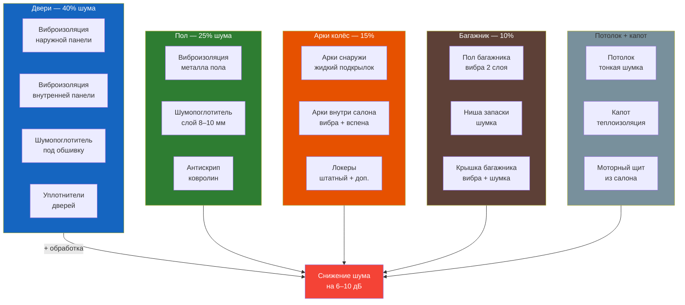

# Шумоизоляция (ШВИ)

Руководство по шумо- и виброизоляции Renault Symbol. Заводская шумоизоляция минимальна — после доработки уровень шума в салоне снижается на 6–10 дБ.



## Материалы

### Для Renault Symbol рекомендуется

| Тип | Материал | Толщина | Назначение |
|-----|----------|---------|------------|
| **Вибродемпфер** (виброизоляция) | STP Bimast Bomb / SGM Big Bat | 2,3–4,0 мм | Двери, пол, арки |
| | STP Aero / SGM Aero | 2,0–3,0 мм | Потолок, средние участки |
| **Шумопоглотитель** (шумка) | STP PES-10 / SGM Isotone | 8–10 мм | Под обшивку, на пол |
| | STP PES-4 / SGM Isotone | 4 мм | Тонкие места, двери |
| **Антискрип** (демпфер) | STP BiBlock / Битопласт | 5–10 мм | Стыки пластика |
| **Герметик жидкий** | STP NB-4 / Rust Stop | — | Арки снаружи |

```admonition tip
Бюджетные, но рабочие альтернативы: «Шумоff» (российский), SGM (San Gorgio Marino). Дорогие: STP (Standartplast), DINITROL. Расчёт для Symbol — 4–5 листов вибры 0,5×0,75 м и 2–3 листа шумки 1×1 м.
```

## Пошаговая обработка

### 1. Двери — наибольший эффект

**Материалы:** вибро 2,3–3,0 мм (2 листа на дверь), шумка 8 мм (1 лист на дверь)

**Порядок:**
1. Снять обшивку двери (см. [9.2 Салон](../kuzov/9-2.md))
2. Снять штатную пароизоляцию (чёрная плёнка)
3. Обезжирить металл (спирт, уайт-спирит, антисиликон)
4. **Вибро:** наружная панель (со стороны стекла) — 50–70% площади, вальцевать роликом
5. **Вибро:** внутренняя панель (напротив динамика) — 100% вокруг динамика
6. **Шумка:** на внутреннюю панель, слой 8 мм
7. **Антискрип:** на все пластиковые фишки, края обшивки
8. Собрать дверь

```text
Изменение звука закрытия двери: «пустой металл» → «глухой удар премиум-класса»
```

### 2. Пол салона — основной источник гула

**Материалы:** вибро 3,0–4,0 мм (4–5 листов на весь пол), шумка 8–10 мм (2–3 листа)

**Порядок:**
1. Снять передние сиденья, центральную консоль, пороги, ковролин
2. Обезжирить металл всего пола
3. **Вибро:** на всю площадь пола, особенно в районе ног водителя и задних пассажиров
4. **Вибро:** на моторный щит (доступ из салона, за педалями)
5. **Шумка:** поверх вибры, слой 8–10 мм под ковролин
6. **Антискрип:** между ковролином и шумкой

### 3. Арки колёс — снижение гула шин

**Материалы:** вибро 4,0 мм (арки из салона), жидкий подкрылок (арки снаружи)

**Порядок (из салона):**
1. Задние арки: снять боковины багажника, доступ есть со снятыми сиденьями
2. Передние арки: снять подкрылки и обработать снаружи

**Порядок (снаружи):**
1. Снять колёса, подкрылки
2. Вымыть и обезжирить арку
3. Нанести жидкий подкрылок (Dinitrol RB20 / STP NB-4) 2–3 слоя
4. Установить дополнительные локеры (полиуретановые, не жёсткий пластик)

### 4. Багажник — резонатор

**Материалы:** вибро 2,3 мм (дно), шумка 8 мм (ниша запаски)

**Порядок:**
1. Снять полку, обшивку, запаску, органайзер
2. Обезжирить
3. Вибро: дно багажника (100%), ниша запаски (полностью)
4. Шумка: в нишу запаски
5. Дополнительно: обработать крышку багажника (2–3 кг облегчает закрытие)

### 5. Потолок — дождь и ветер

**Материалы:** вибро 2,0 мм (1–1,5 листа), шумка 4 мм (0,5 листа)

**Порядок:**
1. Снять обивку потолка (см. [9.2 Салон](../kuzov/9-2.md))
2. Обезжирить
3. Вибро: полосами между усилителями крыши (30–40% площади)
4. Шумка: тонкая 4 мм
5. Антискрип: между обивкой и металлом
6. Собрать

### 6. Капот — теплозащита

**Материалы:** штатная теплоизоляция (или аналог)

**Порядок:**
1. Снять штатный теплоизолятор (если есть)
2. Вырезать новый из подходящего материала (автоакустический ковролин или штатный STP)
3. Установить на клипсы

## Типичный бюджет

| Объём работ | Время (своими руками) | Стоимость материалов |
|-------------|----------------------|---------------------|
| Только передние двери | 4–6 ч | 3 000–5 000 ₽ |
| Все 4 двери | 6–8 ч | 5 000–8 000 ₽ |
| Двери + пол | 12–16 ч | 10 000–15 000 ₽ |
| Полный цикл (всё) | 24–40 ч | 18 000–25 000 ₽ |

```admonition tip
Если бюджет ограничен: сделайте **передние двери** (максимум эффекта на рубль) и **багажник** (дешево, даёт тишину сзади). Полный цикл лучше делать за 2–3 выходных.
```

## Частые ошибки при ШВИ

| Ошибка | Последствия | Правильно |
|--------|-------------|-----------|
| Вибро в один слой 100% площади | Перегруз по весу (+20–40 кг) | 50–70% площади, полосами |
| Только вибро без шумки | Металл не резонирует, но шум идёт по воздуху | Вибро + шумка обязательно |
| Экономия на материале | Не держится, отклеивается, запах | Только авто-специализированные материалы |
| Не вальцевать роликом | Плохое прилегание, дребезг | Тщательно прикатать роликом |
| Не обезжирить | Отклеивание через месяц | Обезжиривать перед наклейкой |
| Антискрип только на защёлки | Скрипит пластик о пластик | На все плоскости соприкосновения |
