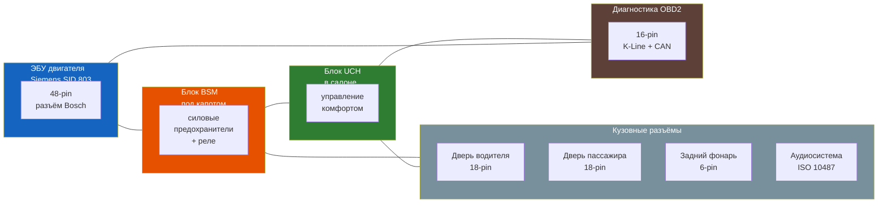

# Распиновка разъёмов (Pinout)

Схемы контактов основных электрических разъёмов Renault Symbol. Цвета проводов указаны по французскому стандарту (см. [глоссарий](../glossary.md#Мнемоника-цветов-проводов-Renault)).



## Диагностический разъём OBD2

16-контактный разъём SAE J1962. Расположен слева под рулевой колонкой, закрыт пластиковой крышкой.

| Пин | Сигнал | Цвет провода | Примечание |
|-----|--------|-------------|------------|
| 1 | — | — | Не используется |
| 2 | J1850 Bus+ | — | Не используется (американский стандарт) |
| 3 | — | — | Не используется |
| 4 | **Масса (шасси)** | M (Marron) | Общий минус |
| 5 | **Масса (сигнальная)** | M (Marron) | Сигнальная земля |
| 6 | **CAN-High** | Bc (Blanc) + ... | CAN шина, высокоскоростная 500 кбит/с |
| 7 | **K-Line (ISO 9141-2)** | V (Violet) | Для Symbol I (1999–2002) |
| 8 | — | — | Не используется |
| 9 | — | — | Не используется |
| 10 | J1850 Bus– | — | Не используется |
| 11 | — | — | Не используется |
| 12 | — | — | Не используется |
| 13 | — | — | Не используется |
| 14 | **CAN-Low** | Bc (Blanc) + ... | CAN шина, низкоскоростная |
| 15 | L-Line | — | Не используется |
| 16 | **+12В (постоянный)** | R (Rouge) | Питание диагностического прибора |

```admonition warning
Пин 16 (+12В) и пины 4–5 (масса) — самые важные. Если сканер не подключается — проверьте эти цепи. Предохранитель F21 (15A в салоне) отвечает за питание OBD2.
```

## Разъём ЭБУ двигателя (ECU)

### Siemens SID 803 (Symbol I–II, K7J/K7M)

81-контактный разъём, расположен в моторном отсеке, слева на чашке амортизатора.

| Пин | Сигнал | Цвет | Назначение |
|-----|--------|------|------------|
| 1 | **+12В (постоянное)** | R | Питание ЭБУ (от АКБ) |
| 2 | **+12В (зажигание)** | J | Питание после замка зажигания |
| 3 | **Масса ЭБУ** | M | Основная земля |
| 4 | ДПКВ (сигнал) | V | Датчик коленвала |
| 5 | ДПКВ (масса) | M | Земля датчика коленвала |
| 6 | ДПРВ (сигнал) | Vt | Датчик распредвала |
| 7 | MAP (сигнал) | V | Давление во впуске |
| 8 | IAT (сигнал) | V | Температура воздуха |
| 9 | ECT (сигнал) | V | Температура ОЖ |
| 10 | ТПС (сигнал) | V | Положение дросселя |
| 11 | Лямбда (сигнал) | V | Кислородный датчик |
| 12 | Лямбда (подогрев +) | R | Подогрев лямбда-зонда |
| 13 | Форсунка 1 | O | Цилиндр 1 |
| 14 | Форсунка 2 | O | Цилиндр 2 |
| 15 | Форсунка 3 | O | Цилиндр 3 |
| 16 | Форсунка 4 | O | Цилиндр 4 |
| 17 | Бензонасос (реле) | V | Управление реле |
| 18 | Катушка зажигания 1–4 | O | Катушка (1+4) |
| 19 | Катушка зажигания 2–3 | O | Катушка (2+3) |
| 20 | Canister purge (EVAP) | Vt | Клапан адсорбера |
| 21 | IAC (РХХ) A | Vt | Регулятор ХХ, обмотка A |
| 22 | IAC (РХХ) B | Vt | Регулятор ХХ, обмотка B |
| 23 | **K-Line (диагностика)** | V | Линия диагностики |
| 24 | Immobiliser IN | V | Сигнал иммобилайзера |
| 25 | +5V REF | J | Опорное напряжение 5В для датчиков |

### Bosch MP7.0 (Symbol III, K4M)

Более сложный блок, 121 контакт. Основные сигналы:

| Группа | Сигнал | Примечание |
|--------|--------|------------|
| **Питание** | +12В постоянное (Klemme 30) | Пин 1, 2 |
| | +12В зажигание (Klemme 15) | Пин 3 |
| | Масса | Пин 4, 5 |
| **CAN-шина** | CAN-H | Пин 6 |
| | CAN-L | Пин 7 |
| **Датчики** | ДПКВ, ДПРВ, MAP, IAT, ECT, ТПС, лямбда (широкополосная) | Аналогично, но пины другие |
| **Исполнители** | Форсунки (по отдельности), катушки (индивидуальные), РХХ, EVAP | |
| **Дополнительно** | Датчик детонации (KS), EGR (если есть), VSS (скорость) | |

```admonition info
Для точной распиновки конкретного ЭБУ используйте оригинальную документацию Renault или Can Clip. Номера пинов зависят от версии ПО ЭБУ.
```

## Блок комфорта UCH (BCM)

Расположен за бардачком, слева. Один из самых важных блоков Symbol — управляет ЦЗ, ЭСП, освещением, дворниками, сигнализацией.

**Основные разъёмы UCH:**

| Разъём | Пины | Назначение |
|--------|------|------------|
| **A** | 32 | Питание, CAN-шина, диагностика |
| **B** | 32 | Освещение салона, багажник, дворники |
| **C** | 16 | Стеклоподъёмники, ЦЗ, зеркала |
| **D** | 8 | Датчики (двери, капот), сигнализация |

### Важные сигналы UCH

| Пин | Сигнал | Цвет | Описание |
|-----|--------|------|----------|
| A1 | +12В (постоянное) | R | Питание UCH |
| A2 | Масса | M | Земля |
| A3 | CAN-H | Bc | Высокоскоростная CAN |
| A4 | CAN-L | Bc | Низкоскоростная CAN |
| A5 | K-Line | V | Диагностика |
| B2 | +12В (дворники) | J | Управление дворниками |
| B8 | Лампа багажника | Vt + Bc | |
| C1 | ЭСП переднее левое | — | +12В и управление |
| C5 | ЦЗ запирание | O | Импульс запирания |
| C6 | ЦЗ отпирание | V | Импульс отпирания |
| D1 | Левый передний датчик двери | — | Концевик |
| D2 | Правый передний датчик двери | — | Концевик |

## ISO-разъём магнитолы

Стандартный 2-блочный разъём ISO 10487.

### Блок A (питание + динамики)

| Пин | Сигнал | Цвет ISO | Цвет Renault | Примечание |
|-----|--------|----------|--------------|------------|
| A1 | Скорость (VSS) | — | V | Для авто-громкости (не всегда) |
| A2 | Телефон Mute | — | — | Не используется |
| A3 | — | — | — | Резерв |
| A4 | +12В ACC (зажигание) | Красный | J (Jaune) | Питание при включении зажигания |
| A5 | +12В ANT (антенна) | Синий | — | Питание усилителя антенны |
| A6 | +12В Illum (освещение) | Оранжевый | O (Orange) | Подсветка магнитолы |
| A7 | +12В постоянное | Жёлтый | R (Rouge) | Память настроек |
| A8 | **Масса** | **Чёрный** | M (Marron) | Земля |

### Блок B (акустика)

| Пин | Сигнал | Цвет | Примечание |
|-----|--------|------|------------|
| B1 | Задний правый + | Фиолетовый | + |
| B2 | Задний правый – | Фиолет./чёрн. | – |
| B3 | Передний правый + | Серый | + |
| B4 | Передний правый – | Серый/чёрн. | – |
| B5 | Передний левый + | Белый | + |
| B6 | Передний левый – | Белый/чёрн. | – |
| B7 | Задний левый + | Зелёный | + |
| B8 | Задний левый – | Зелёный/чёрн. | – |

```admonition tip
При замене штатной магнитолы на нештатную:
1. Переставьте пины A7 → A4, если магнитола не выключается (штатная брала +12В с A7, нештатная требует ACC на A4)
2. Используйте CAN-адаптер (Crux, Connects2) для сохранения управления с кнопок на руле (если есть опция)
3. Переходник антенны: стандартный DIN → ISO (для Symbol I–II) или FAKRA (Symbol III)
```

## Комбинация приборов (щиток)

Основной разъём комбинации приборов — 32-контактный.

| Пин | Сигнал | Цвет | Описание |
|-----|--------|------|----------|
| 1 | +12В постоянное | R | Память одометра |
| 2 | +12В зажигание | J | Питание приборов |
| 3 | Масса | M | |
| 4 | Подсветка | O | Управление яркостью |
| 5 | CAN-H | Bc | |
| 6 | CAN-L | Bc | |
| 7 | Сигнал тахометра | V | От ЭБУ (K-Line или CAN) |
| 8 | Сигнал спидометра | V | От датчика скорости (VSS) |
| 9 | Датчик топлива | V | От датчика в баке |
| 10 | Check Engine | Bc | Лампа MIL от ЭБУ |
| 11 | ABS лампа | Vt | От блока ABS |
| 12 | Airbag лампа | V | От SRS |
| 13 | Ремень безопасности | V | Концевик ремня |
| 14 | Резерв топлива | V | От датчика |

## Разъём генератора

| Пин | Обозначение | Назначение |
|-----|-------------|------------|
| B+ | +12В (толстый красный) | Заряд АКБ, ~90A |
| D+ | Возбуждение (толстый оранжевый) | +12В от замка → возбуждение ген. |
| DFM | Мониторинг нагрузки (тонкий) | Сигнал на ЭБУ (нагрузка генератора) |

## Свечи накала (дизель K9K)

| Пин | Сигнал | Примечание |
|-----|--------|------------|
| 1 | +12В от реле свечей | Все 4 свечи параллельно |
| 2 | Реле свечей (управление) | Сигнал от ЭБУ |
| 3 | Лампа свечей накала | Контрольная лампа на панели |

```admonition tip
Если нужна распиновка конкретного разъёма, которой нет в этом разделе — см. [электрические схемы](./shemy/index.md) или используйте Can Clip для полной диагностики.
```
