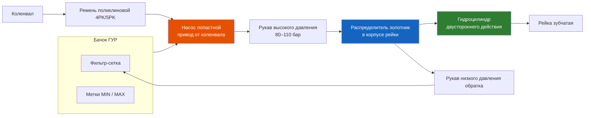

# 6.2 Гидроусилитель руля (ГУР)

Гидроусилитель снижает усилие на рулевом колесе, делая управление комфортным. На Renault Symbol установлен гидроусилитель с лопастным (шиберным) насосом и гидроцилиндром, встроенным в корпус рулевой рейки.

## Состав системы

| Компонент | Описание |
|-----------|----------|
| Насос ГУР | Лопастной (шиберного типа), производительность ~6–8 л/мин |
| Бачок ГУР | Пластиковый, со встроенным фильтром-сеткой, метками MIN/MAX |
| Рукав высокого давления | От насоса к распределителю рейки (сталь + резина) |
| Рукав низкого давления (обратка) | От рейки к бачку (резиновый, армированный) |
| Распределитель (золотник) | Роторный, встроен в корпус рейки — направляет поток в зависимости от поворота руля |
| Гидроцилиндр | Двустороннего действия, поршень соединён с рейкой |
| Приводной ремень | Поликлиновой (Poly-V), 4–5 ручьёв |

## Технические характеристики

| Параметр | Значение |
|----------|----------|
| Тип насоса | Vane pump (лопастной) |
| Рабочее давление в системе | 80–110 бар (пиковое до 120 бар) |
| Производительность насоса | ~6–8 л/мин при 1000 об/мин коленвала |
| Рекомендуемая жидкость | ELF Renaultmatic D3 (ELF 101931) или Dexron IID |
| Объём системы | ~0,8–1,0 л |
| Периодичность замены жидкости | Каждые 60 000 км или 4 года |
| Тип ремня | Поликлиновой, 4PK или 5PK (зависит от двигателя) |

## Проверка уровня и доливка жидкости

1. Установите автомобиль на ровной площадке, двигатель заглушен.

2. Очистите бачок ГУР от грязи вокруг крышки.

3. Отверните крышку. Уровень должен быть между метками MIN и MAX.

4. Если уровень ниже MIN:
   - Проверьте систему на течи
   - Долейте жидкость до отметки MAX
   - Используйте **только рекомендованную жидкость** — смешивание разных типов разрушает уплотнения

5. Закрутите крышку до щелчка.

## Замена жидкости ГУР

1. Откачайте старую жидкость из бачка шприцем (или отсоедините обратный рукав и слейте в ёмкость).

2. Залейте свежую жидкость до MAX.

3. Запустите двигатель на 5–10 секунд — жидкость уйдёт в систему. Заглушите.

4. Повторите шаги 1–3, пока из бачка не пойдёт чистая жидкость.

5. Удалите воздух (см. процедуру прокачки).

## Прокачка системы ГУР (удаление воздуха)

После замены рейки, насоса или жидкости в системе может оказаться воздух. Признаки: пенообразование в бачке, шум насоса, «ватный» руль.

### Метод прокачки

1. Поднимите передние колёса домкратом (чтобы они не касались земли).

2. Залейте жидкость в бачок до MAX.

3. Запустите двигатель.

4. Медленно поверните руль от упора до упора 5–6 раз. **Не держите руль в упоре более 2–3 секунд** — насос работает с максимальным давлением, перегрузка допустима кратковременно.

5. Заглушите двигатель. Долейте жидкость до MAX.

6. Повторите шаги 4–5, пока в бачке не исчезнет пена.

7. Опустите автомобиль. Проверьте уровень на работающем двигателе — долейте при необходимости.

⚠ Если после 3 циклов пена не исчезает — возможен подсос воздуха через всасывающий рукав (обратка от бачка к насосу). Замените рукав.

## Проверка и замена ремня привода насоса ГУР

1. Осмотрите ремень: не должно быть трещин, расслоений, масляных пятен.

2. Проверьте натяжение: нажатие на ремень посередине между шкивами — прогиб 8–12 мм при усилии 10 кг.

3. Натяжение регулируется смещением корпуса насоса ГУР (болт натяжителя + фиксирующий болт).

4. **Замена ремня:** каждые 60 000 км. Рекомендуется менять одновременно с ремнём генератора (они одинакового срока службы).

## Типовые течи ГУР

### Течь из-под бачка

- **Причина:** Трещина бачка, износ уплотнительного кольца.
- **Решение:** Замена бачка в сборе или уплотнительного кольца.

### Течь по рукаву низкого давления (обратка)

- **Причина:** Размягчение резины от контакта с маслом, старение.
- **Решение:** Замена рукава (обычный армированный шланг подходящего диаметра, хомуты).

### Течь из насоса

- **Причина:** Износ сальника вала насоса.
- **Решение:** Ремкомплект насоса или замена насоса в сборе.

### Течь из рейки (из-под пыльников)

- **Причина:** Износ сальников штоков рейки.
- **Решение:** Ремонт рейки (замена сальников) или замена рейки в сборе.

## Диагностика неисправностей ГУР

| Симптом | Причина | Решение |
|---------|---------|---------|
| Гул насоса при повороте | Низкий уровень жидкости, износ лопастей | Доливка, замена жидкости, ремонт насоса |
| «Тяжёлый» руль | Ослабление ремня, неисправность насоса, низкий уровень | Проверка натяжения ремня, уровня, насоса |
| Пена в бачке, «ватный» руль | Воздух в системе, подсос | Прокачка, замена всасывающего рукава |
| Руль самопроизвольно поворачивается | Заклинивание золотника распределителя | Замена рейки |
| Подтёки на корпусе насоса | Износ сальника вала | Замена сальника или насоса |
| Свист при повороте (холодный двигатель) | Износ ремня, низкое натяжение | Подтяжка или замена ремня |
| Стук в рулевом при повороте | Остатки воздуха, износ подшипника насоса | Прокачка, замена насоса |

## Замена насоса ГУР

1. Откачайте жидкость из бачка.

2. Ослабьте натяжение ремня, снимите его со шкива насоса.

3. Отсоедините рукава высокого и низкого давления от насоса.

4. Отверните 2–3 болта крепления насоса к кронштейну двигателя (ключ на 13 или 15 мм).

5. Снимите насос.

6. Установка — в обратной последовательности. Момент затяжки болтов: 20–25 Н·м.

7. Залейте жидкость, запустите двигатель, прокачайте систему.

⚠ **Устанавливайте только новый насос** или восстановленный с заменёнными лопастями. Б/у насосы с другого автомобиля — лотерея.

## Моменты затяжки

| Соединение | Момент, Н·м |
|------------|-------------|
| Болты крепления насоса ГУР | 20–25 |
| Гайка шкива насоса | 35–40 |
| Штуцер высокого давления (к насосу) | 30–35 |
| Штуцер обратки (к бачку) | 20–25 |
| Болты кронштейна насоса к двигателю | 40–45 |
| Болт натяжителя ремня | 20–25 |
