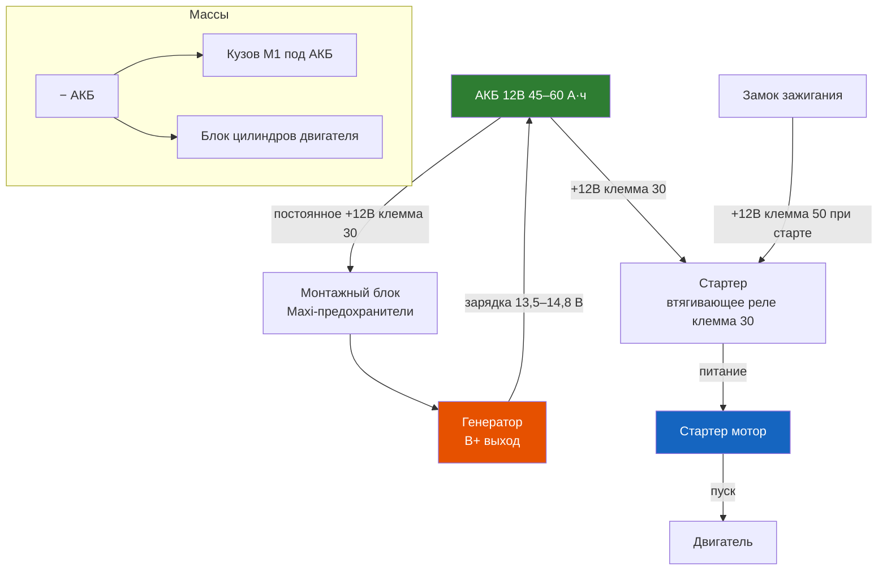
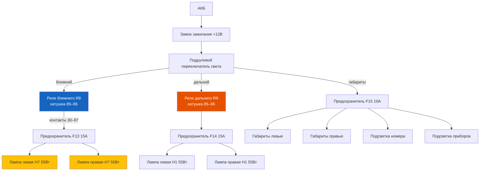
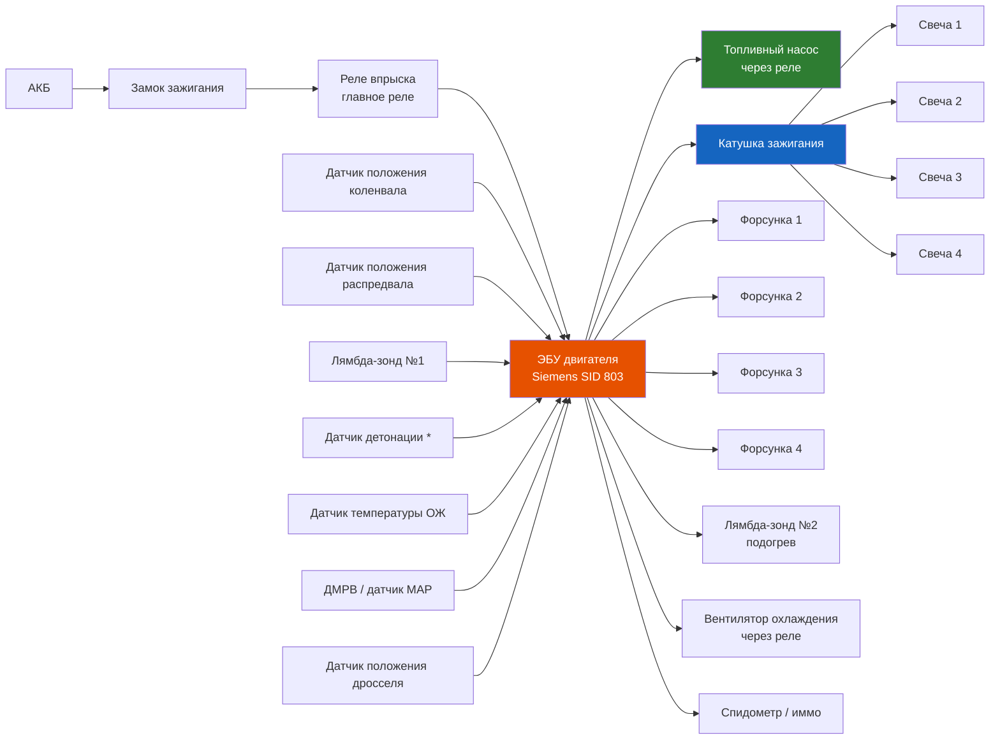
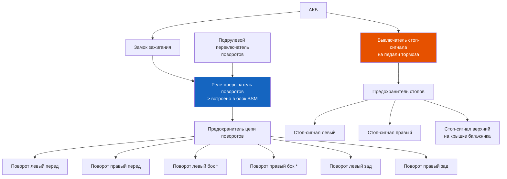
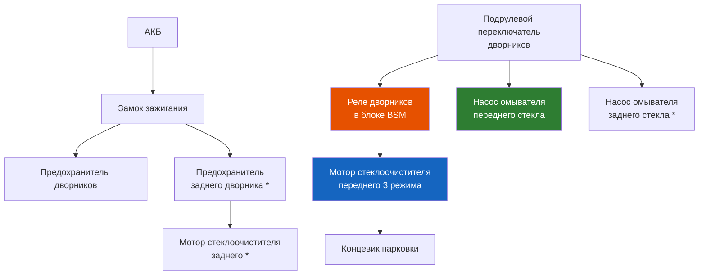
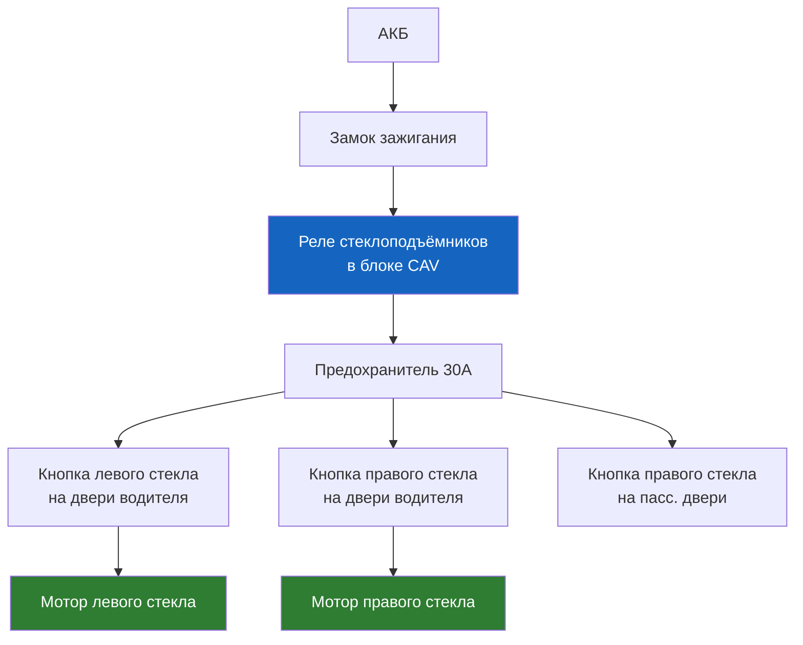
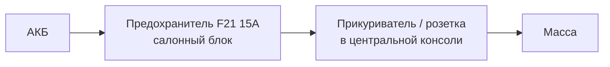

# Электрические схемы

Сборка упрощённых схем основных цепей Renault Symbol. Для полных заводских схем требуется Renault CLIP / Can Clip.

## 1. Цепь питания: АКБ → генератор → стартер

## 2. Система освещения (ближний / дальний свет)

## 3. Система впрыска и зажигания (бензин)

## 4. Световая сигнализация (повороты / стоп-сигналы)

## 5. Стеклоочистители и омыватели

## 6. Электростеклоподъёмники (передние)

## 7. Прикуриватель и розетка 12В

## Pinout-карты разъёмов

### Разъём ЭБУ двигателя (Siemens SID 803, 48 контактов)

| Пин | Цвет | Цепь | Сигнал |
|-----|------|------|--------|
| 1, 2, 3 | M (Marron) | Масса ЭБУ | 0 В |
| 4–7 | B (Bleu) | Форсунки 1–4 | Управление +12 В |
| 8 | G (Gris) | Лямбда-зонд сигнал (−) | 0,1–0,9 В |
| 11 | B (Bleu) | Датчик распредвала | 0–5 В |
| 12, 13 | R (Rouge) | ДПКВ (− / +) | AC-сигнал |
| 14 | V (Violet) | Питание датчиков +5 В | 5 В |
| 15–17 | O/G/J | ДПДЗ (сигнал / масса / +5В) | 0,5–4,5 В |
| 18 | RGE | Питание +12В после реле | 12 В |
| 19–20 | B/V | MAP-датчик (сигнал / +5В) | 0–5 В |
| 22 | J (Jaune) | Датчик температуры ОЖ | 0,5–3,5 В |
| 27–28 | G/V | Реле вентилятора 1 / 2 | 12 В вкл |
| 29 | J (Jaune) | Реле топливного насоса | 12 В вкл |
| 31 | B (Bleu) | Индикатор Check Engine | К лампе |
| 35 | V (Violet) | Катушка зажигания (1+4) | PWM |
| 36 | B (Bleu) | Катушка зажигания (2+3) | PWM |
| 37 | RGE | Питание +12В (постоянное) | 12 В |
| 40 | R (Rouge) | K-Line OBD2 | Диагностика |

### Разъём блока BSM (под капотом)

| Контакт | Цепь | Предохранитель / реле |
|---------|------|----------------------|
| A1 | +12В от АКБ (генератор B+) | Maxi 80A |
| A2 | Стартер (клемма 30) | 30A |
| A3 | ABS (питание) | 40A (F14) |
| B1 | Вентилятор 1 | Реле R5 |
| B2 | Вентилятор 2 | Реле R6 |
| B3 | Топливный насос | Реле R2 |
| C1 | ЭБУ (реле впрыска) | 15A (F2) |
| C2 | Катушка зажигания | 20A (F3) |
| D1 | К/В кондиционера | Реле R7 |
| D2 | Противотуманки | Реле R10 |
| E1–E2 | Ближний свет (лев/прав) | 15A (F13) |
| F1–F2 | Дальний свет (лев/прав) | 15A (F14) |

### Разъём блока UCH (салон)

| Пин | Цепь | Назначение |
|-----|------|-----------|
| 1 | +12В (постоянное) | Питание UCH |
| 2 | Масса | GND |
| 3 | CAN-H | Высокоскоростная CAN |
| 4 | CAN-L | Низкоскоростная CAN |
| 5–6 | LIN-1 / LIN-2 | Двери водителя / пассажира |
| 7–8 | ЭСП лев / прав | Моторы |
| 9 | ЦЗ запирание | +12В |
| 10 | ЦЗ отпирание | +12В |
| 13 | K-Line | OBD2 |
| 15 | Обогрев зад. стекла | Реле |

## Pinout OBD2 (16-контактный разъём)

| Пин | Сигнал | Цвет | Примечание |
|-----|--------|------|-----------|
| 1 | — | — | Не используется |
| 2 | J1850 Bus+ | — | Не используется |
| 3 | — | — | Не используется |
| 4 | Масса кузова | M (Marron) | GND |
| 5 | Сигнальная земля | M (Marron) | GND |
| 6 | CAN-H | Bc (Blanc) | Symbol II+ (с 2003) |
| 7 | K-Line (ISO 9141-2) | R (Rouge) | Основная диагностика |
| 8 | — | — | Не используется |
| 9 | — | — | Не используется |
| 10 | J1850 Bus− | — | Не используется |
| 11 | — | — | Не используется |
| 12 | — | — | Не используется |
| 13 | — | — | Не используется |
| 14 | CAN-L | Bc (Blanc) | Symbol II+ (с 2003) |
| 15 | L-Line | V (Violet) | Редко используется |
| 16 | +12В (постоянное) | R (Rouge) | Питание сканера |

---

## Цветовая маркировка проводов Renault

Renault использует цветовую кодировку по стандарту ISO 10483 с собственными дополнениями. Каждый провод обозначается одним или двумя цветами (основной + полоса).

| Цвет (код) | Назначение |
|------------|------------|
| Rouge (R) | Постоянное +12В (клемма 30) |
| Jaune (J) | +12В после замка зажигания (клемма 15) |
| Orange (O) | Лампы освещения |
| Violet (V) | +12В на стартер (клемма 50) |
| Bleu (B) | Датчики, сигналы управления |
| Vert (Vt) | Сигнализация, указатели поворота |
| Gris (G) | Масса (клемма 31) |
| Blanc (Bc) | CAN-шина, диагностические линии |
| Marron (M) | Заземление |

Цвета в схемах Renault даются в трёхбуквенном коде (RGE, JNE, VIO и т.д.) по французскому стандарту. Основной цвет — первая буква, полоса — вторая. Например: **RGE** (Rouge + Gris) — красный провод с серой полосой, постоянное питание.

## Разъёмы и коннекторы

- **ISO 10487** — головное устройство (питание, акустика, управление)
- **Fakra (SMB)** — антенный разъём, синий/бежевый/зелёный ключ
- **DIN 72552** — 5-контактные реле (30/87/85/86/87a)
- **Maxi Fuse** (30–80 А) — в блоке предохранителей под капотом
- **Mini Fuse** (7,5–30 А) — в блоке в салоне
- **JPT / Micro Timer** — большинство сигнальных колодок (2–8 контактов)

## Монтажные блоки

### Под капотом (блок BSM — Built-in Systems Interface)

Расположен слева, у АКБ. Содержит:
- Главные реле (впрыск, вентилятор, топливный насос)
- Maxi-предохранители силовых цепей (генератор, ABS, ЭУР)
- Реле стартера, К/В кондиционера

### В салоне (блок CAV — Central Air Vent)

Расположен в центральной консоли, под блоком отопления. Содержит:
- Предохранители цепей салона (освещение, стеклоподъёмники, магнитола, прикуриватель)
- Реле стеклоподъёмников, аварийной сигнализации, обогрева заднего стекла

## Диагностическая система

Renault Symbol использует протокол **ISO 9141-2 (K-Line)** для диагностики EOBD через 16-контактный разъём OBD-II. Пин 7 — K-Line, пин 15 — L-Line.

Диагностическое оборудование:
- **RENAULT CLIP (Can Clip)** — оригинальное ПО, полный доступ к ЭБУ (двигатель, ABS, подушки, климат)
- **ELM327** — чтение ошибок двигателя, параметров в реальном времени
- **Multiecuscan** — поддержка Renault, интерпретация заводских кодов

> ⚠ Не все адаптеры ELM327 корректно работают с K-Line. Рекомендуется CANtieCAR (ELM327 v1.5+).

## Перечень доступных схем

| Номер | Система |
|-------|---------|
| 1 | Цепь питания: АКБ → генератор → стартер |
| 2 | Система впрыска (ЭБУ Siemens SID 803 / Continental) |
| 3 | Система зажигания (катушка, свечи) |
| 4 | Система освещения: ближний, дальний, габариты |
| 5 | Световая сигнализация: повороты, стоп-сигналы, ДХО |
| 6 | Стеклоочистители и омыватели (перед/зад) |
| 7 | Электростеклоподъёмники (передние) |
| 8 | Центральный замок + брелок управления |
| 9 | Аудиосистема (штатная магнитола, динамики) |
| 10 | Отопитель / кондиционер (вентилятор, муфта компрессора) |
| 11 | ABS (Bosch 5.3 / 8.0) |
| 12 | Подушки безопасности (SRS) |
| 13 | Электроусилитель руля (при наличии) |
| 14 | Обогрев заднего стекла |
| 15 | Прикуриватель / розетка 12В |

## Типовые точки массы (массы кузова)

| Точка | Расположение |
|-------|-------------|
| M1 | Под АКБ, на лонжероне (двигатель, генератор) |
| M2 | У левой фары (левая блок-фара, сигнал) |
| M3 | За блоком BSM (ЭБУ, катушка, датчики) |
| M5 | Под панелью, слева от рулевой колонки (панель приборов) |
| M6 | В багажнике, под левой обшивкой (фонари) |

## Типовые неисправности электрооборудования

- **Отказ генератора** — износ щёток, пробой диодного моста
- **Не заводится** — реле стартера (обрыв обмотки 85–86, ~80 Ом)
- **Плавающие обороты** — подсасывание воздуха, износ свечей, либо проблема в ЭБУ
- **Не работают стеклоподъёмники** — перелом провода в гофре двери
- **Не отключается вентилятор охлаждения** — реле 4-контактное (залипло)
