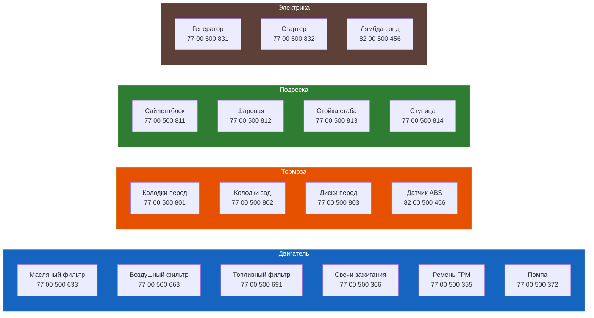

# OEM-каталог запчастей

<input type="text" id="oem-search" placeholder="🔍 Поиск по названию, OEM-номеру или аналогу..." style="width:100%;padding:10px 14px;font-size:15px;border:2px solid #ff6b00;border-radius:8px;margin:10px 0 20px;outline:none;box-sizing:border-box">

Оригинальные номера (OEM Renault) и совместимые аналоги для наиболее востребованных запчастей Renault Symbol. Данные сгруппированы по системам автомобиля.

> **Как пользоваться:** Оригинальный номер указан первым. Аналоги перечислены в порядке предпочтения. Перед покупкой сверьте номер по VIN через дилера или каталог (Partsouq, Renault.net).

## Двигатель

### Масляный фильтр

| Двигатель | Оригинал Renault | Аналоги |
|-----------|-----------------|---------|
| K7J, K7M | **7700 275 724** | MANN W 75/3, Mahle OC 139, Bosch 0 986 452 002, Purflux LS 891 |
| K4J, K4M | **7700 275 727** | MANN W 75/1, Mahle OC 144, Bosch 0 986 452 029, Purflux LS 867 |
| K9K | **7700 275 733** | MANN W 1214/1, Mahle OC 198, Bosch 0 986 452 078 |

### Воздушный фильтр

| Двигатель | Оригинал Renault | Аналоги |
|-----------|-----------------|---------|
| K7J | **77 01 036 983** | MANN C 27 778, Mahle LX 403, Bosch 1 457 433 943 |
| K7M | **77 01 036 983** | MANN C 27 778, Mahle LX 403, Bosch 1 457 433 943 |
| K4J, K4M | **77 01 035 954** | MANN C 27 704, Mahle LX 427, Bosch 1 457 433 990 |
| K9K | **82 00 428 896** | MANN C 27 773, Mahle LX 423 |

### Топливный фильтр

| Двигатель | Оригинал Renault | Аналоги |
|-----------|-----------------|---------|
| K7J, K7M (MPI) | **77 00 842 313** | MANN WK 614, Mahle KL 11, Bosch 1 457 434 209 |
| K4J, K4M | **77 00 845 063** | MANN WK 614/1, Mahle KL 14, Bosch 1 457 434 229 |
| K9K | **77 00 842 455** | MANN WK 5 016, Mahle KL 67 |

### Свечи зажигания

| Двигатель | Оригинал | NGK | Bosch | Champion |
|-----------|----------|-----|-------|----------|
| K7J (до 2002) | **77 00 500 187** | BPR6ES | WR7DC | N9YC |
| K7J (после 2002) | **77 00 500 204** | BKR6E | FR7DC | RC9YC |
| K7M | **77 00 500 204** | BKR6E | FR7DC | RC9YC |
| K4J | **77 00 500 193** | PFR6G | FR7DP | — |
| K4M | **77 00 500 193** | PFR6G | FR7DP | — |

### Ремень ГРМ (комплект)

| Двигатель | Комплект Renault | Ремень | Натяжной ролик | Помпа |
|-----------|-----------------|--------|----------------|-------|
| K7J, K7M | **77 01 471 730** | Gates 5438XS / Conti CT995 | SKF VKM 34010 | SKF VPC 1035 |
| K4J, K4M | **77 01 471 734** | Gates 5429XS / Conti CT1013 | SKF VKM 34012 | SKF VPC 1036 |
| K9K | **77 01 471 746** | Gates 5537XS | SKF VKM 35130 | SKF VPC 1038 |

> **Рекомендация:** Покупайте комплект ГРМ (ремень + ролик) целиком. Отдельная покупка помпы — SKF или Hepu.

## Тормозная система

### Колодки передние

| Тип | Оригинал Renault | Аналоги |
|-----|-----------------|---------|
| Symbol I/II (до 2005) | **77 01 022 743** | TRW GDB1722, Bosch 0 986 473 064, Ferodo FDB1891, Jurid 572348J |
| Symbol II/III (после 2005) | **77 01 048 979** | TRW GDB1725, Bosch 0 986 494 198, Ferodo FDB2096, Jurid 573921J |

### Колодки задние (барабанные)

| Тип | Оригинал Renault | Аналоги |
|-----|-----------------|---------|
| Symbol I/II | **77 01 026 784** | TRW GS8570, Bosch 1 987 473 889, Ferodo FSB908, Jurid 575337J |
| Symbol III | **77 01 048 983** | TRW GS8600, Ferodo FSB910 |

### Тормозные диски передние

| Тип | Оригинал Renault | Аналоги |
|-----|-----------------|---------|
| Symbol I/II | **77 01 023 797** | TRW DF6245, Bosch 0 986 479 729, Brembo 09.8165.10 |
| Symbol II/III | **77 01 048 987** | TRW DF6570, Bosch 0 986 479 830, Brembo 09.A033.11 |

## Подвеска и рулевое

### Амортизаторы передние

| Тип | Оригинал Renault | Аналоги |
|-----|-----------------|---------|
| Symbol I/II | **77 01 035 629** | Monroe G7335, KYB 333244, Sachs 200 950 |
| Symbol III | **77 01 048 995** | Monroe G8446, KYB 349144, Sachs 300 063 |

### Амортизаторы задние

| Тип | Оригинал Renault | Аналоги |
|-----|-----------------|---------|
| Все поколения | **77 01 035 630** | Monroe G7336, KYB 343315, Sachs 200 952 |

### Сайлентблоки переднего рычага

| Позиция | Оригинал Renault | Аналоги |
|---------|-----------------|---------|
| Передний (гидро) | **77 01 036 157** | Lemförder 25612 03, TRW JBU1015 |
| Задний | **77 01 036 169** | Lemförder 25613 03, TRW JBU1034 |

### Шаровая опора

| Тип | Оригинал Renault | Аналоги |
|-----|-----------------|---------|
| Все поколения | **77 01 036 161** | Lemförder 28123 02, TRW JBJ650, Febi 10278 |

### Рулевой наконечник

| Тип | Оригинал Renault | Аналоги |
|-----|-----------------|---------|
| Все поколения | **77 01 036 159** | Lemförder 26013 02, TRW JTE121, Febi 18141 |

## Фильтр салона

| Тип | Оригинал Renault | Аналоги |
|-----|-----------------|---------|
| Symbol I/II | **77 01 036 857** | MANN CU 24 014, Mahle LA 271, Bosch 1 987 432 024 |
| Symbol III | **77 01 048 999** | MANN CU 23 007, Mahle LA 306, Bosch 1 987 432 056 |

## Ремни навесного оборудования

| Двигатель | Ремень генератора | Ремень кондиционера |
|-----------|------------------|---------------------|
| K7J | Gates 4PK815 | — |
| K7M | Gates 4PK815 | — |
| K4J | Gates 5PK875 | Gates 4PK620 |
| K4M | Gates 5PK875 | Gates 4PK620 |
| K9K | Gates 5PK1085 | Gates 4PK675 |

## Лампы

| Назначение | Оригинал | Тип | Цоколь |
|------------|----------|-----|--------|
| Ближний/дальний свет | **77 01 208 856** | H4 60/55 Вт | P43t |
| Габаритные огни (перед) | **77 01 208 003** | W5W (T10) | 5 Вт |
| Указатели поворота (перед) | **77 01 208 431** | PY21W | 21 Вт, оранж. |
| Указатели поворота (бок) | **77 01 208 435** | WY5W | 5 Вт, оранж. |
| Стоп-сигнал | **77 01 208 044** | P21W | 21 Вт |
| Задний ход | **77 01 208 044** | P21W | 21 Вт |
| Противотуманные фары | **77 01 208 593** | H11 55 Вт | PGJ19-2 |
| Плафон салона | **77 01 208 003** | W5W (T10) | 5 Вт |
| Подсветка номера | **77 01 208 003** | W5W (T10) | 5 Вт |

## Расходные материалы (масла)

| Позиция | Оригинал Renault | Аналог |
|---------|-----------------|--------|
| Моторное масло 10W-40 | **77 11 750 821** (Elf Evolution 500) | Mobil Super 2000 / Shell Helix HX7 |
| Моторное масло 5W-40 | **77 11 750 833** (Elf Evolution 900) | Castrol Edge / Shell Helix Ultra |
| Масло КПП 75W-80 | **77 11 750 806** (Elf Tranself NFJ) | Total Transmission SYN FE |
| Тормозная жидкость DOT 4 | **77 01 215 006** | Bosch DOT 4 / Castrol Response |
| Антифриз G30 (синий) | **77 11 750 801** | Glysantin G30 / Febi 26899 |
| Жидкость ГУР | **77 11 750 804** (Elfmatic G3) | Febi 08939 |

## Щётки стеклоочистителя

| Позиция | Длина | Крепление | Оригинал Renault | Аналог |
|---------|-------|-----------|-----------------|--------|
| Водительская | 650 мм (26") | Крючок | **77 11 750 996** | Bosch Aerotwin A650S |
| Пассажирская | 450 мм (18") | Крючок | **77 11 750 997** | Bosch Aerotwin A450S |
| Задняя | 300 мм (12") | Спец. | **77 11 750 998** | Bosch H302 |

> **Совет:** Для зимы используйте беспроволочные (гибридные) щётки — не примерзают.

## Система охлаждения

### Радиатор

| Тип | Оригинал Renault | Аналоги |
|-----|-----------------|---------|
| K7J, K7M | **77 01 035 721** | Valeo 732110, Nissens 63969A, FRIGAIR 5001.1062 |
| K4J, K4M | **77 01 048 893** | Valeo 732112, Nissens 63971A |

### Термостат

| Двигатель | Оригинал Renault | Аналоги |
|-----------|-----------------|---------|
| K7J, K7M | **77 00 500 388** | Vernet VR 103, Wahler 4031.87, Gates 32078 |
| K4J, K4M | **77 00 500 389** | Vernet VR 104, Wahler 4032.87 |

### Помпа водяная

| Двигатель | Оригинал Renault | Аналоги |
|-----------|-----------------|---------|
| K7J, K7M | **77 00 500 372** | SKF VPC 1035, Hepu P152, Gates 4209 |
| K4J, K4M | **77 00 500 373** | SKF VPC 1036, Hepu P153, Gates 4210 |

### Расширительный бачок

| Двигатель | Оригинал Renault | Аналоги |
|-----------|-----------------|---------|
| Все | **77 00 500 381** | Valeo 703211, Nissens 50247 |

### Вентилятор охлаждения (в сборе)

| Двигатель | Оригинал Renault | Аналоги |
|-----------|-----------------|---------|
| Все | **77 01 035 722** | Valeo 104680, Nissens 81148 |

## Система выпуска

### Приёмная труба («штаны»)

| Двигатель | Оригинал Renault | Аналоги |
|-----------|-----------------|---------|
| K7J | **77 01 035 841** | Bosch 2 097 000 001, Walker 21788 |
| K7M | **77 01 035 842** | Bosch 2 097 000 002, Walker 21789 |

### Катализатор

| Двигатель | Оригинал Renault | Аналоги |
|-----------|-----------------|---------|
| K7J | **77 01 035 845** | Bosch 2 097 000 011, Walker 22891 |
| K4J, K4M | **77 01 035 846** | Bosch 2 097 000 012 |

### Глушитель задний

| Двигатель | Оригинал Renault | Аналоги |
|-----------|-----------------|---------|
| Все | **77 01 035 850** | Bosch 2 097 000 110, Walker 22344, Sonic S1005 |

## Сцепление

### Комплект сцепления (диск + корзина + выжимной)

| Двигатель / КПП | Оригинал Renault | Аналоги |
|-----------------|-----------------|---------|
| K7J (КПП JB3) | **77 01 036 015** | Valeo 835017, Luk 622 0020 10, Sachs 3108 000 055 |
| K7M, K4J, K4M (КПП JC5) | **77 01 036 016** | Valeo 835074, Luk 622 0025 10, Sachs 3108 000 081 |
| K9K | **77 01 036 019** | Valeo 835118, Luk 622 0030 10 |

### Выжимной подшипник

| Двигатель | Оригинал Renault | Аналоги |
|-----------|-----------------|---------|
| Все МКПП | **77 01 036 020** | SKF VKM 15001, SNR GT351.11 |

## Электрика и датчики

### Генератор

| Двигатель | Оригинал Renault | Аналоги |
|-----------|-----------------|---------|
| K7J (80 А) | **77 00 500 831** | Valeo 2541305, Bosch 0 986 041 350 |
| K4J, K4M (120 А) | **77 00 500 832** | Valeo 2542301, Bosch 0 986 041 620 |

### Стартер

| Двигатель | Оригинал Renault | Аналоги |
|-----------|-----------------|---------|
| K7J, K7M | **77 00 500 833** | Valeo 458213, Bosch 0 001 108 302 |
| K4J, K4M | **77 00 500 834** | Valeo 458214 |

### Датчики

| Название | Оригинал Renault | Аналоги |
|----------|-----------------|---------|
| Датчик коленвала | **77 00 500 843** | Bosch 0 261 210 203, Febi 18651 |
| Датчик распредвала | **77 00 500 844** | Bosch 0 261 210 204 |
| Датчик фазы | **77 00 500 845** | Bosch 0 261 210 205 |
| Лямбда-зонд (передний) | **82 00 500 457** | Bosch 0 258 003 001, NGK 1801, Denso DOX-0102 |
| Лямбда-зонд (задний) | **82 00 500 458** | Bosch 0 258 003 002, NGK 1802 |
| Датчик ABS | **82 00 500 456** | Bosch 0 265 311 003, Febi 36113 |
| Дроссельная заслонка (в сборе) | **77 00 500 847** | Valeo 254540, Pierburg 7.03621.01 |

## Кузов и салон

### Оптика

| Название | Оригинал Renault | Аналоги |
|----------|-----------------|---------|
| Фара левая (Symbol II) | **77 01 036 211** | Tyc 311-0011, Valeo 061154 |
| Фара правая (Symbol II) | **77 01 036 212** | Tyc 311-0012, Valeo 061155 |
| Фонарь задний левый (Symbol II) | **77 01 036 221** | Tyc 321-0011 |
| Фонарь задний правый (Symbol II) | **77 01 036 222** | Tyc 321-0012 |

### Зеркала

| Название | Оригинал Renault | Аналоги |
|----------|-----------------|---------|
| Зеркало левое | **77 01 036 201** | Tyc 301-0011, Van Wezel 4638811 |
| Зеркало правое | **77 01 036 202** | Tyc 301-0012 |

## Прокладки и сальники

### Прокладка ГБЦ

| Двигатель | Оригинал Renault | Аналоги |
|-----------|-----------------|---------|
| K7J | **77 00 500 301** | Elring 366.210, Victor Reinz 61-36750-00 |
| K7M | **77 00 500 302** | Elring 366.220 |
| K4J | **77 00 500 303** | Elring 366.230 |
| K4M | **77 00 500 304** | Elring 366.240 |

### Прокладки и сальники

| Название | Оригинал Renault | Аналоги |
|----------|-----------------|---------|
| Прокладка клапанной крышки | **77 00 500 311** | Elring 182.310 |
| Прокладка впускного коллектора | **77 00 500 312** | Elring 182.320 |
| Сальник коленвала (передний) | **77 00 500 321** | Elring 265.210, SKF 12840 |
| Сальник коленвала (задний) | **77 00 500 322** | Elring 265.220, SKF 12841 |

## Как найти номер по VIN

1. На сайте **partsouq.com** или **renault.net** введите VIN.
2. Выберите категорию (Engine, Brakes, Suspension).
3. Найдите нужную деталь на схеме.
4. Запишите OEM-номер.
5. Вбейте номер в поисковик — найдёте все аналоги.

> **Важно:** Номера могут отличаться для разных комплектаций и годов выпуска. При заказе через интернет-магазин используйте OEM-номер, а не название детали.
