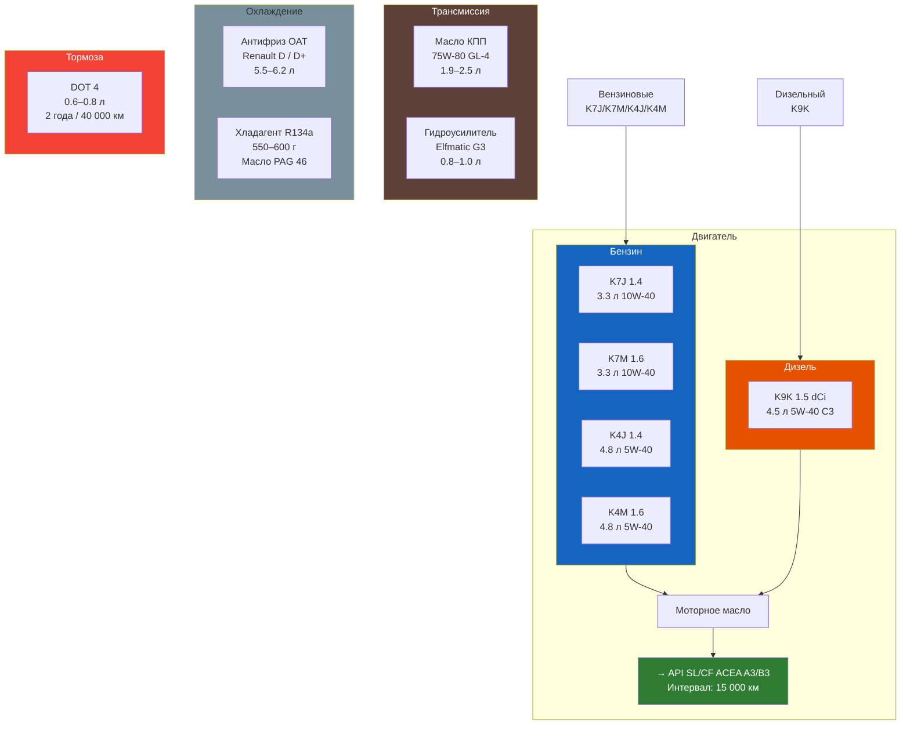

# Жидкости и объёмы

Сводная таблица всех технических жидкостей Renault Symbol (все поколения, все двигатели).

## Моторное масло

| Двигатель | Объём, л | Масло (класс) | Вязкость SAE | Допуск/стандарт |
|-----------|----------|---------------|--------------|-----------------|
| **K7J** 1.4 8V | 3,3 | Полусинтетика | 10W-40 | API SL/CF, ACEA A3/B3 |
| **K4J** 1.4 16V | 4,8 | Полусинтетика / Синтетика | 5W-40 / 10W-40 | API SL/CF, ACEA A3/B4 |
| **K7M** 1.6 8V | 3,3 | Полусинтетика | 10W-40 | API SL/CF, ACEA A3/B3 |
| **K4M** 1.6 16V | 4,8 | Полусинтетика / Синтетика | 5W-40 / 10W-40 | API SL/CF, ACEA A3/B4 |
| **K9K** 1.5 dCi | 4,5 | Синтетика | 5W-40 | ACEA C3 (Low SAPS) |

> **Интервал замены:** каждые 15 000 км или 1 год (бензин), 10 000 км (дизель). При тяжёлых условиях — вдвое чаще.

### Рекомендованные бренды

| Тип масла | Бренд |
|-----------|-------|
| Полусинтетика 10W-40 | Elf Evolution 500, Mobil Super 2000, Shell Helix HX7 |
| Синтетика 5W-40 | Elf Evolution 900, Mobil 1, Castrol Edge, Shell Helix Ultra |
| Дизель 5W-40 (C3) | Elf Solaris DPF, Mobil 1 ESP, Castrol Edge DP |

## Трансмиссионное масло

| Узел | Объём, л | Масло | Вязкость | Спецификация |
|------|----------|-------|----------|--------------|
| **МКПП** (JH1, JH3) | 1,9–2,1 | Полусинтетика трансмиссионная | 75W-80 | API GL-4, Renault NFJ |
| **МКПП** (дюралевый картер, поздние) | 2,3–2,5 | Синтетика трансмиссионная | 75W-80 | API GL-4, Elf Tranself NFJ |
| **Редуктор заднего моста** | — | Не применимо (передний привод) | — | — |

> **Интервал замены в МКПП:** каждые 60 000 км или 4 года. Уровень проверяется контрольной пробкой.

## Тормозная жидкость

| Параметр | Значение |
|----------|----------|
| Тип | DOT 4 |
| Объём системы | 0,6–0,8 л (прокачка с заменой) |
| Класс вязкости | DOT 4 (ISO 4925) |
| Температура кипения (сухая) | ≥ 230 °C |
| Температура кипения (увлажнённая) | ≥ 155 °C |
| Интервал замены | Каждые 2 года или 40 000 км |

> **Рекомендация:** Не используйте DOT 5 (силиконовая) — несовместима с уплотнениями Renault.

### Рекомендованные бренды

| Бренд | Примечание |
|-------|------------|
| Elf 4 | Оригинальная заливка |
| Bosch DOT 4 | Широко доступна |
| Castrol Response DOT 4 | Высокая температура кипения |
| TRW DOT 4 | Рекомендуется для ABS |

## Охлаждающая жидкость (антифриз)

| Двигатель | Объём, л | Тип | Цвет | Спецификация |
|-----------|----------|-----|------|-------------|
| **K7J / K7M** | 5,5 | OAT (Glysantin G30) | Синий / Зелёный | Renault D |
| **K4J / K4M** | 5,8 | OAT (Glysantin G30) | Синий / Зелёный | Renault D |
| **K9K** | 6,2 | OAT (Glysantin G40) | Фиолетовый | Renault D+ |

> **Интервал замены:** каждые 4 года или 60 000 км. Концентрация антифриза: 50–60 % (защита до –36 °C).

### Замена
- Полный объём сливается через пробку на радиаторе (слева внизу) и кран на блоке цилиндров (сбоку).
- Промывка дистиллированной водой обязательна при смене типа антифриза.

## Омывающая жидкость

| Параметр | Значение |
|----------|----------|
| Объём бачка омывателя ветрового стекла | 3,5 л |
| Объём бачка омывателя фар (Symbol II 2005+ / III) | 2,0 л |
| Рекомендуемая концентрация (зима) | –20 °C / –30 °C |
| Рекомендуемая концентрация (лето) | С очистителем насекомых |

## Жидкость ГУР (гидроусилитель руля)

| Параметр | Значение |
|----------|----------|
| Тип | Renault Elfmatic G3 / ATF D21048 |
| Объём системы | 0,8–1,0 л |
| Цвет | Зелёный / Жёлтый |
| Интервал замены | Не регламентирован (долив при необходимости) |

> **Важно:** Не используйте обычную ATF (красную) — несовместима с уплотнениями системы ГУР Renault. Только зелёную Elfmatic G3.

## Хладагент кондиционера

| Параметр | Значение |
|----------|----------|
| Тип хладагента | R134a |
| Объём заправки | 550–600 г |
| Масло компрессора | PAG 46 (100–150 мл) |
| Тип компрессора | Denso 7SBU16C / Sanden |

## Сводная таблица

| Жидкость | Объём | Интервал замены | Основной допуск |
|----------|-------|-----------------|-----------------|
| Моторное масло | 3,3–4,8 л | 15 000 км / 1 год | API SL/CF, ACEA A3/B3 |
| Масло КПП | 2,0–2,5 л | 60 000 км / 4 года | API GL-4 |
| Тормозная жидкость | 0,6–0,8 л | 40 000 км / 2 года | DOT 4 |
| Антифриз | 5,5–6,2 л | 60 000 км / 4 года | Renault D |
| Жидкость ГУР | 0,8–1,0 л | По необходимости | Elfmatic G3 |
| Хладагент R134a | 550–600 г | По необходимости | — |

## Полезные ссылки
- [3.3 Система смазки](../dvigatel/3-3.md) — проверка уровня, долив
- [3.4 Система охлаждения](../dvigatel/3-4.md) — замена антифриза
- [7.1 Передние тормозные механизмы](../tormoza/7-1.md) — прокачка тормозов
