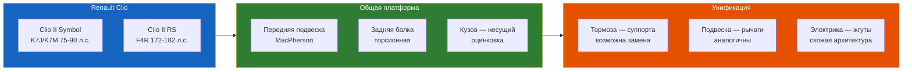

# Обзор Clio Sport

Renault Clio Sport — горячий хэтчбек, выпускавшийся в нескольких поколениях.

## Clio I (1990–1998)

Первое поколение Clio (X57) пришло на смену Renault 5 и сразу завоевало титул «Европейский автомобиль года» (1991). Кузов B-класса, передний привод, поперечное расположение двигателя — архитектура, определившая всю последующую линейку.

Базовые моторы:
- 1.2L (E5F/C3G) — 54–60 л.с., карбюратор/впрыск
- 1.4L (E7F/C3J) — 75–79 л.с.
- 1.8L (F2P) — 88–90 л.с., 8 клапанов

Спортивные версии:
- **Clio 16S/16V**: двигатель F7P 1.8L DOHC 16V, 137 л.с. при 6500 об/мин, 158 Н·м крутящего момента. Максимальная скорость — 209 км/ч, разгон до 100 км/ч за 8,6 с.
- **Clio Williams**: легендарная ограниченная серия (3800 экземпляров + 1600 дополнительных). Двигатель F7R 2.0L DOHC 16V с увеличенным ходом поршня, 150 л.с. при 6100 об/мин, 175 Н·м при 4500 об/мин. Скоростной потолок — 215 км/ч. Отличия: колёса Speedline 15", заниженная подвеска, синий цвет Sport Blue с золотыми дисками (дань команде Williams F1).

Безопасность: по протоколу Euro NCAP (1997) — 2 звезды за защиту водителя (10/16 баллов за фронтальный удар). АБС — опция, подушки безопасности — только у водителя (и то не на всех рынках).

Существовала также «заряженная» версия Clio Baccara/Clio Initiale — люкс-версия с 1.8 16V (137 л.с.), кожаным салоном, электростеклоподъёмниками и литыми дисками, фактически предшественник RS в первом поколении.

## Clio II (1998–2012)

Второе поколение (X65) построено на платформе, лёгшей в основу Renault Symbol I. Передняя подвеска McPherson, задняя — балка кручения H-типа.

Двигатели:
- 1.2L 8V (D7F) — 60 л.с.
- 1.4L 8V (K7J) — 75 л.с.
- 1.6L 16V (K4M) — 90–107 л.с.
- 2.0L RS (F4R) — 172–182 л.с.
- 3.0L V6 (ES9) — 230 л.с. (Clio V6)
- Дизели: 1.5 dCi (K9K) common rail 65–100 л.с., 1.9 dTi/dCi 80–105 л.с.

**Clio RS 172** (2000): двигатель F4R 2.0L 16V, 172 л.с. при 6250 об/мин, 200 Н·м при 5400 об/мин. Максимальная скорость — 220 км/ч, разгон до 100 км/ч за 7,2 с. Передние тормоза Brembo (330×28 мм), 15-дюймовые колёса Speedline Turini, усиленная подвеска Sachs. КПП — JC5-129 (5-ступенчатая, усиленная, с дифференциалом повышенного трения). Поздняя версия Clio RS 182 получила 182 л.с., иные распредвалы и выпуск. Спереди — 312-миллиметровые диски, сзади — 238 мм.

**Clio V6** (2001–2005): радикальная среднемоторная компоновка (двигатель перед задней осью), задний привод. Разработка ателье Tom Walkinshaw Racing (TWR). Двигатель PSA ES9 V6 3.0L 24V, 230 л.с. (позже 255 л.с.), 300 Н·м. Разгон до 100 км/ч за 6,2 с, максимальная скорость — 246 км/ч. Шасси — переработанная платформа Clio с пространственной рамой. Всего выпущено ~1513 экземпляров.

Снаряжённая масса Clio II — 890–1075 кг (в зависимости от двигателя). RS-версия — 965 кг, Clio V6 — 1355 кг (из-за стального подрамника и V6 сзади).

Рестайлинги: 2001 (фаза 2 — изменённая оптика, новый интерьер), 2003 (фаза 3 — каплевидные фары, иная решётка радиатора, обновлённые двигатели). На фазе 3 также появился руль с регулировкой по высоте и вылету.

## Clio III (2005–2014)

Новая платформа (тип B), увеличенная колёсная база. Версия RS впервые получила независимую заднюю подвеску со стойками и поперечной тягой — кардинальное отличие от полузависимой балки у Symbol.

Двигатели:
- 1.2L TCe (D4FT) — 100 л.с., турбо
- 1.4L TCe (H4J) — 130–132 л.с.
- 1.6L 16V (K4M) — 111–114 л.с.
- 2.0L 16V RS (F4R) — 197–200 л.с.

**Clio RS 197** (2005): 2.0L 16V с изменяемыми фазами газораспределения (F4R 830), 197 л.с. при 7250 об/мин, 215 Н·м при 5550 об/мин. Подвеска — стойки McPherson спереди, независимая многорычажка сзади. Тормоза Brembo 312×27 мм. 6-ступенчатая МКПП.

**Clio RS 200** (2009): рестайлинг, 200 л.с., иные настройки подвески и кузовные обвесы.

Снаряжённая масса — 1050–1200 кг. RS 197 — 1225 кг.

Euro NCAP: 5 звёзд (2005) — 33 балла за защиту взрослых, 39 баллов за защиту детей, 15 баллов за пешеходов.

## Clio IV (2012–2019)

Платформа RB (Common Module Family), модернизация архитектуры. Массовый переход на турбодвигатели малого объёма.

Двигатели:
- 0.9L TCe (H4B) — 90 л.с., 3 цилиндра
- 1.2L TCe (H5F) — 120 л.с.
- 1.5L dCi (K9K) — 75–110 л.с.
- **RS: 1.6L TCe (M5MT)** — 200–220 л.с.

**Clio RS 200/220** (2013): турбомотор 1.6 TCe M5MT, 200 л.с. при 6000 об/мин, 240 Н·м при 1750 об/мин. Роботизированная КПП EDC (6-ступенчатый преселективный робот с двумя сцеплениями, производства Getrag DCT450). Разгон до 100 км/ч за 6,6 с, максимальная скорость — 230 км/ч. Режимы вождения: Normal, Sport, Race (на Trophy). Передние тормоза Brembo 320×28 мм, колёса 17–18". Снаряжённая масса — 1204 кг.

**Clio RS 220 Trophy** (2015): форсированный 1.6 TCe до 220 л.с. при 6050 об/мин, 280 Н·м при 2400 об/мин (с overboost до 300 Н·м). Разгон до 100 км/ч за 6,5 с. Изменённая калибровка ЭБУ, иная выхлопная система Akrapovič в титановом исполнении. Тираж — не лимитирован, но редка.

В 2016 — рестайлинг (фаза 2): изменённые бамперы, светодиодная оптика full-LED, мультимедиа R-Link с 7" экраном. RS-версия получила фиолетовый цвет Liquid Yellow и новые 18-дюймовые колёса.

## Платформа Symbol и Clio Sport: взаимозаменяемость

Все поколения Clio RS построены на переднеприводной платформе B-класса, которая лежит в основе Symbol. Отличия RS — усиленные подрамники, спортивные амортизаторы и блокировка дифференциала. Ниже — конкретные узлы, подходящие для свапа:

- **Тормоза**: суппорты Brembo от Clio II RS (2-поршневые, 54 мм) ставятся на Symbol вместе с поворотными кулаками Clio RS. Диски 312–330 мм требуют колёс R16+. Вакуумный усилитель тормозов — 23.81" против штатных 22.2".
- **Подвеска**: пружины и амортизаторы от Clio II RS — прямой апгрейд на Symbol I без доработок. Передние стойки McPherson идентичны по точкам крепления. Задняя балка RS отличается усиленными сайлентблоками и стабилизатором увеличенного диаметра.
- **Двигатель**: мотор F4R 2.0L устанавливается в подкапотное пространство Symbol на штатные подушки двигателя (K7J/K7M/F4R — единый блок креплений K-серии).
- **Коробка передач**: JC5 от Clio RS (5-ступенчатая механическая, усиленная) стыкуется с блоками K7J/K7M через штатный колокол сцепления.
- **Стабилизатор поперечной устойчивости**: задний стабилизатор от Clio II RS (диаметр 26–28 мм вместо штатных 18–21 мм) значительно снижает крены и устанавливается на Symbol без доработок. Передний стабилизатор RS 23–26 мм (против 20–22 мм штатных) — также прямой апгрейд.
- **Рулевое управление**: рейка и рулевые тяги от Clio II RS подходят на Symbol. Передаточное отношение — 16:1 у RS против 18:1 у стандартной версии, что даёт более острую реакцию на руль.
- **Трансмиссия**: приводы (полуоси) у RS короче и толще. Внутренние ШРУСы совпадают со штатными КПП K7J/K7M. При замене двигателя на F4R необходимы приводы от RS.
- **Кузовные элементы**: передние крылья, капот и двери от Clio II штампованы идентично Symbol. Бамперы RS не подходят без замены переднего подрамника и радиаторной рамки.

## Спортивные достижения

Clio Williams использовалась в чемпионате мира по ралли (FIA WRC) в сезоне 1993 — командой Renault Sport. Лучший результат — 6-е место на Ралли Корсики (Жан Раньотти). В 1994 на базе Clio Williams построен прототип Maxi Megane, но проект не пошёл в серию.

Clio II RS успешно выступала в кольцевых гонках: команды Elf Renault Sport выиграли несколько этапов Кубка Clio в Европе. Clio III RS участвовала в World Touring Car Championship (WTCC) в 2007 году.

С 2006 по 2016 существовала монокубок «Clio Cup» — 30 машин, идентичные настройки, этапы на Нюрбургринге, Сильверстоуне, Поль-Рикаре и других европейских трассах. Для Clio IV RS выпускалась специальная версия Clio RS Cup с облегчённым кузовом (-37 кг), отсутствием климат-контроля и задних электростеклоподъёмников, перфорированными тормозными дисками (заводская подготовка под монокубок).

## Почему это важно для владельца Symbol

Понимание конструкции Clio Sport открывает готовый каталог запчастей для серьёзного апгрейда. Тормозные механизмы Brembo от Clio II RS можно установить на Symbol с минимальными доработками — замена поворотных кулаков и переход на 16-дюймовые колёса. Пружины и амортизаторы от RS взаимозаменяемы, как и стабилизаторы. Коробка JC5 от RS — самое простое усиление трансмиссии, если планируется форсировка мотора.

Сварные подрамники и элементы усилителей кузова от Clio RS можно адаптировать на Symbol при заглублённом тюнинге, однако эта работа требует уже серьёзного вмешательства в геометрию кузова.
