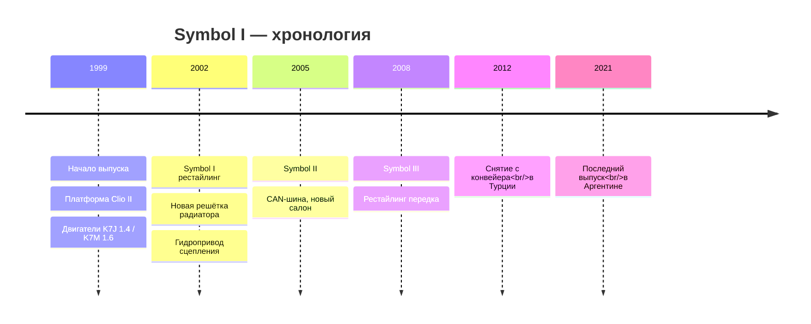

# Обзор первых Renault Symbol

Первое поколение Renault Symbol (Type KH) выпускалось с 1999 по 2008 год.

## Кузов и габариты

- Длина: 4150 мм (до рестайлинга 2002 г.), 4171 мм (после рестайлинга)
- Ширина: 1639 мм
- Высота: 1437 мм
- Колёсная база: 2472 мм
- Объём багажника: 510 литров — рекордный показатель в классе B
- Снаряжённая масса: от 990 до 1065 кг в зависимости от двигателя
- Дорожный просвет: 155 мм

## Конструкция

- Передняя подвеска — независимая типа McPherson со стабилизатором поперечной устойчивости.
- Задняя подвеска — полузависимая H-балка с винтовыми пружинами.
- Тормозная система — передние дисковые (238 мм на маломощных версиях, 259 мм на 1.6), задние барабанные (203 мм).
- ABS — опционально, в базе не было.
- Рулевое управление — рейка с гидроусилителем производства ZF.

## Двигатели

**Бензиновые:**

- **K7J 1.4L 8V** (1390 см³, SOHC) — 75 л.с. при 5500 об/мин, 107 Нм при 3500 об/мин. Выпускался в вариантах: карбюратор, моноинжектор, распределённый впрыск. Свечи зажигания: Champion RC9YCC или аналог.
- **K7M 1.6L 8V** (1598 см³, SOHC) — 90 л.с. при 5500 об/мин, 128 Нм при 3000 об/мин. Надёжный рядный четырёхцилиндровый двигатель с чугунным блоком.
- **K4J 1.4L 16V** (1390 см³, DOHC) — 98 л.с. 16-клапанная головка, более высокая степень сжатия.
- **K4M 1.6L 16V** (1598 см³, DOHC) — 105 л.с. Улучшенная топливная экономичность и экологические показатели.

**Дизельные:**

- **K9K 1.5 dCi** (1461 см³) — 65–82 л.с., common rail, турбонаддув. Выпускался в нескольких вариантах мощности. Масло: 5W40, объём 4.5 л.
- **F8Q 1.9 D** (1870 см³) — 64 л.с., механический ТНВД (топливный насос высокого давления). Шумный, но чрезвычайно живучий.

## Трансмиссия

- **МКПП JH3** — 5-ступенчатая, устанавливалась на двигатели K7J. Передаточные числа: I-3.417, II-1.810, III-1.276, IV-0.975, V-0.754.
- **МКПП JC5** — 5-ступенчатая, усиленная, для двигателей K7M и K4M. Масло: Elf Tranself NFJ 75W80, объём ~3.1 л.
- **АКПП DP0/AL4** — 4-ступенчатая, адаптивная, производства Renault/PSA. Требует замены масла каждые 30–40 тыс. км.

## Электрооборудование

- ЭБУ: Siemens SID 803 (на ранних версиях Siemens SID 801).
- Диагностический разъём: K-Line (ISO 9141-2), 12-pin.
- Генератор: Valeo, номинальный ток 80–90 А.
- АКБ: 12V, ёмкость 55 Ач.
- Система зажигания: катушка на свечу (K7M/K7J — одна катушка, K4J/K4M — индивидуальные).

## Рестайлинг 2002 года

- Новая решётка радиатора с хромированной окантовкой.
- Обновлённые передние и задние бамперы.
- Изменены задние фонари — сегментная оптика.
- Новый руль от Clio II phase 2 с интегрированной вставкой.
- Улучшенные материалы отделки салона, изменена центральная консоль.

## Проблемные места

- **Электростеклоподъёмники** — тросиковый механизм перетирается на морозе. Замена механизма в сборе — единственное решение.
- **Выхлопная система** — резонатор выгорает к 80–100 тыс. км. Характерный дребезжащий звук — первый признак.
- **Коррозия** — задние колёсные арки изнутри, пороги, крышка багажника, кромки передних крыльев.
- **Течь масла** — прокладка клапанной крышки K7J/K7M теряет эластичность к 60 тыс. км.
- **Замок зажигания** — износ контактной группы, возможен отказ запуска двигателя.
- **Печка** — радиатор отопителя забивается продуктами коррозии, снижается эффективность обогрева.
- **Дроссельная заслонка** — загрязнение EGR и масляными отложениями, плавающие обороты холостого хода.
- **Термостат** — заклинивание в открытом положении (двигатель не прогревается до рабочей температуры).

## Взаимозаменяемость с Clio II

Большинство деталей Symbol I взаимозаменяемо с Clio II (хэтчбек):

- **Двигатели и КПП** — полная взаимозаменяемость, включая навесное оборудование.
- **Тормозная система** — полностью (колодки, диски, суппорты, тормозные шланги).
- **Подвеска** — полностью (рычаги, шаровые, сайлентблоки, стойки стабилизатора, амортизаторы), кроме пружин — у Symbol они жёстче из-за увеличенной массы седана.
- **Электрика** — блоки BSM/CAV, ЭБУ, проводка моторного отсека — идентичные.
- **Отличие** — кузовные панели, передняя оптика, бамперы, капот, крышка багажника, задние крылья — уникальные для Symbol.

## Сильные стороны

- Огромный по меркам класса багажник — 510 литров.
- Простая конструкция, позволяющая ремонтировать своими силами.
- Доступные запчасти, в том числе неоригинальные.
- Большой ресурс двигателей K7M при своевременной замене масла.

Первое поколение остаётся востребованным на вторичном рынке благодаря низкой цене и живучести при своевременном обслуживании.
