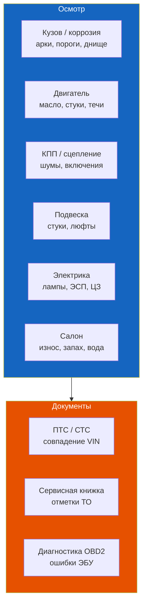

# Осмотр Renault Symbol перед покупкой: чеклист

Интерактивный чеклист для осмотра Renault Symbol перед покупкой.

## Как пользоваться

При осмотре автомобиля отмечайте пункты, которые проверили и не нашли дефектов. Чеклист показывает прогресс и итоговую оценку состояния.

- **>80%** — хороший экземпляр, можно рассматривать к покупке
- **50–80%** — требует детального осмотра специалистом и торга
- **<50%** — рекомендуем поискать другой автомобиль

Перед осмотром возьмите: фонарик, зеркальце для днища, магнит (немаркий, для скрытого шпаклёва), толщиномер (если есть), OBD2-сканер.

## Дополнительные советы

| Что проверить | Как проверить | На что смотреть |
|--------------|---------------|-----------------|
| Документы | ПТС, СТС, сервисная книжка | Количество владельцев, даты ТО, залог |
| Вин-номер | Сверить по кузову и документам | Совпадение, коррозия таблички |
| Пробег | Сверка: одометр, тормозной диск, педали, руль (износ) | Занижение пробега — бич Symbol |
| Тест-драйв | Прогрев до 90 °C, трасса, город | Шумы, вибрации, работа КПП |

## Типичные болезни Symbol по пробегу

| Пробег | Характерные проблемы |
|--------|----------------------|
| 50 000–80 000 км | Ремень ГРМ + помпа (если не менялись), передние стойки стабилизатора |
| 100 000–150 000 км | Замена сцепления, лямбда-зонд, амортизаторы, гидрокомпенсаторы |
| 150 000–200 000 км | ШРУСы, генератор (щётки/регулятор), КПП (синхронизаторы), рулевая рейка |
| >200 000 км | Двигатель — маслосъёмные колпачки, поршневые кольца, капитальный ремонт |

> **Совет:** Самые дорогие проблемы на Symbol — ГРМ (обрыв гнёт клапаны), автоматическая КПП (выход из строя, ремонт 30 000–60 000 ₽), коррозия порогов и арок.
