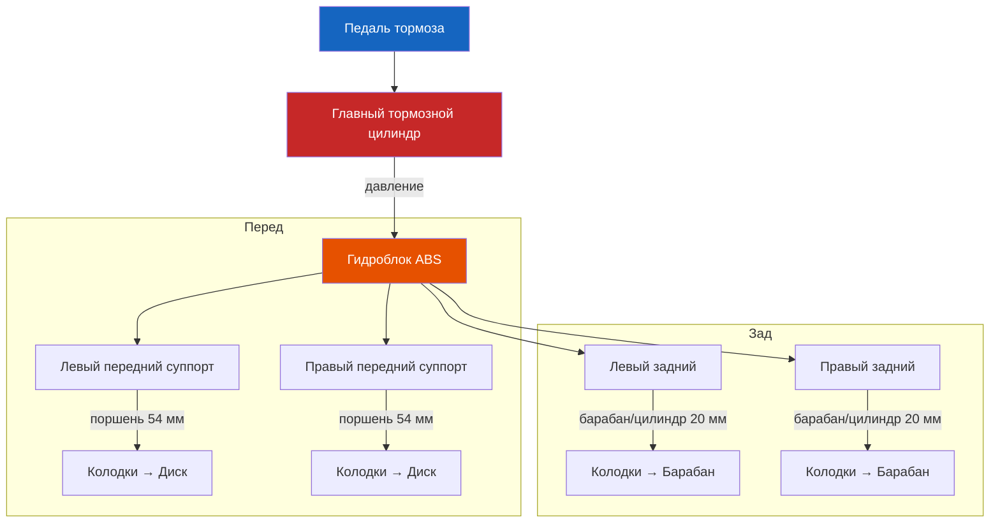

# 7.1 Передние тормозные механизмы

Безопасность

Тормозная жидкость <strong>токсична</strong> и агрессивна к лакокрасочному покрытию.
Работайте в перчатках, при попадании на кожу немедленно смойте водой.
Используйте только свежую жидкость из герметичной тары.

Передние тормоза Renault Symbol — дисковые, вентилируемые, с плавающей однопоршневой скобой. Обеспечивают ~70 % полного тормозного усилия.

## Технические характеристики

| Параметр | Значение |
|----------|----------|
| Диаметр тормозного диска | 259 мм |
| Толщина нового диска | 22 мм |
| Минимально допустимая толщина | 20 мм |
| Максимальное биение диска | 0,05 мм |
| Диаметр поршня суппорта | 48 мм |
| Толщина новой накладки колодки | 14–15 мм |
| Минимальная толщина накладки | 2 мм (сигнализатор износа — 4 мм) |
| Момент затяжки направляющих суппорта | 25–30 Н·м |
| Момент затяжки болтов суппорта к поворотному кулаку | 100–105 Н·м |
| Момент затяжки колесных болтов | 90–105 Н·м |

## Замена тормозных колодок

1. Поднимите автомобиль домкратом, установите на страховочные опоры, снимите колесо.

2. ⚠ **Перед вдавливанием поршня** откачайте часть тормозной жидкости из бачка ГТЦ (шприцем или грушей). Избыток жидкости при вдавливании поршня вытеснится обратно в бачок — не допускайте перелива.

3. Отверните нижний направляющий палец суппорта (ключ на 13 или 15 мм). Откиньте суппорт вверх, не повредив тормозной шланг.

4. Извлеките старые колодки. Запомните расположение демпферных пластин (скоб).

5. Вдавите поршень в цилиндр суппорта:
   - Используйте специальный прижим (струбцину) или монтажную лопатку
   - При вдавливании одновременно откройте штуцер прокачки суппорта — это снизит усилие и исключит повреждение ГТЦ
   - После вдавливания закройте штуцер моментом 8–10 Н·м

6. Установите новые колодки с демпферными пластинами. Смажьте направляющие пальцы высокотемпературной смазкой (Molykote CU-7439 или аналог).

7. Опустите суппорт на место. Затяните направляющий палец моментом 25–30 Н·м.

8. Установите колесо, опустите автомобиль. Затяните колёсные болты моментом 90–105 Н·м.

9. Несколько раз нажмите на педаль тормоза до появления упора (поршень прижмёт колодки к диску).

10. Долейте тормозную жидкость до отметки MAX.

## Замена тормозного диска

1. Выполните шаги 1–5 по замене колодок.

2. Отверните два болта крепления направляющей суппорта к поворотному кулаку (Torx T40 или ключ на 16 мм). Снимите суппорт в сборе. Подвесьте его на проволоке — не допускайте натяжения шланга.

3. Отверните болт крепления тормозного диска (Torx T30). Снимите диск со ступицы.

   - Если диск прикипел к ступице от коррозии — обработайте проникающей смазкой и аккуратно сбейте молотком через деревянную проставку

4. Зачистите ступицу от коррозии металлической щёткой. Убедитесь в отсутствии заусенцев.

5. Установите новый диск. Закрепите болтом диска (момент 10–12 Н·м).

6. Установите суппорт. Затяните болты крепления к поворотному кулаку моментом 100–105 Н·м.

7. Установите колодки, направляющие, колесо (шаги 6–8 замены колодок).

8. Прикатка новых дисков: выполните 20–30 торможений с умеренным усилием (рабочий прогрев колодок и дисков). Избегайте резких торможений первые 300 км.

## Проверка биения диска

| Этап | Действие |
|------|----------|
| 1 | Закрепите индикатор часового типа на неподвижном элементе (поворотный кулак) |
| 2 | Установите ножку индикатора на рабочую поверхность диска (на расстоянии 10 мм от края) |
| 3 | Медленно проворачивайте ступицу — считывайте показания |
| 4 | Максимально допустимое биение — 0,05 мм. Если превышено — диск подлежит замене |

⚠ **Не пытайтесь протачивать диск без снятия** — на ступице диск может быть зажат неравномерно, что приведёт к биению после затяжки колёс.

## Осмотр суппорта

При каждой замене колодок проверяйте:

- **Пыльник поршня** — без трещин, не пропускает грязь. Если повреждён — суппорт требует переборки (ремкомплект поршня).
- **Направляющие пальцы** — свободно перемещаются. При коррозии — замена.
- **Смазка направляющих** — обновляйте каждые 30 000 км.
- **Тормозной шланг** — без трещин, не перекручен.

## Типовые неисправности передних тормозов

| Проблема | Причина | Решение |
|----------|---------|---------|
| Скрип при торможении | Износ колодок (индикатор), отсутствие демпферных пластин, неподходящая смазка | Замена колодок, установка пластин, смазка направляющих |
| Вибрация на руле | Деформация диска (от перегрева), неравномерный износ | Проверка биения — замена диска |
| Машину уводит в сторону | Закисание поршня или направляющей с одной стороны | Разборка, чистка, смазка; при повреждении — ремкомплект |
| Пульсация педали | Грязь/коррозия на рабочей поверхности диска | Замена диска |
| Перегрев диска | Постоянное притирание колодки из-за закисшего суппорта | Промывка/замена суппорта, замена диска |
